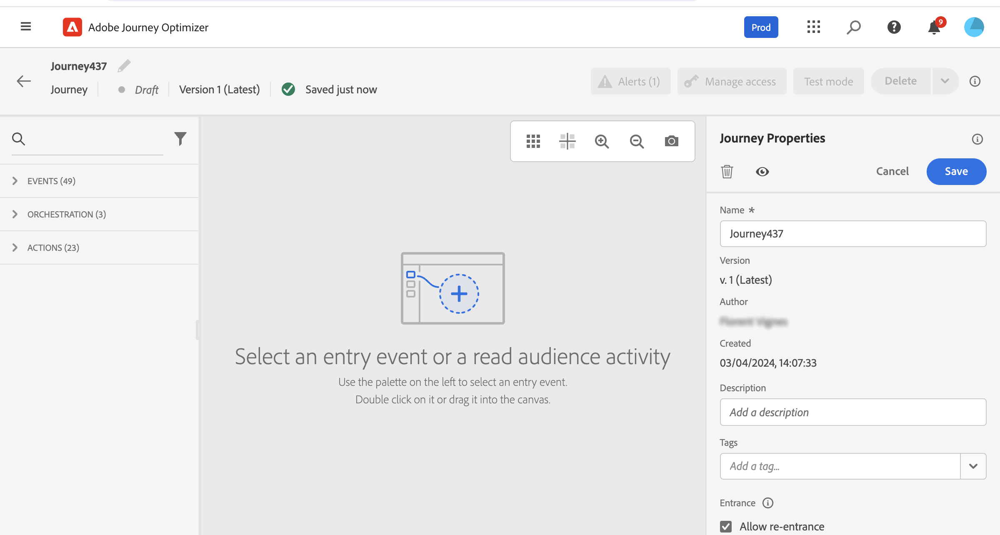

# 여정 시작{#jo-quick-start}

## 전제 조건{#start-prerequisites}

여정과 함께 메시지를 전송하려면 다음 구성이 필요합니다.

1. **이벤트 구성**: 여정이 수신될 때까지 트리거하려면 이벤트를 구성해야 합니다. 필요한 정보와 정보를 처리하는 방법을 정의합니다. **기술 사용자**&#x200B;가 이 단계를 수행해야 합니다. [자세히 보기](../event/about-events.md).

   

1. **세그먼트 만들기**: 여정이 Adobe Experience Platform 세그먼트를 수신하여 메시지를 지정된 프로필 세트에 일괄 전송할 수도 있습니다. 이를 위해 세그먼트를 만들어야 합니다. [자세히 보기](../segment/about-segments.md).

   

1. **데이터 소스 구성**: 여정에 사용할 조건 등의 추가 정보를 검색하는 시스템에 대한 연결을 정의할 수 있습니다. 기본 제공 Adobe Experience Platform 데이터 소스도 프로비저닝 시에 구성됩니다. 여정 내 이벤트의 데이터만 활용하는 경우에는 이 단계를 수행할 필요가 없습니다. **기술 사용자**&#x200B;가 이 단계를 수행해야 합니다. [자세히 보기](../datasource/about-data-sources.md)

   

1. **작업 구성**: 서드파티 시스템을 사용하여 메시지를 전송하는 경우 사용자 지정 작업을 만들 수 있습니다. 자세한 내용 [섹션](../action/action.md). **기술 사용자**&#x200B;가 이 단계를 수행해야 합니다. Journey Optimizer 기본 제공 메시지 기능을 사용하는 경우 여정에 채널 작업을 추가하고 컨텐츠를 디자인하기만 하면 됩니다. [이 섹션](../messages/get-started-content.md)을 참조하십시오.

   

## 여정 빌드{#jo-build}

>[!CONTEXTUALHELP]
>id="ajo_journey_create"
>title="여정 빌드"
>abstract="이 화면에는 기존 여정 목록이 표시됩니다. 여정을 열거나 &#39;여정 만들기&#39;를 클릭하고 다른 이벤트, 오케스트레이션 및 작업 활동을 결합하여 여러 단계로 구성된 크로스 채널 시나리오를 작성할 수 있습니다."

이 단계는 **비즈니스 사용자**. 여기에서 여정을 만듭니다. 다양한 이벤트, 오케스트레이션 및 작업 활동을 조합하여 여러 단계로 구성된 크로스 채널 시나리오를 작성할 수 있습니다.

여정을 통해 메시지를 보내는 주요 단계는 다음과 같습니다.

1. 여정 관리 메뉴 섹션에서 **[!UICONTROL Journeys]**. 여정 목록이 표시됩니다.

   

1. 클릭 **[!UICONTROL Create Journey]** 새 여정을 만들려면

1. 오른쪽에 표시되는 구성 창에서 여정의 속성을 편집합니다. 자세한 내용 [섹션](journey-gs.md#change-properties).

   

1. 먼저 이벤트 또는 **세그먼트 읽기** 활동을 팔레트에서 캔버스로 가져옵니다. 여정 디자인에 대한 자세한 내용은 [이 섹션](using-the-journey-designer.md).

   

1. 개인이 수행할 다음 단계를 끌어서 놓습니다. 예를 들어 조건 뒤에 채널 작업을 추가할 수 있습니다. 활동에 대한 자세한 내용은 [이 섹션](using-the-journey-designer.md).

1. 테스트 프로필을 사용하여 여정을 테스트합니다. 자세한 내용 [섹션](testing-the-journey.md)

1. 여정을 게시하여 활성화합니다. 자세한 내용 [섹션](publishing-the-journey.md).

   

1. 전용 보고 도구를 사용하여 여정을 모니터링하여 여정의 효과를 측정합니다. 자세한 내용 [섹션](../reports/live-report.md).

   

## 여정 속성 정의 {#change-properties}

>[!CONTEXTUALHELP]
>id="ajo_journey_properties"
>title="여정 속성"
>abstract="이 섹션에서는 여정 속성을 보여줍니다. 기본적으로 읽기 전용 매개 변수는 숨겨집니다. 사용 가능한 설정은 여정 상태, 권한 및 제품 구성에 따라 다릅니다."

오른쪽 상단에 있는 연필 아이콘을 클릭하여 여정 속성에 액세스합니다.

여정 이름을 변경하고, 설명을 추가하고, 다시 시작하고, 시작 날짜와 종료 날짜를 선택하고, 관리자 권한으로 을(를) 정의할 수 있습니다 **[!UICONTROL Timeout and error]** 지속 시간. 조직에 대해 활성화된 경우 [버스트 메시징](#burst).

라이브 여정의 경우 이 화면에는 여정을 게시한 사용자의 게시 날짜와 이름이 표시됩니다.

다음 **기술 세부 정보 복사** 지원 팀이 문제를 해결하는 데 사용할 수 있는 여정에 대한 기술 정보를 복사할 수 있습니다. 다음 정보가 복사됩니다. JourneyVersion UID, OrgID, orgName, sandboxName, lastDeployedBy, lastDeployedAt.

### 입구{#entrance}

기본적으로 새 여정은 다시 입력할 수 있습니다. &quot;일회성&quot; 여정에 대한 옵션의 선택을 취소할 수 있습니다. 예를 들어, 사용자가 상점에 들어올 때 일회성 선물을 제공하려는 경우입니다. 이러한 경우 고객이 여정을 다시 입력하고 오퍼를 다시 받을 수 없도록 합니다.

여정이 &quot;종료&quot;되면 상태가 됩니다 **[!UICONTROL Closed]**. 여정은 새 개인이 여정에 들어가는 것을 중지합니다. 여정에 이미 있는 사람은 여정을 정상적으로 완료합니다.

기본 글로벌 시간 초과 30일 이후에는 여정이 **완료됨** 상태. 다음 보기 [섹션](../building-journeys/journey-gs.md#global_timeout).

### 여정 활동의 시간 제한 및 오류 {#timeout_and_error}

작업 또는 조건 활동을 편집할 때 오류 또는 시간 제한 시 대체 경로를 정의할 수 있습니다. 서드파티 시스템을 심문하는 활동이 여정 속성에 정의된 시간 초과 기간을 초과하는 경우(**[!UICONTROL Timeout and  error]** 필드), 잠재적인 대체 작업을 수행하도록 두 번째 경로가 선택됩니다.

허용된 값은 1초에서 30초 사이입니다.

매우 짧은 을 정의하는 것이 좋습니다 **[!UICONTROL Timeout and error]** 여정이 시간에 민감한 경우 값(예: 몇 초 이상 작업을 지연할 수 없으므로 여기에 응답합니다. 여정에 시간이 덜 민감한 경우, 더 긴 값을 사용하여 유효한 응답을 보내기 위해 라는 시스템에 더 많은 시간을 줄 수 있습니다.

여정은 글로벌 시간 초과도 사용합니다. 자세한 내용은 [다음 섹션](#global_timeout).

### 글로벌 여정 시간 초과 {#global_timeout}

추가 [timeout](#timeout_and_error) 여정 활동에 사용되며 인터페이스에 표시되지 않으며 변경할 수 없는 글로벌 여정 시간 초과도 있습니다. 이 시간 제한은 여정이 입력한 후 30일 후에 개인 진행 상태를 중지합니다. 이는 개인의 여정이 30일 이상 지속될 수 없음을 의미합니다. 30일 시간 제한 기간 후 개인의 데이터가 삭제됩니다. 시간 제한 기간이 끝날 때 여전히 여정에 흐르는 개인은 중지되며 보고 오류로 고려됩니다.

>[!NOTE]
>
>여정은 개인 정보 보호 옵트아웃, 액세스 또는 삭제 요청에 직접 대응하지 않습니다. 그러나 글로벌 시간 제한은 개인이 여정에서 30일 이상 머무르지 않도록 합니다.

30일 여정 제한 시간 때문에 여정 재입력이 허용되지 않는 경우 30일 이상, 재입력 차단 기능이 있는지 확인할 수 없습니다. 실제로 입국한 지 30일이 지난 뒤 여정에 들어온 사람에 대한 모든 정보를 제거하므로 30일 이상 전에 입국한 사람을 알 수 없습니다.

### 표준 시간대 및 프로필 시간대 {#timezone}

시간대는 여정 수준에서 정의됩니다.

고정 시간대를 입력하거나 Adobe Experience Platform 프로필을 사용하여 여정 시간대를 정의할 수 있습니다.

Adobe Experience Platform 프로필에 시간대가 정의된 경우 여정에서 검색할 수 있습니다.

시간대 관리에 대한 자세한 내용은 [이 페이지](../building-journeys/timezone-management.md).

### 버스트 모드 {#burst}

버스트 모드는 대량 볼륨에서 매우 빠른 푸시 메시지를 전송할 수 있는 Journey Optimizer 추가 기능입니다. 이 변수는 다음을 포함하는 간단한 여정에 사용됩니다 **세그먼트 읽기** 활동 및 간단한 푸시 메시지. 버스트는 휴대폰에 긴급 푸시 알림을 전송하려는 경우, 예를 들어 뉴스 채널 앱을 설치한 사용자에게 최신 뉴스를 전송하려는 경우 메시지 전달 지연이 비즈니스 크리티컬 상태일 때 사용됩니다.

버스트 메시징은 다음과 같은 요구 사항이 있습니다.

* 여정은 **세그먼트 읽기** 활동. 이벤트는 허용되지 않습니다.
* 다음 단계는 푸시 메시지여야 합니다. 다른 채널, 활동 또는 단계는 허용되지 않습니다.
* 푸시 메시지에 개인화가 허용되지 않습니다.
* 메시지는 작아야 합니다(&lt;2KB).

>[!CAUTION]
>
>요구 사항 중 하나라도 충족하지 않는 경우 여정에서 버스트 모드를 사용할 수 없습니다.

활성화하려면 **버스트 모드**&#x200B;여정을 열고 오른쪽 상단의 연필 아이콘을 클릭하여 여정의 속성에 액세스합니다. 그런 다음 를 활성화합니다 **버스트 모드 활성화** 토글.

버스트 여정을 수정하고 이메일 메시지, 다른 작업, 이벤트 등과 같은 버스트 메시지와 호환되지 않는 활동을 추가하면 버스트 모드가 자동으로 비활성화됩니다.

그런 다음 평소대로 여정을 테스트하고 게시합니다. 테스트 모드에서 메시지는 버스트 모드를 통해 전송되지 않습니다.

이 비디오에서 버스트 메시지에 적용 가능한 사용 사례와 버스트 메시지에 대한 여정을 구성하는 방법을 알아봅니다.

>[!VIDEO](https://video.tv.adobe.com/v/334523?quality=12)
