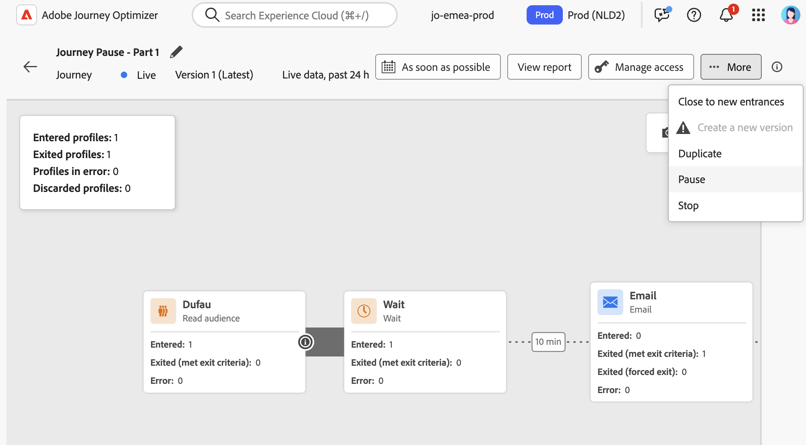

# 여정 일시 중지 {#journey-pause}

>[!CONTEXTUALHELP]
>id="ajo_journey_pause"
>title="여정 일시 중지"
>abstract="새 프로필이 입력되지 않도록 실시간 여정을 일시 중지합니다. 현재 여정에 있는 프로필을 삭제할지 또는 그대로 유지할지 선택합니다. 보존된 경우 여정이 다시 시작되면 다음 작업 활동에서 실행이 다시 시작됩니다. 진행률을 잃지 않고 업데이트 또는 긴급 중단에 적합합니다."

라이브 여정을 일시 중지하고 필요한 모든 변경 사항을 수행한 다음 언제든지 다시 시작할 수 있습니다.<!--You can choose whether the journey is resumed at the end of the pause period, or whether it stops completely. --> 일시 중지 중에 [전역 필터를 적용](#journey-global-filters)하여 특성을 기반으로 프로필을 제외할 수 있습니다. 여정은 일시 중지 기간이 끝나면 자동으로 다시 시작됩니다. [수동으로 다시 시작](#journey-resume-steps)할 수도 있습니다.

>[!AVAILABILITY]
>
>이 기능은 조직 집합(제한된 가용성)에만 사용할 수 있으며 향후 릴리스에서 전역으로 롤아웃될 예정입니다.

## 주요 이점 {#journey-pause-benefits}

일시 중지 및 다시 시작 여정은 고객 경험을 중단하지 않고 라이브 여정을 일시적으로 중단하여 여정 실무자가 더 큰 통제력과 유연성을 발휘합니다. 일시 중지되면 통신이 전송되지 않으며 프로필은 여정이 다시 시작될 때까지 일시 중지된 상태로 유지됩니다.

이 기능은 오류 또는 업데이트(예: 메시지 콘텐츠 변경) 중에 의도하지 않은 메시지를 보낼 위험을 줄이고, 보다 안전한 여정 관리를 지원하며, 실무자의 신뢰도를 높입니다. UI에서 일시 중지된 여정 및 해당 상태를 직접 볼 수 있으므로 투명성과 운영 민첩성이 더욱 향상됩니다.

>[!CAUTION]
>
>* 여정을 일시 중지하고 다시 시작할 수 있는 권한은 **[!DNL Publish journeys]** 높은 수준의 권한을 가진 사용자로 제한됩니다. [이 섹션](../administration/permissions-overview.md)에서 [!DNL Journey Optimizer] 사용자의 액세스 권한 관리에 대해 자세히 알아보세요.
>
>* 일시 중지/다시 시작 기능을 사용하기 전에 [보호 기능 및 제한 사항을 읽어보세요](#journey-pause-guardrails).

## 여정 일시 중지 방법 {#journey-pause-steps}

**Live** 여정을 일시 중지할 수 있습니다.

여정을 일시 중지하려면 다음 단계를 수행하십시오.

1. 일시 중지할 여정을 엽니다.
1. 여정 캔버스의 오른쪽 상단에 있는 **...자세히** 단추를 클릭하고 **일시 중지**&#x200B;를 선택합니다.

   

1. 현재 여정에 있는 프로필을 관리하는 방법을 선택합니다.

   {width="50%" align="left"}

   다음과 같은 작업을 수행할 수 있습니다.

   * **보류** 프로필 - 프로필은 여정이 다시 시작될 때까지 기다립니다.
   * **여정 무시**&#x200B;개 - 프로필이 다음 작업 노드의 프로필에서 제외됩니다.

1. 확인하려면 **일시 중지** 단추를 클릭하세요.

여정 목록에서 하나 또는 여러 개의 **Live** 여정을 일시 중지할 수 있습니다. 여정 그룹(_일괄 일시 중지_)을 일시 중지하려면 목록에서 해당 그룹을 선택하고 화면 하단의 파란색 막대에 있는 **일시 중지** 단추를 클릭합니다. **일시 중지** 단추는 **Live** 여정을 선택한 경우에만 사용할 수 있습니다.

### 일시 중지된 여정의 비헤이비어

여정이 일시 중지되면 보류/삭제 모드에 관계없이 새 시작은 항상 삭제됩니다.

여정이 일시 중지된 경우의 프로필 관리는 활동에 따라 다릅니다. 비헤이비어는 아래에 자세히 설명되어 있습니다. 자세한 내용은 이 [전체 샘플](#journey-pause-sample)도 참조하세요.

| 여정 활동 | 프로필 관리 |
|-------------------------|--------------------------------------------------|
| [대상 자격](audience-qualification-events.md) | <ul> <li>첫 번째 노드에서: 프로필이 삭제됩니다. </li> <li>다른 노드: 라이브 여정과 동일한 동작이지만 대상 자격이 <strong>Action</strong> 활동 후이고 사용자가 해당 작업에서 일시 중지된 경우 대상 자격은 무시됩니다. </li></ul> |
| [단일 이벤트](general-events.md) | - 첫 번째 노드에서: 프로필이 삭제되었습니다.  다른 노드에서는: 라이브 여정과 동일한 동작을 하지만, 이벤트가 <strong>Action</strong> 활동 이후이고 사용자가 해당 작업에서 일시 중지된 경우에는 이벤트가 무시됩니다. |
| [대상자 읽기](read-audience.md) | 몇 가지 특성을 가진 라이브 여정과 같은 동작입니다.  1.  <strong>대상자 읽기</strong> 활동이 시작된 후 <strong>일시 중지</strong>를 누르면 여정에 들어간 프로필이 다음 <strong>작업</strong> 활동까지 계속됩니다. 여정이 특정 속도로 대상자를 읽을 때 전체 대상자를 아직 입력하지 않은 경우 대기열의 나머지 프로필은 무시됩니다.    2. 단일 실행의 경우: 예약된 날짜가 다시 시작 날짜 이전인 경우 다시 시작 시간에 오류가 표시되지 않습니다. 해당 일정은 무시됩니다.  3. 증분 여정의 경우:  - 첫 번째 발생 전에 일시 중지가 발생하면 전체 대상이 재생됩니다.  - 예를 들어, 일별 반복 중 4일에 일시 중지가 발생하고 9일까지 여정이 일시 중지된 상태로 유지되면 4일부터 9일까지 입력한 모든 프로필이 다시 시작됩니다 |
| [반응](reaction-events.md) | 라이브 여정과 동일한 동작이지만, 반응이 <strong>Action</strong> 활동 후이고 사용자가 해당 작업에서 일시 중지된 경우 이벤트가 무시됩니다. |
| [대기](wait-activity.md) | 라이브 여정과 동일한 비헤이비어 |
| [조건](condition-activity.md) | 라이브 여정과 동일한 비헤이비어 |
| 콘텐츠 결정 | 프로필은 여정이 일시 중지되었을 때 사용자가 선택한 내용에 따라 주차 또는 분리됩니다 |
| [채널 작업](journeys-message.md) | 프로필은 여정이 일시 중지되었을 때 사용자가 선택한 내용에 따라 주차 또는 분리됩니다 |
| [사용자 지정 작업](../action/action.md) | 프로필은 여정이 일시 중지되었을 때 사용자가 선택한 내용에 따라 주차 또는 분리됩니다 |
| [프로필 업데이트](update-profiles.md) 및 [이동](jump.md) | 라이브 여정과 동일한 비헤이비어 |
| [외부 데이터 Source](../datasource/external-data-sources.md) | 라이브 여정과 동일한 비헤이비어 |
| [종료 기준](journey-properties.md#exit-criteria) | 라이브 여정과 동일한 비헤이비어 |

## 일시 중지된 여정을 다시 시작하는 방법 {#journey-resume-steps}

>[!CONTEXTUALHELP]
>id="ajo_journey_resume"
>title="여정 다시 시작"
>abstract="일시 중지된 여정을 다시 시작하여 새 프로필을 다시 입력할 수 있습니다. 일시 중지 중에 프로필이 대기 중이었던 경우 여정을 계속합니다. 업데이트 또는 일시 중지 후 여정을 안전하게 다시 시작하는 데 이상적입니다."

일시 중지된 여정은 최대 일시 중지 기간인 14일이 끝날 때 자동으로 다시 시작됩니다. 언제든지 수동으로 다시 시작할 수 있습니다. 일시 중지된 여정을 재개하면 새 프로필이 다시 들어갈 수 있습니다. 일시 중지 중에 프로필이 대기 중이었던 경우 여정을 계속합니다. 업데이트 또는 일시 중지 후 여정을 안전하게 다시 시작하는 데 이상적입니다.

일시 중지된 여정을 다시 시작하고 여정 이벤트를 다시 수신하려면 다음 단계를 수행하십시오.

1. 다시 시작할 여정을 엽니다.
1. 여정 캔버스의 오른쪽 상단에 있는 **...자세히** 단추를 클릭하고 **다시 시작**&#x200B;을 선택합니다.

   여정이 **다시 시작** 상태로 전환됩니다. 여정이 재개되면 1분 이내에 새로운 입구가 시작됩니다. 보관된 프로필을 다시 시작하는 데 시간이 걸릴 수 있습니다.  여정이 다시 **Live**&#x200B;되기 위해 모든 프로필을 다시 시작해야 하므로 **다시 시작**&#x200B;에서 **Live** 상태로 전환하는 데 시간이 걸릴 수 있습니다.

1. 확인하려면 **다시 시작** 단추를 클릭하세요.

여정 목록에서 하나 또는 여러 개의 **일시 중지됨** 여정을 다시 시작할 수 있습니다. 여정 그룹(_일괄 재시작_)을 다시 시작하려면 해당 그룹을 선택하고 화면 하단의 파란색 막대에 있는 **다시 시작** 단추를 클릭합니다. **다시 시작** 단추는 **일시 중지** 여정을 선택한 경우에만 사용할 수 있습니다.

## 일시 중지된 여정의 프로필에 전역 필터 적용 {#journey-global-filters}

여정이 일시 중지되면 프로필 속성에 따라 글로벌 필터를 적용할 수 있습니다. 이 필터를 사용하면 재개 시 정의된 표현식과 일치하는 프로필을 제외할 수 있습니다. 전역 필터가 설정되면 새 프로필 시작에 대해서도 작업 노드에 적용됩니다. 조건과 일치하는 프로필 및 입력하려는 새 프로필은 다음 작업 노드&#x200B;**의 여정**&#x200B;에서 제외됩니다.

예를 들어 일시 중지된 여정에서 모든 프랑스 고객을 제외하려면 다음 단계를 수행합니다.

1. 수정할 일시 중지된 여정을 찾습니다.

1. **종료 기준 및 전역 필터** 아이콘을 클릭합니다.

   

1. **종료 조건 및 전역 필터** 설정에서 **전역 필터 추가**&#x200B;를 클릭하여 프로필 특성에 따라 필터를 정의합니다.

1. 국가 속성이 프랑스와 같은 프로필을 제외하도록 표현식을 설정합니다.

   

1. 필터를 저장하고 **여정 업데이트** 단추를 클릭하여 변경 내용을 적용합니다.

1. [여정 다시 시작](#journey-resume-steps).

   재개 시 국가 속성이 프랑스로 설정된 모든 프로필은 다음 작업 노드의 여정에서 자동으로 제외됩니다. 국가 속성이 프랑스로 설정된 새 프로필이 여정에 들어가려고 하면 다음 작업 노드에서 차단됩니다.

현재 여정에 있는 프로필 및 새 프로필에 대한 프로필 제외는 작업 노드에 도달할 때만 발생합니다.

>[!CAUTION]
>
>* 여정 당 **one** 전역 필터만 설정할 수 있습니다.
>
>* **일시 중지됨** 여정 내에서만 글로벌 필터를 만들거나 업데이트하거나 삭제할 수 있습니다.

## 가드레일 및 제한 사항 {#journey-pause-guardrails}

* 여정 버전은 최대 14일 동안 일시 중지할 수 있습니다.
* 일시 중지된 여정은 모든 비즈니스 규칙에서 마치 살아있는 것처럼 동일하게 고려됩니다.
* 프로필은 작업 활동에 도달하면 일시 중지된 여정에서 &quot;삭제&quot;됩니다. 여정이 일시 중지된 시간 동안 대기 상태를 유지하다가 재개된 후 대기 상태를 종료하면 여정을 계속 진행하며 삭제되지 않습니다.
* 일시 중지 후에도 이벤트가 계속 처리되면 이러한 이벤트는 초당 여정 이벤트 수로 계산되며, 이후 조절은 단일 이벤트에 대해 적용됩니다.
* 여정에 들어갔지만 일시 중지 중에 삭제된 프로필은 여전히 참여 가능 프로필로 계산됩니다.
* 프로필이 일시 중지된 여정에 있으면 다시 시작할 때 프로필 속성이 새로 고쳐집니다
* 일시 중지된 여정에서 조건이 계속 실행되므로 데이터 품질 문제로 인해 여정이 일시 중지된 경우 작업 노드 이전의 모든 조건이 잘못된 데이터로 평가될 수 있습니다.
* 증분 대상자 기반 대상자 읽기 여정의 경우 일시 중지된 기간을 고려합니다. 예를 들어 일별 여정의 경우, 2일에 일시 중지되었다가 그 달 5일에 다시 시작된 경우 6일의 실행은 1일부터 6일까지의 자격이 있는 모든 프로필을 가져옵니다. 이는 대상 자격 또는 이벤트 기반 여정에 해당되지 않습니다(일시 중지 중에 대상 자격 또는 이벤트가 수신되는 경우 해당 이벤트는 삭제됨).
* 일시 중지된 여정은 라이브 여정 할당량에 계산됩니다.
* 여정 전역 시간 제한이 일시 중지된 여정에 여전히 적용됩니다. 예를 들어, 프로필이 90일 동안 여정에 있고 여정이 일시 중지된 경우 이 프로필은 여전히 91일째 여정을 종료합니다.
* 프로필이 여정에 유지되고 이 여정이 며칠 후 자동으로 다시 시작되는 경우 프로필은 여정을 계속하며 삭제되지 않습니다. 삭제하려면 여정을 중지해야 합니다.
* 일시 중지된 세그먼트에서는 일괄 여정 경고에 대한 경고가 실행되지 않습니다.
* 여정 14일 동안 일시 중지 상태가 종료되면 시스템에 감사 로그가 없습니다.
* 삭제된 프로필 중 일부는 여정 단계 이벤트에 표시될 수 있지만 보고에는 표시되지 않습니다. 예: 대상자 읽기, 일시 중지된 여정으로 인해 삭제되는 대상자 읽기 작업, 프로필이 대기 중인 작업 후 이벤트 활동이 있는 경우 삭제된 이벤트에 대한 비즈니스 이벤트를 삭제합니다.
  <!--* There is a guardrail (at an org level) on the max number of profiles that can be held in paused journeys. This guardrail is per org, and is visible in the journey inventory on a new bar (only visible when there are paused journeys).-->

## 엔드투엔드 샘플 {#journey-pause-sample}

아래 여정의 예를 살펴보겠습니다.

이 여정을 일시 중지할 때 프로필이 **삭제됨** 또는 **보류**&#x200B;인지 선택한 다음 프로필 관리가 다음과 같습니다.

1. **AddToCart** 활동: 모든 새 프로필 등록이 차단되었습니다. 일시 중지 전에 프로필이 이미 여정을 입력한 경우 다음 작업 노드까지 계속됩니다.
1. **대기** 활동: 프로필은 여정이 일시 중지 상태에 있더라도 노드에서 계속 정상적으로 대기하고 종료됩니다.
1. **조건**: 프로필은 조건을 계속 통과하고 조건에 정의된 식을 기준으로 오른쪽 분기로 이동합니다.
1. **푸시**/**이메일** 활동: 일시 중지된 여정 동안 프로필이 대기 중이거나 다음 작업 노드에서 삭제되기 시작합니다(일시 중지 시 사용자가 선택한 내용에 따라). 따라서 프로필이 대기 중이거나 거기에서 삭제됩니다.
1. 작업 노드 뒤에 **이벤트**: 프로필이 작업 노드에서 대기 중이고 그 뒤에 이벤트가 있는 경우 해당 이벤트가 실행되면 프로필이 무시됩니다.

이 동작에 따라 일시 중지된 여정 시 프로필 수가 증가하는 것을 볼 수 있으며, 대부분은 작업 전 활동에서 증가합니다. 예를 들어 이 예에서 대기 는 무시되므로 조건 활동을 통과하는 프로필 수가 늘어납니다.

이 여정을 다시 시작할 때:

1. 1분 이내에 새로운 여정 시작
1. 현재 작업 활동에 대한 여정에서 대기 중이던 프로필이 5k tps 속도로 다시 시작됩니다. 그런 다음 기다리고 있던 작업을 입력하고 여정을 계속합니다.
