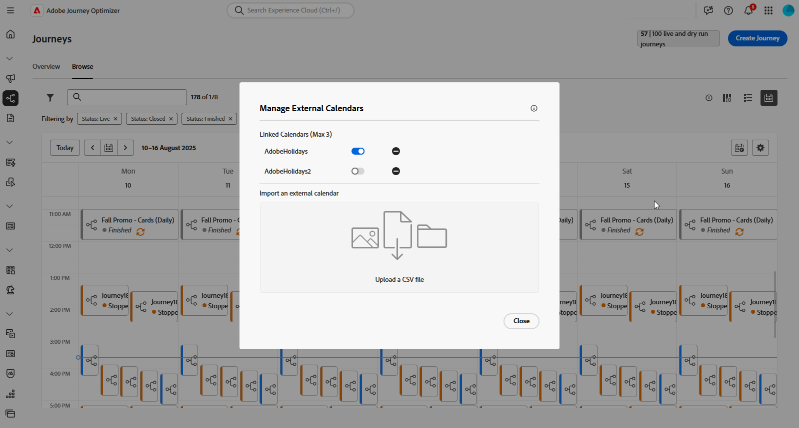
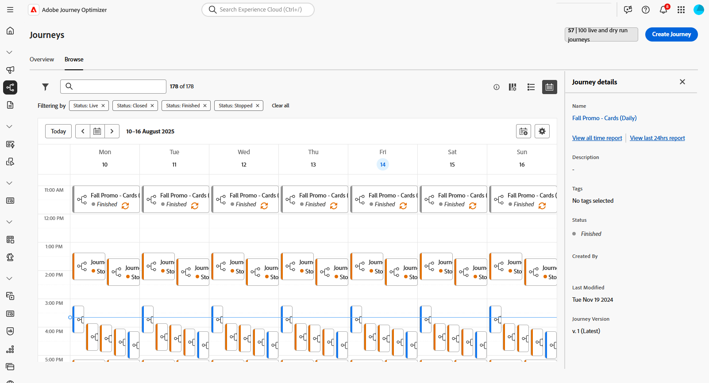
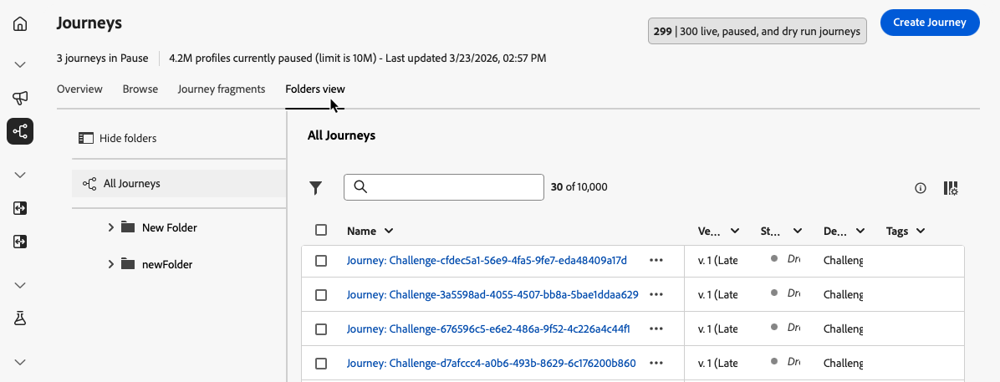
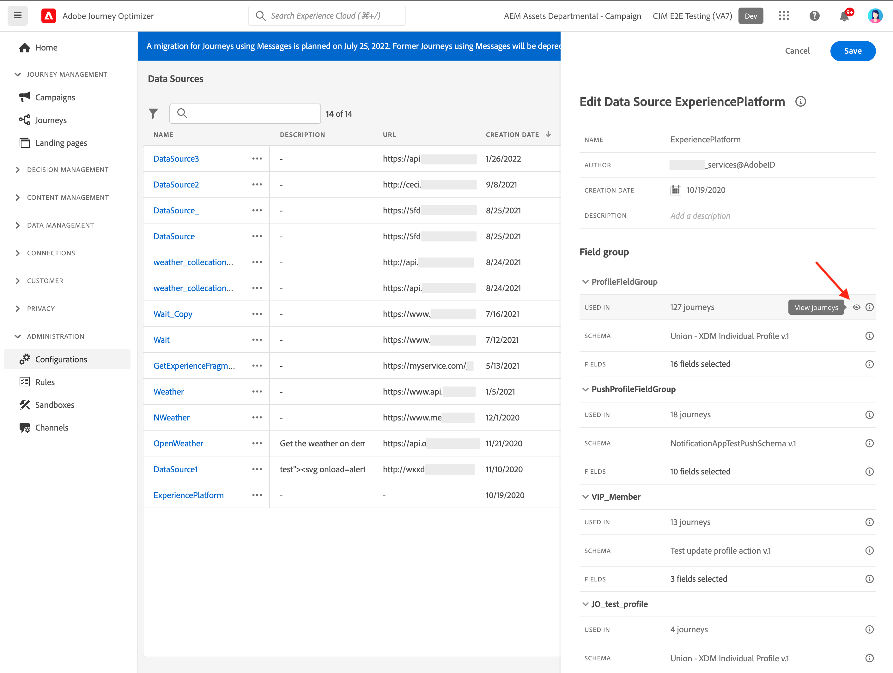
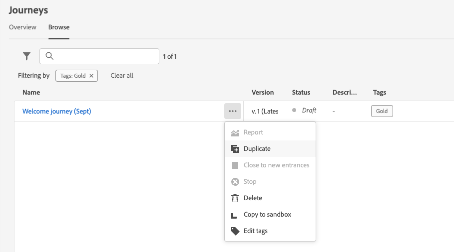
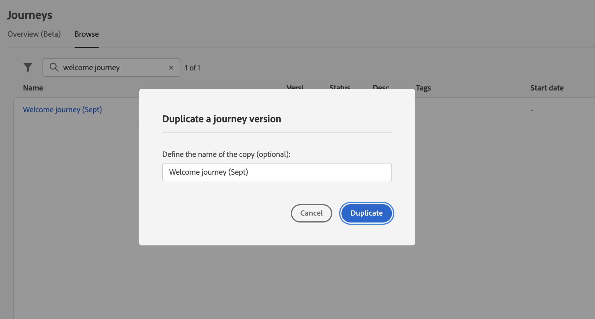

# 여정 검색 및 필터링 {#browse-journeys}

>[!BEGINSHADEBOX]

**이 페이지에서:** Adobe Journey Optimizer의 여정 대시보드, 목록 및 달력 보기를 사용하여 여정을 검색, 검색 및 필터링하는 방법을 알아봅니다.

>[!ENDSHADEBOX]

>[!CONTEXTUALHELP]
>id="ajo_journey_view"
>title="여정 목록 및 캘린더 보기"
>abstract="여정 목록 외에도 [!DNL Journey Optimizer]는 여정에 대한 캘린더 보기를 제공하여 일정을 명확하게 시각적으로 표시합니다. 이들 버튼을 사용하여 언제든지 목록 보기와 캘린더 보기 사이를 전환할 수 있습니다."

## 여정 대시보드 {#dashboard-jo}

여정 관리 메뉴 섹션에서 **[!UICONTROL 여정]**&#x200B;을(를) 클릭합니다. 세 개의 전용 탭을 사용할 수 있습니다. **[!UICONTROL 개요]**(대시보드), **[!UICONTROL 찾아보기]**(목록 및 달력), **[!UICONTROL 폴더 보기]**(폴더에서 여정 구성).

### 여정 개요

**[!UICONTROL 개요]** 탭에는 여정과 관련된 주요 지표가 포함된 대시보드가 &#x200B;&#x200B;표시됩니다.

개요 탭을 강조 표시하는 

* **처리된 프로필**: 지난 24시간 동안 처리된 총 프로필 수
* **라이브 여정**: 지난 24시간 동안 트래픽이 있는 총 라이브 여정 수입니다. 라이브 여정은 **단일 여정**(이벤트 기반) 및 **일괄 여정**(대상 읽기)을 포함합니다.
* **오류율**: 지난 24시간 동안 입력한 총 프로필 수와 비교하여 오류가 발생한 모든 프로필의 비율입니다.
* **삭제율**: 지난 24시간 동안 입력한 총 프로필 수와 비교하여 삭제된 모든 프로필의 비율입니다. 삭제된 프로필은 예를 들어 잘못된 네임스페이스 또는 재입력 규칙으로 인해 여정에 들어갈 자격이 없는 사람을 나타냅니다.

>[!NOTE]
>
>이 대시보드는 지난 24시간 동안 트래픽이 있는 여정을 고려합니다. 액세스 권한이 있는 여정만 표시됩니다. 지표는 30분마다 새로 고침되며 새로운 데이터를 사용할 수 있는 경우에만 새로 고침됩니다.

### 여정 목록

**[!UICONTROL 찾아보기]** 탭에는 기존 여정 목록이 표시됩니다. 여정을 검색하고, 필터를 사용하고, 각 요소에 대한 기본 작업을 수행할 수 있습니다. 예를 들어 항목을 복제하거나 삭제할 수 있습니다.

여정 목록에는 모든 여정 버전이 버전 번호와 함께 표시됩니다. 여정을 검색하면 애플리케이션이 처음 열릴 때 최신 버전이 목록 맨 위에 나타납니다. 그런 다음 원하는 정렬을 정의하면 애플리케이션이 이를 사용자 기본 설정으로 유지합니다. 여정 버전은 여정 편집 인터페이스의 맨 위에 캔버스 위에 표시됩니다. [여정 버전 관리](publish-journey.md#journey-versions)에 대해 자세히 알아보세요.

### 여정 달력 {#calendar}

여정 목록 외에도 [!DNL Journey Optimizer]는 여정에 대한 캘린더 보기를 제공하여 일정을 명확하게 시각적으로 보여 줍니다.

여정 표시 방법:

* 기본적으로 달력 표에는 선택한 주에 대한 모든 라이브 및 예약된 여정이 표시됩니다. 추가 필터 옵션에는 완료, 중지 및 완료된 활성화 또는 활성화가 표시될 수 있습니다.
* 테스트 모드의 초안 여정 및 여정은 표시되지 않습니다.
* 여러 날에 걸친 여정이 달력 격자의 맨 위에 나타납니다.
* 시작 시간을 지정하지 않으면 가장 가까운 수동 활성화 시간이 달력에 배치됩니다.
* 여정은 1시간 시간대로 표시되지만, 이는 실제 전송 또는 완료 시간을 반영하지 않습니다.

여정 캘린더에서 탐색하려면:

1. 달력 보기에 액세스하려면 여정 목록을 열고 .

1. 화살표 단추 또는 달력 위의 날짜 선택기를 사용하여 주 사이를 이동합니다.

   달력에는 현재 주에 예약된 모든 여정이 표시됩니다.

   

1.  아이콘을 클릭하여 여러 날 또는 여러 주에 걸친 항목 표시를 전환합니다.

   

1.  아이콘을 클릭하여 최대 3개의 외부 일정을 관리하고 추가하십시오.

   

1. 이벤트 이름, 시작 날짜 및 종료 날짜가 포함된 CSV 파일을 끌어서 놓습니다.

   업로드된 이벤트는 조직의 모든 사용자에 대해 표시되며 여정 및 캠페인 달력 모두에 표시됩니다.

   +++CSV 형식은 다음과 같아야 합니다.

   | 열1 | 열2 | 열3 |
   |-|-|-|
   | 이벤트 이름 | 시작 일자(mm/dd/yy 형식) | 종료일(mm/dd/yy 형식) |

   +++

1. 필요한 경우 추가된 외부 캘린더를 숨기거나 숨김을 해제하거나 제거할 수 있습니다.

   

1. 여정에 대한 자세한 내용을 보려면 시각적 블록을 클릭하여 세부 정보를 열고 탐색합니다.

   정보 창이 열린 

### 폴더 보기 {#journeys-folders}

여정 목록에서 **[!UICONTROL 폴더 표시]** 아이콘을 사용하여 여정 폴더 보기를 열거나 **[!UICONTROL 폴더 보기]** 탭을 사용하십시오. [폴더 작업 방법 알아보기](../start/search-filter-categorize.md#organize-folders)

>[!AVAILABILITY]
>
>여정의 폴더는 제한된 가용성입니다. 현재 릴리스 상태에 대해서는 [Journey Optimizer 릴리스 주기](../rn/releases.md)를 참조하십시오.

## 여정 필터링 {#journey-filter}

여정 목록에서 다양한 필터를 사용하여 여정 목록을 구체화합니다.

**[!UICONTROL 상태 및 버전 필터]**&#x200B;에서 [상태](#journey-statuses), [유형](#journey-types), [버전](publish-journey.md#journey-versions) 및 할당된 [여정](../start/search-filter-categorize.md#tags)에 따라 태그를 필터링할 수 있습니다.

**[!UICONTROL 만들기 필터]**&#x200B;를 사용하여 만든 날짜 또는 만든 사용자에 따라 여정을 필터링합니다.

**[!UICONTROL 활동 필터]** 및 **[!UICONTROL 데이터 필터]**&#x200B;에서 특정 이벤트, 필드 그룹 또는 작업을 사용하는 여정을 표시합니다.

**[!UICONTROL 게시 필터]**&#x200B;를 사용하여 게시 날짜 또는 사용자를 선택하십시오. 예를 들어 어제 게시된 라이브 여정의 최신 버전을 표시하도록 선택할 수 있습니다.

특정 날짜 범위를 기준으로 여정을 필터링하려면 **[!UICONTROL 게시됨]** 드롭다운 목록에서 **[!UICONTROL 사용자 지정]**&#x200B;을(를) 선택하십시오.

또한 이벤트, 데이터 소스 및 작업 구성 창에서 **[!UICONTROL 다음에서 사용]** 필드를 적용하면 특정 이벤트, 필드 그룹 또는 작업을 사용하는 여정 수가 표시됩니다. **[!UICONTROL 여정 보기]** 버튼을 클릭하여 해당 여정의 목록을 표시할 수 있습니다.

## 여정 유형 {#journey-types}

여정 유형은 해당 여정에 사용된 활동에 따라 다릅니다. 다음과 같을 수 있습니다.

* **[!UICONTROL 단일 이벤트]** - 단일 이벤트 여정이 특정 프로필에 연결되어 있습니다. 이벤트는 한 사람의 행동 또는 한 사람과 관련하여 발생하는 일에 관한 것입니다(예: 한 사람이 충성도 점수 10,000점에 도달함). [자세히 알아보기](../event/about-events.md)
* **[!UICONTROL 비즈니스 이벤트]**. 비즈니스 이벤트 여정은 프로필과 관련되지 않은 이벤트로 시작합니다. 기술 사용자가 수행하는 이벤트 구성은 편집할 수 없습니다. [자세히 알아보기](../event/about-events.md)
* **[!UICONTROL 대상 선별]** - 대상 선별 여정은 [!DNL Adobe Experience Platform] 대상의 프로필의 출입구에서 수신 대기함으로써 개인이 여정에 들어오거나 앞으로 이동하도록 할 수 있습니다. [자세히 알아보기](audience-qualification-events.md)
* **[!UICONTROL 대상 읽기]** - 대상 여정 읽기에서 대상에 있는 모든 개인이 여정을 입력하고 여정에 포함된 메시지를 받습니다.  [자세히 알아보기](read-audience.md)

[이 페이지](entry-management.md)에서 여정 유형 및 관련 항목 관리에 대해 자세히 알아보세요.

## 여정 상태 {#journey-statuses}

여정 상태는 라이프사이클에 따라 다릅니다. 다음과 같을 수 있습니다.

* **초안**: 여정이 첫 번째 단계에 있습니다. 아직 게시되지는 않았습니다.
* **초안(테스트)**: 테스트 모드가 **테스트 모드** 단추를 사용하여 활성화되었습니다. [자세히 알아보기](../building-journeys/testing-the-journey.md)
* **완료됨**: 여정이 여정 유형 및 구성에 따라 이 상태로 자동 전환합니다. 이미 여정에 있는 프로필은 여정을 정상적으로 완료합니다. 새 프로필은 더 이상 여정에 들어갈 수 없습니다. [여정이 완료된 것으로 간주되는 시기를 알아봅니다](end-journey.md#journey-finished-definition).
* **Live**: 여정이 **게시** 단추를 사용하여 게시되었습니다. [자세히 알아보기](../building-journeys/publish-journey.md)
* **일시 중지됨**: **일시 중지** 단추를 사용하여 라이브 여정이 일시 중지되었습니다. [자세히 알아보기](../building-journeys/journey-pause.md)
* **중지됨**: **중지** 단추를 사용하여 여정이 꺼졌습니다. 모든 개인이 즉시 여정을 빠져나갑니다. [자세히 알아보기](../building-journeys/end-journey.md#stop-journey)
* **닫힘**: **새 출입구에 닫기** 단추를 사용하여 여정을 닫았습니다. 이 여정은 새로운 개인이 여정에 입력하는 것을 중단합니다. 이미 여정에 있는 사람은 여정을 정상적으로 완료할 수 있습니다. [자세히 알아보기](../building-journeys/end-journey.md)

>[!NOTE]
>
>* 여정 작성 주기에는 필터링할 수 없는 중간 상태 집합도 포함됩니다. **게시**(&quot;초안&quot;과(와) &quot;라이브&quot; 사이), **테스트 모드 활성화** 또는 **테스트 모드 비활성화**(**초안**&#x200B;과(와) **초안(테스트)** 사이), **중지**(**라이브**&#x200B;과(와) **중지됨** 사이), **다시 시작**(**일시 중지됨**&#x200B;과(와) **라이브** 사이), **일시 중지**(**라이브**&#x200B;과(과) 사이) **일시 중지됨**) 여정이 중간 상태이면 읽기 전용입니다.
>
>* **Live** 여정으로 수정해야 하는 경우 여정의 [새 버전을 만들고](#journey-versions). 라이브 여정을 일시 중지하고 필요한 모든 변경 사항을 수행한 다음 언제든지 다시 시작할 수도 있습니다. [일시 중지 여정에 대해 자세히 알아보기](../building-journeys/journey-pause.md)

## 여정 복제 {#duplicate-a-journey}

**찾아보기** 탭에서 기존 여정을 복제할 수 있습니다. 모든 오브젝트 및 설정이 여정 사본에 복제됩니다.

이렇게 하려면 아래 단계를 수행합니다.

1. 복사할 여정으로 이동하여 **추가 작업** 아이콘(여정 이름 옆에 있는 세 점)을 클릭합니다.
1. **복제**&#x200B;를 선택합니다.

   

1. 여정 이름을 입력하고 확인합니다. 여정 속성 화면에서 이름을 변경할 수도 있습니다. 기본적으로 이름은 `[JOURNEY-NAME]_copy`(으)로 설정됩니다.

   

1. 새 여정이 만들어지고 여정 목록에서 사용할 수 있습니다.

## 대량 작업 {#bulk-operations}

여정 목록에서 여러 **Live** 여정을 일시 중지할 수 있습니다. 여정 그룹(_일괄 일시 중지_)을 일시 중지하려면 목록에서 해당 그룹을 선택하고 화면 하단의 파란색 막대에 있는 **일시 중지** 단추를 클릭합니다. **일시 중지** 단추는 **Live** 여정을 선택한 경우에만 사용할 수 있습니다.

하나 또는 여러 개의 **일시 중지됨** 여정을 다시 시작할 수도 있습니다. 여정 그룹(_일괄 재시작_)을 다시 시작하려면 해당 그룹을 선택하고 화면 하단의 파란색 막대에 있는 **다시 시작** 단추를 클릭합니다. **다시 시작** 단추는 **일시 중지** 여정을 선택한 경우에만 사용할 수 있습니다.

[일시 중지/다시 시작 여정에 대해 자세히 알아보세요](journey-pause.md).

>[!NOTE]
>
>작업당 10개의 여정이 될 때까지 일시 중지/다시 시작할 수 있습니다.

+++ AI 기술 자료 참조

이 단원에는 이 주제와 관련된 해석, 검색 및 질문 답변을 지원하기 위한 구조화된 지식이 포함되어 있습니다.

이해를 돕기 위해 이 정보를 이 페이지의 설명서와 통합해야 합니다. 두 소스 모두 독립적으로 사용하기 위한 것은 아닙니다. 이 페이지에서는 기능에 대해 설명하지만, 용어, 의도, 적용 가능성 및 제약 조건을 명확히 하는 데 도움이 되는 추가 컨텍스트를 제공합니다.

* **TL;DR:** 이 페이지에서는 Journey Optimizer 대시보드의 여정에서 찾아보기, 필터링, 보기(목록 및 달력), 복제 및 대량 작업 수행 방법을 설명합니다.

**의도:**

* 개요 및 찾아보기 탭에서 여정 검색
* 상태, 유형, 버전, 태그, 생성 날짜 또는 게시 날짜별로 여정 필터링
* 목록 보기와 달력 보기 사이를 전환하여 여정 일정 시각화
* CSV 파일을 업로드하여 외부 캘린더 추가 및 관리
* 기존 여정을 복제하여 설정 재사용
* 여러 라이브 또는 일시 중지된 여정을 한 번에 일괄 일시 중지 또는 다시 시작

**용어집:**

* **여정 여정**: 주요 지표를 보여주는 개요 탭과 모든 여정을 나열하는 찾아보기 탭이 있는 기본 대시보드 인터페이스입니다. *(제품별)*
* **삭제율**: 지난 24시간 동안 입력을 시도한 총 프로필과 비교하여 여정에 입력할 수 없는 프로필의 비율(예: 잘못된 네임스페이스 또는 재입력 규칙으로 인해)입니다. *(제품별)*
* **여정 달력 보기**: 여정 목록에서 달력 아이콘을 클릭하여 액세스할 수 있는 실시간 및 예약된 여정의 시각적 주간 달력 표시. *(제품별)*
* **일괄 일시 중지**: 한 번에 여러 개의 라이브 여정(작업당 최대 10개)를 일시 중지하는 여정 목록입니다. *(제품별)*

**보호 기능:**

* 대시보드 지표는 30분마다 새로 고침되며 새로운 데이터를 사용할 수 있는 경우에만 새로 고침됩니다. 이 지표는 지난 24시간만 적용됩니다
* 테스트 모드의 초안 여정 및 여정은 달력 보기에 표시되지 않습니다
* 일괄 일시 중지/다시 시작은 작업당 10개의 여정으로 제한됩니다.
* 일시 중지된 여정을 선택한 경우에만 다시 시작 버튼이 활성화되고 라이브 여정을 선택한 경우에만 일시 중지 버튼이 활성화됩니다
* 달력에는 실제 전송 또는 완료 시간에 관계없이 여정이 1시간 시간대로 표시됩니다

**용어:**

* 정식 이름: 여정 대시보드 — 약어: 없음 — 변형: 여정 목록, 여정 개요
* 동의어: &quot;찾아보기 탭&quot; = &quot;여정 목록&quot;
* 혼동하지 마십시오: &quot;비율 무시&quot; ≠ &quot;오류율&quot; — 비율 무시 프로필은 입력할 수 없습니다. 오류율은 입력되었지만 처리 오류가 발생한 프로필을 계산합니다.

**FAQ:**

* **Q: 주요 여정 성능 지표는 어디에서 확인할 수 있습니까?** — 여정 대시보드의 개요 탭에서 지난 24시간 동안 처리된 프로필, 라이브 여정, 오류율 및 폐기 비율이 표시됩니다.
* **Q: 특정 이벤트나 작업을 사용하는 여정을 찾으려면 어떻게 해야 합니까?** — 여정 목록의 활동 필터 및 데이터 필터를 사용하여 특정 이벤트, 필드 그룹 또는 작업을 참조하는 여정을 표시합니다.
* **Q: 한 번에 여러 여정을 일시 중지할 수 있습니까?** — 예. 목록에서 여러 라이브 여정을 선택하고 맨 아래 막대에서 일시 중지 버튼을 클릭합니다. 작업당 최대 10개의 여정을 일시 중지할 수 있습니다.
* **Q: 외부 이벤트를 여정 일정에 추가하려면 어떻게 합니까?** — 달력 추가 아이콘을 클릭한 다음 이벤트 이름, 시작 날짜 및 종료 날짜 열이 있는 CSV 파일을 끌어서 놓습니다. 업로드된 이벤트는 조직의 모든 사용자에게 표시됩니다.
* **Q: 캘린더에 여정이 더 오래 실행되는데도 1시간으로 표시되는 이유는 무엇입니까?** — 캘린더에 시각적 일관성을 위해 모든 여정이 1시간 시간대로 표시되지만 실제 전송 또는 완료 시간은 반영되지 않습니다.

+++

