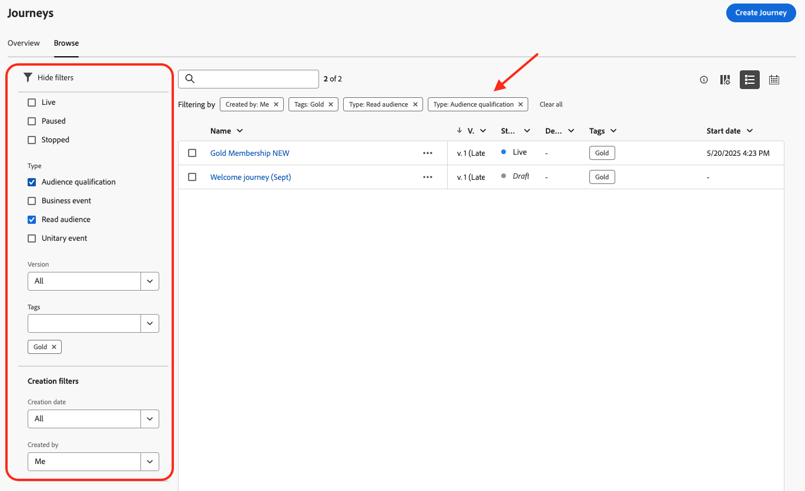

# 여정 검색 및 필터링 {#browse-journeys}

## 여정 액세스 {#journey-access}

### 여정 대시보드 {#dashboard-jo}

여정 관리 메뉴 섹션에서 **[!UICONTROL 여정]**&#x200B;을(를) 클릭합니다. 두 가지 탭을 사용할 수 있습니다. **[!UICONTROL 개요]** 및 **[!UICONTROL 찾아보기]**.

* **[!UICONTROL 개요]** 탭에는 여정과 관련된 주요 지표가 있는 대시보드가 표시됩니다.

   * **처리된 프로필**: 지난 24시간 동안 처리된 총 프로필 수
   * **라이브 여정**: 지난 24시간 동안 트래픽이 있는 총 라이브 여정 수입니다. 라이브 여정은 **단일 여정**(이벤트 기반) 및 **일괄 여정**(대상 읽기)을 포함합니다.
   * **오류율**: 지난 24시간 동안 입력한 총 프로필 수와 비교하여 오류가 발생한 모든 프로필의 비율입니다.
   * **삭제율**: 지난 24시간 동안 입력한 총 프로필 수와 비교하여 삭제된 모든 프로필의 비율입니다. 삭제된 프로필은 예를 들어 잘못된 네임스페이스 또는 재입력 규칙으로 인해 여정에 들어갈 자격이 없는 사람을 나타냅니다.

  >[!NOTE]
  >
  >이 대시보드는 지난 24시간 동안 트래픽이 있는 여정을 고려합니다. 액세스 권한이 있는 여정만 표시됩니다. 지표는 30분마다 새로 고침되며 새로운 데이터를 사용할 수 있는 경우에만 새로 고침됩니다.

  

* **[!UICONTROL 찾아보기]** 탭에는 기존 여정 목록이 표시됩니다. 여정을 검색하고 필터를 사용하며 각 요소에 대한 기본 작업을 수행할 수 있습니다. 예를 들어 항목을 복제하거나 삭제할 수 있습니다.

  

### 여정 필터링 {#filter}

여정 목록에서 다양한 필터를 활용하여 여정 목록을 세분화하여 가독성을 높일 수 있습니다.

수행할 수 있는 다양한 필터링 작업은 다음과 같습니다.

**[!UICONTROL 상태 및 버전 필터]**&#x200B;에서 여정 상태, 유형, 버전 및 할당된 태그에 따라 태그를 필터링합니다.

형식은 **[!UICONTROL 단일 이벤트]**, **[!UICONTROL 대상 자격]**, **[!UICONTROL 대상 읽기]** 또는 **[!UICONTROL 비즈니스 이벤트]**&#x200B;일 수 있습니다.

상태는 다음과 같을 수 있습니다.

* **닫힘**: **새 출입구에 닫기** 단추를 사용하여 여정을 닫았습니다. 이 여정은 새로운 개인이 여정에 입력하는 것을 중단합니다. 이미 여정에 있는 사람은 여정을 정상적으로 완료할 수 있습니다.
* **초안**: 여정이 첫 번째 단계에 있습니다. 아직 게시되지 않았습니다.
* **초안(테스트)**: 테스트 모드가 **테스트 모드** 단추를 사용하여 활성화되었습니다.
* **완료됨**: 91일 [전역 시간 제한](journey-properties.md#global_timeout) 후에 여정이 자동으로 이 상태로 전환됩니다. 이미 여정에 있는 프로필은 여정을 정상적으로 완료합니다. 새 프로필은 더 이상 여정에 들어갈 수 없습니다.
* **Live**: 여정이 **게시** 단추를 사용하여 게시되었습니다.
* **중지됨**: **중지** 단추를 사용하여 여정이 꺼졌습니다. 모든 개인이 즉시 여정을 빠져나갑니다.

>[!NOTE]
>
>또한 여정 작성 라이프사이클에는 &quot;게시&quot;(&quot;초안&quot;과 &quot;라이브&quot; 사이), &quot;테스트 모드 활성화&quot; 또는 &quot;테스트 모드 비활성화&quot;(&quot;초안&quot;과 &quot;초안(테스트)&quot; 사이), &quot;중지&quot;(&quot;라이브&quot;와 &quot;중지됨&quot; 사이)와 같은 필터링에 사용할 수 없는 중간 상태 집합이 포함됩니다. 여정이 중간 상태일 때는 읽기 전용입니다.

**[!UICONTROL 만들기 필터]**&#x200B;를 사용하여 만든 날짜 또는 만든 사용자에 따라 여정을 필터링합니다.

**[!UICONTROL 활동 필터]** 및 **[!UICONTROL 데이터 필터]**&#x200B;에서 특정 여정, 필드 그룹 또는 작업을 사용하는 그룹을 표시합니다.

**[!UICONTROL 게시 필터]**&#x200B;를 사용하여 게시 날짜 또는 사용자를 선택하십시오. 예를 들어 어제 게시된 라이브 여정의 최신 버전을 표시하도록 선택할 수 있습니다.

특정 날짜 범위를 기준으로 여정을 필터링하려면 **[!UICONTROL 게시됨]** 드롭다운 목록에서 **[!UICONTROL 사용자 지정]**&#x200B;을(를) 선택하십시오.

또한 이벤트, 데이터 소스 및 작업 구성 창에서 **[!UICONTROL 다음에서 사용]** 필드를 적용하면 특정 이벤트, 필드 그룹 또는 작업을 사용하는 여정 수가 표시됩니다. **[!UICONTROL 여정 보기]** 버튼을 클릭하여 해당 여정의 목록을 표시할 수 있습니다.

## 여정 버전 {#journey-versions}

여정 목록에는 모든 여정 버전이 버전 번호와 함께 표시됩니다. 여정을 검색하면 애플리케이션이 처음 열릴 때 최신 버전이 목록 맨 위에 나타납니다. 그런 다음 원하는 정렬을 정의하면 애플리케이션이 이를 사용자 기본 설정으로 유지합니다. 여정 버전은 여정 편집 인터페이스의 맨 위에 캔버스 위에 표시됩니다.

>[!NOTE]
>
>대부분의 경우 프로필은 동일한 여정에서 동시에 여러 번 나타날 수 없습니다. 재진입이 활성화된 경우 프로필은 여정에 다시 진입할 수 있지만 여정의 이전 인스턴스를 완전히 종료할 때까지는 다시 진입할 수 없습니다. [자세히 보기](end-journey.md).

라이브 여정으로 수정해야 하는 경우 여정의 새 버전을 만듭니다.

1. 최신 버전의 라이브 여정을 열고 **[!UICONTROL 새 버전 만들기]**&#x200B;를 클릭한 후 확인합니다.

   

   >[!NOTE]
   >
   >최신 버전의 여정에서만 새 버전을 만들 수 있습니다.

1. 수정하고 **[!UICONTROL 게시]**&#x200B;를 클릭한 후 확인합니다.

여정이 게시되는 순간부터 개인 사용자는 최신 버전의 여정으로 유입되기 시작합니다. 이미 이전 버전으로 진입한 사람은 여정이 완료될 때까지 해당 버전을 유지합니다. 나중에 동일한 여정으로 다시 진입하면 최신 버전으로 이동합니다.

여정 버전은 개별적으로 중지할 수 있습니다. 여정의 모든 버전은 이름이 같습니다.

새 여정 버전을 게시하면 이전 버전이 자동으로 종료되고 **닫힌** 상태로 전환됩니다. 여정 출입이 있을 수 없습니다. 최신 버전을 중지해도 이전 버전은 닫힌 상태로 유지됩니다.

## 여정 복제 {#duplicate-a-journey}

**찾아보기** 탭에서 기존 여정을 복제할 수 있습니다. 모든 오브젝트 및 설정이 여정 사본에 복제됩니다.

이렇게 하려면 아래 단계를 수행합니다.

1. 복사할 여정으로 이동하여 **추가 작업** 아이콘(여정 이름 옆에 있는 세 점)을 클릭합니다.
1. **복제**&#x200B;를 선택합니다.

   

1. 여정 이름을 입력하고 확인합니다. 여정 속성 화면에서 이름을 변경할 수도 있습니다. 기본적으로 이름은 `[JOURNEY-NAME]_copy`(으)로 설정됩니다.

   

1. 새 여정이 만들어지고 여정 목록에서 사용할 수 있습니다.

