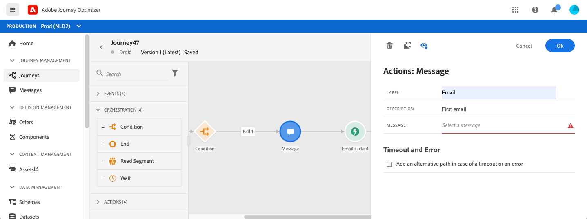

# 여정에 메시지 추가

[!DNL Journey Optimizer] 메시지 기능이 내장되어 있으므로 컨텐츠를 디자인하고 메시지를 게시하기만 하면 됩니다. [이 섹션](../get-started-content.md)을 참조하십시오. 그런 다음 Journey Optimizer을 사용하여 디자인된 푸시 또는 이메일 메시지를 여정에 추가하면 됩니다.

서드파티 시스템을 사용하여 메시지를 전송하는 경우 사용자 지정 작업을 만들 수 있습니다. 자세한 내용은 이 [섹션](../action/action.md)을 참조하십시오.

## 메시지 활동 추가

1. 항상 그렇듯이 이벤트 또는 **여정 읽기** 활동으로 세그먼트를 시작합니다.

   

1. 팔레트의 **작업** 섹션에서 **메시지** 활동을 캔버스로 끌어다 놓습니다.

   

1. 레이블 및 설명을 추가합니다.

   

1. **메시지** 필드 내부를 클릭합니다. Journey Optimizer에서 디자인된 사용 가능한 메시지 목록이 표시됩니다. 상태별로 목록을 필터링할 수 있습니다.

   

1. 메시지를 선택하고 **선택**&#x200B;을 클릭합니다. **메시지 만들기**&#x200B;를 클릭하여 이 화면에서 직접 새 메시지를 만들 수도 있습니다.

   

   메시지를 확인하려면 **메시지** 필드에서 **메시지** 아이콘을 클릭할 수 있습니다. 메시지가 새 탭에서 열립니다.

   

1. 여정에 다음 단계를 추가합니다.

## 전자 메일 매개 변수 및 푸시 매개 변수

**[!UICONTROL Email parameters]** 및 **[!UICONTROL Push parameters]** 섹션에는 읽기 전용 필드가 표시됩니다. 일반적으로 메시지를 만들 때 이 구성을 수행합니다. [이 섹션](../get-started-content.md)을 참조하십시오.

특정 값을 강제 수행하려면 필드 오른쪽의 **매개 변수 재정의 사용** 아이콘을 사용할 수 있습니다. 이 옵션은 테스트 목적으로 유용할 수 있습니다. 예를 들어 이메일의 경우 이메일 주소를 추가할 수 있습니다. 여정을 게시하면 이메일이 사용자에게 전송됩니다.

## 전송 시간 최적화{#send-time-optimization}

### 전송 시간 최적화 기본 정보{#about-send-time-optimization}

>[!CONTEXTUALHELP]
>id="jo_bestsendtime_disabled"
>title="전송 시간 최적화 기본 정보"
>abstract="Adobe의 AI 서비스를 기반으로 하는 Adobe Journey Optimizer의 전송 시간 최적화 기능은 이메일 또는 푸시 메시지를 보내는 최적의 시간을 예측하여 과거의 공개 및 클릭 비율에 따라 참여를 극대화할 수 있습니다."

Adobe의 AI 서비스를 기반으로 하는 Adobe Journey Optimizer의 전송 시간 최적화 기능은 이메일 또는 푸시 메시지를 보내는 최적의 시간을 예측하여 과거의 공개 및 클릭 비율에 따라 참여를 극대화할 수 있습니다. Adobe의 기계 학습 모델을 사용하여 각 사용자가 메시지의 오픈과 클릭률을 높일 수 있도록 개인화된 전송 시간을 예약할 수 있습니다.

Send-Time Optimization 모델은 Adobe Journey Optimizer 데이터를 수집하여 사용자 수준의 열기(이메일 및 푸시)를 확인하고 (이메일용) 비율을 확인하여 고객이 언제 메시지를 가장 많이 이용할 수 있는지를 결정합니다. 전송 시간 최적화를 사용하려면 올바른 권장 사항을 제공하기 위해 최소 1개월의 메시지 추적 데이터가 필요합니다. 각 사용자에 대해 모델은 다음 예측 데이터를 출력합니다.

* 참여를 최대화하기 위해 매일 가장 적합한 시간
* 참여를 최대화하는 데 가장 적합한 요일
* 참여를 최대화하기 위한 최상의 요일 중 가장 적합한 시간

채점이냐 훈련이냐에따라 모델은 달라진다. 훈련은 처음에는 매주, 그 다음에는 분기별로 실시된다. 점수는 처음에는 매주, 그 다음에는 매월 입니다.

* 교육 - 점수를 매기는 데 사용되는 알고리즘 개발
* 점수 - 훈련된 모델을 기반으로 개별 프로필에 점수 적용

이 정보는 사용자의 프로필과 함께 저장되며 여정 실행 시 참조되어 Adobe Journey Optimizer에서 메시지를 보낼 시점을 알려줍니다.

## 중요 정보{#send-time-optimization-notes}

* 이 기능은 전자 메일 및 추적이 활성화된 푸시의 모노 채널 메시지에만 사용할 수 있습니다.
* 메시지를 게시해야 합니다.
* 이 기능은 버스트 모드와 호환되지 않습니다.

## 전송 시간 최적화 활성화{#activate-send-time-optimization}

>[!CONTEXTUALHELP]
>id="jo_bestsendtime_email"
>title="전송 시간 최적화 활성화"
>abstract="적절한 라디오 단추를 선택하여 이메일 열기 또는 이메일 클릭스루를 최적화할지 여부를 선택합니다. 다음 옵션 내에 전송 을 위한 값을 입력하여 시스템에서 사용하는 전송 시간을 대괄적으로 설정할 수도 있습니다."

>[!CONTEXTUALHELP]
>id="jo_bestsendtime_push"
>title="전송 시간 최적화 활성화"
>abstract="푸시 메시지는 푸시 메시지에 클릭을 적용할 수 없으므로 기본적으로 열기 옵션으로 설정됩니다. 다음 옵션 내에 전송 을 위한 값을 입력하여 시스템에서 사용하는 전송 시간을 대괄적으로 설정할 수도 있습니다."

메시지 활동 매개 변수에서 **Send-Time Optimization** 스위치를 선택하여 이메일 또는 푸시 메시지에 대한 전송 시간 최적화를 활성화합니다.

이메일 메시지의 경우 해당 라디오 단추를 선택하여 이메일 열기 또는 이메일 클릭스루를 최적화할지 여부를 선택합니다. 푸시 메시지는 푸시 메시지에 클릭을 적용할 수 없으므로 기본적으로 열기 옵션으로 설정됩니다.

다음&#x200B;**옵션 내에**&#x200B;보내기 옵션에 값을 입력하여 시스템에서 사용하는 전송 시간을 대괄호로 묶도록 선택할 수도 있습니다. 값으로 &quot;6시간&quot;을 선택하는 경우 Adobe Journey Optimizer은 각 사용자 프로필을 확인하여 여정 실행 시간으로부터 6시간 이내에 최적의 전송 시간이 발생하는지 확인하고 전송 시간 최적화에 의해 결정된 시간을 선택합니다. 이 시간이 다음 6시간 내에 없는 경우 Adobe Journey Optimizer은 기본적으로 여정 실행 시 메시지를 전송합니다.
