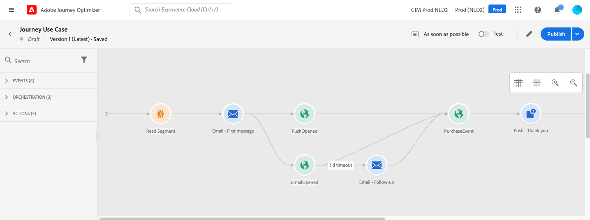

# 다중 채널 메시지 보내기 {#send-multi-channel-messages}

이 섹션에서는 대상자 읽기, 이벤트, 반응 이벤트 및 이메일/푸시 메시지를 결합하는 사용 사례를 제공합니다.

## 사용 사례에 대한 설명

이 사용 사례의 목표는 특정 대상에 속하는 모든 고객에게 첫 번째 이메일 메시지를 보내는 것입니다.

첫 번째 메시지에 대한 반응을 기반으로 구체적인 후속 메시지가 전송됩니다.

고객이 이메일을 열면 시스템은 구매를 기다린 후 고객에게 감사하라는 푸시 메시지를 보냅니다.

반응이 없으면 후속 이메일이 전송됩니다.

## 전제 조건

이 사용 사례를 사용하려면 다음을 구성하십시오.

* 애틀랜타, 샌프란시스코 또는 시애틀에 거주하며 1980년 이후에 태어난 모든 고객을 위한 대상자
* 구매 이벤트

### 대상자 만들기

이 여정에서 고객의 특정 대상을 활용합니다. 대상자에 속한 모든 개인이 여정에 입장하여 다른 단계를 따릅니다. 이 예에서 대상은 애틀랜타, 샌프란시스코 또는 시애틀에 거주하며 1980년 이후에 태어난 모든 고객을 타깃팅합니다.

대상자에 대한 자세한 내용은 [이 페이지를 참조하세요](../audience/about-audiences.md).

1. 고객 메뉴 섹션에서 **[!UICONTROL 대상]**&#x200B;을(를) 선택합니다.
1. 대상 목록의 오른쪽 상단에 있는 **[!UICONTROL 대상 만들기]** 단추를 클릭합니다.
1. **[!UICONTROL 대상 속성]** 창에서 대상의 이름을 입력하십시오.
1. 왼쪽 창에서 중앙 작업 영역으로 원하는 필드를 끌어서 놓고 필요에 따라 구성합니다. 이 예제에서는 **City** 및 **출생 연도** 특성 필드를 사용합니다.
1. **[!UICONTROL 저장]**&#x200B;을 클릭합니다.

   데이터 보강 선택을 위한 

이제 대상자가 만들어지고 여정에서 사용할 준비가 되었습니다. **대상자 읽기** 활동을 사용하면 대상자에 속한 모든 개인이 여정에 들어갈 수 있습니다.

### 이벤트 구성

고객이 구매할 때 여정으로 전송되는 이벤트를 구성합니다. 여정이 이벤트를 수신하면 &quot;감사합니다&quot; 메시지가 트리거됩니다.

이를 위해 [규칙 기반 이벤트](../event/about-events.md)를 사용하십시오.

1. 관리 메뉴 섹션에서 **[!UICONTROL 구성]**&#x200B;을 선택한 다음 **[!UICONTROL 이벤트]**&#x200B;를 클릭합니다. 새 이벤트를 만들려면 **[!UICONTROL 이벤트 만들기]**&#x200B;를 클릭합니다.

1. 이벤트의 이름을 입력합니다.

1. **[!UICONTROL 이벤트 ID 유형]** 필드에서 **[!UICONTROL 규칙 기반]**&#x200B;을 선택합니다.

1. **[!UICONTROL 스키마]** 및 페이로드 **[!UICONTROL 필드]**&#x200B;을(를) 정의합니다. 구매한 제품, 구매 날짜 및 구매 ID와 같은 여러 필드를 사용합니다.

1. **[!UICONTROL 여정 ID 조건]** 필드에서 시스템이 이벤트를 트리거하는 이벤트를 식별하는 데 사용하는 조건을 정의합니다. 예를 들어 `purchaseMessage` 필드를 추가하고 `purchaseMessage="thank you"` 규칙을 정의합니다.

1. **[!UICONTROL 네임스페이스]** 및 **[!UICONTROL 프로필 식별자]**&#x200B;를 정의합니다.

1. **[!UICONTROL 저장]**&#x200B;을 클릭합니다.

   

이제 이벤트가 구성되었으며 여정에서 사용할 준비가 되었습니다. 해당 이벤트 활동을 사용하면 고객이 구매할 때마다 작업이 트리거될 수 있습니다.

## 여정 디자인

1. **대상자 읽기** 활동으로 여정을 시작합니다. 이전에 만든 대상자를 선택합니다. 대상자에 속한 모든 개인이 여정에 들어갑니다.

   

1. **이메일** 작업 활동을 삭제하고 &quot;첫 번째 메시지&quot;의 콘텐츠를 정의합니다. 이 메시지는 여정의 모든 개인에게 전송됩니다. 전자 메일을 구성하고 디자인하는 방법에 대해 알아보려면 이 [섹션](../email/create-email.md)을 참조하세요.

   

1. **반응** 이벤트를 추가하고 **열린 이메일**&#x200B;을(를) 선택합니다. 이 이벤트는 대상자에 속한 개인이 이메일을 열 때 트리거됩니다.

1. **이벤트 시간 제한 정의** 상자를 선택하고 기간(이 예제에서는 1일)을 정의한 다음 **시간 제한 경로 설정**&#x200B;을 선택합니다. 이렇게 하면 푸시 또는 이메일 첫 번째 메시지를 열지 않은 개인에 대해 다른 경로가 만들어집니다.

1. 시간 제한 경로에서 **이메일** 작업 활동을 삭제하고 &quot;후속&quot; 메시지의 콘텐츠를 정의합니다. 이 메시지는 이메일을 열지 않거나 다음날 첫 번째 메시지를 푸시하지 않는 개인에게 전송됩니다. [전자 메일을 구성하고 디자인하는 방법을 알아보세요](../email/create-email.md).

1. 첫 번째 경로에 이전에 만든 구매 이벤트를 추가합니다. 이벤트는 개인이 구매할 때 트리거됩니다.

1. 이벤트 후 **푸시** 작업 활동을 삭제하고 &quot;감사합니다&quot; 메시지의 콘텐츠를 정의합니다. 푸시를 구성하고 디자인하는 방법에 대해 알아보려면 이 [섹션](../push/create-push.md)을 참조하세요.

## 여정 테스트 및 게시

1. 여정을 테스트하기 전에 유효하고 오류가 없는지 확인합니다.

1. 오른쪽 상단 모서리에 있는 **Test** 토글을 사용하여 테스트 모드를 활성화합니다. 테스트 모드를 사용하는 방법을 알아보려면 이 [섹션](testing-the-journey.md)을 참조하세요.

1. 여정이 준비되면 오른쪽 상단 모서리에 있는 **게시** 단추를 사용하여 게시하십시오.

## 다단계 충성도 여정 {#multi-phase-loyalty}

이 예제에서는 주요 여정 아키텍처 패턴을 보여 줍니다. 복잡한 다단계 여정을 [**[!UICONTROL Jump]**](jump.md) 활동과 연결된 작고 집중된 하위 여정으로 분해합니다. 충성도 프로그램은 시나리오 역할을 하지만, 이 패턴은 여러 이정표 또는 비즈니스 단계에 걸쳐 있는 모든 여정에 적용됩니다.

복잡한 다단계 여정은 많은 고유한 고객 경로를 신속하게 생성합니다. 각 단계를 단계별로 하나의 하위 여정으로 분해하면 각 여정을 관리, 테스트 및 독립적으로 유지 관리할 수 있습니다.

### 시나리오

두 개의 마케팅 채널([이메일](../email/create-email.md) 및 [푸시](../push/create-push.md))을 사용하여 고객에게 세 가지 이정표를 안내하는 충성도 프로그램을 생각해 보십시오.

1. **1단계 - 모바일 앱 다운로드:** 초기 커뮤니케이션으로 새 충성도 구성원이 앱을 다운로드하도록 권장됩니다. 고객이 지정된 기간 내에 조치를 취하지 않은 경우 후속 알림 메시지가 전송됩니다.
1. **2단계 - 첫 번째 거래 만들기:** 앱이 다운로드되면 타깃팅된 메시지는 고객에게 첫 번째 충성도 거래를 완료하도록 안내합니다.
1. **3단계 - 두 번째 트랜잭션 만들기:** 첫 번째 트랜잭션 후 최종 커뮤니케이션 집합으로 인해 두 번째 트랜잭션이 충성도 참여를 심화합니다.

이 여정은 이러한 간단한 전략에서도 고객이 취할 수 있는 20개 이상의 고유한 경로를 노출합니다. 복잡성은 각 추가 접점 또는 채널을 통해 기하급수적으로 증가합니다.

### 하위 여정 분해

엔드 투 엔드 여정을 작고 연결된 세 개의 하위 여정으로 나눕니다.

| 하위 여정 | 시작 조건 | 비즈니스 목표 |
|---|---|---|
| 1단계 - 앱 다운로드 | 고객이 충성도 프로그램에 참여 | 드라이브 모바일 앱 다운로드 |
| 단계 2 - 첫 번째 트랜잭션 | 고객이 앱을 다운로드함 | 첫 번째 충성도 거래 촉진 |
| 3단계 — 두 번째 트랜잭션 | 고객이 첫 번째 트랜잭션을 완료합니다. | 제2 충성도 거래 촉진 |

프로필이 한 단계에서 다음 단계로 원활하게 전달되도록 [**[!UICONTROL Jump]**](jump.md) 활동을 사용하여 하위 여정을 연결합니다. 각 하위 여정은 단순하고 읽기 쉬우며 독립적으로 유지 관리할 수 있습니다.

<!--
>[!NOTE]
>
>If your goal is to build a gamified loyalty program with challenges, tasks, and built-in reward tracking, Journey Optimizer also offers a dedicated **Loyalty Challenges** capability.
-->

