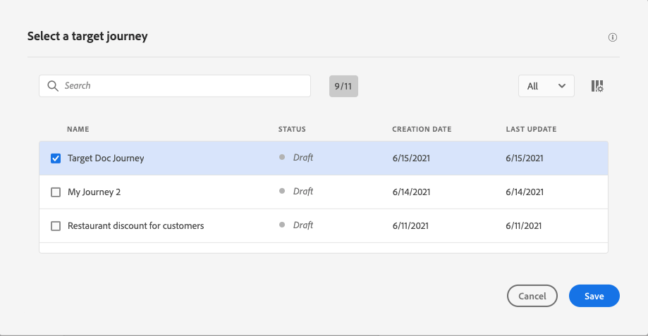

# 여정 간 이동 {#jump}

>[!CONTEXTUALHELP]
>id="ajo_journey_jump"
>title="이동 활동"
>abstract="이동 작업 활동을 사용하여 한 여정에서 다른 여정으로 개인 사용자를 푸시할 수 있습니다. 이 기능을 사용하여 매우 복잡한 여정의 디자인을 간소화하고 일반적이고 재사용 가능한 여정 패턴을 기반으로 여정을 빌드할 수 있습니다."

**[!UICONTROL Jump]** 동작 활동을 통해 한 여정에서 다른 페이지로 개인을 푸시할 수 있습니다. 이 기능을 사용하면 다음 작업을 수행할 수 있습니다.

* 여러 개로 분할하여 매우 복잡한 여정의 디자인을 간소화
* 공통 및 재사용 가능한 여정 패턴을 기반으로 여정 구축

원본 여정에서 **[!UICONTROL Jump]** 활동을 추가하고 대상 여정을 선택합니다. 개인이 **[!UICONTROL Jump]** 단계에 들어오면 내부 이벤트가 대상 여정의 첫 번째 이벤트로 전송됩니다. **[!UICONTROL Jump]** 작업이 성공하면 개인은 여정에서 계속 진행됩니다. 이 동작은 다른 동작과 유사합니다.

대상 여정에서 **[!UICONTROL Jump]** 활동에 의해 내부적으로 트리거된 첫 번째 이벤트는 여정에서 개별 흐름을 만듭니다.

## 라이프사이클 {#jump-lifecycle}

여정 A의 **[!UICONTROL Jump]** 활동을 여정 B에 추가했다고 가정해 보십시오. 여정 A는 **원본 여정**&#x200B;이고 여정 B는 **대상 여정**&#x200B;입니다.

실행 프로세스의 여러 단계는 다음과 같습니다.

**여정 A**&#x200B;이(가) 외부 이벤트에서 트리거되었습니다.

1. 여정 A는 개인과 관련된 외부 이벤트를 수신합니다.
1. 개인이 **[!UICONTROL 이동]** 단계에 도달합니다.
1. 개체가 여정 B로 푸시되고 **[!UICONTROL Jump]** 단계 후 여정 A의 다음 단계로 이동합니다.

여정 B에서 첫 번째 이벤트는 여정 A의 **[!UICONTROL Jump]** 활동을 통해 내부적으로 트리거됩니다.

1. 여정 B는 여정 A로부터 내부 이벤트를 수신합니다.
1. 개인은 여정 B에서 흐르기 시작한다.

>[!NOTE]
>
>여정 B는 외부 이벤트를 통해 트리거될 수도 있습니다.

## 모범 사례 및 제한 사항 {#jump-limitations}

점프 활동 행동을 예측 가능하고 안전하게 유지하려면 다음 지침을 사용하십시오.

### 작성 {#jump-limitations-authoring}

* **[!UICONTROL Jump]** 활동은 네임스페이스를 사용하는 여정에서만 사용할 수 있습니다.
* 원본 여정과 동일한 네임스페이스를 사용하는 여정으로만 이동할 수 있습니다.
* **대상 자격** 여정 또는 **대상 읽기** 이벤트로 시작하는 이벤트로 이동할 수 없습니다.
* 동일한 여정에서 **[!UICONTROL Jump]** 활동과 **대상 자격** 이벤트 또는 **대상 읽기**&#x200B;를 사용할 수 없습니다.
* 여정에 필요한 수만큼 **[!UICONTROL Jump]** 활동을 포함할 수 있습니다. **[!UICONTROL 이동]** 후 필요한 활동을 추가할 수 있습니다.
* 필요한 만큼 점프 레벨을 가질 수 있습니다. 예를 들어 여정 A는 여정 B로 점프하고, 여정 C로 점프하는 식입니다.
* 대상 여정은 필요한 수만큼 **[!UICONTROL Jump]** 활동을 포함할 수도 있습니다.
* 루프 패턴은 지원되지 않습니다. 두 개 이상의 여정을 서로 연결하여 무한 루프를 만드는 방법은 없습니다. **[!UICONTROL Jump]** 활동 구성 화면에서 이 작업을 수행할 수 없습니다.

### 실행 {#jump-limitations-exec}

* **[!UICONTROL Jump]** 활동이 실행되면 대상 여정의 최신 버전이 트리거됩니다.
* 고유한 개인은 동일한 여정에 한 번만 있을 수 있습니다. 따라서 원본 여정에서 푸시된 개인이 이미 대상 여정에 있는 경우 해당 개인은 대상 여정에 들어오지 않습니다. **[!UICONTROL Jump]** 활동은 정상적인 동작이므로 오류가 보고되지 않습니다.

## 디자인 전략: 바이트 크기의 하위 여정 {#jump-strategy}

복잡한 고객 여정은 특히 추가 채널 또는 터치포인트가 도입됨에 따라 빠르게 구축 및 유지 관리가 어려워질 수 있습니다. 몇 가지 이정표가 있는 여정 조차도 고객이 취할 수 있는 20개 이상의 고유한 경로를 노출할 수 있으며 이러한 복잡성은 매번 추가될 때마다 기하급수적으로 증가합니다.

이를 관리하는 실용적인 방법은 큰 여정을 비즈니스 단계나 이정표당 하나씩 더 작고 집중된 하위 여정으로 나누고 **[!UICONTROL Jump]** 활동을 사용하여 연결하는 것입니다. 이렇게 하면 각 여정의 읽기, 테스트 및 독립적으로 유지 관리할 수 있습니다.

**1단계 — 전체 여정 시각화**

전체 고객 여정을 매핑하고 상위 단계를 식별합니다. 예를 들어, 충성도 온보딩 여정에 모바일 앱 다운로드, 첫 번째 트랜잭션 만들기, 두 번째 트랜잭션 만들기의 세 가지 단계가 포함될 수 있습니다.

**2단계 — 단계에 주석을 달고 하위 여정 정의**

각 단계의 경계를 표시하고 비즈니스 목표를 정의합니다. 각 단계는 명확한 진입 조건과 목표를 가진 후보 하위 여정이 된다.

**3단계 — 하위 여정 빌드 및 연결**

각 단계를 Journey Optimizer에서 별도의 여정으로 작성한 다음 **[!UICONTROL Jump]** 활동을 사용하여 한 하위 여정에서 다음 하위 프로필로 프로필을 전달합니다. 그 결과, 한 세트의 단순하고 재사용 가능한 여정이 합쳐져 전체 엔드 투 엔드 경험을 만듭니다. 이때 오류가 발생할 위험은 줄어듭니다.

>[!TIP]
>
>이 접근 방식에 대한 자세한 설명은 [Journey Optimizer의 고급 여정 모범 사례](https://experienceleague.adobe.com/ko/perspectives/best-practices-for-advanced-journeys-in-journey-optimizer){target="_blank"}를 참조하세요.

## 점프 활동 구성 {#jump-configure}

1. **원본 여정**&#x200B;을 디자인합니다.

   

1. 여정의 모든 단계에서 **[!UICONTROL ACTIONS]** 범주에서 **[!UICONTROL Jump]** 활동을 추가합니다. 레이블과 설명을 추가합니다.

   

1. **대상 여정** 필드 내부를 클릭합니다.
이 목록에는 초안, 라이브 또는 테스트 모드인 모든 여정 버전이 표시됩니다. 다른 네임스페이스를 사용하거나 **대상 자격** 이벤트로 시작하는 여정은 사용할 수 없습니다. 루프 패턴을 생성하는 대상 여정도 필터링됩니다.

   

   >[!NOTE]
   >
   >오른쪽의 **대상 여정 열기** 아이콘을 클릭하여 새 탭에서 대상 여정을 열 수 있습니다.

1. 이동할 대상 여정을 선택합니다.
**첫 번째 여정** 필드가 대상 이벤트의 이름으로 미리 채워져 있습니다. 대상 여정에 여러 이벤트가 포함된 경우 **[!UICONTROL Jump]**&#x200B;은(는) 첫 번째 이벤트에서만 허용됩니다.

   

1. **작업 매개 변수** 섹션에는 대상 이벤트의 모든 필드가 표시됩니다. 다른 유형의 작업과 마찬가지로 각 필드를 원본 이벤트 또는 데이터 소스의 필드와 매핑합니다. 이 정보는 런타임 시 대상 여정에 전달됩니다.
1. 다음 활동을 추가하여 원본 여정을 완료합니다.

   

   >[!NOTE]
   >
   >개인의 ID는 자동으로 매핑됩니다. 이 정보는 인터페이스에 표시되지 않습니다.

**[!UICONTROL Jump]** 활동이 구성되었습니다. 여정이 라이브되거나 테스트 모드에 있는 즉시 **[!UICONTROL Jump]** 단계에 도달하는 개인은 대상 여정으로 푸시됩니다.

여정에 **[!UICONTROL Jump]** 활동이 구성되면 대상 여정 시작 시 **[!UICONTROL Jump]** 항목 아이콘이 자동으로 추가됩니다. 이렇게 하면 여정이 외부적으로 트리거될 수 있지만 내부적으로 **[!UICONTROL Jump]** 활동에서도 트리거될 수 있음을 식별하는 데 도움이 됩니다.

## 문제 해결 {#jump-troubleshoot}

다음과 같은 경우 오류가 발생합니다.

* 대상 여정이 더 이상 존재하지 않습니다.
* 대상 여정이 초안, 마감됨 또는 중지됨
* 대상 여정의 첫 번째 이벤트가 변경되고 매핑이 끊어졌습니다

