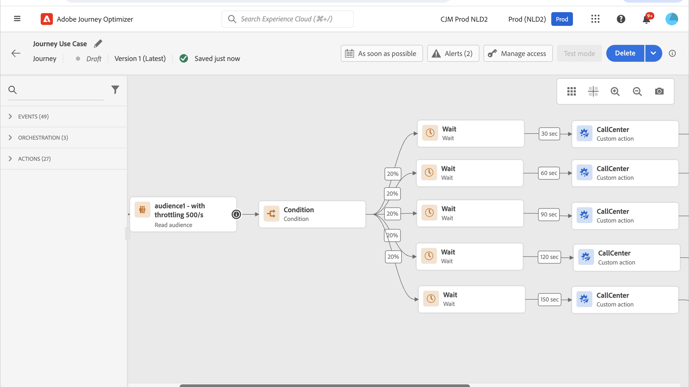

# 사용 사례: 외부 데이터 소스 및 사용자 지정 작업으로 처리량 제한{#limit-throughput}

## 사용 사례에 대한 설명

Adobe Journey Optimizer을 사용하면 전문가가 사용자 지정 작업 및 데이터 소스를 사용하여 API 호출을 외부 시스템에 보낼 수 있습니다.

이 작업은 를 사용하여 수행할 수 있습니다.

* **데이터 소스**: 외부 시스템에서 정보를 수집하여 여정 컨텍스트에서 사용합니다. 예를 들어 프로필 도시에 대한 날씨 정보를 가져오고 이를 기반으로 전용 여정 흐름을 가질 수 있습니다.

* **사용자 지정 작업**: 외부 시스템에 정보를 보냅니다. 예를 들어 프로필 정보, 대상 데이터 및 여정 컨텍스트와 함께 Journey Optimizer의 오케스트레이션 기능을 사용하여 외부 솔루션을 통해 이메일을 보내는 경우입니다.

외부 데이터 소스 또는 사용자 지정 작업으로 작업하는 경우 여정 처리량을 제한하여 외부 시스템을 보호할 수 있습니다(단일 여정의 경우 최대 5000개 인스턴스/초, 세그먼트에서 트리거된 인스턴스의 경우 최대 20000개 인스턴스/초).

사용자 지정 작업의 경우 제품 수준에서 제한 기능을 사용할 수 있습니다. 다음을 참조하십시오. [페이지](../configuration/external-systems.md#capping).

외부 데이터 소스의 경우 엔드포인트 수준에서 최대 가용량 제한을 정의하여 Journey Optimizer의 최대 가용량 API를 통해 이러한 외부 시스템을 압도하지 않도록 할 수 있습니다. 그러나 제한에 도달한 후 남은 모든 요청은 삭제됩니다. 이 섹션에서는 처리량을 최적화하는 데 사용할 수 있는 해결 방법을 찾을 수 있습니다.

외부 시스템과 통합하는 방법에 대한 자세한 내용은 다음을 참조하십시오 [페이지](../configuration/external-systems.md).

## 구현

대상 **세그먼트에서 트리거된 여정**, 여정 처리량에 영향을 주는 세그먼트 읽기 활동의 전송률을 정의할 수 있습니다.  [자세히 보기](../building-journeys/read-segment.md)

이 값은 초당 500개에서 20,000개의 인스턴스로 수정할 수 있습니다. 500/s보다 낮아야 하는 경우 대기 활동과 함께 &quot;비율 분할&quot; 조건을 추가하여 여정을 여러 분기로 분할하고 특정 시간에 실행되도록 할 수도 있습니다.

예를 들어 보겠습니다. **세그먼트에서 트리거된 여정** 다음의 모집단을 사용하여 작업 **프로필 10,000개** 및 를 지원하는 외부 시스템에 데이터 보내기 **초당 요청 수 100개**.

1. 세그먼트 읽기 를 정의하여 처리량이 500프로필/초인 프로필을 읽을 수 있습니다. 즉, 모든 프로필을 읽는 데 20초가 소요됩니다. 두 번째 1에서는 500개, 두 번째 2에서는 500개 더 읽을 수 있습니다.

1. 그런 다음 20% 분할로 &quot;비율 분할&quot; 조건 활동을 추가하여 각 분기의 각 초 100개 프로필을 가질 수 있습니다.

1. 그런 다음 각 분기에 특정 타이머가 있는 대기 활동을 추가합니다. 여기서는 각 항목을 30초 동안 대기하도록 설정했습니다. 매 초마다 100개의 프로필이 각 분기로 유입됩니다.

   * 분기 1에서 30초 동안 대기하며, 이는 다음을 의미합니다.
      * 두 번째 1에서는 100개의 프로필이 두 번째 31을 기다립니다.
      * 두 번째 2에서는 100개의 프로필이 두 번째 32개를 기다립니다.
   * 2분기에서는 60초 동안 대기하며, 이는 다음을 의미합니다.
      * 두 번째 1에서는 100개의 프로필이 두 번째 61(1&#39;01&#39;&#39;)을 기다립니다.
      * 두 번째 2에서는 100개의 프로필이 두 번째 62(1&#39;02&#39;&#39;)를 기다립니다.
   * 최대 20초가 모든 프로필을 읽을 것으로 예상되므로 각 분기 간에 겹치는 부분이 없으며 프로필이 조건으로 유입되는 마지막 부분이 20초입니다. 두 번째 31과 두 번째 51 사이에서 분기 1의 모든 프로필이 처리됩니다. 두 번째 61(1&#39;01&#39;&#39;)과 두 번째 81(1&#39;21&#39;&#39;) 사이에 분기 2의 모든 프로필이 처리됩니다.

   * 가드레일로서, 특히 외부 시스템이 초당 100개의 요청만 지원하는 경우 여섯 번째 분기를 추가하여 분기당 100개 미만의 프로필을 보유할 수도 있습니다.

>[!IMPORTANT]
>
>다른 해결 방법과 마찬가지로 프로덕션에 들어가기 전에 해당 솔루션을 철저히 테스트하여 원하는 대로 작동하는지 확인하십시오.

추가 가드레일로는 캡핑 기능을 사용할 수도 있습니다.

>[!NOTE]
>
>샌드박스의 모든 여정에 전역으로 할당되어 끝점을 보호하는 캡핑 기능과 달리, 이 해결 방법은 여정 수준에서만 작동합니다. 즉, 여러 여정이 동시에 실행되고 있으며 동일한 엔드포인트를 타겟팅하는 경우 여정을 디자인하는 동안 이를 고려해야 합니다. 따라서 이 해결 방법은 모든 사용 사례에 적합하지 않습니다.
