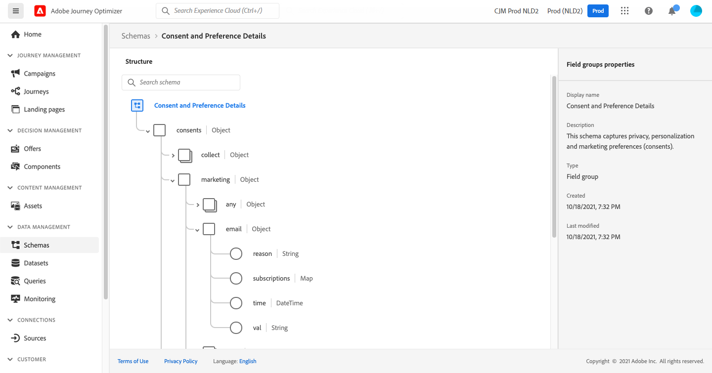

# 목록의 구독자에게 메시지 보내기 {#send-a-message-to-the-subscribers-of-a-list}

>[!BEGINSHADEBOX]

**이 페이지에서:** 동의 및 환경 설정 세부 정보 필드 그룹을 사용하여 목록의 구독자에게 메시지를 보내는 여정을 만드는 방법을 알아봅니다.

>[!ENDSHADEBOX]

이 사용 사례의 목적은 목록 구독자에게 메시지를 보내는 여정을 만드는 것입니다.

이 예제에서는 [!DNL Adobe Experience Platform]의 **[!UICONTROL 동의 및 환경 설정 세부 정보]** 필드 그룹이 사용됩니다. 이 필드 그룹을 찾으려면 **[!UICONTROL 데이터 관리]** 메뉴에서 **[!UICONTROL 스키마]**&#x200B;를 선택하십시오. **[!UICONTROL 필드 그룹]** 탭에서 검색 필드에 필드 그룹의 이름을 입력합니다.



이 여정을 구성하려면 다음 단계를 수행합니다.

1. **[!UICONTROL 읽기]** 활동으로 시작하는 여정을 만듭니다. [첫 번째 여정 만들기](journey-gs.md)에서 자세히 알아보세요.
1. **[!UICONTROL 전자 메일]** 작업 활동을 여정에 추가합니다. [채널 작업을 사용하는 방법](journey-action.md)을 알아보세요.
1. **[!UICONTROL 이메일]** 활동 설정의 **[!UICONTROL 이메일 매개 변수]** 섹션에서 기본 이메일 주소(`PersonalEmail.adress`)를 목록 구독자의 이메일 주소로 바꾸십시오.

   1. **[!UICONTROL 주소]** 필드 오른쪽에 있는 **[!UICONTROL 매개 변수 재정의 사용]** 아이콘을 클릭한 다음 **[!UICONTROL 편집]** 아이콘을 클릭합니다.

      구독자 목록 타깃팅에 대한 대상 읽기가 포함된 

   1. 표현식 편집기에서 구독자의 이메일 주소를 검색하는 표현식을 입력합니다. [자세히 보기](expression/expressionadvanced.md).

      다음 예에서는 매핑 필드에 대한 참조를 포함하는 표현식을 보여 줍니다.

      ```json
      #{ExperiencePlatform.Subscriptions.profile.consents.marketing.email.subscriptions.entry('daily-email').subscribers.firstEntryKey()}
      ```

      이 예에서는 다음 함수가 사용됩니다.

      | 함수 | 설명 | 예 |
      | --- | --- | --- |
      | `entry` | 선택한 네임스페이스에 따른 맵 요소를 참조합니다. | 특정 구독 목록 참조 |
      | `firstEntryKey` | 맵의 첫 번째 시작 키 검색 | 구독자의 첫 번째 이메일 주소 검색 |

      이 예제에서 구독 목록의 이름은 `daily-email`입니다. 이메일 주소는 `subscribers` 맵에서 구독 목록 맵에 연결된 키로 정의됩니다.

      식의 [필드 참조](expression/field-references.md)에 대해 자세히 알아보세요.

      

   1. **[!UICONTROL 식 추가]** 대화 상자에서 **[!UICONTROL 확인]**&#x200B;을 클릭합니다.

>[!CAUTION]
>
>이메일 주소 재정의는 특정 사용 사례에만 사용해야 합니다. 대부분의 경우 **[!UICONTROL 실행 필드]**&#x200B;에 기본 주소로 정의된 값을 사용해야 하므로 이메일 주소를 변경할 필요가 없습니다. [자세히 알아보기](../configuration/primary-email-addresses.md)

+++ AI 기술 자료 참조

이 단원에는 이 주제와 관련된 해석, 검색 및 질문 답변을 지원하기 위한 구조화된 지식이 포함되어 있습니다.

이해를 돕기 위해 이 정보를 이 페이지의 설명서와 통합해야 합니다. 두 소스 모두 독립적으로 사용하기 위한 것은 아닙니다. 이 페이지에서는 기능에 대해 설명하지만, 용어, 의도, 적용 가능성 및 제약 조건을 명확히 하는 데 도움이 되는 추가 컨텍스트를 제공합니다.

* **TL;DR:** 이 페이지에서는 동의 맵 필드에서 구독자 주소를 읽는 식을 사용하여 기본 전자 메일 주소 매개 변수를 재정의하여 목록의 구독자에게 전자 메일을 보내는 여정을 만드는 방법을 보여 줍니다.

**의도:**

* 대상자 읽기 활동을 사용하여 특정 목록의 구독자를 타겟팅하는 여정을 빌드합니다
* 표현식 편집기를 사용하여 이메일 작업 활동에서 기본 이메일 주소 재정의
* 동의 맵에서 구독자 전자 메일 주소를 검색하려면 `entry` 및 `firstEntryKey` 함수를 사용하십시오.
* 동의 및 환경 설정 세부 정보 필드 그룹을 참조하여 구독 목록 데이터에 액세스

**용어집:**

* **전자 메일 주소 재정의(매개 변수 재정의)**: 기본 프로필 전자 메일 주소를 구독 목록 타깃팅과 같은 특수한 경우에 사용되는 사용자 지정 식으로 바꾸는 여정 전자 메일 활동 설정입니다. *(제품별)*
* **동의 및 환경 설정 세부 정보 필드 그룹**: 구독자 전자 메일 주소를 저장하는 데 사용되는 `subscriptions` 맵을 포함하여 구독 및 동의 데이터를 포함하는 Adobe Experience Platform 스키마 필드 그룹입니다. *(제품별)*
* **`entry`함수**: 네임스페이스 키로 맵 요소를 참조하는 식 함수입니다. 여기에서 특정 구독 목록(예: `daily-email`)을 참조하는 데 사용됩니다. *(제품별)*
* **`firstEntryKey`함수**: 맵의 첫 번째 키를 검색하는 표현식 함수입니다. 구독 목록의 구독자 맵에서 첫 번째 이메일 주소를 검색하는 데 사용됩니다. *(제품별)*

**보호 기능:**

* 이메일 주소 재정의는 구독 목록 타겟팅과 같은 특정 사용 사례에만 사용해야 합니다. 대부분의 경우 실행 필드에 정의된 기본 주소를 사용해야 합니다
* 이 사용 사례가 작동하려면 동의 및 환경 설정 세부 정보 필드 그룹이 스키마에 있어야 합니다.
* 식에 사용된 구독 목록 이름(예: `daily-email`)은 데이터에 구성된 이름과 정확히 일치해야 합니다.

**용어:**

* 정식 이름: 이메일 주소 무시 — 약어: 없음 — 변형: 매개 변수 무시, 이메일 매개 변수 무시
* 동의어: &quot;subscription list&quot; = &quot;subscriber list&quot;
* 혼동하지 마십시오: &quot;이메일 주소 재정의&quot; ≠ &quot;기본 이메일 주소&quot; — 기본 이메일 주소는 모든 여정에서 사용되는 기본 주소입니다. 재정의는 구독 목록 전송과 같은 특별한 경우에만 사용되는 활동별 표현식입니다

**FAQ:**

* **Q: 프로필 이메일 주소가 아닌 구독 목록의 구독자에게 이메일을 보내려면 어떻게 해야 합니까?** — 이메일 활동의 주소 필드에서 매개 변수 재정의를 활성화하고 `entry` 및 `firstEntryKey` 함수를 사용하여 식을 입력하여 대상 구독 목록의 구독자 맵에서 주소를 검색합니다.
* **Q: 이 사용 사례에 필요한 필드 그룹은 무엇입니까?** — 구독자 전자 메일 주소를 저장하는 데 사용되는 `subscriptions` 맵 구조를 포함하는 Adobe Experience Platform의 동의 및 환경 설정 세부 정보 필드 그룹입니다.
* **Q: 구독자를 타겟팅할 때 항상 이메일 주소 재정의를 사용해야 합니까?** — 아니요. 이메일 주소 재정의는 특정 사용 사례에만 해당됩니다. 대부분의 여정에서 실행 필드에 정의된 기본 주소를 사용해야 합니다.
* **Q: `firstEntryKey` 함수는 이 컨텍스트에서 어떤 작업을 수행합니까?** — 특정 구독 목록과 연결된 `subscribers` 맵에서 첫 번째 이메일 주소 키를 검색하여 여정이 개별 구독자의 주소를 지정할 수 있도록 합니다.

+++
