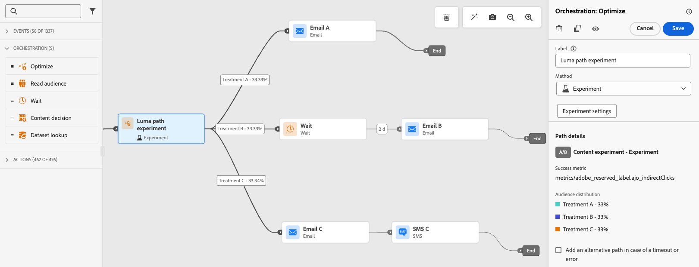
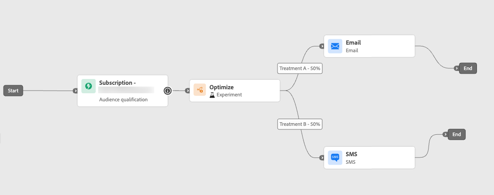

# 활동 최적화 {#journey-path-optimization}

>[!CONTEXTUALHELP]
>id="ajo_journey_optimize"
>title="활동 최적화"
>abstract="**최적화** 활동을 통해 실험, 타기팅, 특정 조건 등의 구체적인 기준에 따라 여러 경로를 만들어 개인이 여정을 어떻게 진행할지 정의할 수 있습니다."

>[!AVAILABILITY]
>
>이 기능은 제한적으로 이용할 수 있습니다. 액세스 권한을 얻으려면 Adobe 담당자에게 문의하십시오.

**최적화** 활동을 사용하면 실험, 타기팅 및 특정 조건을 포함한 특정 기준에 따라 여러 **여정**&#x200B;을 만들어 개개인이 여정을 진행하는 방법을 정의할 수 있습니다. 이를 통해 참여도와 성공을 극대화하여 고도로 사용자 지정되고 효과적인 경로를 만들 수 있습니다.

여정 **path**&#x200B;은(는) 통신 순서 지정, 통신 시간, 통신 횟수 또는 이 세 변수의 조합으로 구성될 수 있습니다.

예를 들어 한 경로에는 하나의 이메일이 포함될 수 있고, 다른 경로에는 두 개의 SMS 메시지가 포함될 수 있으며, 세 경로에는 이메일, 2시간의 대기 노드, SMS 메시지가 포함될 수 있습니다.

<!--With this feature, [!DNL Journey Optimizer] empowers you with the tools to deliver personalized and optimized paths to your audience, ensuring maximum engagement and success to create highly customized and effective journeys.-->

**최적화** 활동을 통해 결과 경로에 대해 다음 작업을 수행할 수 있습니다.

* [경로 실험 실행](#experimentation)
* 각 여정 경로에서 [타깃팅](#targeting) 규칙 활용
* 경로에 [조건](#conditions) 적용

여정이 라이브되면 정의된 기준에 따라 프로필이 평가되고 일치하는 기준에 따라 여정에서 적절한 경로로 전송됩니다.

## 실험 사용 {#experimentation}

>[!CONTEXTUALHELP]
>id="ajo_campaigns_path_experiment_success_metric"
>title="성공 지표"
>abstract="성공 지표는 실험에서 가장 성과가 좋은 처리를 추적하고 평가하는 데 사용됩니다."

실험을 통해 무작위 분할을 기반으로 서로 다른 경로를 테스트하여 사전 정의된 성공 지표를 기반으로 가장 뛰어난 성과를 결정할 수 있습니다.

여정에서 경로 실험을 설정하려면 아래 단계를 따르십시오.

세 가지 경로를 비교한다고 가정해 보겠습니다.

* 하나의 이메일로 하나의 경로;
* **[!UICONTROL 대기]** 노드가 있는 두 번째 경로와 전자 메일
* 이메일과 SMS 메시지가 포함된 세 번째 경로입니다.

1. **[!UICONTROL 오케스트레이션]** 섹션에서 **[!UICONTROL 최적화]** 활동을 여정 캔버스로 끌어서 놓습니다.

1. 보고 및 테스트 모드 로그에서 활동을 식별하는 데 유용할 수 있는 선택적 레이블을 추가합니다.

1. **[!UICONTROL 메서드]** 드롭다운 목록에서 **[!UICONTROL 실험]**&#x200B;을(를) 선택합니다.

   {width=75%}

1. **[!UICONTROL 실험 만들기]**&#x200B;를 클릭합니다.

1. 실험에 대해 설정할 **[!UICONTROL 성공 지표]**&#x200B;를 선택하십시오.

   <!--Need to have the list of all default metrics + a description for each.
    Explain why the metric selection is important.
    Are there custom metrics? If so explain.
    If possible, add best practices and examples for each metrics (could even be a dedicated section).
    Consider adding an example in this step: For this example, select this metric to test xxx.
    -->

   {width=80%}

1. 게재에 **[!UICONTROL 보류 중]** 그룹을 추가하도록 선택할 수 있습니다. 이 그룹은 이 실험의 경로를 입력하지 않습니다.

   >[!NOTE]
   >
   >토글 막대를 켜면 인구의 10%가 자동으로 사용됩니다. 필요한 경우 이 비율을 조정할 수 있습니다.

   <!--
    DOES THIS APPLY TO PATH EXPERIMENT?
    IMPORTANT: When a holdout group is used in an action for path experimentation, the holdout assignment only applies to that specific action. After the action is completed, profiles in the holdout group will continue down the journey path and can receive messages from other actions. Therefore, ensure that any subsequent messages do not rely on the receipt of a message by a profile that might be in a holdout group. If they do, you may need to remove the holdout assignment.-->

1. 각 **[!UICONTROL 처리]**&#x200B;에 정확한 백분율을 할당하거나 **[!UICONTROL 균등 분포]** 토글 막대를 켜기만 하면 됩니다.

   {width=80%}

1. **[!UICONTROL 만들기]**&#x200B;를 클릭합니다.

1. 실험 결과 각 분기에 대해 원하는 요소를 정의합니다. 예:

   * [이메일](../email/create-email.md) 활동을 첫 번째 분기(**처리 A**)로 끌어서 놓습니다.

   * 이틀 동안의 [대기](wait-activity.md) 활동을 첫 번째 분기로 끌어다 놓은 다음 [이메일](../email/create-email.md) 활동(**처리 B**)을 끌어다 놓습니다.

   * [Email](../email/create-email.md) 활동을 세 번째 분기로 드래그한 다음 [SMS](../sms/create-sms.md) 활동(**처리 C**)을 드래그합니다.

   {width=100%}

1. 선택적으로 **[!UICONTROL 시간 초과 또는 오류 발생 시 대체 경로를 추가]**&#x200B;하여 대체 동작을 정의합니다. [자세히 알아보기](using-the-journey-designer.md#paths)

1. 채널 작업을 선택하고 **[!UICONTROL 콘텐츠 편집]** 단추를 사용하여 디자인 도구에 액세스합니다.

   {width=70%}

1. 왼쪽 창에서 실험의 각 작업에 대한 서로 다른 콘텐츠 사이를 탐색할 수 있습니다. 각 콘텐츠를 선택하고 필요에 따라 디자인합니다.

   {width=100%}

1. 여정 [게시](publishing-the-journey.md).

여정이 활성 상태가 되면 사용자가 임의로 할당되어 다른 경로를 통해 이동합니다. [!DNL Journey Optimizer]은(는) 성과가 가장 좋은 경로를 추적하고 실행 가능한 통찰력을 제공합니다.

<!--Follow the success of your journey with the Journey Path Experiment report.Reporting page on Journey Path Experimentation to be created - such as what we have for [Experimentation campaign report](../reports/campaign-global-report-cja-experimentation.md)-->

### 실험 사용 사례 {#uc-experiment}

다음 예제에서는 **[!UICONTROL Experiment]** 메서드와 함께 **[!UICONTROL Optimize]** 활동을 사용하여 전체적으로 가장 잘 작동하는 경로를 확인하는 방법을 보여 줍니다.

+++채널 효율성

첫 번째 메시지를 이메일로 전송할지 SMS로 전송할지 여부를 테스트하면 전환율이 높아집니다.

➡️ 전환율을 최적화 지표로 사용합니다(예: 구매, 등록).

+++

+++메시지 빈도

➡️ 실험을 실행하여 1주일에 한 개의 전자 메일을 보내는 것과 세 개의 전자 메일을 보내는 것이 더 많은 구매를 가져오는지 확인합니다.

구매 또는 구독 취소 비율을 최적화 지표로 사용합니다.

+++

+++통신 간 대기 시간

24시간 대기 및 후속 조치 이전의 72시간 대기 를 비교하여 어느 타이밍이 참여를 극대화하는지 확인합니다.

➡️ 클릭스루 비율 또는 매출을 최적화 지표로 사용합니다.

+++

## 타깃팅 활용 {#targeting}

타깃팅 규칙을 사용하면 특정 대상 세그먼트<!-- depending on profile attributes or contextual attributes-->에 따라 고객이 여정 경로 중 하나를 입력할 수 있도록 충족해야 하는 특정 규칙이나 자격을 결정할 수 있습니다.

주어진 경로를 임의로 할당하는 실험과 달리, 타깃팅은 올바른 대상 또는 프로필이 지정된 경로로 들어가도록 하는 관점에서 결정적입니다.

<!--With targeting, specific rules can be defined based on:

* **User profile attributes** such as location (eg. geo-targeting), age, or preferences. For example, users in the US receive a "Golden Gate" promotion, while users in France receive an "Eiffel Tower" promotion.

* **Contextual data** such as device type (eg. device-targeting), time of day, or session details. For example, desktop users receive desktop-optimized content, while mobile users receive mobile-optimized content.

* **Audiences** which can be used to include or exclude profiles that have a particular audience membership.-->

여정에서 타깃팅을 설정하려면 아래 단계를 따르십시오.

1. **[!UICONTROL 오케스트레이션]** 섹션에서 **[!UICONTROL 최적화]** 활동을 여정 캔버스로 끌어서 놓습니다.

1. 보고 및 테스트 모드 로그에서 활동을 식별하는 데 유용할 수 있는 선택적 레이블을 추가합니다.

1. **[!UICONTROL 메서드]** 드롭다운 목록에서 **[!UICONTROL 타깃팅 규칙]**&#x200B;을(를) 선택하십시오.

   {width=70%}

1. **[!UICONTROL 타깃팅 규칙 만들기]**&#x200B;를 클릭합니다.

1. 규칙 빌더를 사용하여 기준을 정의합니다. 예를 들어, 충성도 프로그램의 Gold 멤버(`loyalty.status.equals("Gold", false)`)에 대한 규칙을 정의하고 다른 멤버(`loyalty.status.notEqualTo("Gold", false)`)에 대한 규칙을 정의합니다.

   

1. 필요에 따라 **[!UICONTROL 대체 콘텐츠 사용]**&#x200B;을 선택합니다. 대체 콘텐츠 를 사용하면 타깃팅 규칙이 적격하지 않을 때 대상자가 기본 콘텐츠를 받을 수 있습니다. 이 옵션을 선택하지 않으면 위에서 정의한 타겟팅 규칙에 적합하지 않은 대상은 대체 경로를 입력하지 않습니다.

1. **[!UICONTROL 만들기]**&#x200B;를 클릭하여 타깃팅 규칙 설정을 저장합니다.

1. 다시 여정으로 돌아가서 특정 작업을 놓아 각 경로를 사용자 지정합니다. 예를 들어 Gold Loyalty 회원에 대한 개인화된 오퍼와 다른 모든 회원에 대한 SMS 미리 알림을 포함하는 이메일을 만듭니다.

   

1. 선택적으로 **[!UICONTROL 시간 초과 또는 오류 발생 시 대체 경로를 추가]**&#x200B;하여 대체 동작을 정의합니다. [자세히 알아보기](using-the-journey-designer.md#paths)

1. 타겟팅 규칙 설정에 정의된 각 그룹에 해당하는 각 작업에 적절한 콘텐츠를 디자인할 수 있습니다. 각 작업에 대해 서로 다른 콘텐츠 사이를 원활하게 탐색할 수 있습니다.

   

   이 예에서는 Gold 회원을 위한 특별 오퍼와 다른 회원을 위한 SMS 미리 알림을 포함하는 이메일을 디자인합니다.

1. 여정 [게시](publishing-the-journey.md).

여정이 라이브되면 각 세그먼트에 대해 지정된 경로가 처리되어 골드 멤버는 이메일 오퍼와 함께 경로를 입력하고 다른 멤버는 SMS 미리 알림과 함께 경로를 입력합니다.

<!--Follow the success of your journey with the Journey Path Targeting report.Reporting page on Journey Path Targeting to be created - such as what we have for [Experimentation campaign report](../reports/campaign-global-report-cja-experimentation.md)-->

### 타깃팅 규칙 사용 사례 {#uc-targeting}

다음 예제에서는 **[!UICONTROL 타깃팅 규칙]** 메서드와 함께 **[!UICONTROL Optimize]** 활동을 사용하여 다양한 하위 대상에 대한 경로를 개인화하는 방법을 보여 줍니다.

+++세그먼트별 채널

골드 상태 충성도 멤버는 이메일을 통해 개인화된 오퍼를 받을 수 있으며 다른 모든 멤버는 SMS 미리 알림으로 이동됩니다.

➡️ 프로필당 매출 또는 전환율을 최적화 지표로 사용합니다.

+++

+++행동 기반 타기팅

이메일을 열었지만 클릭하지 않은 고객은 푸시 알림을 받을 수 있으며 열지 않은 고객은 SMS를 받습니다.

➡️ 클릭스루 비율 또는 다운스트림 전환을 최적화 지표로 사용합니다.

+++

+++구매 내역 타기팅

최근 구매한 고객은 짧은 &#39;땡큐+크로스셀&#39; 길로 갈 수 있고, 구매 이력이 없는 고객은 더 긴 육성 여정으로 접어든다.

➡️ 반복 구매율 또는 참여 비율을 최적화 지표로 사용합니다.

+++

## 조건 추가 {#conditions}

특정 기준에 따라 여러 경로를 만들어 개인이 여정을 진행하는 방식을 정의하는 조건을 추가할 수 있습니다. 또한 시간 초과나 오류를 처리하기 위한 대체 경로를 구성하여 원활한 환경을 보장할 수 있습니다.

[이 섹션](conditions.md)에서 조건을 정의하는 방법을 알아보세요.

다음 유형의 조건을 사용할 수 있습니다.

* [데이터 Source 조건](condition-activity.md#data_source_condition)
* [시간 조건](condition-activity.md#time_condition)
* [분할 비율](condition-activity.md#percentage_split)
* [날짜 조건](condition-activity.md#date_condition)
* [프로필 상한](condition-activity.md#profile_cap)
