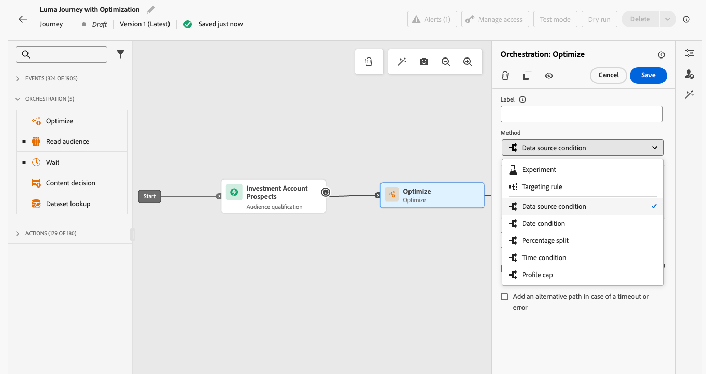

# 최적화 활동 시작 {#journey-path-optimization}

>[!BEGINSHADEBOX]

**이 페이지에서:** 최적화 활동을 사용하여 실험, 타기팅 및 조건을 기반으로 여러 여정 경로를 만들고 이전 조건 활동을 대체하는 방법을 알아봅니다.

>[!ENDSHADEBOX]

>[!CONTEXTUALHELP]
>id="ajo_journey_optimize"
>title="활동 최적화"
>abstract="**최적화** 활동을 통해 실험, 타기팅, 특정 조건 등의 구체적인 기준에 따라 여러 경로를 만들어 개인이 여정을 어떻게 진행할지 정의할 수 있습니다. **최적화** 활동은 여정에서 조건부 경로를 만드는 새로운 수단입니다. 이는 이전의 **조건** 활동을 대체합니다."

>[!IMPORTANT]
>
>**최적화** 활동은 여정에서 조건부 경로를 만드는 새로운 방법입니다. 이 활동은 UI에서 제거된 이전 **조건** 활동을 대체합니다. 모든 조건부 논리는 유지되고 이제 **Optimize** 활동의 [조건](conditions.md)을(를) 통해 처리됩니다.
>
>**[!UICONTROL 조건]** 활동을 사용한 기존 여정이 있는 경우 이전처럼 계속 사용할 수 있습니다. 이제 새 아이콘과 함께 **[!UICONTROL Condition]** 메서드를 사용하여 **[!UICONTROL Optimize]** 활동으로 표시되지만 동작은 변경되지 않습니다. 노드에 설정한 모든 사용자 지정 레이블이 유지됩니다.

**최적화** 활동을 사용하면 실험, 타기팅 및 특정 조건을 포함한 특정 기준에 따라 여러 **여정**&#x200B;을 만들어 개개인이 여정을 진행하는 방법을 정의할 수 있습니다. 이를 통해 참여도와 성공을 극대화하여 고도로 사용자 지정되고 효과적인 경로를 만들 수 있습니다.

## 여정 경로란 무엇입니까? {#journey-path}

여정 **path**&#x200B;은(는) 통신 순서 지정, 통신 시간, 통신 횟수 또는 이 세 변수의 조합으로 구성될 수 있습니다.

예를 들어 한 경로에는 하나의 이메일이 포함될 수 있고, 다른 경로에는 두 개의 SMS 메시지가 포함될 수 있으며, 세 경로에는 이메일, 2시간의 대기 노드, SMS 메시지가 포함될 수 있습니다.

## 여정을 최적화하는 세 가지 방법 {#optimization-methods}

**최적화** 활동을 통해 여정 경로에서 다음 작업을 수행할 수 있습니다.

* [경로 실험 실행](path-experimentation.md) - 무작위 분할을 기반으로 다른 경로를 테스트하여 미리 정의된 성공 지표(예: 전환율, 매출, 참여)에 따라 가장 성과가 좋은 항목을 확인합니다.

* [타깃팅 규칙 활용](path-targeting.md) - 대상 세그먼트, 프로필 특성 또는 컨텍스트 데이터를 기반으로 고객이 여정 경로 중 하나를 입력할 수 있도록 충족해야 하는 특정 규칙을 정의합니다. 이렇게 하면 올바른 대상자가 지정된 경로로 들어가게 됩니다.

  >[!AVAILABILITY]
  >
  >이 기능은 현재 제한된 가용성입니다. 액세스 권한을 요청하려면 Adobe 담당자에게 문의하십시오.

* [조건 적용](conditions.md) - 데이터 원본, 시간, 날짜, 분할 비율 또는 프로필 상한 등 특정 조건을 기준으로 조건부 경로를 만듭니다. 이는 이전 조건 활동과 동일합니다.

## 작동 방식 {#how-it-works}

여정이 라이브되면 정의된 기준에 따라 프로필이 평가되고 일치하는 기준에 따라 여정에서 적절한 경로로 전송됩니다.

## 다음 단계 {#next-steps}

사용 사례에 가장 적합한 최적화 방법을 선택합니다.

* 어떤 경로가 가장 성과가 좋은지 테스트하고 학습하시겠습니까? →0}경로 실험](path-experimentation.md)(으)로 이동[
* 서로 다른 대상을 특정 경로로 전송하시겠습니까? →0}경로 타깃팅](path-targeting.md)(으)로 이동[
* 조건부 논리(if/then 시나리오)를 생성하시겠습니까? →0}조건](conditions.md)(으)로 이동[
