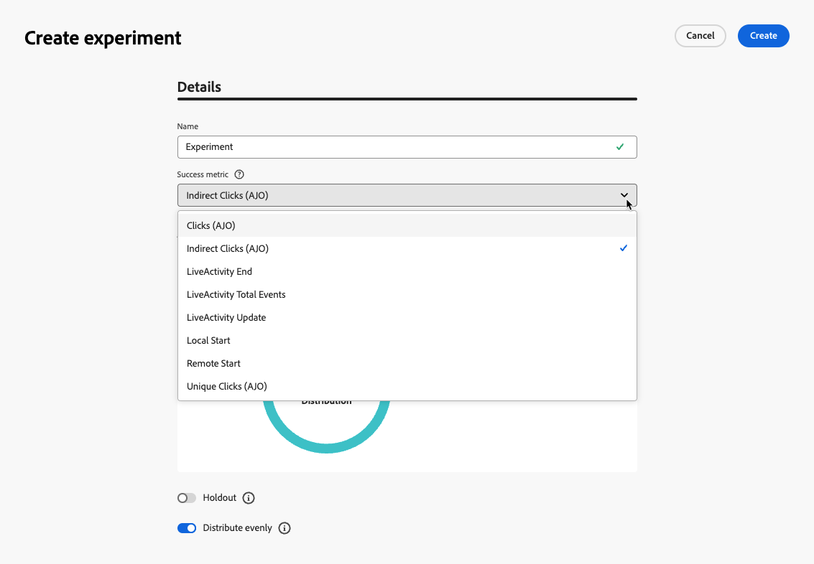
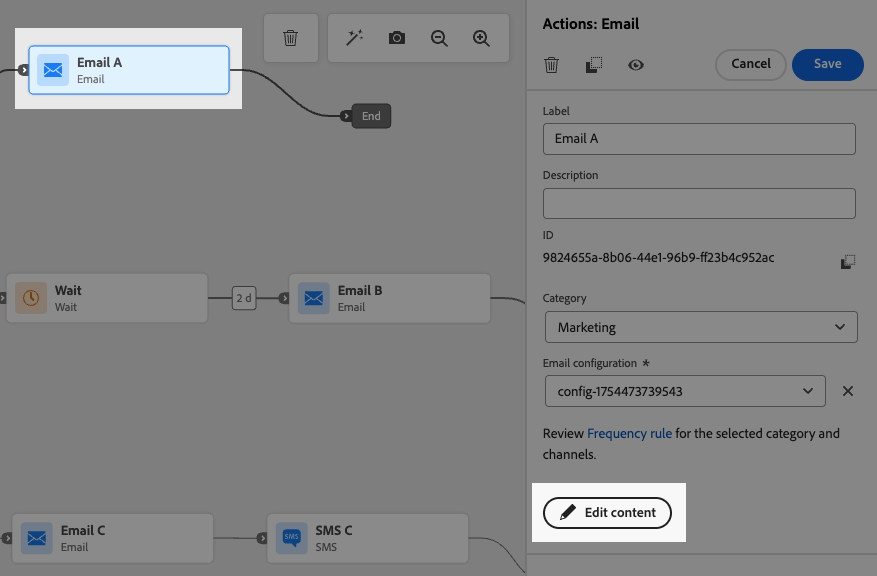

# 경로 실험 사용 {#experimentation}

>[!CONTEXTUALHELP]
>id="ajo_path_experiment_success_metric"
>title="성공 지표"
>abstract="성공 지표는 실험에서 가장 효과적인 처리를 추적하고 평가하는 데 사용됩니다."
>additional-url="https://experienceleague.adobe.com/ko/docs/journey-optimizer/using/orchestrate-journeys/create-journey/success-metrics" text="여정 지표 구성 및 추적"

실험을 통해 무작위 분할을 기반으로 서로 다른 경로를 테스트하여 사전 정의된 성공 지표를 기반으로 가장 뛰어난 성과를 결정할 수 있습니다.

여정에서 경로 실험을 설정하려면 아래 단계를 따르십시오.

세 가지 경로를 비교한다고 가정해 보겠습니다.

* 하나의 이메일로 하나의 경로;
* **[!UICONTROL 대기]** 노드가 있는 두 번째 경로와 전자 메일
* 이메일과 SMS 메시지가 포함된 세 번째 경로입니다.

1. **[!UICONTROL 오케스트레이션]** 섹션에서 **[!UICONTROL 최적화]** 활동을 여정 캔버스로 끌어서 놓습니다.

1. 보고 및 테스트 모드 로그에서 활동을 식별하는 데 유용할 수 있는 선택적 레이블을 추가합니다.

1. **[!UICONTROL 메서드]** 드롭다운 목록에서 **[!UICONTROL 실험]**&#x200B;을(를) 선택합니다.

   {width=65%}

1. **[!UICONTROL 실험 만들기]**&#x200B;를 클릭합니다.

1. 실험에 대해 설정할 **[!UICONTROL 성공 지표]**&#x200B;를 선택하십시오. 사용 가능한 지표와 [이 섹션](success-metrics.md)에서 목록을 구성하는 방법에 대해 자세히 알아보세요.

   {width=80%}

1. 경로 실험에 대한 **[!UICONTROL 실험 유형]**&#x200B;을(를) 선택하십시오.

   * **[!UICONTROL A/B 실험]** — 테스트 시작 시 처리 간 트래픽 분할을 정의합니다. 성능은 선택한 기본 지표를 기반으로 평가됩니다. 보고는 처리 간 관찰된 상승도를 보여줍니다.

   * **[!UICONTROL Multi-armed bandit]** - 처리 간 트래픽 분할이 자동으로 처리됩니다. 7일마다 기본 지표의 성능을 검토하고 그에 따라 가중치를 조정합니다. A/B 테스트의 경우 보고는 상승도를 계속 표시합니다.

   경로 실험의 {width=80%}

   ➡️ [A/B와 Multi-armed bandit 실험의 차이점에 대해 자세히 알아보기](../content-management/mab-vs-ab.md)

1. 게재에 **[!UICONTROL 보류 중]** 그룹을 추가하도록 선택할 수 있습니다. 이 그룹은 이 실험의 경로를 입력하지 않습니다.

   >[!NOTE]
   >
   >토글 막대를 켜면 인구의 10%가 자동으로 사용됩니다. 필요한 경우 이 비율을 조정할 수 있습니다.

   <!--
    DOES THIS APPLY TO PATH EXPERIMENT?
    IMPORTANT: When a holdout group is used in an action for path experimentation, the holdout assignment only applies to that specific action. After the action is completed, profiles in the holdout group will continue down the journey path and can receive messages from other actions. Therefore, ensure that any subsequent messages do not rely on the receipt of a message by a profile that might be in a holdout group. If they do, you may need to remove the holdout assignment.-->

1. 각 **[!UICONTROL 처리]**&#x200B;에 정확한 백분율을 할당하거나 **[!UICONTROL 균등 분포]** 토글 막대를 켜기만 하면 됩니다.

   {width=80%}

1. 자동 크기 조정 실험을 활성화하여 실험의 가장 성과가 좋은 변형을 자동으로 롤아웃합니다. [우승자를 평가하는 방법에 대해 자세히 알아보기](#scale-winner)

1. **[!UICONTROL 만들기]**&#x200B;를 클릭합니다.

1. 실험 결과 각 분기에 대해 원하는 요소를 정의합니다. 예:

   * [이메일](../email/create-email.md) 활동을 첫 번째 분기(**처리 A**)로 끌어서 놓습니다.

   * 이틀 동안의 [대기](wait-activity.md) 활동을 첫 번째 분기로 끌어다 놓은 다음 [이메일](../email/create-email.md) 활동(**처리 B**)을 끌어다 놓습니다.

   * [Email](../email/create-email.md) 활동을 세 번째 분기로 드래그한 다음 [SMS](../sms/create-sms.md) 활동(**처리 C**)을 드래그합니다.

   {width=100%}

1. 선택적으로 **[!UICONTROL 시간 초과 또는 오류 발생 시 대체 경로를 추가]**&#x200B;하여 대체 동작을 정의합니다. [자세히 알아보기](using-the-journey-designer.md#paths)

1. 여정 [게시](publish-journey.md).

<!--

    Select a channel action and use the **[!UICONTROL Edit content]** button to access the design tools.

    {width=70%}

    From there, using the left pane you can navigate between the different contents for each action in your experiment. Select each content and design it as needed.

    {width=100%}

-->

여정이 활성 상태가 되면 사용자가 임의로 할당되어 다른 경로를 통해 이동합니다. [!DNL Journey Optimizer]은(는) 성과가 가장 좋은 경로를 추적하고 실행 가능한 통찰력을 제공합니다.

여정 경로 실험 보고서를 통해 여정의 성공 여부를 확인하십시오. [자세히 알아보기](../reports/journey-global-report-cja-experimentation.md)

<!--REMOVED WITH GA

>[!CAUTION]
>
>Do not edit the metadata of a path experiment once it has been published. Editing the metadata will disrupt the calculation and reporting of experiment results.
-->

## 실험 사용 사례 {#uc-experiment}

다음 예제에서는 **[!UICONTROL Experiment]** 메서드와 함께 **[!UICONTROL Optimize]** 활동을 사용하여 전체적으로 가장 잘 작동하는 경로를 확인하는 방법을 보여 줍니다.

+++채널 효율성

첫 번째 메시지를 이메일로 전송할지 SMS로 전송할지 여부를 테스트하면 전환율이 높아집니다.

➡️ 전환율을 성공 지표로 사용합니다(예: 구매, 등록).

전자 메일과 SMS를 비교하는 

+++

+++메시지 빈도

1주일에 한 개의 이메일을 보낼 때와 3개의 이메일을 보낼 때 더 많은 구매가 발생하는지 확인하는 실험을 실행하십시오.

➡️ 구매 또는 구독 취소 속도를 성공 지표로 사용합니다.

+++

+++통신 간 대기 시간

24시간 대기 및 후속 조치 이전의 72시간 대기 를 비교하여 어느 타이밍이 참여를 극대화하는지 확인합니다.

➡️ 클릭스루 비율 또는 매출을 성공 지표로 사용합니다.

+++

## 우승자 비율 조정 {#scale-winner}

>[!AVAILABILITY]
>
>경로 실험의 경우 우승자 크기 조정 기능은 단일 여정(이벤트 트리거 및 대상 자격 조건)에서만 사용할 수 있습니다.
>
>대상자 읽기 여정에 사용할 수 없습니다.

우승자 적용 확대 기능을 사용하면 실험에서 우승한 베리에이션을 전체 대상자에게 자동 또는 수동으로 롤아웃할 수 있습니다. 이 기능은 일단 승자가 결정되면 실험을 지속적으로 모니터링하지 않고 도달 범위와 효과를 증폭시킬 수 있도록 한다.

다음 두 모드 중에서 선택할 수 있습니다.

* **자동 크기 조정**: 실험을 만들 때 승자 처리 또는 승자가 나타나지 않을 경우 대체 옵션에 대한 크기 조정 시기와 조건을 선택하여 자동 크기 조정 설정을 구성합니다.

* **수동 크기 조정**: 수동으로 실험 결과를 검토하고 가장 성과가 좋은 치료의 롤아웃을 시작하여 시기와 결정에 대한 모든 권한을 유지합니다.

### 자동 확장 {#autoscaling}

자동 크기 조절을 사용하면 실험 결과에 따라 채택 처리 또는 대체 처리 롤아웃 시기에 대한 사전 정의된 규칙을 설정할 수 있습니다.

자동 확장이 발생하면 수동 확장을 더 이상 사용할 수 없습니다.

실험에서 자동 크기 조절을 활성화하려면 다음을 수행합니다.

1. 여정을 설정하고 필요에 따라 실험을 구성합니다. [자세히 알아보기](#experimentation)

1. 실험을 설정할 때 자동 크기 조정 옵션을 활성화합니다.

   

1. 우승자의 배율을 조정해야 하는 시기를 선택합니다.

   * 우승자를 찾는 즉시.
   * 선택한 시간 동안 실험이 라이브 상태가 됩니다.

   자동 크기 조정 시간은 실험 종료일 전에 예약해야 합니다. 종료 날짜 이후 시간으로 설정하면 유효성 검사 경고가 표시되고 여정이 게시되지 않습니다.

   

1. 배율 시간별 우승자를 찾을 수 없는 경우 대체 동작을 선택하십시오.

   * 예정대로 실험이 종료될 때까지 계속하십시오.
   * 지정된 시간 후에 대체 치료의 크기를 조절하십시오.

모든 매개 변수가 충족되면 우승 또는 대체 치료가 대상자에게 전송됩니다.

### 수동 크기 조정 {#manual-scaling}

수동 스케일링은 실험 결과를 검토하고 당첨 치료의 출시 시기를 자신의 일정에 따라 결정할 수 있는 기능을 제공합니다.

예약된 자동 크기 조정 시간 전에 수동으로 승자의 크기를 조정하는 경우 자동 크기 조정이 취소됩니다.

실험의 승자를 수동으로 조정하려면 다음을 수행합니다.

1. 여정을 설정하고 필요에 따라 실험을 구성합니다. [자세히 알아보기](#experimentation)

1. 승자가 확인되거나 통계적 유의성이 달성될 때까지 실험을 실행하게 한다.

1. 여정을 열고 경로 실험이 포함된 **[!UICONTROL 최적화]** 활동을 선택합니다.

   **[!UICONTROL 경로 실험]** 보기에서 결과를 검토하여 가장 성과가 좋은 처리를 식별하십시오.

   

1. **[!UICONTROL 치료 비율 조정]**&#x200B;을 클릭하여 가장 성과가 좋은 치료를 나머지 대상자에게 푸시합니다.

   <!---->

1. 드롭다운 메뉴에서 크기를 조정할 처리를 선택하고 **[!UICONTROL 크기 조정]**&#x200B;을 클릭합니다.

   {width=80%}

치료의 크기를 조정하는 데 최대 1시간이 소요될 수 있습니다. 수동 배율 조정 프로세스가 완료되면 알림을 받게 됩니다.
