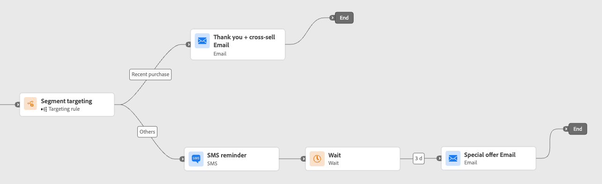

# 경로 타깃팅 활용 {#targeting}

>[!CONTEXTUALHELP]
>id="ajo_path_targeting_fallback"
>title="대체 경로란 무엇입니까?"
>abstract="대체 경로를 사용하여 타기팅 규칙이 적격하지 않을 때 대상자가 대체 경로로 입장할 수 있도록 합니다.  이 옵션을 선택하지 않으면 타기팅 규칙에 적합하지 않은 대상자는 대체 경로로 들어가지 않고 여정을 종료합니다."

>[!AVAILABILITY]
>
>이 기능은 현재 제한된 가용성입니다. 액세스 권한을 요청하려면 Adobe 담당자에게 문의하십시오.

타깃팅 규칙을 사용하면 특정 대상 세그먼트<!-- depending on profile attributes or contextual attributes-->에 따라 고객이 여정 경로 중 하나를 입력할 수 있도록 충족해야 하는 특정 규칙이나 자격을 결정할 수 있습니다.

주어진 경로를 임의로 할당하는 실험과 달리, 타깃팅은 올바른 대상 또는 프로필이 지정된 경로로 들어가도록 하는 관점에서 결정적입니다.

<!--With targeting, specific rules can be defined based on:

* **User profile attributes** such as location (eg. geo-targeting), age, or preferences. For example, users in the US receive a "Golden Gate" promotion, while users in France receive an "Eiffel Tower" promotion.

* **Contextual data** such as device type (eg. device-targeting), time of day, or session details. For example, desktop users receive desktop-optimized content, while mobile users receive mobile-optimized content.

* **Audiences** which can be used to include or exclude profiles that have a particular audience membership.-->

여정에서 타깃팅을 설정하려면 아래 단계를 따르십시오.

1. **[!UICONTROL 오케스트레이션]** 섹션에서 **[!UICONTROL 최적화]** 활동을 여정 캔버스로 끌어서 놓습니다.

1. 보고 및 테스트 모드 로그에서 활동을 식별하는 데 유용할 수 있는 선택적 레이블을 추가합니다.

1. **[!UICONTROL 메서드]** 드롭다운 목록에서 **[!UICONTROL 타깃팅 규칙]**&#x200B;을(를) 선택하십시오.

   {width=60%}

1. **[!UICONTROL 타깃팅 규칙 만들기]**&#x200B;를 클릭합니다.

1. **[!UICONTROL 규칙 만들기]** > **[!UICONTROL 새로 만들기]**&#x200B;를 클릭하고 규칙 빌더를 사용하여 조건을 정의합니다.

   타깃팅 기준을 만들기 위한 {width=100%}

   예를 들어, 충성도 프로그램의 Gold 멤버(`loyalty.status.equals("Gold", false)`)에 대한 규칙을 정의하고 다른 멤버(`loyalty.status.notEqualTo("Gold", false)`)에 대한 규칙을 정의합니다.

   

1. **[!UICONTROL 규칙 만들기]** > **[!UICONTROL 규칙 선택]**&#x200B;을 클릭하여 **[!UICONTROL 규칙]** 메뉴에서 만든 기존 타깃팅 규칙을 선택할 수도 있습니다. [자세히 알아보기](../experience-decisioning/rules.md)

   {width=70%}

   이 경우 규칙을 구성하는 공식은 단순히 여정 활동에 복사됩니다. **[!UICONTROL 규칙]** 메뉴에서 해당 규칙에 대한 이후의 변경 내용은 여정 복사본에 영향을 주지 않습니다.

   >[!AVAILABILITY]
   >
   >[전용 &#x200B;](../experience-decisioning/rules.md#create) 메뉴에서 타깃팅 규칙을 만드는 중[!DNL Journey Optimizer]은(는) 현재 Decisioning 추가 기능 서비스를 구입한 조직에서 사용할 수 있으며 다른 조직에 대해 필요할 때 사용할 수 있습니다(제한된 가용성).
   >
   >이 용량은 모든 고객에게 점진적으로 제공될 예정입니다. 그동안 Adobe 담당자에게 문의하여 액세스 권한을 얻으십시오.

1. 규칙을 추가한 후에도 수정할 수 있습니다. 규칙 빌더를 사용하여 이동 중에 업데이트하려면 **[!UICONTROL 인라인 편집]**&#x200B;을 선택하고, 다른 기존 규칙을 선택하려면 **[!UICONTROL 규칙 선택]**&#x200B;을 선택하십시오.

   {width=100%}

   >[!NOTE]
   >
   >인라인 규칙을 편집해도 기존의 원본 규칙에는 영향을 주지 않습니다.

1. 필요에 따라 **[!UICONTROL 대체 경로 사용]** 옵션을 선택하십시오. 이 작업을 수행하면 위에 정의된 타깃팅 규칙을 충족하지 않는 대상에 대한 대체 경로가 만들어집니다.

   >[!NOTE]
   >
   >이 옵션을 선택하지 않으면 타겟팅 규칙에 적합하지 않은 대상은 대체 경로로 들어가지 않고 여정을 종료합니다.

1. **[!UICONTROL 만들기]**&#x200B;를 클릭하여 타깃팅 규칙 설정을 저장합니다.

1. 다시 여정으로 돌아가서 특정 작업을 놓아 각 경로를 사용자 지정합니다. 예를 들어 Gold Loyalty 회원에 대한 개인화된 오퍼와 다른 모든 회원에 대한 SMS 미리 알림을 포함하는 이메일을 만듭니다.

   

1. 규칙 설정을 정의할 때 **[!UICONTROL 대체 콘텐츠 사용]** 옵션을 선택한 경우 자동으로 추가된 대체 경로에 대해 하나 이상의 동작을 정의하십시오.

   {width=70%}

1. 필요한 경우 **[!UICONTROL 시간 초과 또는 오류 발생 시 대체 경로를 추가]**&#x200B;하여 문제가 발생할 경우 대체 작업을 정의합니다. [자세히 알아보기](using-the-journey-designer.md#paths)

1. 타겟팅 규칙 설정에 정의된 각 그룹에 해당하는 각 작업에 적절한 콘텐츠를 디자인할 수 있습니다.

   이 예제에서는 골드 회원을 위한 특별 오퍼와 다른 회원을 위한 SMS 알림 메시지가 포함된 전자 메일을 디자인합니다.<!--You can seamlessly navigate between the different contents for each action. -->

1. 여정 [게시](publish-journey.md).

여정이 라이브되면 각 세그먼트에 대해 지정된 경로가 처리되어 골드 멤버는 이메일 오퍼와 함께 경로를 입력하고 다른 멤버는 SMS 미리 알림과 함께 경로를 입력합니다.

여정 보고서를 사용하여 여정 성공 여부를 확인합니다. [자세히 알아보기](../reports/journey-global-report-cja.md#targeting)

## 타깃팅 규칙 사용 사례 {#uc-targeting}

다음 예제에서는 **[!UICONTROL 타깃팅 규칙]** 메서드와 함께 **[!UICONTROL Optimize]** 활동을 사용하여 다양한 하위 대상에 대한 경로를 개인화하는 방법을 보여 줍니다.

+++세그먼트별 채널

골드 상태 충성도 멤버는 이메일을 통해 개인화된 오퍼를 받을 수 있으며 다른 모든 멤버는 SMS 미리 알림으로 이동됩니다.

<!--➡️ Use the revenue per profile or conversion rate as the optimization metric.-->

+++

+++행동 기반 타기팅

이메일을 열었지만 클릭하지 않은 고객은 푸시 알림을 받을 수 있으며 열지 않은 고객은 SMS를 받습니다.

<!--➡️ Use the click-through rate or downstream conversions as the optimization metric.-->

푸시 또는 SMS 대체 항목을 사용하여 전자 메일 참여를 위한 

+++

+++구매 내역 타기팅

최근 구매한 고객은 짧은 &#39;땡큐+크로스셀&#39; 길로 갈 수 있고, 구매 이력이 없는 고객은 더 긴 육성 여정으로 접어든다.

<!--➡️ Use the repeat purchase rate or engagement rate as the optimization metric.-->

+++

