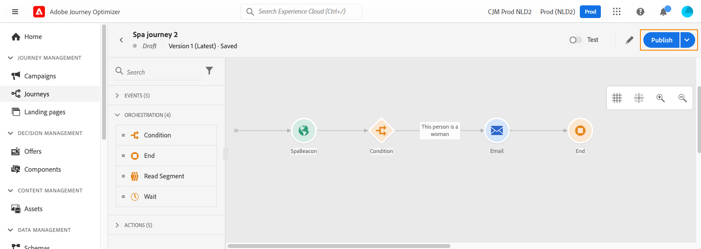

# 여정 게시 {#publishing-the-journey}

여정을 게시하면 **[!UICONTROL Live]** 상태로 이동되고 새 프로필이 들어갈 수 있게 되며 읽기 전용 모드로 전환됩니다. 오류가 포함된 여정은 게시할 수 없습니다.

>[!NOTE]
>
>여정을 저장하거나 게시할 때 Journey Optimizer은 총 여정 페이로드 크기를 확인하고 제한에 근접하거나 이를 초과하는 경우 게시를 경고하거나 차단할 수 있습니다. [여정 페이로드 크기 유효성 검사](../start/guardrails.md#journey-payload-size)에서 자세히 알아보세요.

➡️ [비디오에서 이 기능 살펴보기](#video)

## 게시하기 전에 {#before-you-publish}

게시하기 전에 여정이 다음 사전 요구 사항을 충족하는지 확인하십시오.

* **유효성 검사 오류 없음** — 오류가 포함된 여정은 게시할 수 없습니다. [먼저 여정을 테스트하고](testing-the-journey.md) [활동 오류를 해결합니다](../building-journeys/troubleshooting.md#activity-errors).
* **게시 권한** — 게시를 수행하려면 **[!DNL Publish journeys]** 높은 수준의 권한이 필요합니다. [액세스 권한 관리](../administration/permissions-overview.md)에 대해 자세히 알아보세요.
* **제한 내 페이로드** — 여정 페이로드는 구성된 제한(기본적으로 4MB) 내에 있어야 합니다. [여정 페이로드 크기 유효성 검사](../start/guardrails.md#journey-payload-size)를 참조하십시오.
* **승인 받음** — 여정이 승인 정책의 적용을 받는 경우 게시하기 전에 요청하여 승인을 받습니다. [자세히 알아보기](../test-approve/gs-approval.md)

>[!TIP]
>
>게시하기 전에 사용 가능한 여정 옵션 중 하나를 사용하여 테스트의 유효성을 검사하십시오.
>
>* [시뮬레이션](simulate-journey-gs.md) — Adobe Experience Platform에서 영구 테스트 프로필을 사용하지 않고 시뮬레이션된 사용자를 사용하여 테스트합니다.
>* [테스트 모드](testing-the-journey.md) — Adobe Experience Platform에서 테스트 프로필로 플래그가 지정된 영구 프로필로 테스트합니다.
>* [시험 실행](journey-dry-run.md) — 프로필에 연결하지 않고 실제 프로덕션 데이터로 테스트합니다.

## 게시 프로세스 {#journey-publication}

여정 게시 단계는 아래에 자세히 설명되어 있습니다.

1. 여정이 올바르고 오류가 없는지 확인하고 [위의 필수 구성 요소](#before-you-publish)를 충족하는지 확인하십시오.

1. 여정을 게시하려면 오른쪽 상단 드롭다운 메뉴에 있는 **[!UICONTROL 게시]** 옵션을 클릭합니다.

   >[!NOTE]
   >
   > 여정이 승인 정책의 적용을 받는 경우 여정을 게시하려면 승인을 요청해야 합니다. [자세히 알아보기](../test-approve/gs-approval.md)

   

여정이 게시되면 **읽기 전용** 모드에 있습니다. 읽기 전용 모드에서는 활동 레이블 및 설명, 여정 이름 및 여정 설명만 수정할 수 있습니다. 게시된 여정을 추가로 수정해야 하는 경우 여정의 [새 버전](journey-ui.md#journey-filter)을 만드십시오.

### 여정 상태 {#journey-statuses}

게시 후 여정은 다음과 같은 여러 상태로 이동합니다.

* **[!UICONTROL 라이브]** — 여정이 게시되고 프로필에서 입력할 수 있습니다.
* **[!UICONTROL 닫힘]** — 새 버전이 게시되면 자동으로 종료되는 이전 버전입니다. 출입이 불가능합니다.
* **[!UICONTROL 완료됨]** — 여정이 종료 조건에 따라 완료되었습니다. 여정이 완료된 것으로 간주되는 정확한 시간에 대한 정의는 [여정 종료 방법](end-journey.md#journey-finished-definition)을 참조하십시오.

### 여정 중지 {#stop-journey}

여정을 중지하면 영구적으로 중지됩니다. 여정을 통해 흘러가는 모든 개인은 영구적으로 정지되며, 여정은 새로운 항목을 허용하는 것을 중단한다. 여정을 다시 실행해야 하는 경우 복제하고 새 여정을 게시합니다. 여정 종료 방법에 대한 자세한 내용은 [여정 종료 방법](end-journey.md)을 참조하세요.

### 요구 사항 다시 게시 {#republishing}

경우에 따라 변경 사항 또는 에셋이 계속 유효하도록 여정을 다시 게시해야 합니다.

>[!IMPORTANT]
>
>* 여정의 메시지에 사용된 여정 결정이 변경되는 경우 오퍼 게시를 취소하고 다시 게시해야 합니다. 이렇게 하면 변경 사항이 여정 메시지에 통합되고 메시지가 최신 업데이트와 일관되게 표시됩니다.
>
>* Assets/이미지는 모든 조각/인라인 메시지에 처음 게시된 후 최대 2년(730일) 동안 게재된 콘텐츠에서 액세스할 수 있습니다. 이 만료 기간(730일 후 언제든지) 이후에는 다시 게시해야 2년 동안 액세스할 수 있습니다. 첫 번째 게시 후 730일 이내에 다시 게시하면 에셋/이미지의 만료가 다음 730일로 연장되지 않습니다.

## 여정 버전 {#journey-versions}

여정 목록에는 모든 여정 버전이 버전 번호와 함께 표시됩니다. 여정을 검색하면 애플리케이션이 처음 열릴 때 최신 버전이 목록 맨 위에 나타납니다. 그런 다음 원하는 정렬을 정의하면 애플리케이션이 이를 사용자 기본 설정으로 유지합니다. 여정 버전은 여정 편집 인터페이스의 맨 위에 캔버스 위에 표시됩니다.

>[!NOTE]
>
>일반적으로 프로필은 모든 활성 버전의 여정에 대해 동일한 여정에 동시에 여러 번 있을 수 없습니다. 재진입이 활성화된 경우 프로필은 여정에 다시 진입할 수 있지만 여정의 이전 인스턴스를 완전히 종료할 때까지는 다시 진입할 수 없습니다. [자세히 보기](entry-management.md).

### 여정의 새 버전 만들기 {#journey-create-new-version}

라이브 여정으로 수정해야 하는 경우 여정의 새 버전을 만듭니다. 기존 여정의 새 버전을 생성하려면 아래 단계를 수행하십시오.

1. 최신 버전의 라이브 여정을 열고 **[!UICONTROL 새 버전 만들기]**&#x200B;를 클릭한 후 확인합니다.

   

   >[!NOTE]
   >
   >최신 버전의 여정에서만 새 버전을 만들 수 있습니다.

1. 수정하고 **[!UICONTROL 게시]**&#x200B;를 클릭한 후 확인합니다.

여정이 게시되는 순간부터 개인 사용자는 최신 버전의 여정으로 유입되기 시작합니다. 이미 이전 버전으로 진입한 사람은 여정이 완료될 때까지 해당 버전을 유지합니다. 나중에 동일한 여정으로 다시 진입하면 최신 버전으로 이동합니다.

여정 버전은 개별적으로 중지할 수 있습니다. 여정의 모든 버전은 이름이 같습니다.

새 여정 버전을 게시하면 이전 버전이 자동으로 종료되고 **닫힌** 상태로 전환됩니다. 여정 출입이 있을 수 없습니다. 최신 버전을 중지해도 이전 버전은 닫힌 상태로 유지됩니다.

>[!NOTE]
>
>특정 보호 기능 및 제한 사항은 여정 버전 관리에 적용됩니다. [이 페이지](../start/guardrails.md#journey-versions-g)에서 자세히 알아보십시오.

## 자주 묻는 질문 {#faq}

**여정을 게시할 수 없는 이유**

가장 일반적인 이유는 여정에 유효성 검사 오류가 있기 때문입니다. 오류가 있는 여정은 게시할 수 없습니다. 다른 차단기에는 [페이로드 크기 제한](../start/guardrails.md#journey-payload-size)을 초과하거나, **[!DNL Publish journeys]** 권한이 없거나, 보류 중인 [승인](../test-approve/gs-approval.md)이 포함됩니다. [게시 전](#before-you-publish) 및 [활동 오류 문제 해결](../building-journeys/troubleshooting.md#activity-errors)을 참조하세요.

**여정을 게시한 후 편집할 수 있습니까?**

게시된 여정이 읽기 전용 모드입니다. 활동 레이블 및 설명, 여정 이름 및 여정 설명만 변경할 수 있습니다. 다른 변경 내용은 여정의 [새 버전을 만들고](#journey-create-new-version)하세요.

**새 버전을 게시할 때 여정에 이미 있는 프로필은 어떻게 됩니까?**

새 프로필은 최신 버전으로 이동합니다. 이미 이전 버전의 프로필은 완료될 때까지 유지됩니다. 나중에 다시 입력하는 경우 최신 버전으로 이동합니다. 이전 버전은 **[!UICONTROL 닫힘]**(으)로 자동 전환되며 새 항목을 사용할 수 없습니다. [여정 버전](#journey-versions)을 참조하세요.

**중지된 여정을 다시 실행하려면 어떻게 해야 합니까?**

여정 중단은 영구적입니다. 다시 실행하려면 이를 복제하고 새 여정을 게시합니다. [여정 중지](#stop-journey)를 참조하세요.

**오퍼 결정을 변경하거나 자산을 업데이트한 후 다시 게시해야 합니까?**

예. 여정의 메시지에 사용된 여정 결정을 변경하는 경우 변경 사항이 적용되도록 오퍼를 게시 취소하고 다시 게시하십시오. Assets 및 이미지는 처음 게시한 후 730일이 지나면 만료됩니다. 해당 기간이 지나면 다시 게시하여 액세스할 수 있도록 하십시오. [다시 게시 요구 사항](#republishing)을 참조하세요.

**승인이 필요한 여정을 게시할 수 있습니까?**

여정이 승인 정책의 대상이라면 게시 전에 승인을 요청해야 합니다. [승인에 대해 자세히 알아보기](../test-approve/gs-approval.md).

## 관련 항목 {#related-topics}

* [여정 테스트](testing-the-journey.md) - 게시하기 전에 테스트 프로필로 여정의 유효성을 검사합니다.
* [여정 시뮬레이션](simulate-journey-gs.md) - 게시하기 전에 시뮬레이션된 사용자로 여정의 유효성을 검사합니다.
* [여정 시험 실행](journey-dry-run.md) - 프로필에 연결하지 않고 실제 프로덕션 데이터로 테스트합니다.
* [문제 해결](../building-journeys/troubleshooting.md#activity-errors) - 활동 및 게시 오류 해결
* [여정 종료 방법](end-journey.md#journey-finished-definition) - 여정 완료 및 상태 이해
* [여정 입장 관리](entry-management.md) - 프로필이 프로필을 입력하고 다시 입력하는 방법 구성
* [여정 보호 및 제한 사항](../start/guardrails.md#journeys-guardrails-journeys) - 게시 및 버전 관리 보호 검토

## 사용 방법 비디오 {#video}

이 비디오에서 여정을 게시하는 방법을 알아봅니다.

>[!VIDEO](https://video.tv.adobe.com/v/3424998?quality=12)
