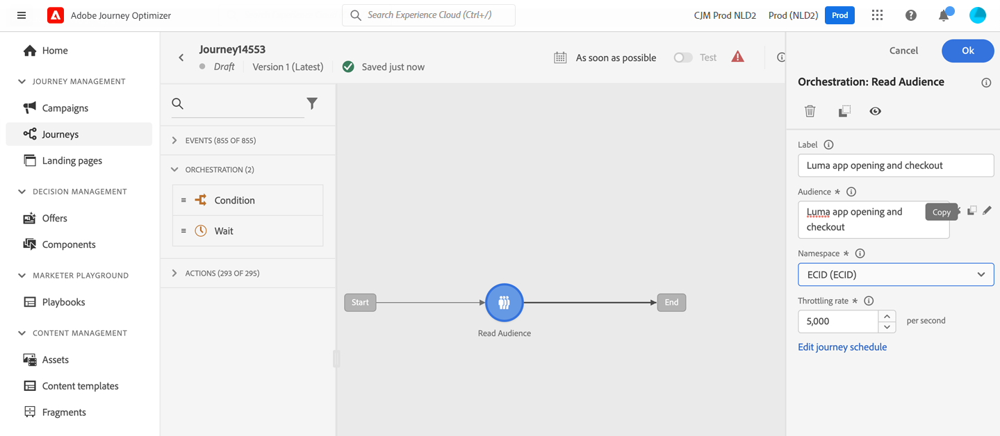
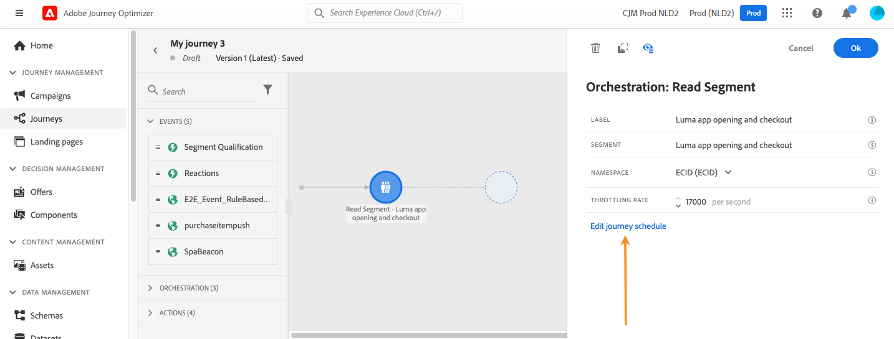
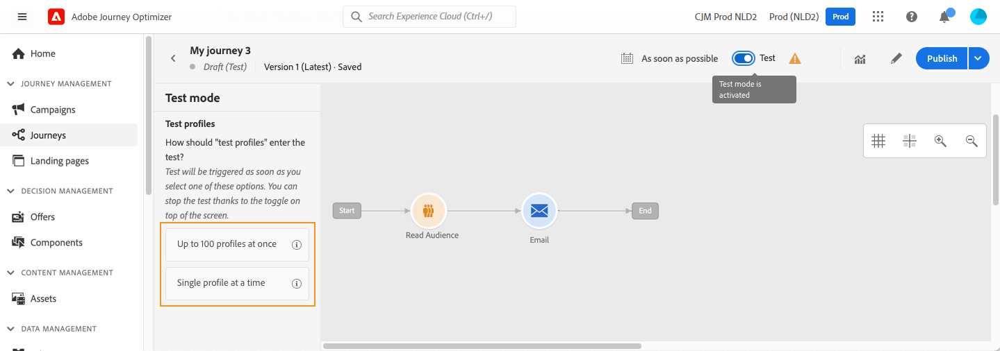

# 여정에서 대상자 사용 {#segment-trigger-activity}

## 대상자 읽기 활동 정보 {#about-segment-trigger-actvitiy}

>[!CONTEXTUALHELP]
>id="ajo_journey_read_segment"
>title="대상자 읽기 활동"
>abstract="대상자 읽기 활동을 사용하여 Adobe Experience Platform 대상자에 속하는 모든 개인이 여정을 시작할 수 있습니다. 여정의 시작은 한 번 또는 정기적으로 실행될 수 있습니다."

**대상자 읽기** 활동을 사용하여 대상자의 모든 개인이 여정에 들어가도록 만듭니다. 여정의 시작은 한 번 또는 정기적으로 실행될 수 있습니다.

[대상자 빌드](../audience/about-audiences.md) 사용 사례에서 만든 &quot;Luma 앱 열기 및 체크 아웃&quot; 대상을 예로 들어 보겠습니다. 대상자 읽기 활동을 사용하면 이 대상자에 속하는 모든 개인에게 여정을 입력하고 조건, 타이머, 이벤트, 작업과 같은 모든 여정 기능을 활용하는 개별화된 여정으로 흐르도록 할 수 있습니다.

➡️ [비디오에서 이 기능 살펴보기](#video)

## 보호 기능 및 모범 사례 {#must-read}

* 여정에서 **[!UICONTROL 대상자 읽기]** 활동은 하나만 사용할 수 있으며 캔버스에서 첫 번째 활동이어야 합니다.

* **[!UICONTROL 대상자 읽기]** 활동은 한 대상자만 타깃팅할 수 있습니다. 여러 대상이 필요한 경우 사용하기 전에 이러한 대상을 하나의 대상으로 병합하는 것이 좋습니다. [컴포지션 워크플로를 사용하여 대상자를 결합하는 방법에 대해 알아보세요](../audience/get-started-audience-orchestration.md)

* **대상자 읽기** 활동을 사용하는 여정의 경우 정확히 동시에 시작할 수 있는 여정의 최대 개수가 정해져 있습니다. 다시 시도는 시스템에서 수행되지만 정확히 같은 시간에 시작하여 5개 이상의 여정(**대상자 읽기** 사용, 예약됨 또는 &quot;가능한 한 빨리&quot; 시작)가 시작되지 않도록 합니다. 가장 좋은 방법은 예를 들어 5분에서 10분 간격과 같이 시간이 지남에 따라 이를 분산시키는 것입니다.

* **대상자 읽기** 활동, **[대상자 자격](audience-qualification-events.md)** 활동 또는 비즈니스 이벤트 활동으로 시작하는 여정에서 경험 이벤트 필드 그룹을 사용할 수 없습니다.

* 가장 좋은 방법은 **대상자 읽기** 활동에서만 일괄 대상자를 사용하는 것입니다. 이렇게 하면 여정에 사용된 대상자에 대해 안정적이고 일관된 카운트를 제공합니다. 대상자 읽기는 일괄 사용 사례용으로 설계되었습니다. 사용 사례에 실시간 데이터가 필요한 경우 **[대상 자격](audience-qualification-events.md)** 활동을 사용하십시오.

* CSV 파일에서 가져온 대상 [개](https://experienceleague.adobe.com/docs/experience-platform/segmentation/ui/overview.html?lang=ko#import-audience) 또는 [컴포지션 워크플로](../audience/get-started-audience-orchestration.md)의 결과로 가져온 대상은 **대상 읽기** 활동에서 선택할 수 있습니다. 이러한 대상은 **대상 자격** 활동에서 사용할 수 없습니다.

**대상자 읽기** 활동과 관련된 보호 기능은 [이 페이지](../start/guardrails.md#read-segment-g)에 나열되어 있습니다.

## 활동 구성 {#configuring-segment-trigger-activity}

대상 읽기 활동을 구성하는 단계는 다음과 같습니다.

### 대상자 읽기 활동을 추가하고 대상자를 선택합니다

1. **[!UICONTROL Orchestration]** 범주를 펼친 후 **[!UICONTROL 대상자 읽기]** 활동을 캔버스에 넣으십시오.

   활동은 여정의 첫 번째 단계로 배치해야 합니다.

1. 활동에 **[!UICONTROL Label]**&#x200B;을(를) 추가합니다(선택 사항).

1. **[!UICONTROL 대상]** 필드에서 여정을 입력할 Adobe Experience Platform 대상을 선택한 다음 **[!UICONTROL 저장]**&#x200B;을 클릭합니다. [세그먼트 정의](../audience/creating-a-segment-definition.md)를 사용하여 생성된 Adobe Experience Platform 대상을 선택할 수 있습니다.

   >[!NOTE]
   >
   >또한 [대상 구성](../audience/get-started-audience-orchestration.md) 또는 [CSV 파일에서 업로드한](https://experienceleague.adobe.com/docs/experience-platform/segmentation/ui/overview.html?lang=ko#import-audience){target="_blank"}을 사용하여 만든 Adobe Experience Platform 대상을 타깃팅할 수도 있습니다.

   목록에 표시되는 열을 사용자 정의하고 정렬할 수 있습니다.

   

   대상자가 추가되면 **[!UICONTROL 복사]** 버튼을 사용하여 해당 이름과 ID를 복사할 수 있습니다.

   `{"name":"Luma app opening and checkout","id":"8597c5dc-70e3-4b05-8fb9-7e938f5c07a3"}`

   

   >[!NOTE]
   >
   >대상자 참가 상태가 **실현됨**&#x200B;인 개인만 여정에 들어갑니다. 대상자를 평가하는 방법에 대한 자세한 내용은 [세그먼테이션 서비스 설명서](https://experienceleague.adobe.com/docs/experience-platform/segmentation/tutorials/evaluate-a-segment.html?lang=ko#interpret-segment-results){target="_blank"}를 참조하세요.

1. **[!UICONTROL 네임스페이스]** 필드에서 개인을 식별하기 위해 사용할 네임스페이스를 선택합니다. 기본적으로 필드는 마지막으로 사용된 네임스페이스로 미리 채워집니다. [네임스페이스에 대해 자세히 알아보기](../event/about-creating.md#select-the-namespace).

   >[!NOTE]
   >
   >서로 다른 ID 중에서 선택한 ID(네임스페이스)가 없는 대상에 속하는 개인은 여정에 들어갈 수 없습니다. 사용자 기반 ID 네임스페이스만 선택할 수 있습니다. 조회 테이블에 대한 네임스페이스를 정의한 경우(예: 제품 조회에 대한 ProductID 네임스페이스) **네임스페이스** 드롭다운 목록에서 사용할 수 없습니다.

### 여정의 프로필 항목 관리

**[!UICONTROL 읽기 속도]**&#x200B;를 설정합니다. 초당 여정을 입력할 수 있는 최대 프로필 수입니다. 이 비율은 이 활동에만 적용되며 여정의 다른 활동에는 적용되지 않습니다. 예를 들어 사용자 지정 작업에 대한 전송률 조절 속도를 정의하려면 전송률 조절 API를 사용해야 합니다. 이 [페이지](../configuration/throttling.md)를 참조하세요.

이 값은 여정 버전 페이로드에 저장됩니다. 기본값은 초당 5,000개의 프로필입니다. 이 값은 초당 500개에서 20,000개의 프로필로 수정할 수 있습니다.

>[!NOTE]
>
>샌드박스당 전체 읽기 속도는 초당 20,000개의 프로필로 설정됩니다. 따라서 동일한 샌드박스에서 동시에 실행되는 모든 읽기 대상의 읽기 속도는 초당 최대 20,000개의 프로필을 추가합니다. 이 캡은 수정할 수 없습니다.

### 여정 예약 {#schedule}

>[!CONTEXTUALHELP]
>id="ajo_journey_read_segment_scheduler_start_date"
>title="시작 날짜/시간"
>abstract="이 여정을 트리거할 날짜 및 시간을 정의합니다."

>[!CONTEXTUALHELP]
>id="ajo_journey_read_segment_scheduler_repeat_until"
>title="다음 시간까지 반복"
>abstract="반복의 종료 일자를 정의합니다."

>[!CONTEXTUALHELP]
>id="ajo_journey_read_segment_scheduler_repeat_every"
>title="모두 반복"
>abstract="반복 스케줄러 빈도를 정의합니다."

>[!CONTEXTUALHELP]
>id="ajo_journey_read_segment_scheduler_incremental_read"
>title="증분 읽기"
>abstract="마지막으로 읽은 이후의 새 프로필만 여정에 진입하도록 허용합니다."

>[!CONTEXTUALHELP]
>id="ajo_journey_read_segment_scheduler_force_reentrance"
>title="강제 재진입"
>abstract="각 대상자를 읽기 전에 모든 여정 참가자를 드롭합니다."

>[!CONTEXTUALHELP]
>id="ajo_journey_read_segment_scheduler_synchronize_audience"
>title="배치 대상자 평가 후 트리거"
>abstract="새로운 배치 대상자 평가의 내보내기가 준비되었을 때 트리거 여정을 실행하려면 이 옵션을 토글합니다."

>[!CONTEXTUALHELP]
>id="ajo_journey_read_segment_scheduler_synchronize_audience_wait_time"
>title="새 대상자 평가에 대한 대기 시간"
>abstract="일괄 처리 대상이 새로 평가될 때까지 여정이 대기할 시간을 지정합니다. 대기 기간은 정수 값으로 제한되며 분 또는 시간 단위로 지정할 수 있으며 1시간에서 6시간 사이여야 합니다."

기본적으로 여정은 한 번 실행되도록 구성됩니다. 여정을 실행할 특정 날짜/시간 및 빈도를 정의하려면 아래 단계를 따르십시오.

>[!NOTE]
>
>일회성 읽기 대상 여정은 여정 실행 후 91일([여정 글로벌 시간 초과](journey-properties.md#global_timeout)) 후에 **완료됨** 상태로 이동합니다. 예약된 읽기 대상의 경우 마지막 항목이 실행된 후 91일이 경과해야 합니다.

1. **[!UICONTROL 대상자 읽기]** 활동 속성에서 pa, **[!UICONTROL 여정 일정 편집]**&#x200B;을 선택합니다.

   

1. 여정 속성이 표시됩니다. **[!UICONTROL 스케줄러 유형]** 드롭다운 목록에서 여정을 실행할 빈도를 선택합니다.

   

반복 여정의 경우 여정에 대한 프로필 입력을 관리하는 데 도움이 되는 특정 옵션을 사용할 수 있습니다. 각 옵션에 대한 자세한 내용을 보려면 아래 섹션을 확장하십시오.

+++**[!UICONTROL 증분 읽기]**

되풀이하는 **대상자 읽기**&#x200B;를 사용하는 여정이 처음 실행되면 대상자의 모든 프로필이 여정에 들어갑니다.

이 옵션을 사용하면 여정의 마지막 실행 이후 대상에 들어온 개인만 첫 번째 발생 후 타깃팅할 수 있습니다.

>[!NOTE]
>
>여정에서 [사용자 지정 업로드 대상](../audience/about-audiences.md#segments-in-journey-optimizer)을(를) 대상으로 하는 경우, 이러한 대상이 수정되므로 반복 여정에서 이 옵션이 활성화된 경우 프로필은 첫 번째 반복에서만 검색됩니다.

+++

+++**[!UICONTROL 반복 시 강제 재입력]**

이 옵션을 사용하면 여정에 여전히 존재하는 모든 프로필이 다음 실행 시 자동으로 종료되도록 할 수 있습니다.

예를 들어 일별 반복 여정에서 2일 대기하는 경우 이 옵션을 활성화하면 프로필이 다음 실행 대상에 있는지 여부에 관계없이 항상 다음 여정 실행 시(즉, 다음 날) 이동됩니다.

이 여정에서 프로필의 수명이 반복 빈도보다 길 수 있는 경우 프로필이 여정을 완료할 수 있도록 이 옵션을 활성화하지 마십시오.

+++

+++**[!UICONTROL 일괄 대상 평가 후 트리거]**(제한된 가용성)

>[!AVAILABILITY]
>
>**[!UICONTROL 일괄 대상 평가 후 트리거]** 옵션은 조직 집합(제한된 가용성)에만 사용할 수 있습니다. 액세스 권한을 받으려면 Adobe 담당자에게 문의하십시오.

매일 예약된 여정 및 타깃팅 배치 대상의 경우, 여정이 배치 세분화 작업에서 새 대상 데이터를 대기할 최대 6시간의 시간 창을 정의할 수 있습니다. 시간 창 내에 세분화 작업이 완료되면 여정이 트리거됩니다. 그렇지 않으면 다음 상황이 발생할 때까지 여정을 건너뜁니다. 이 옵션을 사용하면 정확한 최신 대상 데이터로 여정을 실행할 수 있습니다.

예를 들어 여정이 매일 오후 6시로 예약된 경우 여정이 실행되기 전에 대기할 분 또는 시간을 지정할 수 있습니다. 여정이 오후 6시에 일어나면 새 대상을 확인합니다. 즉, 이전 여정 실행에 사용된 대상보다 새로운 대상을 의미합니다. 지정된 기간 동안 새 대상을 감지하면 여정이 즉시 실행됩니다. 그러나 새 대상이 감지되지 않으면 해당 날짜의 여정 실행을 건너뜁니다.

**증분 읽기 여정에 대한 전환 확인 기간**

**[!UICONTROL 일괄 대상 평가 후 트리거]**&#x200B;를 선택하면 [!DNL Journey Optimizer]에서 새 대상 평가를 찾습니다. 전환 확인 기간의 시작점에 대해 시스템은 24시간 이상 전에 발생한 경우에도 마지막으로 성공한 여정 실행 시간을 사용합니다. 이는 일반적으로 24시간 전환 확인 기간이 있는 증분 읽기 여정에 중요합니다.

일별 증분 읽기 여정 예:

* &quot;일괄 처리 대상 평가 후 트리거&quot;가 활성화된 경우: 증분 프로필이 여정에 들어간 이후 3일이 지난 경우 증분 프로필을 찾을 때 전환 확인 기간이 3일 지연됩니다.
* &quot;일괄 처리 대상 평가 후 트리거&quot;가 활성화되지 않은 경우: 증분 프로필이 여정에 들어간 이후 3일이 지난 경우 증분 프로필을 찾을 때 전환 기간이 24시간 이전으로만 표시됩니다.

+++

<!--

### Segment filters {#segment-filters}

[!CONTEXTUALHELP]
>id="jo_segment_filters"
>title="About segment filters"
>abstract="You can choose to target only the individuals who entered or exited a specific segment during a specific time window. For example, you can decide to only retrieve all the customers who entered the VIP segment since last week."

You can choose to target only the individuals who entered or exited a specific segment during a specific time window. For example, you can decide to only retrieve all the customers who entered the VIP segment since last week. Only the new VIP customers will be targeted. All the customers who were already part of the VIP segment before will be excluded.

To activate this mode, click the **Segment Filters** toggle. Two fields are displayed:

**Segment membership**: choose whether you want to listen to segment entrances or exits. 

**Lookback window**: define when you want to start to listen to entrances or exits. This lookback window is expressed in hours, starting from the moment the journey is triggered.  If you set this duration to 0, the journey will target all members of the segment. For recurring journeys, it will take into account all entrances/exits since the last time the journey was triggered.

-->

## 여정 테스트 및 게시 {#testing-publishing}

**[!UICONTROL 대상자 읽기]** 활동을 사용하면 단일 프로필에서 여정을 테스트할 수 있습니다.

이렇게 하려면 테스트 모드를 활성화합니다.

평소대로 테스트 모드를 구성하고 실행합니다. [여정 테스트 방법을 알아보세요](testing-the-journey.md).

테스트가 실행되면 **[!UICONTROL 로그 표시]** 단추를 사용하여 테스트 결과를 볼 수 있습니다. 자세한 정보는 [이 섹션](testing-the-journey.md#viewing_logs)을 참조하세요.

테스트가 성공하면 여정을 게시할 수 있습니다([여정 게시](publishing-the-journey.md) 참조). 대상에 속한 개인 사용자는 여정의 속성 **[!UICONTROL 스케줄러]** 섹션에 지정된 날짜/시간에 여정을 입력합니다.

>[!NOTE]
>
>반복 대상 기반 여정의 경우 마지막 발생이 실행되면 여정이 자동으로 닫힙니다. 종료 날짜/시간이 지정되지 않은 경우 신규 진입에 대한 여정을 수동으로 마감하여 종료해야 합니다.

## 대상 기반 여정의 대상 타기팅

대상 기반 여정은 항상 Adobe Experience Platform 대상에 속하는 개인을 검색하기 위해 **대상 읽기** 활동으로 시작합니다.

대상자에 속한 대상자는 한 번 또는 정기적으로 검색됩니다.

여정에 입장한 후 대상 오케스트레이션 사용 사례를 만들어 초기 대상의 개인이 여정의 다른 분기로 유입될 수 있도록 할 수 있습니다.

**세그먼테이션**

조건을 사용하여 **조건** 활동을 사용하여 세분화를 수행할 수 있습니다. 예를 들어 VIP 사용자가 특정 경로를 사용하고 VIP 이외의 사용자는 다른 경로를 사용할 수 있도록 할 수 있습니다.

세분화는 다음을 기반으로 할 수 있습니다.

* 데이터 소스 데이터
* 여정 이벤트 컨텍스트(예: 한 시간 전에 받은 메시지를 클릭했습니까?)
* 예를 들어, 날짜가 어떤 사람이 여정을 거치는 6월에 있습니까?
* 시간, 예를 들어 아침이 개인 시간대의 시간대입니까?
* 여정에서 흐르는 대상을 백분율에 따라 분할하는 알고리즘(예: 90% - 10%)으로, 컨트롤 그룹을 제외합니다.

>[!NOTE]
>
>**[!UICONTROL 대상자 읽기]** 활동과 함께 &quot;일별&quot; 스케줄러 유형을 사용할 때 여정이 새로운 대상자 데이터를 기다리는 기간을 정의할 수 있습니다. 이를 통해 정확한 타기팅을 보장하고 일괄 처리 세분화 작업의 지연으로 인해 발생하는 문제를 방지할 수 있습니다. [여정 예약 방법 알아보기](#schedule)
>
>**[!UICONTROL 일괄 대상 평가 후 트리거]** 옵션은 조직 집합(제한된 가용성)에만 사용할 수 있습니다. 액세스 권한을 받으려면 Adobe 담당자에게 문의하십시오.

**예외**

세분화에 사용된 동일한 **조건** 활동(위 참조)을 사용하면 모집단의 일부를 제외할 수도 있습니다. 예를 들어 VIP 사용자를 바로 뒤 종료 단계가 있는 분기로 흘러가게 하여 제외할 수 있습니다.

이 제외는 대상 검색 직후, 모집단 계산을 위해 또는 여러 단계의 여정을 따라 발생할 수 있습니다.

**결합**

여정을 사용하면 N개의 분기를 만들고 세그멘테이션 후 서로 연결할 수 있습니다. 따라서 두 대상이 공통 경험으로 돌아오도록 할 수 있습니다.

예를 들어 여정에서 10일 동안 다른 경험을 팔로우한 후 VIP 및 VIP이 아닌 고객은 동일한 경로로 돌아갈 수 있습니다. 결합 후 세분화 또는 제외를 수행하여 대상을 다시 분할할 수 있습니다.

## 다시 시도 {#read-audience-retry}

내보내기 작업을 검색하는 동안 대상이 트리거된 여정(**대상자 읽기** 또는 **비즈니스 이벤트**&#x200B;로 시작)에서 기본적으로 다시 시도가 적용됩니다. 내보내기 작업 생성 중 오류가 발생하면 최대 1시간 동안 10분마다 다시 시도됩니다. 그 후에는 실패로 간주합니다. 따라서 이러한 유형의 여정은 예정된 시간보다 최대 1시간 후에 실행될 수 있습니다.

실패한 **대상자 읽기** 트리거가 캡처되어 **경고**&#x200B;에 표시됩니다. **대상자 읽기 경고**&#x200B;은(는) **대상자 읽기** 활동이 예약된 실행 시간 10분 후에 어떤 프로필도 처리하지 않은 경우 경고합니다. 이 실패는 기술 문제 또는 대상이 비어 있기 때문에 발생할 수 있습니다. 이 실패가 기술적인 문제로 인해 발생한 경우 문제 유형에 따라 다시 시도가 계속 발생할 수 있습니다(예: 내보내기 작업 만들기가 실패한 경우 최대 1시간 동안 10밀리초마다 다시 시도). [자세히 알아보기](../reports/alerts.md#alert-read-audiences)

## 방법 비디오 {#video}

대상자 읽기 활동으로 트리거되는 여정에 적용할 수 있는 사용 사례를 이해합니다. 일괄 처리 단위 기반 여정을 작성하는 방법과 상황에 따라 적용할 모범 사례를 알아봅니다.

>[!VIDEO](https://video.tv.adobe.com/v/3424997?quality=12)
