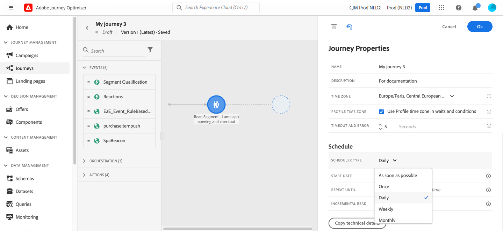
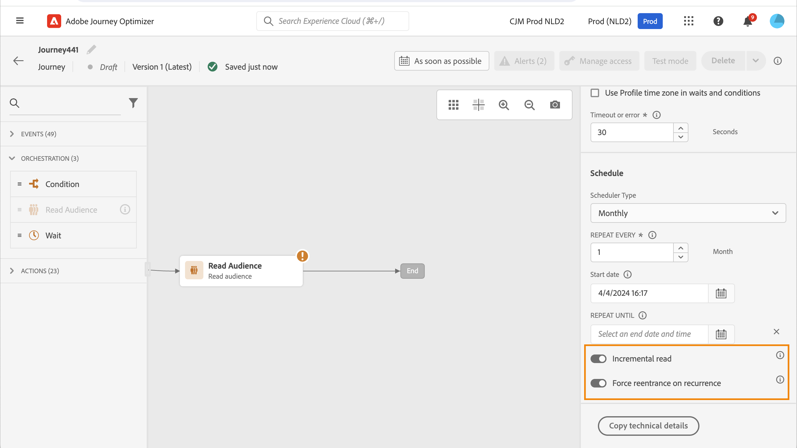
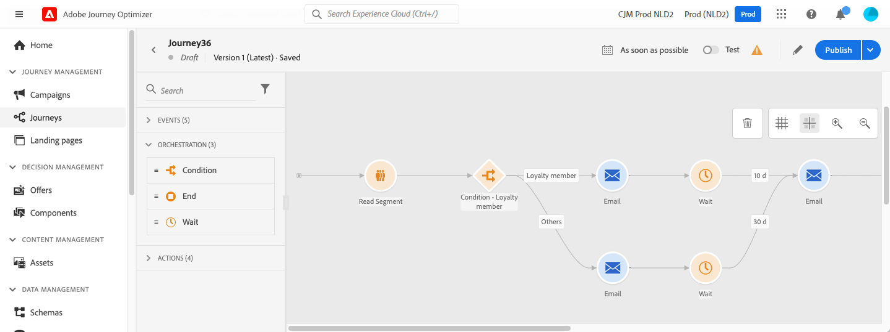

# 여정에서 대상자 사용 {#segment-trigger-activity}

대상자 읽기 활동을 사용하여 정의된 대상자로 여정을 시작합니다. 대상자와 대상 실행 시기를 선택한 다음 [조건](#audience-targeting-in-journeys), 타이머 및 작업을 사용하여 각 프로필의 경로를 개인화합니다.

## 대상자 읽기 활동 정보 {#about-segment-trigger-activity}

>[!CONTEXTUALHELP]
>id="ajo_journey_read_segment"
>title="대상자 읽기 활동"
>abstract="선택한 [!DNL Adobe Experience Platform] 대상자의 모든 적격 프로필을 이 여정에 추가합니다. 한 번 또는 일정에 따라 실행합니다."

**대상 읽기** 활동은 선택한 [!DNL Adobe Experience Platform] 대상의 모든 프로필을 여정에 추가하는 여정 진입점 활동입니다. 출입문은 한 번 또는 되풀이하는 일정에 따라 실행할 수 있습니다. API 및 기술 참조에서 이 활동을 세그먼트 트리거 또는 대상 기반 여정 항목이라고도 합니다.

**대상 읽기와 대상 자격을 사용하는 경우**

| 다음과 같은 경우 **대상자 읽기**&#x200B;를 사용합니다. | 다음과 같은 경우 **[대상 자격](audience-qualification-events.md)** 사용 |
|----------------------------|-----------------------------------------------------------------------|
| 한 번 또는 일정(일괄 처리)에 따라 여정을 실행할 수 있습니다. | 자격을 부여할 때 실시간으로 여정을 입력하려면 프로필이 필요합니다. |
| 대상자는 일괄 평가됩니다(예: 일별 스냅샷). | 대상자는 스트리밍 또는 이벤트를 기반으로 합니다. |
| 대상 평가와 여정 입력 사이에 지연이 있어도 됩니다. | 프로필이 유효하면 즉시 입력해야 합니다. |

**키 제한:** 여정 당 읽기 대상(첫 번째 활동이어야 함) 1개, 활동당 대상 1개, 조직당 최대 5개의 동시 읽기 대상 실행, 샌드박스당 초당 프로필 20,000개, 작업 시간 제한 12시간. [보호 기능 및 제한 사항](../start/guardrails.md#read-segment-g)의 전체 세부 정보.

**사전 요구 사항:** 작성 및 평가된 [!DNL Adobe Experience Platform] 대상(실현된 상태), 여정에 대해 선택된 사용자 기반 ID 네임스페이스 및 반복 실행을 위해 [예약 및 처리량 제한을 이해](../start/guardrails.md#read-segment-g)하는 대상입니다.

예를 들어 `Luma app opening and checkout`대상 작성[&#x200B; 사용 사례에서 만든 &#x200B;](../audience/about-audiences.md) 대상을 진입점으로 사용할 수 있습니다. 모든 적격 프로필은 조건, 타이머, 이벤트 및 작업을 사용하여 개별화된 경로를 통해 여정 및 진행률을 입력합니다.

➡️ [비디오에서 이 기능 살펴보기](#video)

>[!CAUTION]
>
>* 대상자 읽기 활동을 사용하기 전에 [보호 기능 및 제한 사항을 읽으십시오](#must-read).

## 활동 구성 {#configuring-segment-trigger-activity}

**대상**(필수), **네임스페이스**(필수), **열람율**(필수, 기본 5,000/s) 및 **일정**(여정 실행 시)을 설정합니다. 선택적으로 **레이블** 및 **보조 식별자**&#x200B;를 추가합니다. 아래 단계는 각 설정을 안내합니다.

### 활동 추가 및 대상자 선택 {#add-activity-and-select-audience}

>[!CONTEXTUALHELP]
>id="ajo_journey_read_segment_label"
>title="레이블"
>abstract="보고 및 테스트 모드 로그에서 이 활동을 식별하는 선택적 레이블입니다."

>[!CONTEXTUALHELP]
>id="ajo_journey_read_segment_audience"
>title="대상자"
>abstract="이 여정에 들어갈 프로필을 가진 대상자 [!DNL Adobe Experience Platform]명을 선택합니다."

>[!CONTEXTUALHELP]
>id="ajo_journey_read_segment_namespace"
>title="네임스페이스"
>abstract="여정에 들어가는 개인을 식별하는 데 사용되는 ID(예: 이메일, ECID)를 선택합니다. 기본적으로 필드는 마지막으로 사용된 네임스페이스로 미리 채워집니다."

1. **[!UICONTROL Orchestration]** 범주를 펼친 후 **[!UICONTROL 대상자 읽기]** 활동을 캔버스에 넣으십시오.

   활동은 여정의 첫 번째 단계로 배치해야 합니다.

1. 활동에 **[!UICONTROL Label]**&#x200B;을(를) 추가합니다(선택 사항). 선택적 레이블은 보고 및 테스트 모드 로그에서 활동을 식별하는 데 도움이 됩니다.

1. **[!UICONTROL 대상]** 필드에서 여정을 입력할 [!DNL Adobe Experience Platform] 대상을 선택한 다음 **[!UICONTROL 저장]**&#x200B;을 클릭합니다. [!DNL Adobe Experience Platform]세그먼트 정의[를 사용하여 생성된 &#x200B;](../audience/creating-a-segment-definition.md) 대상을 선택할 수 있습니다.

   >[!NOTE]
   >
   >또한 [!DNL Adobe Experience Platform]대상자 구성[을 사용하여 만든 &#x200B;](../audience/get-started-audience-orchestration.md)대상자를 타깃팅할 수 있습니다.
   >[CSV 파일에서 업로드한 대상](https://experienceleague.adobe.com/docs/experience-platform/segmentation/ui/overview.html#import-audience){target="_blank"}을 타깃팅할 수도 있습니다.
   >[Journey Optimizer에서 대상자를 생성하고 타깃팅하는 방법에 대해 자세히 알아보세요](../audience/about-audiences.md).

   목록에 표시되는 열을 사용자 정의하고 정렬할 수 있습니다.

   ![사용 가능한 대상 [!DNL Adobe Experience Platform]개를 표시하는 대상 선택 인터페이스](assets/read-segment-selection.png)

   대상자가 추가되면 **[!UICONTROL 복사]** 버튼을 사용하여 해당 이름과 ID를 복사할 수 있습니다.

   `{"name":"Luma app opening and checkout","id":"8597c5dc-70e3-4b05-8fb9-7e938f5c07a3"}`

   

   >[!NOTE]
   >
   >대상자 참가 상태가 **실현됨**&#x200B;인 개인만 여정에 들어갑니다. 대상자를 평가하는 방법에 대한 자세한 내용은 [세그먼테이션 서비스 설명서](https://experienceleague.adobe.com/docs/experience-platform/segmentation/tutorials/evaluate-a-segment.html#interpret-segment-results){target="_blank"}를 참조하세요.

1. **[!UICONTROL 네임스페이스]** 필드에서 개인을 식별하기 위해 사용할 네임스페이스를 선택합니다. 기본적으로 필드는 마지막으로 사용된 네임스페이스로 미리 채워집니다. [네임스페이스에 대해 자세히 알아보기](../event/about-creating.md#select-the-namespace).

   >[!NOTE]
   >
   >서로 다른 ID 중에서 선택한 ID(네임스페이스)가 없는 대상에 속하는 개인은 여정에 들어갈 수 없습니다. 사용자 기반 ID 네임스페이스만 선택할 수 있습니다. 조회 테이블에 대한 네임스페이스를 정의한 경우(예: 제품 조회에 대한 ProductID 네임스페이스) **네임스페이스** 드롭다운 목록에서 사용할 수 없습니다.

### 보조 식별자 {#read-audience-supplemental-id}

필요에 따라 **보조 식별자를 사용**&#x200B;하여 여정 ID 외에 보조 식별자(예: 주문 ID 또는 예약 ID)의 컨텍스트에서 프로필을 실행할 수 있습니다. 보조 식별자가 다른 경우 동일한 프로필에 여러 번 들어갈 수 있습니다.

[여정에서 보조 식별자를 사용하는 방법을 알아보세요](supplemental-identifier.md). 대상자 읽기 여정의 경우 보조 식별자는 프로필 속성이어야 합니다. 보조 ID가 사용되는 경우 읽기 속도는 초당 500개의 프로필로 제한됩니다.

### 가드레일 및 추천 사항 {#must-read}

**대상 읽기** 활동에 대한 모든 보호 기능 및 제한 사항(동시 실행, 처리량, 활동당 하나의 대상, 작업 시간 초과, 다시 시도 등)이 [보호 기능 및 제한 사항](../start/guardrails.md#read-segment-g)에 나열되어 있습니다.

**Recommendations**

* 신뢰할 수 있고 일관된 카운트를 위해서는 **대상자 읽기** 활동에서 일괄 대상자를 사용하는 것이 좋습니다. 대상자 읽기는 일괄 사용 사례용으로 설계되었습니다. 사용 사례에 실시간 데이터가 필요한 경우 대신 [대상 자격](audience-qualification-events.md) 활동을 사용하십시오.
* CSV 파일에서 가져온 대상 [개](https://experienceleague.adobe.com/docs/experience-platform/segmentation/ui/overview.html#import-audience) 또는 [컴포지션 워크플로](../audience/get-started-audience-orchestration.md)의 결과로 가져온 대상은 **대상 읽기** 활동에서 선택할 수 있습니다. 이러한 대상은 **대상 자격** 활동에서 사용할 수 없습니다.
* 대상 스냅숏 시간, 일괄 처리 세분화 완료 기간 및 여정이 항상 최신 데이터에서 실행되도록 하는 방법에 대한 자세한 내용은 [시간 및 데이터 전파](#timing-and-data-propagation)를 참조하십시오. 반복 여정의 경우 **[!UICONTROL 일괄 대상 평가 후 트리거]** 옵션을 활성화하여 최신 대상 스냅숏이 준비될 때까지 실행을 자동으로 지연시키는 것이 좋습니다. [자세히 알아보기](#schedule).

>[!CAUTION]
>
>[실시간 고객 프로필 데이터 및 세분화에 대한 보호 기능](https://experienceleague.adobe.com/docs/experience-platform/profile/guardrails.html?lang=ko){target="_blank"}이 [!DNL Adobe Journey Optimizer]에도 적용됩니다.

**다음:** [열람율](#profile-entry-and-reading-rate) 및 [일정](#schedule)을 설정한 다음 [테스트 및 게시](#testing-publishing)를 설정합니다.

### 프로필 입력 및 읽기 속도 {#profile-entry-and-reading-rate}

>[!CONTEXTUALHELP]
>id="ajo_journey_read_segment_reading_rate"
>title="읽기 속도"
>abstract="초당 여정에 들어가는 최대 프로필(500-20,000)입니다. 기본값은 5,000입니다."

**[!UICONTROL 읽기 속도]**&#x200B;을(를) 설정합니다(필수). 초당 여정을 입력할 수 있는 최대 프로필 수입니다. 이 비율은 이 활동에만 적용되며 여정의 다른 활동에는 적용되지 않습니다. 예를 들어 사용자 지정 작업에 대한 전송률 조절 속도를 정의하려면 전송률 조절 API를 사용해야 합니다. 이 [페이지](../configuration/throttling.md)를 참조하세요.

이 값은 여정 버전 페이로드에 저장됩니다. 기본값은 초당 5,000개의 프로필입니다. 이 값은 초당 500개에서 20,000개의 프로필로 수정할 수 있습니다.

>[!NOTE]
>
>샌드박스당 전체 읽기 속도는 초당 20,000개의 프로필로 설정됩니다. 따라서 동일한 샌드박스에서 동시에 실행되는 모든 읽기 대상의 읽기 속도는 초당 최대 20,000개의 프로필을 추가합니다. 이 캡은 수정할 수 없습니다. [이 섹션](entry-management.md#journey-processing-rate)에서 여정 처리 속도 및 처리량에 대해 자세히 알아보세요.

### 여정 예약 {#schedule}

>[!CONTEXTUALHELP]
>id="ajo_journey_read_segment_scheduler_start_date"
>title="시작 날짜/시간"
>abstract="이 여정을 시작할 시점을 정의합니다."

>[!CONTEXTUALHELP]
>id="ajo_journey_read_segment_scheduler_repeat_until"
>title="다음 시간까지 반복"
>abstract="반복 실행의 종료 일자를 정의합니다."

>[!CONTEXTUALHELP]
>id="ajo_journey_read_segment_scheduler_repeat_every"
>title="모두 반복"
>abstract="여정 실행 빈도(예: 매일, 매주)입니다."

>[!CONTEXTUALHELP]
>id="ajo_journey_read_segment_scheduler_incremental_read"
>title="증분 읽기"
>abstract="첫 번째 실행 후 대상자에 추가된 새 프로필만 여정에 들어갑니다."

>[!CONTEXTUALHELP]
>id="ajo_journey_read_segment_scheduler_force_reentrance"
>title="강제 재진입"
>abstract="새로운 대상자가 읽기 전에 여정에서 모든 참가자를 지웁니다."

>[!CONTEXTUALHELP]
>id="ajo_journey_read_segment_scheduler_synchronize_audience"
>title="배치 대상자 평가 후 트리거"
>abstract="배치 대상자가 새로 평가된 후에만 여정을 실행합니다."

>[!CONTEXTUALHELP]
>id="ajo_journey_read_segment_scheduler_synchronize_audience_wait_time"
>title="새 대상자 평가에 대한 대기 시간"
>abstract="여정이 새 대상자 데이터를 기다리는 시간(1~6시간, 분 또는 시간)입니다."

기본적으로 여정은 한 번 실행되도록 구성됩니다. 여정을 실행할 특정 날짜/시간 및 빈도를 정의하려면 아래 단계를 따르십시오.

>[!NOTE]
>
>**여정 상태 및 91일 전역 시간 제한:**
>
>* 여정 실행 후 91일(**여정 글로벌 시간 초과**) 후에 **일회성** 대상자 읽기 여정이 [완료됨](journey-properties.md#global_timeout) 상태로 이동합니다.
>* **반복** 종료 날짜가 없는 대상 여정 읽기 **여정이 게시되는 동안 라이브로 유지**&#x200B;합니다. 이 사용자는 **마지막 항목**&#x200B;을 실행한 후 91일 후에 **완료됨** 상태로 이동합니다.
>* 91일 시간 제한은 여정의 라이브 상태가 아니라 여정을 통해 흐르는 개별 **프로필**&#x200B;에 적용됩니다(프로필이 활성 상태로 유지될 수 있는 최대 시간).
>* 91일 **보고 기간**&#x200B;은(는) 별도의 개념입니다. UI는 대략 지난 91일 동안의 성능 데이터를 표시합니다. 이전 데이터는 UI에서 액세스할 수 없지만 여정은 계속 실행됩니다. [자세히 알아보기](journey-properties.md#global_timeout)

1. **[!UICONTROL 대상자 읽기]** 활동 속성에서 **[!UICONTROL 여정 일정 편집]**&#x200B;을 선택합니다.

   

1. 여정 속성이 표시됩니다. **[!UICONTROL 스케줄러 유형]** 드롭다운 목록에서 여정을 실행할 빈도를 선택합니다.

   

반복 여정의 경우 여정에 대한 프로필 입력을 관리하는 데 도움이 되는 특정 옵션을 사용할 수 있습니다. 각 옵션에 대한 자세한 내용을 보려면 아래 섹션을 확장하십시오.

+++**[!UICONTROL 증분 읽기]**

되풀이하는 **대상자 읽기**&#x200B;를 사용하는 여정이 처음 실행되면 대상자의 모든 프로필이 여정에 들어갑니다. 이 옵션을 사용하면 여정의 마지막 실행 이후 대상에 들어온 개인만 첫 번째 발생 이후에 타깃팅할 수 있습니다.

이 옵션을 사용하면 시스템은 **의 세분화 서비스에서 마지막으로 수행한 대상 평가 작업의 시간으로부터** 24시간[!DNL Adobe Experience Platform]을(를) 되돌아봅니다.

세그멘테이션이 완료되면 Journey Optimizer에서 새 프로필을 감지하고 처리할 수 있는 프로필 스냅샷 내보내기 작업이 시작됩니다. 이 두 작업 사이에 여정이 예약되는 경우 증분 읽기는 여정의 마지막 실행 이후 대상자의 멤버가 된 프로필을 선택하지 않습니다.

프로필 누락의 위험을 최소화하려면 다음을 수행하십시오.
* **[!UICONTROL 일괄 대상 평가 후 트리거]** 옵션을 활성화하여 반환 기간을 발생한 시간과 관계없이 마지막으로 성공한 여정 실행 시간으로 연장합니다
* 일일 일괄 처리 세분화 작업이 완료된 후 여정이 잘 실행되도록 예약합니다(일반적으로 2~3시간 버퍼).
* 즉각적인 프로필 포함이 필요한 시간이 중요한 사용 사례의 경우 스트리밍 대상과 함께 [대상 자격](audience-qualification-events.md) 활동을 대신 사용해 보십시오

>[!CAUTION]
>
>여정에서 [사용자 지정 업로드 대상](../audience/about-audiences.md#about-segments)을(를) 대상으로 하는 경우 반복 여정에서 이 옵션을 활성화하면 첫 번째 반복 시에만 프로필이 검색됩니다. 이러한 대상은 수정되었습니다.

+++

+++**[!UICONTROL 반복 시 강제 재입력]**

이 옵션을 사용하면 여정에 여전히 존재하는 모든 프로필이 다음 실행 시 자동으로 종료되도록 할 수 있습니다.

예를 들어 매일 반복되는 여정에서 2일 동안 대기하는 경우 이 옵션을 활성화하면 프로필이 다음 여정 실행으로 이동합니다. 다음 실행 대상에 있든 없든 다음 날 이런 일이 발생합니다.

이 여정에서 프로필의 수명이 반복 빈도보다 길 수 있는 경우 프로필이 여정을 완료할 수 있도록 이 옵션을 활성화하지 마십시오.

+++

+++**[!UICONTROL 일괄 대상자 평가 후 트리거]**

매일 예약된 여정 및 타깃팅 배치 대상의 경우, 여정이 배치 세분화 작업에서 새 대상 데이터를 대기할 최대 6시간의 시간 창을 정의할 수 있습니다. 시간 창 내에 세분화 작업이 완료되면 여정이 트리거됩니다. 그렇지 않으면 다음 상황이 발생할 때까지 여정을 건너뜁니다. 이 옵션을 사용하면 정확한 최신 대상 데이터로 여정을 실행할 수 있습니다.

예를 들어 여정이 매일 오후 6시로 예약된 경우 여정이 실행되기 전에 대기할 분 또는 시간을 지정할 수 있습니다. 여정이 오후 6시에 일어나면 새 대상을 확인합니다. 즉, 이전 여정 실행에 사용된 대상보다 새로운 대상을 의미합니다. 지정된 기간 동안 새 대상을 감지하면 여정이 즉시 실행됩니다. 새 대상이 감지되지 않으면 해당 날짜의 여정 실행을 건너뜁니다.

+++

<!--
### Segment filters {#segment-filters}

[!CONTEXTUALHELP]
>id="jo_segment_filters"
>title="About segment filters"
>abstract="You can choose to target only the individuals who entered or exited a specific segment during a specific time window. For example, you can decide to only retrieve all the customers who entered the VIP segment since last week."

You can choose to target only the individuals who entered or exited a specific segment during a specific time window. For example, you can decide to only retrieve all the customers who entered the VIP segment since last week. Only the new VIP customers will be targeted. All the customers who were already part of the VIP segment before will be excluded.

To activate this mode, click the **Segment Filters** toggle. Two fields are displayed:

**Segment membership**: choose whether you want to listen to segment entrances or exits. 

**Lookback window**: define when you want to start to listen to entrances or exits. This lookback window is expressed in hours, starting from the moment the journey is triggered.  If you set this duration to 0, the journey will target all members of the segment. For recurring journeys, it will take into account all entrances/exits since the last time the journey was triggered.
-->

## 여정 테스트 및 게시 {#testing-publishing}

**[!UICONTROL 대상자 읽기]** 활동을 사용하면 단일 프로필에서 여정을 테스트할 수 있습니다.

이렇게 하려면 테스트 모드를 활성화합니다.

평소대로 테스트 모드를 구성하고 실행합니다. [여정 테스트 방법을 알아보세요](testing-the-journey.md).

테스트가 실행되면 **[!UICONTROL 로그 표시]** 단추를 사용하여 테스트 결과를 볼 수 있습니다. 자세한 정보는 [이 섹션](testing-the-journey.md#viewing_logs)을 참조하세요.

테스트가 성공하면 여정을 게시할 수 있습니다([여정 게시](../building-journeys/publish-journey.md) 참조). 대상에 속한 개인 사용자는 여정의 속성 **[!UICONTROL 스케줄러]** 섹션에 지정된 날짜/시간에 여정을 입력합니다.

>[!NOTE]
>
>반복 대상 기반 여정의 경우 마지막 발생이 실행되면 여정이 자동으로 닫힙니다. 종료 날짜/시간이 지정되지 않은 경우 신규 진입에 대한 여정을 수동으로 마감하여 종료해야 합니다.

## 여정의 대상 타기팅 {#audience-targeting-in-journeys}

대상 기반 여정은 항상 **대상에 속하는 개인을 검색하기 위해**&#x200B;대상 읽기[!DNL Adobe Experience Platform] 활동으로 시작합니다. 이러한 프로필은 한 번 또는 되풀이하는 일정에서 읽혀집니다.

사용자가 여정을 입력한 후 **조건** 활동을 사용하여 이를 오케스트레이션합니다. 특성 또는 동작을 기준으로 세그먼트화하거나, 모집단의 일부를 제외하거나, 분기를 다시 병합(결합)합니다. 아래 섹션에서는 각 패턴에 대해 설명합니다.

**세그먼테이션**

조건을 사용하여 **조건** 활동을 사용하여 세분화를 수행할 수 있습니다. 예를 들어 VIP 사용자가 특정 경로를 사용하고 VIP 이외의 사용자는 다른 경로를 사용할 수 있도록 할 수 있습니다.

세분화는 다음을 기반으로 할 수 있습니다.

* 데이터 소스 데이터
* 이벤트 컨텍스트(예: 한 시간 전에 받은 메시지를 클릭했습니까?)
* 예를 들어, 날짜가 어떤 사람이 여정을 거치는 6월입니까?
* 시간, 예를 들어 아침이 개인 시간대의 시간대입니까?
* 여정에서 흐르는 대상을 백분율에 따라 분할하는 알고리즘(예: 90% - 10%)으로, 컨트롤 그룹을 제외합니다.

>[!NOTE]
>
>**[!UICONTROL 대상자 읽기]** 활동과 함께 &quot;일별&quot; 스케줄러 유형을 사용할 때 여정이 새로운 대상자 데이터를 기다리는 기간을 정의할 수 있습니다. 이를 통해 정확한 타기팅을 보장하고 일괄 처리 세분화 작업의 지연으로 인해 발생하는 문제를 방지할 수 있습니다. [여정 예약 방법 알아보기](#schedule)

**예외**

세분화에 사용된 동일한 **조건** 활동(위 참조)을 사용하면 모집단의 일부를 제외할 수도 있습니다. 예를 들어 VIP 사용자를 바로 뒤 종료 단계가 있는 분기로 흘러가게 하여 제외할 수 있습니다.

이 제외는 대상 검색 직후, 모집단 계산을 위해 또는 여러 단계의 여정을 따라 발생할 수 있습니다.

**결합**

여정을 사용하면 N개의 분기를 만들고 세그멘테이션 후 서로 연결할 수 있습니다. 따라서 두 대상이 공통 경험으로 돌아오도록 할 수 있습니다.

예를 들어 여정에서 10일 동안 다른 경험을 팔로우한 후 VIP 및 VIP이 아닌 고객은 동일한 경로로 돌아갈 수 있습니다. 결합 후 세분화 또는 제외를 수행하여 대상을 다시 분할할 수 있습니다.

## 문제 해결 {#audience-count-mismatch}

이 섹션은 **대상자 규모 불일치**(예상보다 적은 수의 프로필이 입력됨), **0개의 프로필이 처리됨**(대상 경고 읽기 또는 항목 없음), **지연 또는 누락된 항목**(타이밍 및 데이터 전파)을 해결하는 데 도움이 됩니다.

>[!NOTE]
>
>대상 읽기 활동이 실행되면 시스템은 대상 내보내기 작업의 라이프사이클을 추적하기 위해 내부 이벤트(`segmentExportJob` 이벤트)를 생성합니다. 이러한 이벤트는 개별 프로필이 아닌 활동 수준에서 기록되며 모니터링 및 문제 해결을 위해 쿼리할 수 있습니다. [대상자 읽기 이벤트 쿼리](../reports/query-examples.md#read-segment-queries)에 대해 자세히 알아보세요.

**문제 찾기:**

| 증상 | 다음으로 이동 |
|---------|--------|
| 대상자 크기보다 적은(또는 더 많은) 프로필 입력 | [타이밍 및 데이터 전파](#timing-and-data-propagation), [데이터 유효성 검사 및 모니터링](#data-validation-and-monitoring) |
| 대상자 읽기(0개 프로필 처리됨), 경고 실행됨 | [0개의 프로필이 처리됨](#zero-profiles-processed) |
| 배치 대상의 시작이 지연되었거나 누락되었습니다. | [타이밍 및 데이터 전파](#timing-and-data-propagation) |
| 세그먼트 작업 상태 또는 네임스페이스를 확인해야 합니다. | [데이터 유효성 검사 및 모니터링](#data-validation-and-monitoring) |

### 0개 프로필이 처리됨 {#zero-profiles-processed}

**대상자 읽기** 활동이 프로필을 처리하지 않은 경우(예: [대상자 읽기 경고](../reports/alerts.md#alert-read-audiences)가 표시됨):

1. **대상이 비어 있는지 확인** - [!DNL Adobe Experience Platform]에서 대상 크기를 확인하고 프로필이 **실현됨** 상태인지 확인하십시오. 비어 있거나 아직 평가되지 않은 대상은 항목이 0이 됩니다.
2. **네임스페이스 확인** - 대상자 읽기 활동에서 선택한 네임스페이스가 대상자의 프로필에 있어야 합니다. 해당 ID가 없는 프로필은 여정에 들어갈 수 없습니다. [네임스페이스에 대해 자세히 알아보기](../event/about-creating.md#select-the-namespace).
3. **경고 및 다시 시도 검토** - **경고**&#x200B;에 오류가 보고됩니다. 시스템 다시 시도는 최대 1시간 동안 10분마다 작업 생성을 내보냅니다. [다시 시도 및 경고에 대해 자세히 알아보세요](#read-audience-retry).

이러한 확인 후에도 문제가 지속되면 일괄 처리 및 구성 원인에 대해 [타이밍 및 데이터 전파](#timing-and-data-propagation) 및 [데이터 유효성 검사 및 모니터링](#data-validation-and-monitoring)을 참조하십시오.

### 타이밍 및 데이터 전파 {#timing-and-data-propagation}

* **일괄 처리 세분화 작업 완료**: 일괄 처리 대상의 경우 여정 실행 전에 일일 일괄 처리 세분화 작업이 완료되었고 스냅숏이 업데이트되었는지 확인하십시오. 일괄 처리 대상자는 세분화 작업 완료 후 약 **2시간**&#x200B;에 사용할 준비가 됩니다. [대상 평가 방법](https://experienceleague.adobe.com/docs/experience-platform/segmentation/home.html#evaluate-segments){target="_blank"}에 대해 자세히 알아보세요.

* **데이터 수집 타이밍**: 여정 실행 전에 프로필 데이터 수집이 완전히 완료되었는지 확인하십시오. 프로필이 여정 시작 직전에 수집된 경우 아직 대상자에 반영되지 않을 수 있습니다. [&#x200B; [!DNL Adobe Experience Platform]의 &#x200B;](https://experienceleague.adobe.com/docs/experience-platform/ingestion/home.html?lang=ko){target="_blank"}데이터 수집에 대해 자세히 알아보세요.

* **일괄 처리 대상 평가 후 트리거 옵션을 사용합니다**: 일괄 처리 대상을 사용하는 매일 예약된 여정의 경우 **[!UICONTROL 일괄 처리 대상 평가 후 트리거]** 옵션을 사용하도록 설정하는 것이 좋습니다. 이렇게 하면 여정이 실행되기 전에 새 대상 데이터(최대 6시간)를 대기합니다. [예약에 대해 자세히 알아보기](#schedule)

* **대기 활동 추가**: 최근에 수집된 데이터가 있는 스트리밍 대상의 경우 데이터 전파 및 프로필 자격 조건을 위한 시간을 허용하려면 여정 시작 부분에 **대기** 활동을 추가하는 것이 좋습니다. [대기 활동에 대해 자세히 알아보기](wait-activity.md)

* **`inAudience()`조건 타이밍:** 대상 읽기 여정 내의 조건 노드에서 `inAudience()`을(를) 사용할 때 프로필의 일괄 처리 프로젝션에서 세그먼트 멤버십을 읽습니다. 이 프로젝션의 데이터는 수집 후 **2시간** 내에 새로 고쳐집니다. 전파 시간 시나리오에 대한 자세한 내용은 [inAudience 함수 설명서](functions/functioninaudience.md#propagation-timing)를 참조하세요.

### 데이터 유효성 검사 {#data-validation-and-monitoring}

* **세그먼테이션 작업 상태 확인**: [!DNL Adobe Experience Platform] [모니터링 대시보드](https://experienceleague.adobe.com/docs/experience-platform/dataflows/ui/monitor-segments.html){target="_blank"}에서 배치 세그먼테이션 작업 완료 시간을 모니터링합니다. 대상 데이터가 준비되면 이를 사용하여 확인합니다.

* **병합 정책 확인**: 대상자에 대해 구성된 병합 정책이 다른 소스의 프로필 데이터를 조합하는 데 필요한 동작과 일치하는지 확인하십시오. [&#x200B; [!DNL Adobe Experience Platform]의 &#x200B;](https://experienceleague.adobe.com/docs/experience-platform/profile/merge-policies/overview.html){target="_blank"}병합 정책에 대해 자세히 알아보세요.

* **세그먼트 정의 검토**: 세그먼트 정의가 올바르게 구성되었는지 확인하고 모든 예상 자격 조건을 포함하십시오. [대상자 빌드](../audience/creating-a-segment-definition.md)에 대해 자세히 알아보세요. 다음 사항에 특별히 주의하십시오.
   * 이벤트 타임스탬프를 기반으로 프로필을 제외할 수 있는 시간 기반 조건
   * 최근에 업데이트된 데이터에 의존하는 속성 자격
   * 스트리밍과 일괄 처리 평가 방법

* **네임스페이스 구성 유효성 검사**: **대상자 읽기** 활동에서 선택한 네임스페이스가 대상자의 프로필에서 사용하는 기본 ID와 일치하는지 확인하십시오. 선택한 네임스페이스가 없는 프로필은 여정에 들어가지 않습니다. [ID 네임스페이스](../event/about-creating.md#select-the-namespace)에 대해 자세히 알아보세요.

### 모범 사례

* **세그먼테이션 후 여정 예약**: 배치 대상의 경우 일반적인 배치 세그먼테이션 작업 완료 시간 후 최소 2~3시간 후에 여정 실행을 예약하십시오. [여정 예약에 대해 자세히 알아보기](#schedule)

* **실시간 사용 사례에 스트리밍 대상 사용**: 즉시 프로필 자격 및 여정 입력이 필요한 경우 일괄 대상이 있는 [대상 읽기](audience-qualification-events.md) 대신 스트리밍 대상이 있는 **대상 자격** 활동을 사용하십시오.

* **먼저 소규모 대상을 사용하여 테스트**: 대규모 여정을 시작하기 전에 더 작은 하위 집합으로 테스트하여 예상과 일치하는 항목을 확인해야 합니다. [여정 테스트 방법 알아보기](testing-the-journey.md)

* **정기적으로 모니터링**: 대상자 크기 및 여정 항목 지표에 대한 정기적인 모니터링을 설정하여 불일치를 조기에 감지합니다. [여정 처리 속도 및 항목 관리에 대해 자세히 알아보세요](entry-management.md).

### 지원 문의 시기

위의 단계를 수행한 후 카운트 불일치 또는 제로 프로필 실행이 지속되는 경우 Adobe 지원 센터에 문의하십시오. 준비 완료: 대상 이름/ID, 여정 이름/ID, 예약된 실행 시간, 샌드박스 및 불일치에 대한 간단한 설명(예: &quot;대상은 10K를 실현했으며 [날짜]&quot;에 여정을 입력한 것은 2K에 불과합니다.).

## 다시 시도 {#read-audience-retry}

내보내기 작업을 검색하는 동안 대상이 트리거된 여정(**대상자 읽기** 또는 **비즈니스 이벤트**&#x200B;로 시작)에서 기본적으로 다시 시도가 적용됩니다. 내보내기 작업 생성 중 오류가 발생하면 최대 1시간 동안 10분마다 다시 시도됩니다. 그 후에는 실패로 간주합니다. 따라서 이러한 유형의 여정은 예정된 시간보다 최대 1시간 후에 실행될 수 있습니다.

실패한 **대상자 읽기** 트리거가 캡처되어 **경고**&#x200B;에 표시됩니다. **대상자 읽기 경고**&#x200B;는 **대상자 읽기** 활동이 예약된 실행 시간으로부터 10분 후에 프로필을 처리하지 않은 경우 경고합니다. 이 오류는 기술 문제 또는 빈 대상자로 인해 발생할 수 있습니다. 기술적인 문제로 인한 실패인 경우 문제 유형에 따라 다시 시도할 수 있습니다. 예를 들어 내보내기 작업 생성이 실패하면 최대 1시간 동안 10분마다 다시 시도합니다. [자세히 알아보기](../reports/alerts.md#alert-read-audiences)

대상자 읽기 가드레일의 전체 목록(다시 시도 및 처리량 제한 포함)에 대해서는 [가드레일 및 제한 사항](../start/guardrails.md#read-segment-g)을 참조하십시오.

## 관련 항목

* [대상자 빌드](../audience/about-audiences.md)
* [대상자 선별 활동](audience-qualification-events.md)
* [여정에서 추가 식별자 사용](supplemental-identifier.md)
* [가드레일 및 제한 사항](../start/guardrails.md#read-segment-g)
* [여정 처리 속도 및 항목 관리](entry-management.md)
* [여정 테스트](testing-the-journey.md)
* [여정 게시](../building-journeys/publish-journey.md)

## 사용 방법 비디오 {#video}

대상자 읽기 활동으로 트리거되는 여정에 적용할 수 있는 사용 사례를 이해합니다. 배치 기반 여정을 작성하는 방법과 적용할 모범 사례를 알아봅니다.

>[!VIDEO](https://video.tv.adobe.com/v/3424997?quality=12)
