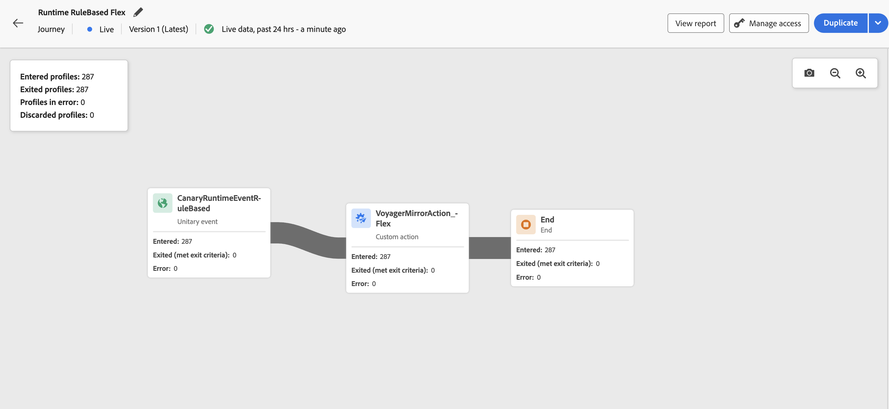

# 여정 캔버스의 라이브 보고서 {#report-journey}

>[!NOTE]
>
>여정 실시간 보고서에서 데이터를 볼 수 없는 경우 **[!UICONTROL 여정 보고서 보기]** 권한을 포함하도록 액세스 권한을 확장해야 합니다. [자세히 알아보기](../administration/permissions.md)

여정이 게시되면 **실시간 보고**&#x200B;에서 지난 24시간 동안의 지표를 여정 캔버스 내에서 직접 제공합니다.

표시된 이벤트는 지난 24시간 내에 발생했으며, 이벤트와 해당 표시 간 최소 간격은 2분이며, 일반적으로 5분 이내입니다.

라이브 여정의 경우 다음에 액세스할 수 있습니다.

* **[!UICONTROL 입력한 프로필]**: 이 활동에 입력한 총 개인 수입니다.
* **[!UICONTROL 프로파일링된 종료됨]**: 종료 조건으로 인해 해당 활동에서 여정을 종료한 총 개인 수.
* **[!UICONTROL 오류가 있는 프로필]**: 여정 중에 오류가 발생한 개인의 총 수입니다.
* **[!UICONTROL 삭제된 프로필]**: 다음 이유 중 하나로 여정에서 삭제된 총 개인 수:

   * **대상 자격** 활동의 경우 대상 자격에 대한 예상 동사가 여정이 받은 내용과 일치하지 않으면(예: &quot;실현됨&quot; 대신 &quot;종료됨&quot;) 취소가 발생할 수 있습니다.
   * **event-triggered** 여정의 경우, 개인이 너무 빨리 여정을 다시 입력하려고 시도하거나 다시 입력이 허용되지 않는 경우 취소가 발생할 수 있습니다.
   * **반복** 여정에서 개인이 이미 여정에 있고 재입력 정책이 &quot;강제 재입력&quot;으로 설정되어 있지 않은 경우 각 반복에서 취소가 계산됩니다.
   * **대상자 읽기** 활동에서 내보낸 개인에 대해 ID가 설정되지 않았거나 수신된 ID 네임스페이스가 여정의 예상 ID와 일치하지 않으면 무시됩니다.

모든 라이브 여정 내의 각 활동에 대해 다음에 액세스할 수 있습니다.

* **[!UICONTROL 입력한 프로필]**: 이 활동에 입력한 총 개인 수입니다.
* **[!UICONTROL 종료된 여정]**: 종료 조건으로 인해 해당 활동에서 프로필을 종료한 총 개인 수
* **[!UICONTROL 오류]**: 해당 활동에 오류가 있는 개인의 총 수입니다.
