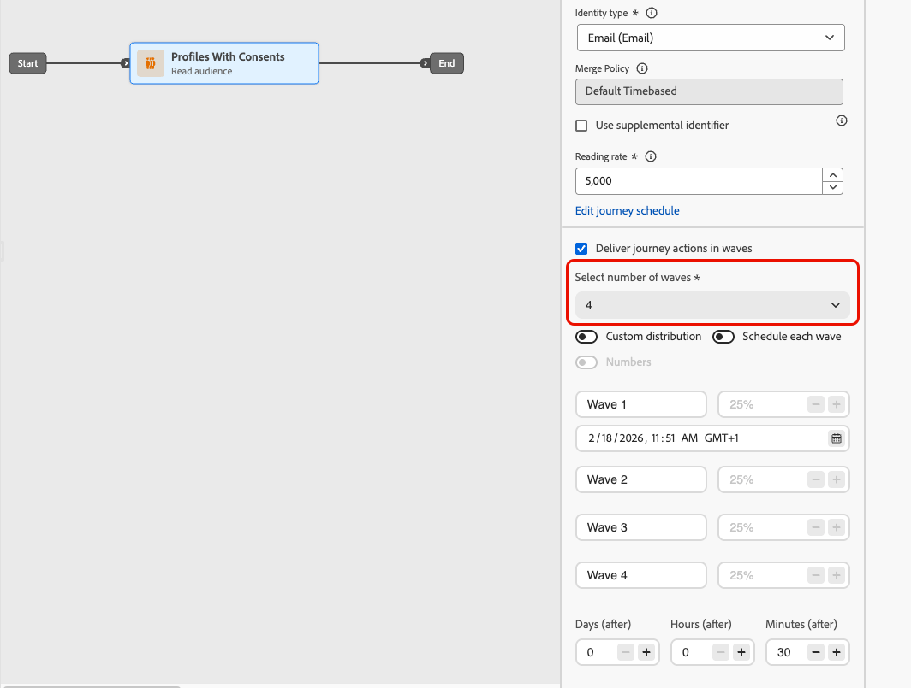
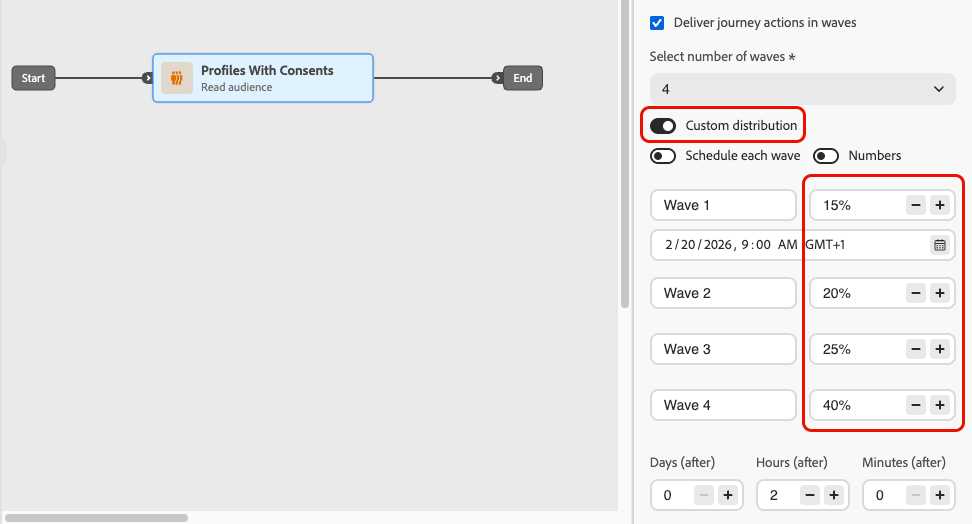

# 여정에서 예약된 일괄 처리를 사용하여 전송 {#send-using-waves-journeys}

>[!BEGINSHADEBOX]

**이 페이지에서:** 예약된 일괄 처리로 대상자 읽기 여정의 아웃바운드 메시지를 전달하는 방법(예약된 일괄 처리)을 배웁니다(부하 분산, 다운스트림 시스템 보호 및 전달성 지원).

>[!ENDSHADEBOX]

여정의 아웃바운드 메시지를 한 번에 모두 전달하는 대신 시간이 지남에 따라 배치(예약된 일괄 처리)로 전달할 수 있습니다. Wave Sending은 로드 밸런싱을 지원하고, 과도한 다운스트림 시스템(예: 콜 센터나 랜딩 페이지)을 방지하고, 특히 대량 읽기 대상 여정의 경우 전달성과 발신자의 평판을 지원합니다.

<!--
>[!CAUTION]
>
>Wave sending is available for read audience journeys only and applies to **outbound** actions only (Email, SMS, Push, Direct mail).
-->

대상자가 입장하는 방법과 작업을 예약하는 방법을 정의할 때 여정 수준에서 구성합니다. 예약된 일괄 처리 수, 예약된 일괄 처리 크기(대상의 백분율 또는 절대 숫자) 및 각 일괄 처리가 실행되는 시점을 정의합니다.

## 제한 사항 및 보호 기능 {#limitations-guardrails}

* 예약된 여정 유형이 **[!DNL As soon as possible]** 및 **[!UICONTROL Once]**&#x200B;인 대상자 읽기에만 웨이브 전송을 사용할 수 있습니다. [여정 일정](read-audience.md#schedule)에 대해 자세히 알아보세요.
* 반복, 여정 트리거, 비즈니스 이벤트, 테스트 모드 또는 시험 실행 이벤트에는 웨이브 전송을 사용할 수 없습니다.
* **2개 이상의 예약된 일괄 처리**&#x200B;를 정의해야 하며 최대 **10개의 예약된 일괄 처리**&#x200B;를 추가할 수 있습니다.
* 두 예약된 일괄 처리 시작 사이의 최소 간격은 **30분**&#x200B;입니다.
* 예약된 일괄 처리 시작은 여정 시작 전이거나 과거일 수 없습니다.
* 대상자를 파도로 분할하는 데는 최대 1시간이 소요될 수 있습니다. 그때까지 프로필이 여정에 들어가지 않을 수 있습니다.
* 단일 여정 버전 내에서는 두 개의 웨이브가 동시에 실행되지 않습니다. 다음 물결은 이전 물결이 끝난 후에야 시작된다. 예를 들어 예약된 파동이 1시간 간격으로 예약되어 있지만 첫 번째 파동이 2시간 동안 실행되는 경우 예약된 시간이 아니라 첫 번째 파동이 종료될 때 두 번째 파동이 시작됩니다.
* 플랫폼에서 할당량 제한을 적용하거나 시스템 용량이 과부하인 경우 웨이브 시작이 지연될 수 있습니다.

## 여정에서 웨이브 전송 구성 {#configure-wave-sending}

1. [대상자 읽기](read-audience.md) 활동으로 여정을 시작하십시오.

1. **[!UICONTROL 대상 읽기]** 활동을 두 번 클릭하여 해당 속성을 열고 **[!UICONTROL 여정 작업을 웨이브로 배달]** 옵션을 선택합니다.

   {width="100%"}

1. **예약된 일괄 처리 수**&#x200B;를 설정합니다(예: 4개).

   {width="80%"}

   >[!NOTE]
   >
   >최소한 2개의 웨이브를 정의해야 하며 최대 10개의 웨이브를 추가할 수 있습니다.

1. 아래에 자세히 설명된 대로 웨이브 크기와 타이밍을 정의하는 방법을 선택하십시오.

### 예약된 일괄 처리 {#equal-waves}

기본적으로 대상자는 동일한 크기의 예약된 일괄 처리로 분할됩니다. 각 웨이브의 시작 사이의 고정 간격(예: 2시간)을 설정합니다.

{width="70%"}

>[!NOTE]
>
>두 예약된 일괄 처리 시작 사이의 최소 간격은 **30분**&#x200B;입니다.

그런 다음 시스템은 후속 웨이브를 자동으로 예약합니다(예: 오전 9:00에 첫 번째 웨이브, 오전 11:00에 두 번째 웨이브, 오후 1:00에 세 번째 웨이브, 오후 3:00에 네 번째 웨이브).

### 사용자 지정 배포 {#custom-distribution}

**[!UICONTROL 사용자 지정 분포]** 옵션을 선택하여 각 파동의 크기를 전체 대상자의 백분율(예: 15%, 20%, 25%, 40%)로 정의합니다.

{width="70%"}

**[!UICONTROL 숫자]**&#x200B;을(를) 선택하여 각 웨이브의 크기를 프로필의 절대 수(예: 10,000; 50,000)로 정의합니다.

{width="70%"}

>[!NOTE]
>* 백분율을 사용할 때 모든 파동의 합계는 100%여야 합니다. 그렇지 않은 경우 경고가 표시됩니다.
>* 숫자를 사용할 때 시스템에서 범위를 확인하지 않습니다. 웨이브 크기가 의도한 대상자를 포함하는지 확인하십시오. [자세히 알아보기](#faq)

### 사용자 정의 일정 {#custom-schedule}

**[!UICONTROL 예약된 예약된 각 예약된 예약된 예약된 예약된 예약된 예약된 각 예약된 일괄 처리]**&#x200B;를 선택하여 각 예약된 일괄 처리에 대한 특정 시작 날짜와 시간을 정의합니다. 예약된 일괄 처리는 균일한 간격으로 배치할 필요가 없습니다(예: 오전 9:00, 오전 11:00, 오후 5:00, 오후 8:30).

{width="70%"}

>[!NOTE]
>
>두 예약된 일괄 처리 시작 사이의 최소 간격은 **30분**&#x200B;입니다.

## 사용 사례 {#use-cases}

웨이브 전송을 사용하면 메시지를 보내는 시기와 수를 제어하여 게재 능력을 향상시키고, 보낸 사람의 평판을 보호하며, 사용자의 운영 용량에 맞게 전송을 조정할 수 있습니다. 다음과 같은 경우 예약된 일괄 처리를 사용하는 것이 좋습니다.

* **콜센터 또는 응답 관리:** 다운스트림 팀(예: 고객 지원 센터)이 응답을 처리할 수 있도록 하루에 또는 시간당 나가는 메시지 수를 제한합니다. 예를 들어 콜센터 용량을 일치시키기 위해 하루에 20개의 메시지를 보냅니다.

  {width="55%"}

* **높은 볼륨 및 전달성:** 한 번에 매우 큰 여정 전송을 보내지 마십시오. 시간에 따라 게재를 확산하여 발신자의 평판을 유지하고 스팸으로 플래그가 지정될 위험을 줄입니다.

  {width="55%"}

* **램프 업:** 새 플랫폼 또는 IP를 사용할 때 점진적으로 볼륨을 늘려(예: 첫 번째 웨이브에서 10%, 그 다음 15%, 20% 등) 평판을 점진적으로 구축합니다.

  {width="55%"}

## 자주 묻는 질문 {#faq}

+++ 예약된 일괄 처리 크기의 합이 전체 대상자와 같지 않으면 어떻게 됩니까?

* 예약된 예약된 웨이브 크기 **이(가) 대상자를 초과**&#x200B;하면(예를 들어 100,000명의 대상자에 대해 첫 번째 웨이브에서 100,000명을 예약), 첫 번째 웨이브는 전체 대상자에게 보내지고 나머지 웨이브에는 보낼 사람이 없게 됩니다. 즉, 아직 실행되지 않습니다.
* **의 합계가 대상자보다**&#x200B;이(가) 적으면(예: 10만 명의 대상에 대해 총 40,000개의 프로필로 4개의 웨이브를 정의) 해당 웨이브에 포함된 프로필만 메시지를 수신합니다. 나머지 관객은 커뮤니케이션을 받지 못하며, 추후 파도에 의해 재시도되지 않을 것이다.

+++

+++ 개별 예약된 일괄 처리에 서로 다른 세그먼트나 기준을 할당할 수 있습니까?

예약된 일괄 처리의 크기와 타이밍만 정의할 수 있습니다. 동일한 대상이 여정을 통해 흐릅니다. 개별 전파에 다른 세그먼트나 기준을 할당할 수 없습니다.

+++

## 참조 - {#see-also}

* [여정에서 대상 사용](read-audience.md)—대상 읽기 활동을 구성합니다.

+++ AI 기술 자료 참조

이 단원에는 이 주제와 관련된 해석, 검색 및 질문 답변을 지원하기 위한 구조화된 지식이 포함되어 있습니다.

이해를 돕기 위해 이 정보를 이 페이지의 설명서와 통합해야 합니다. 두 소스 모두 독립적으로 사용하기 위한 것은 아닙니다. 이 페이지에서는 기능에 대해 설명하지만, 용어, 의도, 적용 가능성 및 제약 조건을 명확히 하는 데 도움이 되는 추가 컨텍스트를 제공합니다.

* **TL;DR:** 이 페이지에서는 시간이 지남에 따라 아웃바운드 메시지를 제어된 배치로 전달하도록 Adobe Journey Optimizer 읽기 대상 여정에서 웨이브 전송을 구성하여 게재 능력을 향상시키고 보낸 사람의 평판을 보호하는 방법을 설명합니다.

**의도:**
* 대상자 읽기 여정에서 웨이브 전송을 활성화하여 메시지를 일괄적으로 전달
* 각 예약된 일괄 처리 사이에 일정한 간격을 두고 동일한 일괄 처리 구성
* 사용자 정의 웨이브 크기를 백분율 또는 절대 프로필 수로 정의
* 사용자 지정 예약을 사용하여 특정 시작 날짜 및 시간으로 각 예약된 일괄 처리
* 전송 볼륨을 제어하여 보낸 사람의 평판을 보호하거나 운영 용량에 맞게 조정

**용어집:**
* **웨이브 전송**: 읽기 대상을 한 번에 일괄(예약된 일괄 처리)로 분할하고 각 일괄 처리로 메시지를 보내는 배달 모드 *(제품별)*
* **예약된 예약된 예약된 예약된 예약된 예약된 예약된 예약된 예약된 예약된 예약된 일괄 처리**: 예약된 일괄 처리 시작 사이의 간격이 고정된 동일한 크기로 대상이 분할되는 예약된 일괄 처리 구성 *(제품별)*
* **사용자 지정 배포**: 각 웨이브의 크기가 *(제품별) 프로필의 비율 또는 절대 수로 수동으로 정의되는 웨이브 구성*
* **사용자 지정 일정**: 각 예약된 일괄 처리에 특정 시작 날짜와 시간이 있어 일정하지 않은 간격 *(제품별)*&#x200B;을(를) 허용하는 예약된 일괄 처리 구성입니다.

**보호 기능:**
* 웨이브 전송은 &quot;가능한 한 빨리&quot; 및 &quot;한 번&quot; 스케줄러 유형이 있는 대상 읽기 여정에 대해서만 사용할 수 있으며, 반복, 이벤트 트리거, 비즈니스 이벤트, 테스트 모드 또는 시험 실행 여정에 대해서는 사용할 수 없습니다.
* 최소 2개의 웨이브와 최대 10개의 웨이브를 정의해야 합니다.
* 연속되는 두 파동의 시작 사이의 최소 간격은 30분입니다.
* 예약된 일괄 처리 시작 시간은 여정 시작 이전이거나 과거일 수 없습니다.
* 대상자를 파도로 분할하는 데는 최대 1시간이 소요될 수 있으며, 그때까지 프로필이 입장하지 않을 수 있습니다.
* 단일 여정 버전에서는 두 개의 웨이브가 동시에 실행되지 않습니다. 이전 웨이브가 완료된 후에만 다음 웨이브가 시작됩니다.
* 플랫폼 할당량 제한이나 시스템 과부하로 웨이브 시작이 지연될 수 있습니다.
* 백분율 기반 사용자 지정 분포를 사용할 때 모든 예약된 일괄 처리는 총 100%여야 합니다.
* 숫자 기반 사용자 지정 배포를 사용하는 경우 시스템에서 총 범위를 확인하지 않습니다. 사용자는 예약된 대상자를 파도 크기가 커버하는지 확인해야 합니다.
* 웨이브 크기가 대상자를 초과하면 첫 번째 웨이브는 전체 대상자로 전송되고 나머지 웨이브는 실행되지 않습니다.
* 예약된 예약된 예약된 일괄 처리 크기가 대상보다 작은 경우 정의된 일괄 처리의 프로필만 메시지를 수신하며 나머지는 재시도되지 않습니다.

**용어:**
* 정식 이름: 웨이브 전송 — 약어: 없음 — 변형: 배치 전송, 웨이브 기반 전송, 단계별 전송
* 동의어: &quot;waves&quot; = &quot;batches&quot; = &quot;delivery phase&quot;
* 다음과 같은 항목을 혼동하지 마십시오. &quot;웨이브 보내기&quot; ≠ &quot;반복 여정&quot;(웨이브 보내기는 읽은 단일 대상을 시간 배치로 분할하고, 반복 여정은 일정에 따라 대상을 다시 읽습니다.)

**FAQ:**
* **Q: 반복 여정에서 웨이브 전송을 사용할 수 있습니까?** — 아니요. 웨이브 전송은 &quot;가능한 한 빨리&quot; 또는 &quot;한 번&quot; 스케줄러 유형이 있는 대상 읽기 여정에 대해서만 사용할 수 있습니다.
* **Q: 두 예약된 일괄 처리 사이의 최소 시간은 얼마입니까?** — 두 번 연속되는 파도의 시작 사이에 30분.
* **Q: 파도 크기가 대상자보다 큰 경우 어떻게 됩니까?** — 첫 번째 웨이브가 전체 대상자에게 전송되고 후속 웨이브에는 보낼 프로필이 남아 있지 않습니다. 이들은 실행되지 않습니다.
* **Q: 개별 웨이브에 다른 콘텐츠 또는 세그먼트를 할당할 수 있습니까?** — 아니요. 모든 웨이브에서 동일한 대상 및 여정 컨텐츠를 사용합니다. 웨이브 당 크기 및 타이밍만 사용자 정의할 수 있습니다.
* **Q: 몇 개의 웨이브를 구성할 수 있습니까?** — 여정 당 예약된 일괄 처리 수 2~10개.
* **Q: 웨이브 전송을 언제 사용해야 합니까?** — 대량 전송을 위한 발신자의 평판을 보호하고 다운스트림 팀 용량(예: 콜 센터)에 맞춰 서비스를 제공하거나 새로운 IP 또는 플랫폼에서 점진적으로 볼륨을 증가시킬 수 있습니다.

+++
