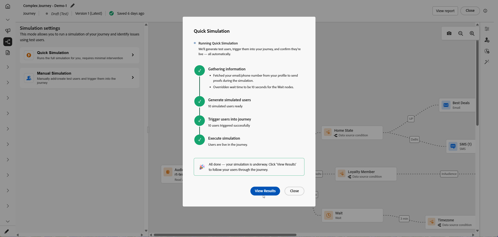
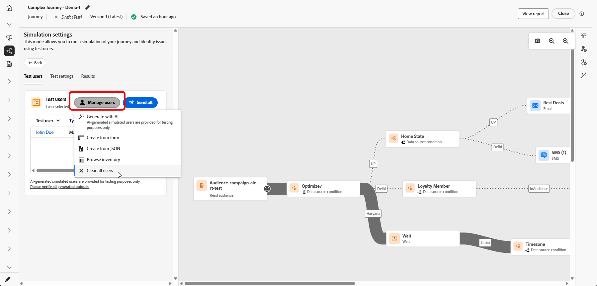
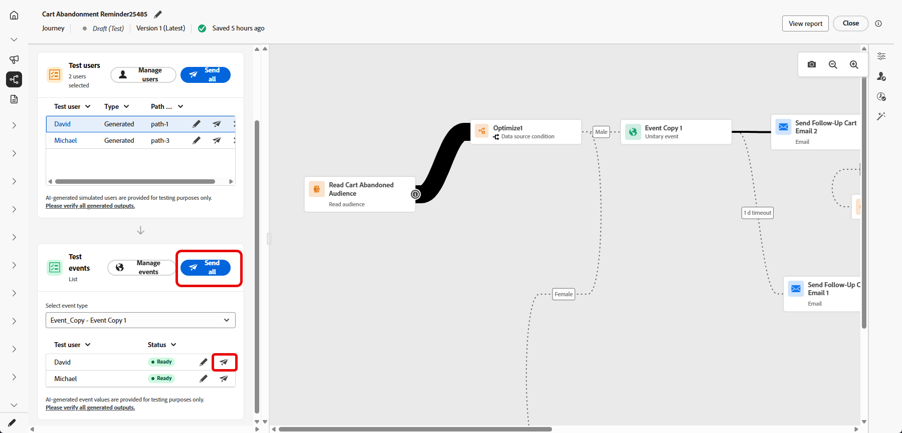
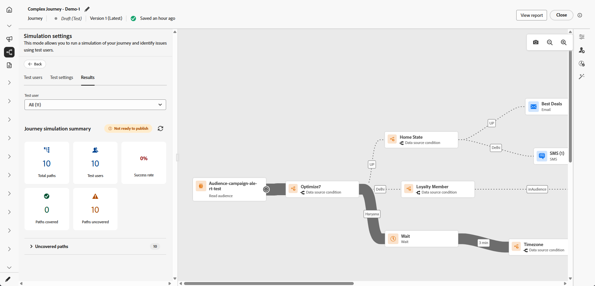

# 여정 시뮬레이션{#simulate-journey}

게시하기 전에 **[!UICONTROL 시뮬레이션]**&#x200B;을 사용하여 **시뮬레이션된 사용자**&#x200B;와(과) 여정의 유효성을 검사하십시오. 이 페이지에서는 **[!UICONTROL 빠른 시뮬레이션]** 및 **[!UICONTROL 수동 시뮬레이션]**, 시뮬레이션된 여정 생성 및 전송, 사용자에게 필요할 때 단일 이벤트 트리거 및 **[!UICONTROL 결과]** 로그 검토를 안내합니다.

여정 유형별 개요는 [여정 시뮬레이션 시작](simulate-journey-gs.md)을 참조하십시오.

## 시뮬레이션 유형 {#simulation-types}

활성화 후 대상자 항목 읽기가 포함된 일괄 여정은 시뮬레이션을 실행하는 두 가지 방법을 제공합니다.

* **[!UICONTROL 빠른 시뮬레이션]**&#x200B;은(는) 생성된 사용자와 기본값을 사용하여 처음부터 끝까지 실행됩니다. 단일 여정은 빠른 시뮬레이션을 사용할 수 없습니다.

* **[!UICONTROL 수동 시뮬레이션]**&#x200B;을 통해 사용자를 선택하고, 주문, 이벤트 페이로드를 전송하고, 단계별로 대기 재정의를 수행할 수 있습니다.

### 빠른 시뮬레이션 {#quick-simulation}

**[!UICONTROL 시뮬레이션]**&#x200B;의 일괄 여정에서 **[!UICONTROL 빠른 시뮬레이션]**&#x200B;은(는) 생성된 사용자와 미리 채워진 설정으로 여정을 실행합니다.

1. **[!UICONTROL 빠른 시뮬레이션]**&#x200B;을 선택하세요.

1. 실행을 위해 Adobe Journey Optimizer이 수집한 필드를 검토합니다. 증명 또는 채널 설정을 변경하거나 변경하지 않고 계속하려면 **[!UICONTROL 값 업데이트]**&#x200B;를 클릭하십시오.

   

1. **[!UICONTROL 값 업데이트]**&#x200B;를 연 경우 설정을 편집하십시오. 예를 들어 메시지 증명에 사용되는 주소를 편집한 다음 시뮬레이션을 시작하도록 확인하십시오.

   

1. Adobe Journey Optimizer은 여정 정의에서 시뮬레이션된 사용자를 생성하고 각 사용자를 여정으로 트리거합니다.

1. 실행이 완료되면 **[!UICONTROL 결과 보기]**&#x200B;를 클릭하여 경로, 오류 및 검색된 분기를 검토합니다. [결과 보기](#viewing-results)를 참조하세요.

   

### 수동 시뮬레이션 {#manual-simulation}

시뮬레이션된 각 사용자를 선택하고 전송 순서를 제어하며 이벤트 페이로드를 구성하고 실행 기간을 **[!UICONTROL 대기]**&#x200B;해야 하는 경우 **[!UICONTROL 수동 시뮬레이션]**&#x200B;을(를) 선택하십시오. 이 플로우는 배치 및 단일 여정에 적용됩니다.

[시뮬레이션된 사용자 만들기 및 관리](#test-users), [이벤트 트리거](#firing_events) 및 [결과 보기](#viewing-results)를 계속합니다.

## 시뮬레이션된 사용자 만들기 및 관리 {#test-users}

>[!IMPORTANT]
>
>**[!UICONTROL 시뮬레이션]** 기능에 액세스하려면 **여정 시뮬레이션** 권한이 필요합니다. [자세히 알아보기](../administration/permissions.md)

시뮬레이션된 사용자는 **[!UICONTROL 시뮬레이션 설정]**&#x200B;에서 정의한 임시 프로필과 같은 엔터티입니다. 이 섹션에서는 이러한 구성 요소를 만들고, 재사용하기 위해 저장하고, 목록에서 조정 또는 제거하고, 여정으로 보내는 방법을 다룹니다.

1. **[!UICONTROL 테스트 사용자]** 목록을 채우는 것부터 시작하십시오.

   +++ AI로 사용자 생성

   Adobe Journey Optimizer은 여정 정의에서 시뮬레이션된 사용자 세트를 생성합니다.

   이메일 또는 SMS 노드가 있는 여정의 경우 AI가 사용할 이메일 주소 또는 전화번호를 확인하라는 메시지를 표시합니다. 완료되면 **[!UICONTROL 생성]**&#x200B;을 클릭하세요.

   

   +++

   +++ 인벤토리 찾아보기

   **[!UICONTROL 인벤토리 찾아보기]**&#x200B;를 선택하여 양식 또는 JSON에서 만든 사용자 또는 AI 생성 실행 후 유지한 사용자 등 이미 저장한 시뮬레이션 사용자를 추가합니다.

   

   +++

   +++ 양식에서 만들기

   1. 이 시뮬레이션된 사용자를 식별하려면 **[!UICONTROL 표시 이름]** 및 **[!UICONTROL 설명]**&#x200B;을 입력하십시오.

      

   1. 그런 다음 이 사용자에 대해 채울 유니온 스키마에서 속성을 선택합니다.

   1. 세그먼트 멤버십을 시뮬레이션하려면 **[!UICONTROL 대상 멤버십 추가]**&#x200B;를 클릭하십시오.

   1. 하나의 세션에서 시뮬레이션된 사용자를 여러 개 만들려면 **[!UICONTROL 프로필 추가]**&#x200B;를 클릭하십시오.

   1. 메뉴에서 **[!UICONTROL 복제]**&#x200B;를 사용하여 사용자를 복사하고, **[!UICONTROL 모두 적용]**&#x200B;을 사용하여 한 사용자의 특성을 세션의 다른 모든 사용자에게 복사하거나, **[!UICONTROL 삭제]**&#x200B;를 사용하여 사용자를 제거합니다.

      

   1. 이 세션에서 사용자 구성을 마치면 **[!UICONTROL 저장]**&#x200B;을 클릭합니다.

   +++

   +++ JSON에서 만들기

   시뮬레이션된 사용자 데이터로 해당 필드를 업데이트하여 새 시뮬레이션된 사용자를 정의합니다.

   

   +++

1. 만든 시뮬레이션 사용자가 **[!UICONTROL 테스트 사용자]** 목록에 나타납니다. 각 항목에 대해 옵션 메뉴를 열고 다음 중 하나를 선택합니다.

   * : 시뮬레이션된 사용자의 세부 정보를 업데이트합니다.
   * : 이 시뮬레이션된 사용자에 대해서만 시뮬레이션을 실행합니다.
   * : 이 목록에서 사용자를 제거합니다. 시뮬레이션된 사용자는 삭제되지 않으며 시뮬레이션된 사용자 선택에서 계속 사용할 수 있습니다.

   

1. 선택 후 목록을 변경하려면 **[!UICONTROL 사용자 관리]**&#x200B;를 클릭하여 인벤토리에서 또는 새 사용자를 만들어 시뮬레이션된 사용자를 더 추가합니다. 이 실행에 대한 **[!UICONTROL 사용자 테스트]** 목록에서 모든 사용자를 제거하려면 **[!UICONTROL 모든 사용자 지우기]**&#x200B;를 선택하십시오.

   

1. 여정에 **[!UICONTROL 대기]** 활동이 포함된 경우 **[!UICONTROL 테스트 설정]** 탭을 열어 시뮬레이션 중 대기 시간을 미세 조정하십시오. 예를 들어 라이브 **[!UICONTROL 대기]** 활동이 며칠 동안 구성된 경우 시뮬레이션된 사용자가 다음 활동으로 이동하기 전에 해당 기간만 노드에서 보내도록 10초로 재정의할 수 있습니다.

1. **[!UICONTROL 모두 보내기]**&#x200B;를 클릭하여 목록의 모든 시뮬레이션된 사용자를 여정으로 보내거나 을 클릭하여 해당 사용자만 보냅니다. 시뮬레이션된 사용자가 여정을 성공적으로 입력하면 `Simulated users have been sent successfully.` 확인 메시지가 나타납니다.

   

1. 여정에 단일 이벤트가 포함된 경우 트리거할 이벤트를 선택해야 합니다. [이벤트 트리거](#firing_events)를 참조하세요.

1. **[!UICONTROL 결과]** 탭에 액세스하여 실행 로그를 열고 각 단계가 실행되는 방식을 검토하십시오. 자세한 내용은 [결과 보기](#viewing-results)를 참조하세요.

**[!UICONTROL 시뮬레이션]**&#x200B;에서 여정의 유효성을 검사한 후 **[!UICONTROL 결과]** 로그를 검토하십시오. 오류가 나타나면 **[!UICONTROL 시뮬레이션]**&#x200B;을 종료하고 필요한 변경 내용을 여정에 적용한 다음 실행이 올바르게 나타날 때까지 **[!UICONTROL 시뮬레이션]**&#x200B;을 다시 실행하십시오. 그런 다음 여정을 게시할 수 있습니다. [여정 게시](../building-journeys/publish-journey.md)를 참조하십시오.

## 이벤트 트리거 {#firing_events}

여정에 하나 이상의 단일 이벤트가 포함된 경우 시뮬레이션이 활성화되어 있을 때 트리거됩니다.

1. **[!UICONTROL 이벤트 유형 선택]**&#x200B;에서 이 시뮬레이션에 대해 실행할 이벤트를 선택합니다.

   

1. 목록의 모든 사용자에게 동일한 변경 사항을 적용하려면 **[!UICONTROL 이벤트 관리]** 옵션을 사용하여 다음을 수행합니다.

   * Adobe Journey Optimizer에서 AI를 사용하여 페이로드를 생성하도록 하려면 **[!UICONTROL 이벤트 값을 생성]**&#x200B;하십시오. 값이 생성되면 사용자는 **[!UICONTROL 전송 준비 완료]**(으)로 표시됩니다.
   * **[!UICONTROL 이벤트 날짜를 편집]**&#x200B;하여 시뮬레이션된 사용자의 페이로드만 변경합니다.

   

1. 사용자 옆에 있는 을 클릭하여 각 사용자에 대한 이벤트 페이로드를 구성하십시오.

   * Adobe Journey Optimizer에서 AI를 사용하여 페이로드를 생성하도록 하려면 **[!UICONTROL 이벤트 값을 생성]**&#x200B;하십시오. 값이 생성되면 사용자는 **[!UICONTROL 전송 준비 완료]**(으)로 표시됩니다.
   * **[!UICONTROL 이벤트 날짜를 편집]**&#x200B;하여 시뮬레이션된 사용자의 페이로드만 변경합니다.

   

1. **[!UICONTROL 테스트 이벤트]**&#x200B;에서 **[!UICONTROL 모두 보내기]**&#x200B;를 선택하여 **[!UICONTROL 여정 테스트]**&#x200B;에 나열된 모든 시뮬레이션된 사용자를 테스트로 보내거나 을 선택하여 해당 사용자에 대해서만 시뮬레이션을 실행하십시오.

   

1. 이벤트가 실행되면 각 사용자의 진행률을 반영하도록 캔버스가 업데이트됩니다. **[!UICONTROL 여정 테스트]** 목록에서 행을 클릭하면 사용자가 사용자를 통해 사용한 새 경로를 볼 수 있습니다.

1. **[!UICONTROL 결과]** 탭에 액세스하여 실행 로그를 열고 각 단계가 실행되는 방식을 검토하십시오. 자세한 내용은 [결과 보기](#viewing-results)를 참조하세요.

## 결과 보기 {#viewing-results}

**[!UICONTROL 결과]** 탭에서 테스트 결과를 볼 수 있습니다. **[!UICONTROL 사용자 테스트]** 드롭다운에서 실행을 검사할 시뮬레이션된 사용자를 선택합니다.

실행 시 시뮬레이션된 모든 사용자 간에 집계된 결과를 보려면 **[!UICONTROL 모두]**&#x200B;를 선택하십시오. 이 보기는 시뮬레이트된 단일 사용자를 먼저 선택하지 않고 전체 시뮬레이션을 한 눈에 스캔하는 데 도움이 됩니다.

각 활동에 대해 로그는 시뮬레이션된 사용자가 단계를 시작했는지 또는 종료했는지 여부와 시뮬레이션 중에 발생한 오류를 표시할 수 있습니다.

**대기** 활동의 경우 로그에 두 개의 기간 관련 값이 포함됩니다.

* **정의된 기간**: 게시된 여정의 **대기** 활동에 지정되고 여정이 라이브되면 적용되는 기간입니다. 로그는 시뮬레이션이 여정에 정의된 값에만 의존하지 않고 테스트 설정에서 재정의를 적용하는지 여부(예: 10초)를 기록합니다.
* **실제 기간**: 시뮬레이션된 사용자가 **대기** 활동에 남아 있는 경과 시간입니다. 이 값은 **[!UICONTROL 테스트 설정]** 탭에서 설정합니다.

로그에 오류가 나타나면 **시뮬레이션**&#x200B;을 종료하고 필요한 변경 내용을 여정에 적용한 다음 **시뮬레이션**&#x200B;을 다시 실행하십시오. 유효성 검사가 성공하면 여정을 게시합니다. [여정 게시](../building-journeys/publish-journey.md)를 참조하십시오.
