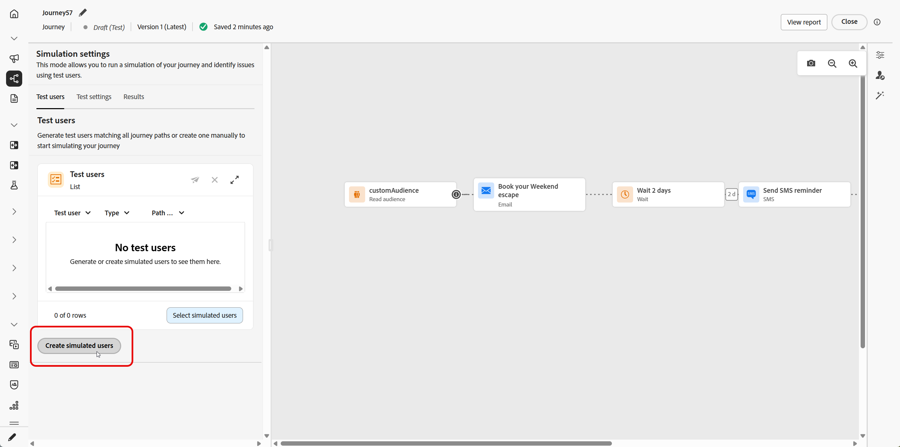
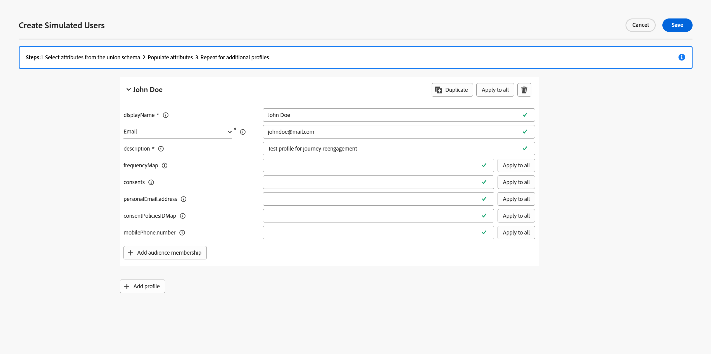
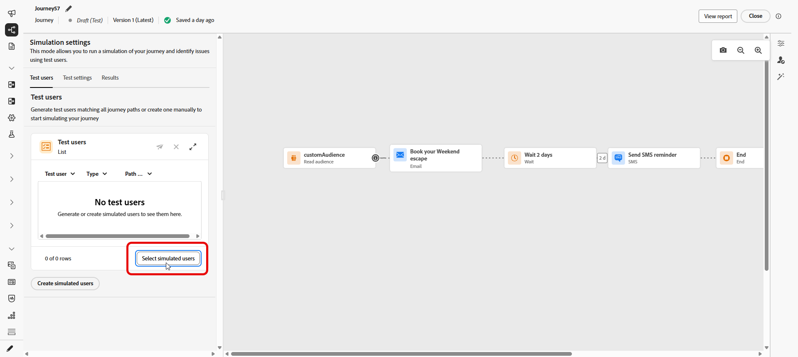

# 여정 시뮬레이션{#simulate-journey}

>[!IMPORTANT]
>
> 이 기능은 필수 기능을 갖춘 제한된 가용성으로 모든 고객이 사용할 수 있습니다.

**초안**, **테스트 모드** 및 **라이브** 외에 **[!UICONTROL 시뮬레이션]**(으)로 여정을 설정할 수 있습니다. 시뮬레이션에서 **시뮬레이션된 사용자**: Adobe Experience Platform에서 영구 테스트 프로필을 사용하지 않고 추가하는 임시 프로필과 유사한 엔터티로 테스트합니다.

Adobe Journey Optimizer은 여정을 테스트하고 확인하는 두 가지 방법을 제공합니다.

* **[시뮬레이션](#test-users)**: Adobe Experience Platform에서 미리 만들어진 프로필 없이 빠른 실행을 위해 **[!UICONTROL 시뮬레이션]** 여정 기능과 시뮬레이션된 사용자를 사용하십시오.

* **[테스트 모드](testing-the-journey.md)**: Adobe Experience Platform에서 테스트 프로필로 플래그가 지정된 영구 프로필을 사용하고 여러 세션에서 다시 사용할 수 있습니다. 일관되고 사전 정의된 데이터가 필요한 경우 이 방법을 선택합니다. [테스트 프로필을 만드는 방법을 알아봅니다](../audience/creating-test-profiles.md).

여정 시뮬레이션은 **제한된 가용성**&#x200B;에 있습니다. 피드백을 공유하고 환경을 개선하려면 상단 표시줄에서 **[!UICONTROL 피드백]**&#x200B;을 여세요.

## 시뮬레이션된 사용자 만들기 및 관리 {#test-users}

>[!IMPORTANT]
>
>**[!UICONTROL 시뮬레이션]** 기능에 액세스하려면 **여정 시뮬레이션** 권한이 필요합니다. [자세히 알아보기](../administration/permissions.md)

시뮬레이션된 사용자는 **[!UICONTROL 시뮬레이션 설정]**&#x200B;에서 정의한 임시 프로필과 같은 엔터티입니다. 이 섹션에서는 UI 또는 JSON 파일에서 이러한 구성 요소를 만들고, 재사용을 위해 저장하고, 목록에서 조정 또는 제거하고, 여정으로 전송하는 방법에 대해 설명합니다.

### 시뮬레이션된 사용자 만들기

다음 단계는 UI에서 또는 JSON 파일을 가져와서 시뮬레이션된 사용자를 만드는 방법을 보여 줍니다.

1. 여정에서 **[!UICONTROL 시뮬레이션]**&#x200B;을 열고 **[!UICONTROL 시뮬레이션]**&#x200B;을 선택하세요.

   

1. 새 사용자를 만들려면 **[!UICONTROL 시뮬레이션된 사용자 만들기]**&#x200B;를 클릭하고 UI에서 사용자를 만들지 JSON에서 사용자를 가져올지 선택합니다.

   대신 시뮬레이션된 사용자를 다시 사용하려면 **[!UICONTROL 시뮬레이션된 사용자 선택]**&#x200B;을 클릭하고 이전에 저장한 항목을 선택하십시오.

   

1. JSON에서 시뮬레이션된 사용자를 만드는 경우 시뮬레이션된 사용자 데이터로 해당 필드를 업데이트합니다.

1. UI에서 시뮬레이션된 사용자를 만드는 경우 **[!UICONTROL 표시 이름]** 및 **[!UICONTROL 설명]**&#x200B;을 입력하여 시뮬레이션된 사용자를 식별하십시오. 그런 다음 이 사용자에 대해 채울 유니온 스키마에서 속성을 선택합니다.

   

1. 세그먼트 멤버십을 시뮬레이션하려면 **[!UICONTROL 대상 멤버십]** 추가를 클릭하세요.

1. 하나의 세션에서 시뮬레이션된 사용자를 여러 개 만들려면 **[!UICONTROL 프로필 추가]**&#x200B;를 클릭하십시오.

1. 이 세션에서 추가한 각 시뮬레이션된 사용자에 대해 다음 작업을 사용할 수 있습니다.

   * **[!UICONTROL 복제]**: 기존 항목의 완료된 구성을 복제하는 새 시뮬레이션된 사용자를 추가합니다. 그런 다음 필요에 따라 복제를 편집할 수 있습니다.
   * **[!UICONTROL 모든 사용자에게 적용]**: 시뮬레이션된 사용자 중 하나의 속성 값 또는 설정을 목록의 다른 시뮬레이션된 사용자에게 전파합니다.
   * **[!UICONTROL 삭제]**: 선택한 시뮬레이션된 사용자를 목록에서 제거합니다.

1. 나중에 사용할 수 있도록 시뮬레이트된 사용자를 한 명 이상 저장하려면 **[!UICONTROL 저장]**&#x200B;을 클릭하세요.

1. 저장한 후 만든 시뮬레이션 사용자가 **[!UICONTROL 테스트 사용자]** 목록에 나타납니다. 각 항목에 대해 옵션 메뉴를 열고 다음 중 하나를 선택합니다.

   * : 시뮬레이션된 사용자의 세부 정보를 업데이트합니다.
   * : 이 시뮬레이션된 사용자에 대해서만 시뮬레이션을 실행합니다.
   * : 이 목록에서 사용자를 제거합니다. 시뮬레이션된 사용자는 삭제되지 않으며 시뮬레이션된 사용자 선택에서 계속 사용할 수 있습니다.

   

1. 여정에 **[!UICONTROL 대기]** 활동이 포함된 경우 **[!UICONTROL 테스트 설정]** 탭을 열어 시뮬레이션 중 대기 시간을 미세 조정하십시오.

1. **[!UICONTROL 모두 보내기]**&#x200B;를 클릭하여 목록에 있는 모든 시뮬레이션된 사용자를 여정으로 보냅니다. 시뮬레이션된 사용자가 여정을 성공적으로 입력하면 `Simulated users have been sent successfully.` 확인 메시지가 나타납니다.

   

1. **[!UICONTROL 결과]** 탭에 액세스하여 실행 로그를 열고 각 단계가 실행되는 방식을 검토하십시오. 자세한 내용은 [결과 보기](#viewing-results)를 참조하세요.

**[!UICONTROL 시뮬레이션]**&#x200B;에서 여정의 유효성을 검사한 후 **[!UICONTROL 결과]** 로그를 검토하십시오. 오류가 나타나면 **[!UICONTROL 시뮬레이션]**&#x200B;을 종료하고 필요한 변경 내용을 여정에 적용한 다음 실행이 올바르게 나타날 때까지 **[!UICONTROL 시뮬레이션]**&#x200B;을 다시 실행하십시오. 그런 다음 여정을 게시할 수 있습니다. [여정 게시](../building-journeys/publish-journey.md)를 참조하십시오.

### 시뮬레이션된 사용자 선택

수동으로 생성하는 시뮬레이션된 사용자는 저장되며 다른 여정에서 시뮬레이션이 활성화되어 있으면 이 목록에서 선택할 수 있습니다.

1. 여정을 **[!UICONTROL 시뮬레이션]**(으)로 설정합니다. **[!UICONTROL 시뮬레이션]** 진입점을 열고 **[!UICONTROL 시뮬레이션]**&#x200B;을(를) 선택하면 여정에서 작업 영역에 따라 테스트 모드 또는 라이브와 함께 시뮬레이션 기능을 사용합니다.

   

1. **[!UICONTROL 시뮬레이션 설정]** 패널에서 **[!UICONTROL 시뮬레이션 사용자 선택]**&#x200B;을 클릭하여 이전에 만든 시뮬레이션 사용자를 선택할 수 있습니다.

   

1. 이전에 생성 및 저장한 시뮬레이션된 사용자 목록에서 를 선택합니다.

1. 시뮬레이션한 사용자를 선택하면 이제 **[!UICONTROL 테스트 사용자]** 목록에서 해당 사용자를 사용할 수 있습니다. 옵션 메뉴에서 다음 옵션 중 하나를 선택합니다.

   * 사용자를 편집하고 세부 정보를 변경하려면 을 사용하세요.
   * 시뮬레이션된 사용자 한 명에게만 시뮬레이션을 보내려면 을 사용하십시오.
   * 를 클릭하여 목록에서 시뮬레이션된 사용자를 지웁니다. 지우는 것은 삭제되지 않으며 시뮬레이트된 사용자 목록에서 선택할 수 있습니다.

   

1. **[!UICONTROL 모두 보내기]**&#x200B;를 클릭하여 목록에 있는 모든 시뮬레이션된 사용자를 여정으로 보냅니다. 시뮬레이션된 사용자가 여정을 성공적으로 입력하면 `Simulated users entered the journey successfully.` 확인 메시지가 나타납니다.

   

1. **[!UICONTROL 결과]** 탭에 액세스하여 실행 로그를 열고 각 단계가 실행되는 방식을 검토하십시오. 자세한 내용은 [결과 보기](#viewing-results)를 참조하세요.

**[!UICONTROL 시뮬레이션]**&#x200B;에서 여정의 유효성을 검사한 후 **[!UICONTROL 결과]** 로그를 검토하십시오. 오류가 나타나면 **[!UICONTROL 시뮬레이션]**&#x200B;을 종료하고 필요한 변경 내용을 여정에 적용한 다음 실행이 올바르게 나타날 때까지 **[!UICONTROL 시뮬레이션]**&#x200B;을 다시 실행하십시오. 그런 다음 여정을 게시할 수 있습니다. [여정 게시](../building-journeys/publish-journey.md)를 참조하십시오.

## 이벤트 트리거 {#firing_events}

여정에 하나 이상의 이벤트가 포함된 경우 시뮬레이션이 활성화되어 있을 때 트리거할 수 있습니다.

1. **[!UICONTROL 이벤트 유형 선택]**&#x200B;에서 이 시뮬레이션에 대해 실행할 이벤트를 선택합니다.

   

1. 시뮬레이션된 이 사용자에 대한 이벤트를 조정하려면 을 클릭합니다.

   

1. 시뮬레이션된 사용자 드롭다운에서 시뮬레이션된 사용자를 선택하고 이벤트 구성 및 이벤트 생성 방법을 완료합니다.

   

1. **[!UICONTROL 선택한 이벤트 트리거]**&#x200B;를 클릭합니다.

   시뮬레이션된 사용자가 여정을 성공적으로 입력하면 `Events triggered successfully` 확인 메시지가 나타납니다.

1. **[!UICONTROL 결과]** 탭에 액세스하여 실행 로그를 열고 각 단계가 실행되는 방식을 검토하십시오. 자세한 내용은 [결과 보기](#viewing-results)를 참조하세요.

## 결과 보기 {#viewing-results}

**[!UICONTROL 결과]** 탭에서 테스트 결과를 볼 수 있습니다. 보기 선택기를 사용하여 로그를 검색하는 방법을 선택합니다.

* **시뮬레이션된 모든 사용자**: 실행 중인 모든 시뮬레이션된 사용자 간에 집계된 결과를 보려면 **[!UICONTROL 모두]**&#x200B;를 선택합니다. 이 보기는 시뮬레이트된 단일 사용자를 먼저 선택하지 않고 전체 시뮬레이션을 한 눈에 스캔하는 데 도움이 됩니다.

* **시뮬레이션된 사용자 한 명**: **[!UICONTROL 테스트 사용자]** 드롭다운에서 실행을 검사할 시뮬레이션된 사용자를 선택합니다.

각 활동에 대해 로그는 시뮬레이션된 사용자가 단계를 시작했는지 또는 종료했는지 여부와 시뮬레이션 중에 발생한 오류를 표시할 수 있습니다.

**대기** 활동의 경우 로그에 두 개의 기간 관련 값이 포함됩니다.

* **정의된 기간**: 게시된 여정의 **대기** 활동에 지정되고 여정이 라이브되면 적용되는 기간입니다. 로그는 시뮬레이션이 여정에 정의된 값에만 의존하지 않고 테스트 설정에서 재정의를 적용하는지 여부(예: 10초)를 기록합니다.
* **실제 기간**: 시뮬레이션된 사용자가 **대기** 활동에 남아 있는 경과 시간입니다. 이 값은 **[!UICONTROL 테스트 설정]** 탭에서 설정합니다.

로그에 오류가 나타나면 **시뮬레이션**&#x200B;을 종료하고 필요한 변경 내용을 여정에 적용한 다음 **시뮬레이션**&#x200B;을 다시 실행하십시오. 유효성 검사가 성공하면 여정을 게시합니다. [여정 게시](../building-journeys/publish-journey.md)를 참조하십시오.

## 제한 사항 {#limitations}

이 릴리스에서 **[!UICONTROL 시뮬레이션]**&#x200B;은(는) **[!UICONTROL 테스트 모드]** 또는 라이브 여정이 지원하는 모든 활동, 채널 또는 통합을 지원하지 않을 수 있으며, 기능이 향상됨에 따라 동작이 변경될 수 있습니다. 지원되는 워크플로에 대해서는 이 문서의 절차를 사용하십시오.

시뮬레이션 제한에 대한 자세한 내용은 아래 드롭다운을 참조하십시오.

+++ 노드 수준 제한 사항

여정에 다음 노드가 포함되어 있으면 **[!UICONTROL 시뮬레이션]**&#x200B;에서 시작할 수 없습니다. 시뮬레이션을 실행하려면 여정을 수정하거나 관련 노드를 제거해야 합니다.

| 제한된 노드 | 참고 |
| --- | --- |
| 비즈니스 이벤트 | 비즈니스 이벤트로 시작하는 여정은 **[!UICONTROL 시뮬레이션]**&#x200B;에서 실행할 수 없습니다. |
| 보조 ID(다중 재입력) | 동시 다시 시작(동일한 시뮬레이션된 사용자의 여러 활성 인스턴스)으로 인해 **[!UICONTROL 시뮬레이션]**&#x200B;을 시작할 수 없습니다. |
| 콘텐츠 결정 노드 | 여정을 시뮬레이션하려면 이 활동을 제거하거나 변경해야 합니다. |
| 데이터 세트 조회 | 키별 고객 데이터 세트 조회는 지원되지 않습니다. 이 활동을 포함하는 여정은 **[!UICONTROL 시뮬레이션]**&#x200B;에서 실행할 수 없습니다. |
| 경로 실험(최적화 — 실험 변형) | **[!UICONTROL 시뮬레이션]**&#x200B;에서는 지원되지 않습니다. **[!UICONTROL 조건]**(예: 데이터 소스 조건)에서 라이브하던 플로우에 대해 **[!UICONTROL 최적화]**&#x200B;를 사용할 수 있습니다. |
| 경로 타깃팅(최적화, 타깃팅 규칙 변형) | **[!UICONTROL 시뮬레이션]**&#x200B;에서는 지원되지 않습니다. |
| 외부 대상 속성 보강 | 외부 대상 원본의 개인화된 특성을 사용하는 여정은 이 유효성 검사가 활성 상태일 때 **[!UICONTROL 시뮬레이션]**&#x200B;에서 시작되지 않습니다. |

+++

 

+++ 기능 제한 사항

다음 기능은 **[!UICONTROL 시뮬레이션]**&#x200B;에서 지원되지 않습니다.

| 기능 | 참고 |
| --- | --- |
| 종료 기준 | **[!UICONTROL 시뮬레이션]**&#x200B;을 실행할 때는 종료 기준이 적용되지 않습니다. |
| 작업(예: Adobe Journey Optimizer decisioning을 사용한 이메일 콘텐츠) 내에서 [!DNL Adobe Journey Optimizer] 의사 결정 | [!DNL Adobe Journey Optimizer] 결정을 사용하는 콘텐츠에 대한 작업 증명이 생성되지 않습니다. |
| 모의 사용자 지정 작업 응답 | [!UICONTROL 사용자 지정 작업]은(는) 기본적으로 실제 아웃바운드 호출을 수행합니다. 외부 호출 실행이 지원되지 않도록 응답을 비웃습니다. |
| 동의 정책 평가 | 시뮬레이션된 사용자 수준에서는 동의를 조롱할 수 없습니다. |
| 여정 한도 및 중재 | **[!UICONTROL 시뮬레이션]**&#x200B;에서는 지원되지 않습니다. |
| 주파수 제한(채널 또는 통신 유형별) | **[!UICONTROL 시뮬레이션]**&#x200B;에서는 지원되지 않습니다. |
| 옵트아웃 관리, 제외 및 허용 목록 | 적용되는 메시징 라우팅 구성을 따릅니다. |
| 채널 구성의 동적 하위 도메인 및 동적 속성 | 적용되는 메시징 라우팅 구성을 따릅니다. |
| STO(전송 시간 최적화) | **[!UICONTROL 시뮬레이션]**&#x200B;에서는 지원되지 않습니다. |
| 샌드박스 도구(샌드박스 간 시뮬레이션된 사용자 복사) | 지원되지 않습니다. |
| 여정에서 웨이브 보내기 | 지원되지 않습니다. |
| 방해 금지 시간 | 지원되지 않습니다. |
| 옵트아웃 관리, 제외 및 허용 목록 | 지원되지 않습니다. |
| 채널 구성의 동적 하위 도메인 및 동적 속성 | 지원되지 않습니다. |
| Privacy service | 시뮬레이션된 사용자는 GDPR 호환 영구 프로필이 아닙니다. 시뮬레이션된 사용자에 실제 고객 데이터를 포함하지 마십시오. |

+++

 

+++ 양적 보호 기능 

이러한 보호 기능은 **[!UICONTROL 시뮬레이션]**&#x200B;에 적용됩니다. 숫자 상한은 여정 인터페이스 및 런타임에 적용됩니다. 제한은 이후 릴리스에서 변경될 수 있습니다. 천정 근처에서 실행하는 경우 샌드박스에서 비헤이비어를 확인하십시오.

| 가드레일 | 제한 | 참고 |
| --- | --- | --- |
| 하나의 배치에서 선택 및 트리거할 수 있는 시뮬레이션된 최대 사용자(배치 여정, 이벤트 트리거된 흐름 및 대상 자격 흐름) | 20 | 각 **[!UICONTROL 모두 보내기]** 또는 **[!UICONTROL 선택한 여정 트리거]**&#x200B;에 대해 계산되며, 전체 이벤트에 대한 누적 상한은 아닙니다. |
| 단일 시뮬레이션 실행에서 테스트한 최대 고유 시뮬레이션 사용자 수 | 100 | 한 번의 실행으로 **100**&#x200B;명의 고유 사용자에게 연결 **[!UICONTROL 새로운 시뮬레이션 사용자에 대해 시뮬레이션된 사용자 선택]**&#x200B;합니다. **90**&#x200B;에 있는 경우 같은 블록 앞에 최대 **10**&#x200B;을(를) 추가할 수 있습니다. |
| 한 샌드박스에서 동시에 **[!UICONTROL 시뮬레이션]**&#x200B;에서 실행할 수 있는 최대 여정 수 | 20 | 해당 샌드박스의 모든 **[!UICONTROL 시뮬레이션]** 여정이 한 번에 상한을 공유합니다. |
| 하나의 샌드박스에서 최대 활성 시뮬레이션된 사용자 수 | 2,000 | 샌드박스에 한 번에 존재할 수 있는 최대 시뮬레이션 사용자. Adobe은 고객 피드백을 기반으로 이 제한을 조정할 수 있습니다. |
| 이벤트 미리 채우기(브라우저만 해당) | — | 이벤트 미리 채우기는 브라우저에서만 지원됩니다. 미리 채워진 이벤트 데이터는 브라우저에만 해당됩니다. |

+++
