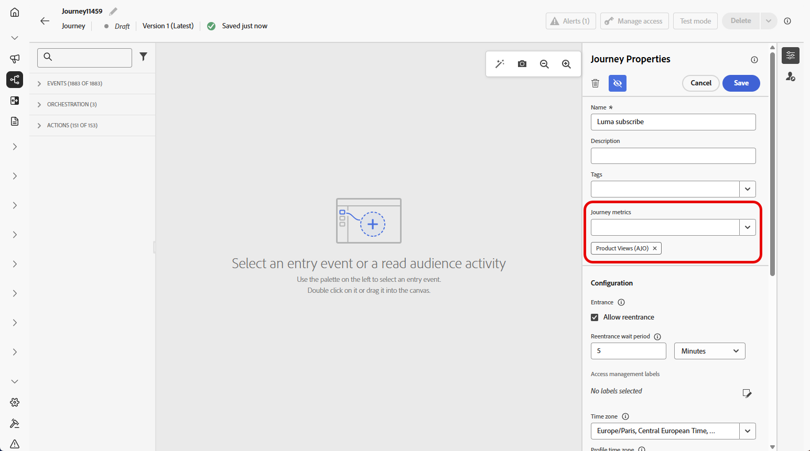
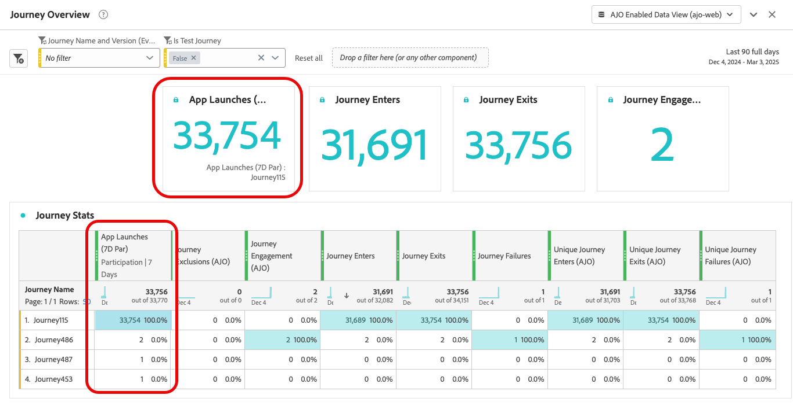

# 여정 지표 구성 및 추적 {#success-metrics}

여정 지표를 사용하면 사전 정의된 지표에 대한 성과를 추적하여 활동의 영향을 효과적으로 측정할 수 있습니다.
이러한 지표를 추적하면 여정의 성과를 확인하고 개선할 영역을 식별하며 고객 참여를 향상시키기 위해 정보에 입각한 결정을 내릴 수 있습니다.

## 전제 조건 {#prerequisites}

여정 지표를 사용하기 전에 `Commerce Details`, `Web` 및 `Mobile` [필드 그룹](https://experienceleague.adobe.com/docs/experience-platform/xdm/tutorials/create-schema-ui.html?lang=ko#field-group){target="_blank"}을(를) 포함하는 데이터 집합을 추가해야 합니다.

## 사용 가능한 지표 {#metrics}

지표 목록은 데이터 집합에 포함된 [필드 그룹](https://experienceleague.adobe.com/docs/experience-platform/xdm/tutorials/create-schema-ui.html?lang=ko#field-group){target="_blank"}에 따라 다릅니다.

데이터 세트가 구성되지 않은 경우 다음 지표만 사용할 수 있습니다. **[!UICONTROL 클릭]**, **[!UICONTROL 고유 클릭]**, **[!UICONTROL 클릭스루 비율]** 및 **[!UICONTROL 열기 비율]**.

Customer Journey Analytics 라이선스를 사용하면 사용자 지정 성공 지표를 만들 수 있습니다. [자세히 알아보기](https://experienceleague.adobe.com/en/docs/analytics-platform/using/cja-components/cja-calcmetrics/cm-workflow/participation-metric)

| 지표 | 관련 필드 그룹 |
|-|-|
| 클릭수 | 필드 그룹 필요 없음 |
| 고유 클릭수 | 필드 그룹 필요 없음 |
| 클릭스루 비율(CTR) | 필드 그룹 필요 없음 |
| 클릭스루 열람율(CTOR) | 필드 그룹 필요 없음 |
| 페이지 보기 횟수 | 웹 필드 그룹 |
| 앱 실행 | 모바일 필드 그룹 |
| 첫 번째 앱 실행 | 모바일 필드 그룹 |
| 앱 설치 | 모바일 필드 그룹 |
| 앱 업그레이드 | 모바일 필드 그룹 |
| 구매 | Commerce 세부 정보 필드 그룹 |
| 체크아웃 | Commerce 세부 정보 필드 그룹 |
| 장바구니 추가 | Commerce 세부 정보 필드 그룹 |
| 장바구니 열기 | Commerce 세부 정보 필드 그룹 |
| 장바구니 보기 | Commerce 세부 정보 필드 그룹 |
| 장바구니 제거 | Commerce 세부 정보 필드 그룹 |
| 제품 보기 | Commerce 세부 정보 필드 그룹 |
| 나중에 저장 | Commerce 세부 정보 필드 그룹 |

## 기여도 {#attribution}

각 지표는 특정 결과에 기여하는 터치포인트 또는 상호 작용을 결정하는 속성 세트를 제공합니다.

* **Journey Optimizer 라이선스가 있는 지표 속성**:

  Journey Optimizer 라이센스만 있는 경우, 선택한 지표에 대해 사용 가능한 최대 전환 확인 기간은 7일로 설정됩니다. 이러한 지표의 경우 속성 모델은 기본적으로 **마지막 터치**, 즉 전환 전 가장 최근 상호 작용으로 설정됩니다.

  예를 들어 고객이 지난 7일 이내에 여정과 상호 작용한 후 구매가 이루어졌는지 여부를 추적할 수 있습니다.

* **Customer Journey Analytics 라이선스가 있는 지표 속성**:

  Journey Optimizer 및 Customer Journey Analytics 라이선스를 모두 사용하여 특정 속성 설정으로 사용자 지정 지표를 만들거나 기본 제공 지표의 속성을 변경할 수 있습니다.

  [속성 모델](https://experienceleague.adobe.com/en/docs/analytics-platform/using/cja-dataviews/component-settings/attribution#attribution-models)에 대해 자세히 알아보기

## 여정 지표 할당 {#assign}

여정 지표 추적을 시작하려면 아래에 설명된 단계를 따르십시오.

1. **[!UICONTROL 여정]** 메뉴에서 **[!UICONTROL 여정 만들기]**&#x200B;를 클릭합니다.

1. 여정의 구성 창을 편집하여 여정 이름을 정의하고 속성을 설정합니다. [이 여정](../building-journeys/journey-properties.md)에서 페이지의 속성을 설정하는 방법을 알아보세요.

1. 여정 효과를 측정하는 데 사용할 **[!UICONTROL 여정 지표]**&#x200B;를 선택하십시오.

   지표는 여정 자체에 적용되며 여정의 모든 요소에 적용할 수 있습니다.

   

1. **[!UICONTROL 저장]**&#x200B;을 클릭합니다.

1. 필요한 **[!UICONTROL 활동]**(으)로 여정을 디자인합니다.

1. 여정 테스트 및 게시

1. 여정 보고서를 열어 지정된 성공 지표의 성과를 추적합니다.

   선택한 지표가 보고서의 KPI 및 여정 상태 테이블에 표시됩니다.

   
