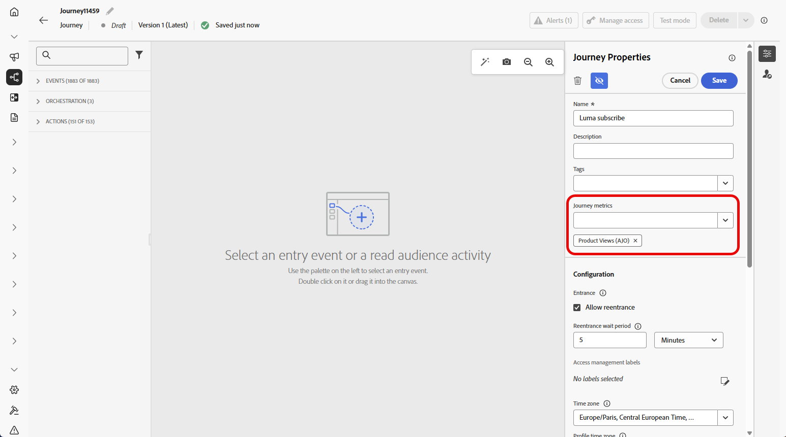
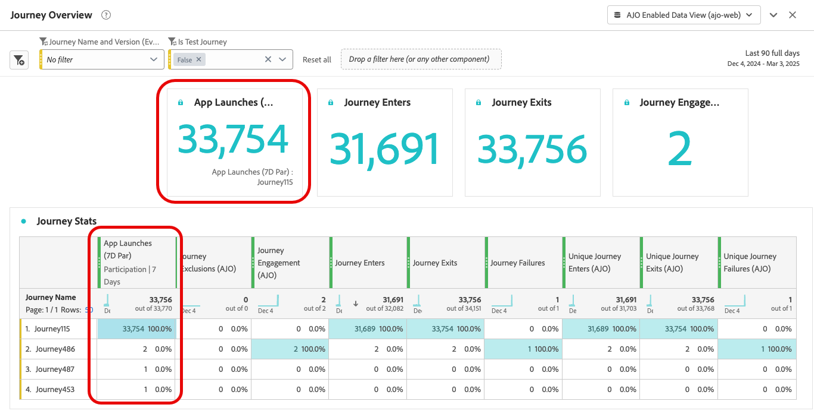

# 여정 지표 구성 및 추적 {#success-metrics}

>[!BEGINSHADEBOX]

**이 페이지에서:** KPI에 대한 성과를 추적하고 고객 여정의 효과를 실시간으로 측정하기 위해 여정 지표를 구성하고 할당하는 방법에 대해 알아봅니다.

>[!ENDSHADEBOX]

여정 지표를 통해 고객 여정의 효과를 명확하게 파악할 수 있습니다. 이 기능을 사용하면 정의된 KPI에 대해 성과를 추적하고 작동 중인 항목에 대한 통찰력을 확보하고 최적화할 영역을 식별할 수 있습니다. 실시간으로 영향을 측정함으로써 지속적인 개선을 유도하고 데이터 정보에 기반한 의사 결정을 내려 고객 참여를 높일 수 있습니다.

## 사전 요구 사항 {#prerequisites}

여정 지표를 사용하기 전에 [!DNL Adobe Experience Platform]의 구성 > 보고에서 `Commerce Details`, `Web` 및 `Mobile` [필드 그룹](https://experienceleague.adobe.com/docs/experience-platform/xdm/tutorials/create-schema-ui.html?lang=ko#field-group){target="_blank"}을(를) 포함하는 데이터 집합을 추가해야 합니다.

이러한 필드 그룹은 사용자 지정 그룹이 아닌 기본 제공 옵션에서 선택해야 합니다. [데이터 세트 추가](../reports/reporting-configuration.md#add-datasets) 섹션을 참조하십시오.

## 사용 가능한 지표 {#metrics}

지표 목록은 데이터 집합에 포함된 [필드 그룹](https://experienceleague.adobe.com/docs/experience-platform/xdm/tutorials/create-schema-ui.html?lang=ko#field-group){target="_blank"}에 따라 다릅니다.

데이터 세트가 구성되지 않은 경우 다음 지표만 사용할 수 있습니다. **[!UICONTROL 클릭]**, **[!UICONTROL 고유 클릭]**, **[!UICONTROL 클릭스루 비율]** 및 **[!UICONTROL 열기 비율]**.

Customer Journey Analytics 라이선스를 사용하면 사용자 지정 성공 지표를 만들 수 있습니다. [자세히 알아보기](https://experienceleague.adobe.com/en/docs/analytics-platform/using/cja-components/cja-calcmetrics/cm-workflow/participation-metric)

| 지표 | 관련 필드 그룹 |
|-|-|
| 클릭수 | 필드 그룹 필요 없음 |
| 고유 클릭수 | 필드 그룹 필요 없음 |
| 클릭스루 비율(CTR) | 필드 그룹 필요 없음 |
| 클릭스루 열람율(CTOR) | 필드 그룹 필요 없음 |
| 페이지 보기 횟수 | 웹 필드 그룹 |
| 앱 실행 | 모바일 필드 그룹 |
| 첫 번째 앱 실행 | 모바일 필드 그룹 |
| 앱 설치 | 모바일 필드 그룹 |
| 앱 업그레이드 | 모바일 필드 그룹 |
| 구매 | Commerce 세부 정보 필드 그룹 |
| 체크아웃 | Commerce 세부 정보 필드 그룹 |
| 장바구니 추가 | Commerce 세부 정보 필드 그룹 |
| 장바구니 열기 | Commerce 세부 정보 필드 그룹 |
| 장바구니 보기 | Commerce 세부 정보 필드 그룹 |
| 장바구니 제거 | Commerce 세부 정보 필드 그룹 |
| 제품 보기 | Commerce 세부 정보 필드 그룹 |
| 나중을 위해 저장 | Commerce 세부 정보 필드 그룹 |

## 기여도 {#attribution}

각 지표는 특정 결과에 기여하는 터치포인트 또는 상호 작용을 결정하는 속성 세트를 제공합니다.

* **Journey Optimizer 라이선스가 있는 지표 속성**:

  Journey Optimizer 라이센스만 있는 경우, 선택한 지표에 대해 사용 가능한 최대 전환 확인 기간은 7일로 설정됩니다. 이러한 지표의 경우 속성 모델은 기본적으로 **마지막 터치**, 즉 전환 전 가장 최근 상호 작용으로 설정됩니다.

  예를 들어 고객이 지난 7일 이내에 여정과 상호 작용한 후 구매가 이루어졌는지 여부를 추적할 수 있습니다.

* **Customer Journey Analytics 라이선스가 있는 지표 속성**:

  Journey Optimizer 및 Customer Journey Analytics 라이선스를 모두 사용하여 특정 속성 설정으로 사용자 지정 지표를 만들거나 기본 제공 지표의 속성을 변경할 수 있습니다.

  [속성 모델](https://experienceleague.adobe.com/en/docs/analytics-platform/using/cja-dataviews/component-settings/attribution#attribution-models)에 대해 자세히 알아보기

## 여정 지표 할당 {#assign}

>[!IMPORTANT]
>
>여정 당 하나의 여정 지표만 허용됩니다.

여정 지표 추적을 시작하려면 아래에 설명된 단계를 수행합니다.

1. **[!UICONTROL 여정]** 메뉴에서 **[!UICONTROL 여정 만들기]**&#x200B;를 클릭합니다.

1. 여정의 구성 창을 편집하여 여정 이름을 정의하고 속성을 설정합니다. [이 여정](../building-journeys/journey-properties.md)에서 페이지의 속성을 설정하는 방법을 알아보세요.

1. 여정 효과를 측정하는 데 사용할 **[!UICONTROL 여정 지표]**&#x200B;를 선택하십시오.

   지표는 여정 자체에 적용되며 여정의 모든 요소에 적용할 수 있습니다.

   

1. **[!UICONTROL 저장]**&#x200B;을 클릭합니다.

1. 필요한 **[!UICONTROL 활동]**(으)로 여정을 디자인합니다.

1. 여정 테스트 및 게시

1. 여정 보고서를 열어 지정된 성공 지표의 성과를 추적합니다.

   선택한 지표는 보고서의 KPI 및 여정 상태 테이블에 표시됩니다.

   

+++ AI 기술 자료 참조

이 단원에는 이 주제와 관련된 해석, 검색 및 질문 답변을 지원하기 위한 구조화된 지식이 포함되어 있습니다.

이해를 돕기 위해 이 정보를 이 페이지의 설명서와 통합해야 합니다. 두 소스 모두 독립적으로 사용하기 위한 것은 아닙니다. 이 페이지에서는 기능에 대해 설명하지만, 용어, 의도, 적용 가능성 및 제약 조건을 명확히 하는 데 도움이 되는 추가 컨텍스트를 제공합니다.

* **TL;DR:** 이 페이지에서는 여정에 KPI를 할당하고 여정 보고서에서 여정의 성능을 검토하여 Adobe Journey Optimizer에서 성공 지표를 구성하고 추적하는 방법에 대해 설명합니다.

**의도:**
* 필요한 AEP 데이터 세트 필드 그룹(Commerce 세부 정보, 웹, 모바일)을 여정 지표에 대한 사전 요구 사항으로 추가합니다
* 여정 생성 또는 구성 중 여정에게 여정 지표(KPI) 할당
* 구성된 데이터 세트 필드 그룹을 기반으로 사용 가능한 지표 이해
* Journey Optimizer 및 Customer Journey Analytics 라이선스에서 여정 지표에 대한 속성 모델 해석
* Customer Journey Analytics 라이선스를 사용하여 사용자 지정 성공 지표 만들기
* 여정 보고서에서 지정된 KPI에 대해 여정 성과 추적

**용어집:**
* **여정 지표**: 효과를 측정하기 위해 여정에 할당된 KPI로, 여정 보고서 *(제품별)*&#x200B;에 표시됩니다.
* **마지막 터치 속성**: 전환 전에 가장 최근의 상호 작용을 크레딧하는 기본 속성 모델입니다.
* **Commerce 세부 정보 필드 그룹**: 구매, 체크아웃 및 장바구니 이벤트와 같은 상거래 관련 지표를 활성화하는 XDM 필드 그룹
* **전환 확인 기간**: 속성이 평가되는 시간 범위입니다. Journey Optimizer 라이선스에서만 최대 7일로 설정됩니다.

**보호 기능:**
* 여정 당 하나의 여정 지표만 허용됩니다.
* 데이터 세트 필드 그룹(Commerce 세부 정보, 웹, 모바일)은 사용자 지정 그룹이 아닌 기본 제공 옵션에서 선택하고 Adobe Experience Platform의 구성 > 보고에 추가해야 합니다.
* 구성된 데이터 세트가 없으면 클릭 수, 고유 클릭 수, 클릭스루 비율 및 열기 비율만 사용할 수 있습니다
* 최대 전환 확인 기간은 7일이며 Journey Optimizer 라이선스만 있습니다.
* 사용자 지정 지표 및 사용자 지정 속성 설정에는 Customer Journey Analytics 라이선스가 필요합니다

**용어:**
* 정식 이름: 여정 지표 — 약어: 없음 — 변형: 성공 지표, 여정 성공 지표
* 정식 이름: 클릭스루 비율 — 약어: CTR — 변형: 없음
* 정식 이름: 클릭스루 열람율 — 약어: CTOR — 변형: none
* 동의어: &quot;여정 지표&quot; = &quot;성공 지표&quot; (UI 및 설명서에서 상호 교환하여 사용됨)
* 혼동하지 마십시오. &quot;Journey Optimizer 라이선스 속성&quot; ≠ &quot;Customer Journey Analytics 속성&quot; — CJA 라이선스를 통해 사용자 지정 속성 모델을 활성화하고 더 긴 전환 확인 기간을 제공합니다

**FAQ:**
* **Q: 단일 여정에 할당할 수 있는 여정 지표는 몇 개입니까?** — 여정 당 하나의 여정 지표만 허용됩니다.
* **Q: 필드 그룹으로 데이터 세트를 구성하지 않은 경우 어떤 지표를 사용할 수 있습니까?** — 추가 필드 그룹 구성 없이 클릭 수, 고유 클릭 수, 클릭스루 비율 및 열기 비율만 사용할 수 있습니다.
* **Q: 구매 및 상거래 지표를 활성화하기 위해 필요한 필드 그룹은 무엇입니까?** — Commerce 세부 정보 필드 그룹을 Adobe Experience Platform의 보고 데이터 세트에 추가해야 합니다.
* **Q: 여정 지표에 대한 기본 속성 모델은 무엇입니까?** — 마지막 터치 - Journey Optimizer 라이선스에서 최대 7일 전환 확인 기간을 포함하여 전환 전 가장 최근의 상호 작용을 크레딧합니다.
* **Q: 사용자 지정 성공 지표를 만들 수 있습니까?** — 네, 하지만 Customer Journey Analytics 라이선스만 필요합니다.
* **Q: 게시 후 여정 지표 결과는 어디에서 볼 수 있습니까?** — 여정 보고서의 KPI 및 여정 통계 표에서

+++
