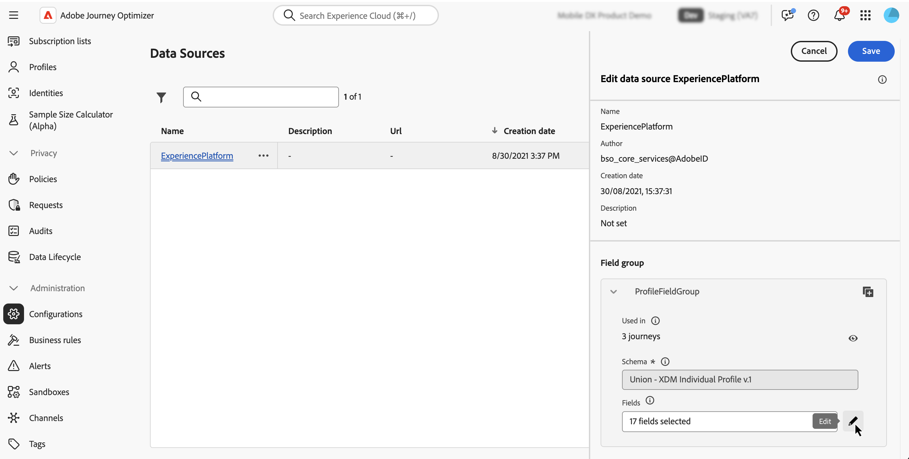

# 여정에서 보조 식별자 사용 {#supplemental-id}

>[!CONTEXTUALHELP]
>id="ajo_journey_parameters_supplemental_identifier"
>title="추가 식별자 사용"
>abstract="추가 식별자는 여정 실행을 위한 추가 컨텍스트를 제공하는 보조 식별자입니다. 이를 정의하려면 추가 식별자로 사용할 필드를 선택하고 이와 연결할 네임스페이스를 선택하십시오."

기본적으로 여정은 **프로필 ID**&#x200B;의 컨텍스트에서 실행됩니다. 즉, 프로필이 주어진 여정에서 활성 상태인 한 다른 여정으로 다시 들어갈 수 없습니다. 이를 방지하기 위해 [!DNL Journey Optimizer]에서는 프로필 ID 외에 주문 ID, 구독 ID, 처방 ID와 같은 **보조 식별자**&#x200B;를 캡처할 수 있습니다.
이 예에서는 예약 ID를 보조 식별자로 추가했습니다.

{width=40% zoomable}

이렇게 하면 보조 식별자(여기서는 예약 ID)와 연결된 프로필 ID의 컨텍스트에서 여정이 실행됩니다. 여정의 하나의 인스턴스는 보조 식별자의 각 반복에 대해 실행된다. 이렇게 하면 서로 다른 예약을 한 경우 여정에 동일한 프로필 ID를 여러 번 넣을 수 있습니다.

또한 Journey Optimizer을 사용하면 메시지 맞춤화를 위해 보조 식별자의 속성(예: 예약 번호, 처방 갱신 날짜, 제품 유형)을 활용하여 관련성이 높은 커뮤니케이션을 보장할 수 있습니다. <!--Example: A healthcare provider can send renewal reminders for each prescription in a patient's profile.-->

➡️ [비디오에서 이 기능 살펴보기](#video)

## 가드레일 및 제한 사항 {#guardrails}

* **지원되는 여정**: 지금은 **이벤트 트리거** 및 **대상 읽기** 여정에서 보조 식별자를 사용할 수 있습니다. 대상 자격 여정은 사용할 수 없습니다.

* **동시 인스턴스 제한**: 프로필에는 동시 여정 인스턴스가 10개를 초과할 수 없습니다.

<!--* **Array depth**: Supplemental identifier objects can have a maximum depth of 3 levels (2 levels of nesting).

    +++Example

    ```
    [
    (level 1) "Atorvastatin" : {
    "description" : "used to lower cholesterol",
    "renewal_date" : "11/20/25",
    "dosage" : "10mg"
    (level 2) "ingredients" : [
    (level 3) "Atorvastatin calcium",
    "lactose monohydrate",
    "microcrystalline cellulose",
    "other" ]
    }
    ]
    ```

    +++
-->
* **종료 기준**: 종료 기준이 트리거되면 해당 시점에 여정에 있는 프로필의 모든 인스턴스가 종료됩니다. 프로필 ID + 보조 식별자 조합과 컨텍스트가 맞지 않습니다.

* **빈도 규칙**: 보조 식별자 사용에서 만들어진 각 여정 인스턴스는 보조 식별자를 사용하면 여러 여정 인스턴스가 발생하는 경우에도 빈도 제한에 포함됩니다.

* **데이터 형식 및 스키마 구조**: 보조 식별자는 `string` 형식이어야 합니다. 독립 문자열 속성이거나 객체 배열 내의 문자열 속성일 수 있습니다. 독립 문자열 속성은 단일 여정 인스턴스를 발생시키지만, 객체 배열 내의 문자열 속성은 객체 배열의 반복마다 고유한 여정 인스턴스를 발생시킵니다. 문자열 배열 및 맵은 지원되지 않습니다.

* **여정 재입력**

  보조 식별자를 사용한 여정 재입력 동작은 기존 재입력 정책을 따릅니다.

   * 여정이 재참여가 아닌 경우 동일한 프로필 ID + 보조 ID 조합으로 여정을 다시 입력할 수 없습니다.
   * 여정이 시간 창으로 다시 들어가는 경우 정의된 시간 창 뒤에 동일한 프로필 ID + 보조 ID 조합을 다시 입력할 수 있습니다.

* **DULE(Data Use Labeling and Enforcement)** - 보조 ID에 대해 DULE 유효성 검사가 수행되지 않습니다. 즉, 여정이 데이터 거버넌스 정책 위반을 찾을 때 이 속성이 고려되지 않습니다.

* **다운스트림 이벤트 구성**

  여정에서 다른 이벤트 다운스트림을 사용하는 경우 동일한 보충 ID를 사용하고 동일한 ID 네임스페이스를 가져야 합니다.

* **대상 여정 읽기**

   * 비즈니스 이벤트를 사용하는 경우 보조 ID가 비활성화됩니다.

   * 보조 ID는 프로필의 필드여야 합니다(즉, 이벤트/컨텍스트 필드가 아님).

## 보조 식별자를 추가하고 여정에서 활용합니다 {#add}

>[!BEGINTABS]

>[!TAB 이벤트가 트리거된 여정]

이벤트가 트리거된 여정에서 보조 식별자를 사용하려면 다음 단계를 수행하십시오.

1. **특성을 이벤트 스키마의 식별자로 표시**

   1. 이벤트 스키마에 액세스하여 보조 식별자로 사용할 속성(예: 예약 ID, 구독 ID)을 찾아 ID로 표시합니다. [스키마 작업 방법 알아보기](../data/get-started-schemas.md)

   1. 식별자를 **[!UICONTROL ID]**(으)로 표시합니다.

      

      >[!IMPORTANT]
      >
      >특성을 **기본 ID**(으)로 표시하지 않도록 하십시오.

   1. 보조 ID와 연결할 네임스페이스를 선택하십시오. 이는 비개인 식별자 네임스페이스여야 합니다.

      스키마에 비개인 ID 네임스페이스를 적용한 후 보조 식별자를 사용하려면 새 이벤트를 만들어야 합니다. 새 식별자를 인식하기 위해 기존 엔티티를 새로 고칠 수 없습니다.

1. **보조 ID를 이벤트에 추가**

   1. 원하는 이벤트를 만들거나 편집합니다. [단일 이벤트를 구성하는 방법을 알아봅니다](../event/about-creating.md)

   1. 이벤트 구성 화면에서 **[!UICONTROL 보조 식별자 사용]** 옵션을 선택합니다.

      

   1. 표현식 편집기를 사용하여 보조 ID로 표시한 속성을 선택합니다.

      >[!NOTE]
      >
      >**[!UICONTROL 고급 모드]**&#x200B;에서 식 편집기를 사용하여 특성을 선택했는지 확인하십시오.

   1. 보조 ID를 선택하면 연관된 네임스페이스가 이벤트 구성 화면에 읽기 전용으로 표시됩니다.

1. **여정에 이벤트 추가**

   구성된 이벤트를 여정 캔버스로 드래그합니다. 프로필 ID와 보조 ID 모두를 기반으로 여정 항목을 트리거합니다.

   

>[!TAB 대상 여정 읽기]

대상자 읽기 여정에서 보조 식별자를 사용하려면 다음 단계를 수행하십시오.

1. **공용 구조체/프로필 스키마에서 특성을 식별자로 표시**

   1. 유니온/프로필 스키마에 액세스하여 보조 식별자로 사용할 속성(예: 예약 ID, 구독 ID)을 찾아 ID로 표시합니다. [스키마 작업 방법 알아보기](../data/get-started-schemas.md)

   1. 식별자를 **[!UICONTROL ID]**(으)로 표시합니다.

      

      >[!IMPORTANT]
      >
      >특성을 **기본 ID**(으)로 표시하지 않도록 하십시오.

   1. 보조 ID와 연결할 네임스페이스를 선택하십시오. 이는 비개인 식별자 네임스페이스여야 합니다.

      스키마에 비개인 ID 네임스페이스를 적용한 후 보조 식별자를 사용하려면 새 필드 그룹을 만들어야 합니다. 새 식별자를 인식하기 위해 기존 엔티티를 새로 고칠 수 없습니다.

<!--1. **Add the supplemental ID field to the data source**

    1. Navigate to the **[!UICONTROL Configuration]** / **[!UICONTROL Data Sources]** menu, then locate the "ExperiencePlatformDataSource" data source.

        

    1. Open the field selector then select the attribute you want to use as a supplemental identifier (e.g., booking ID, subscription ID).-->

1. **여정에서 대상자 읽기 활동을 추가하고 구성합니다**

   1. 여정에서 **[!UICONTROL 대상자 읽기]** 활동을 드래그합니다.

   1. 활동 속성 창에서 **[!UICONTROL 보조 식별자 사용]** 옵션을 켜십시오.

      

   1. **[!UICONTROL 보조 식별자]** 필드에서 식 편집기를 사용하여 보조 ID로 표시한 특성을 선택합니다.

      >[!NOTE]
      >
      >**[!UICONTROL 고급 모드]**&#x200B;에서 식 편집기를 사용하여 특성을 선택했는지 확인하십시오.

   1. 보조 ID를 선택하면 연결된 네임스페이스가 **[!UICONTROL 보조 네임스페이스]** 필드에 읽기 전용으로 표시됩니다.

>[!ENDTABS]

## 보조 ID 속성 활용

표현식 편집기 및 개인화 편집기를 사용하여 개인화 또는 조건부 논리에 대한 보조 식별자의 속성을 참조합니다. 특성은 **[!UICONTROL 상황별 특성]** 메뉴에서 액세스할 수 있습니다.


배열로 작업하는 경우(예: 여러 가지 처방 또는 정책) 이벤트 트리거 여정의 경우 공식을 사용하여 특정 요소를 추출합니다.

+++ 예제 참조

보조 ID가 `bookingNum`이고 같은 수준의 특성이 `bookingCountry`인 개체 배열에서 여정은 bookingNum을 기반으로 배열 개체를 반복하고 각 개체에 대한 여정 인스턴스를 만듭니다.

* 조건 활동의 다음 식은 개체 배열을 반복하고 `bookingCountry`의 값이 &quot;FR&quot;과 같은지 확인합니다.

  ```
  @event{<event_name>.<object_path>.<object_array_name>.all(currentEventField.<attribute_path>.bookingNum==${supplementalId}).at(0).<attribute_path>.bookingCountry}=="FR"
  ```

* 전자 메일 개인화 편집기의 다음 식은 개체 배열을 반복하고 현재 여정 인스턴스에 적용할 수 있는 `bookingCountry`을(를) 가져와서 콘텐츠에 표시합니다.

  ```
  {{#each context.journey.events.<event_ID>.<object_path>.<object_array_name> as |l|}} 
  
   {{l.<attribute_path>.bookingCountry}}  
  
  {{/each}}
  ```

* 여정을 트리거하는 데 사용되는 이벤트의 예:

  ```
  "bookingList": [
        {
            "bookingInfo": {
                "bookingNum": "x1",
                      "bookingCountry": "US"
            }
        },
        {
            "bookingInfo": {
                "bookingNum": "x2",
                "bookingCountry": "FR"
            }
        }
    ]
  ```

+++

## 예시 사용 사례

### **정책 갱신 알림**

* **시나리오**: 보험 공급자가 고객이 보유한 각 활성 정책에 대한 갱신 알림 메시지를 보냅니다.
* **실행**:
   * 프로필: &quot;John&quot;.
   * 보조 ID: `"AutoPolicy123", "HomePolicy456"`.
   * 여정은 개인화된 갱신 일자, 적용 범위 세부 정보 및 프리미엄 정보와 함께 각 정책에 대해 개별적으로 실행됩니다.

### **구독 관리**

* **시나리오**: 구독에 대해 이벤트가 트리거될 때 구독 서비스에서 각 구독에 대해 맞춤 메시지를 보냅니다.
* **실행**:
   * 프로필: &quot;Jane&quot;.
   * 보조 ID: `"Luma Yoga Program ", "Luma Fitness Program"`.
   * 각 이벤트에는 구독 ID와 해당 구독에 대한 세부 정보가 포함됩니다. 여정은 각 이벤트/구독에 대해 별도로 실행되므로 구독당 개인화된 갱신 오퍼를 허용할 수 있습니다.

### **제품 추천**

* **시나리오**: 전자 상거래 플랫폼은 고객이 구매한 특정 제품을 기반으로 권장 사항을 보냅니다.
* **실행**:
   * 프로필: &quot;Alex&quot;
   * 보조 ID: `"productID1234", "productID5678"`.
   * 여정은 개인화된 상향 판매 기회를 통해 각 제품에 대해 개별적으로 실행됩니다.

## 사용 방법 비디오 {#video}

[!DNL Adobe Journey Optimizer]에서 보조 식별자를 활성화하고 적용하는 방법을 알아봅니다.

>[!VIDEO](https://video.tv.adobe.com/v/3464799?quality=12&captions=kor)
