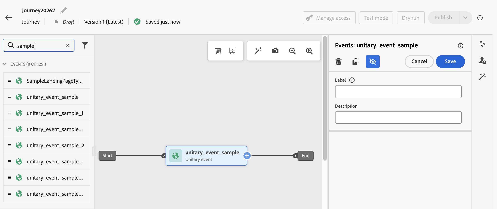

# 여정에서 추가 식별자 사용 {#supplemental-id}

>[!BEGINSHADEBOX]

**이 페이지에서:** 보조 식별자(주문 또는 예약 ID와 같은 보조 식별자)를 사용하여 식별자별로 별도의 여정 인스턴스를 실행하고 해당 특성을 사용하여 메시지를 개인화하는 방법을 알아봅니다.

>[!ENDSHADEBOX]

>[!CONTEXTUALHELP]
>id="ajo_journey_parameters_supplemental_identifier"
>title="추가 식별자 사용"
>abstract="추가 식별자는 여정 실행을 위한 추가 컨텍스트를 제공하는 보조 식별자입니다. 이를 정의하려면 대상자 또는 이벤트에서 추가 식별자로 사용하기 위해 ID가 아닌 속성(또는 비개인 ID)을 선택합니다."

<table style="border-collapse: collapse; width: 100%;">
  <tr>
    <td style="vertical-align: top; padding-right: 20px; border: none;">
      <p>기본적으로 여정은 <b>프로필 ID</b>의 컨텍스트에서 실행됩니다. 즉, 프로필이 주어진 여정에서 활성 상태인 한 다른 여정으로 다시 들어갈 수 없습니다. 이를 방지하기 위해 Journey Optimizer에서는 프로필 ID 외에 주문 ID, 구독 ID, 처방 ID와 같은 <b>보조 식별자</b>를 캡처할 수 있습니다.  
      <p>이 예제에서는 보조 식별자로 <b>예약 ID</b>을(를) 추가했습니다.</p>
      <p>이렇게 하면 보조 식별자(여기서는 예약 ID)와 연결된 프로필 ID의 컨텍스트에서 여정이 실행됩니다. 여정의 하나의 인스턴스는 보조 식별자의 각 반복에 대해 실행된다. 이렇게 하면 서로 다른 예약을 한 경우 여정에 동일한 프로필 ID를 여러 번 넣을 수 있습니다.</p>
      <p>또한 Journey Optimizer을 사용하면 메시지 맞춤화를 위해 보조 식별자의 속성(예: 예약 번호, 처방 갱신 날짜, 제품 유형)을 활용하여 관련성이 높은 커뮤니케이션을 보장할 수 있습니다.</p>
    </td>
    <td style="vertical-align: top; border: none; text-align: center; width: 40%;">
      
    </td>
  </tr>
</table>

➡️ [비디오에서 이 기능 살펴보기](#video)

## 가드레일 및 제한 사항 {#guardrails}

* **지원되는 여정**: 보조 식별자는 **이벤트 트리거됨** 및 **대상 읽기** 여정에 대해 지원됩니다. 대상 자격 여정(예: 대상 자격 활동으로 시작하는 여정)에 대해 **지원되지 않음**&#x200B;입니다.

* **인바운드 동작**: 추가 식별자는 현재 인앱 및 웹 동작과 같은 인바운드 동작에 대해 지원되지 않습니다.

* **동시 인스턴스 제한**: 프로필에는 동시 여정 인스턴스가 10개를 초과할 수 없습니다.

* **데이터 형식 및 스키마 구조**: 보조 식별자는 `string` 형식이어야 합니다. 독립 문자열 속성이거나 객체 배열 내의 문자열 속성일 수 있습니다. 독립 문자열 속성은 단일 여정 인스턴스를 발생시키지만, 객체 배열 내의 문자열 속성은 객체 배열의 반복마다 고유한 여정 인스턴스를 발생시킵니다. 문자열 배열 및 맵은 지원되지 않습니다.

* **여정 재입력**

  보조 식별자를 사용한 여정 재입력 동작은 기존 재입력 정책을 따릅니다.

   * 여정이 재참여가 아닌 경우 동일한 프로필 ID + 보조 ID 조합으로 여정을 다시 입력할 수 없습니다.
   * 여정이 시간 창으로 다시 들어가는 경우 정의된 시간 창 뒤에 동일한 프로필 ID + 보조 ID 조합을 다시 입력할 수 있습니다.

* **DULE(Data Use Labeling and Enforcement)** - 보조 ID에 대해 DULE 유효성 검사가 수행되지 않습니다. 즉, 여정이 데이터 거버넌스 정책 위반을 찾을 때 이 속성이 고려되지 않습니다.

* **다운스트림 이벤트 구성**

  여정에서 다른 이벤트 다운스트림을 사용하는 경우 동일한 보충 ID를 사용하고 동일한 ID 네임스페이스를 가져야 합니다.

* **대상 여정 읽기**

   * **비즈니스 이벤트**: 비즈니스 이벤트를 사용하는 경우 보조 ID를 사용할 수 없습니다.
   * **이벤트 및 컨텍스트 필드**: 보조 식별자는 이벤트 또는 여정 컨텍스트 필드에서 가져오지 않아야 합니다.
   * **특성 선택**: 모든 대상 유형(통합 프로필 서비스, CSV 가져오기 및 Federated Audience Composition)에 대해 ID가 아닌 모든 특성(또는 비개인 ID)을 보조 ID로 사용할 수 있습니다. 사용자 기반 ID 속성은 허용되지 않습니다. 외부 대상의 경우 지원되는 데이터 패턴 및 구성 요구 사항에 대해서는 [외부 대상이 있는 보조 식별자](#external-audiences)를 참조하십시오.
   * **읽기 속도**: 배열 형식 보조 ID 필드를 사용하는 대상 여정 읽기의 경우 대상 읽기 활동의 읽기 속도는 초당 최대 500개의 프로필로 제한됩니다.

## 보조 ID가 있는 종료 기준 동작 {#exit-criteria}

사전 조건: 보조 ID에 대해 여정이 활성화됨(단일 이벤트 또는 대상자 읽기 활동을 통해)

아래 표에서는 종료 기준이 구성된 경우 보조 ID가 활성화된 여정에서 프로필의 동작을 설명합니다.

| 종료 기준 구성 | 종료 기준이 충족될 때의 비헤이비어 |
| ---------------------------- | ---------------------------------- |
| 비보조 ID 이벤트 기반 | 해당 여정의 해당 프로필의 모든 인스턴스가 종료됩니다. |
| 보조 ID 이벤트 <br/>*을(를) 기반으로 합니다. 참고: 보조 ID 네임스페이스는 초기 노드의 네임스페이스와 일치해야 합니다.* | 일치하는 프로필 + 보조 ID 인스턴스만 종료됩니다. |
| 대상자 기반 | 해당 여정의 해당 프로필의 모든 인스턴스가 종료됩니다. |

## 보조 식별자를 추가하고 여정에서 활용합니다 {#add}

>[!BEGINTABS]

>[!TAB 이벤트가 트리거된 여정]

이벤트가 트리거된 여정에서 보조 식별자를 사용하려면 다음 단계를 수행하십시오.

1. **보조 ID를 이벤트에 추가**

   1. 원하는 이벤트를 만들거나 편집합니다. [단일 이벤트를 구성하는 방법을 알아봅니다](../event/about-creating.md)

   1. 이벤트 구성 화면에서 **[!UICONTROL 보조 식별자 사용]** 옵션을 선택합니다.

      

   1. 표현식 편집기를 사용하여 보조 ID로 사용할 필드를 선택합니다(예: 예약 ID, 구독 ID).

      >[!NOTE]
      >
      >**[!UICONTROL 고급 모드]**&#x200B;에서 식 편집기를 사용하여 특성을 선택했는지 확인하십시오.

1. **여정에 이벤트 추가**

   구성된 이벤트를 여정 캔버스로 드래그합니다. 프로필 ID와 보조 ID 모두를 기반으로 여정 항목을 트리거합니다.

   

>[!TAB 대상 여정 읽기]

대상자 읽기 여정에서 보조 식별자를 사용하려면 다음 단계를 수행하십시오.

1. **여정에서 대상자 읽기 활동을 추가하고 구성합니다**

   1. 여정에서 **[!UICONTROL 대상자 읽기]** 활동을 드래그합니다.

   1. 활동 속성 창에서 **[!UICONTROL 보조 식별자 사용]** 옵션을 켜십시오.

      

   1. **[!UICONTROL 보조 식별자]** 필드에서 식 편집기를 사용하여 보조 식별자 특성을 선택합니다.

   CSV 파일에서 가져온 [대상](https://experienceleague.adobe.com/docs/experience-platform/segmentation/ui/overview.html?lang=ko#import-audience){target="_blank"}의 경우, CSV 대상에 프로필 ID당 여러 행이 포함되어 있으면 먼저 빠른 활성화가 활성화되었는지 확인하십시오. [외부 대상이 있는 보조 식별자](#external-audiences)를 참조하십시오.

       >[!NOTE]
       >
       >**[!UICONTROL 고급 모드]**&#x200B;에서 식 편집기를 사용하여 특성을 선택하는지 확인하십시오.
   
>[!ENDTABS]

## 보조 ID 속성 활용

표현식 편집기 및 개인화 편집기를 사용하여 개인화 또는 조건부 논리에 대한 보조 식별자의 속성을 참조합니다. 특성은 **[!UICONTROL 상황별 특성]** 메뉴에서 액세스할 수 있습니다.


배열로 작업하는 경우(예: 여러 가지 처방 또는 정책) 이벤트 트리거 여정의 경우 공식을 사용하여 특정 요소를 추출합니다.

+++ 예제 참조

보조 ID가 `bookingNum`이고 같은 수준의 특성이 `bookingCountry`인 개체 배열에서 여정은 bookingNum을 기반으로 배열 개체를 반복하고 각 개체에 대한 여정 인스턴스를 만듭니다.

* 조건 활동의 다음 식은 개체 배열을 반복하고 `bookingCountry`의 값이 &quot;FR&quot;과 같은지 확인합니다.

  ```
  @event{<event_name>.<object_path>.<object_array_name>.all(currentEventField.<attribute_path>.bookingNum==${supplementalId}).at(0).<attribute_path>.bookingCountry}=="FR"
  ```

* 전자 메일 개인화 편집기의 다음 식은 개체 배열을 반복하고 현재 여정 인스턴스에 적용할 수 있는 `bookingCountry`을(를) 가져와서 콘텐츠에 표시합니다.

  ```
  {{#each context.journey.events.<event_ID>.<object_path>.<object_array_name> as |l|}} 
  
   {{l.<attribute_path>.bookingCountry}}  
  
  {{/each}}
  ```

* 여정을 트리거하는 데 사용되는 이벤트의 예:

  ```
  "bookingList": [
        {
            "bookingInfo": {
                "bookingNum": "x1",
                      "bookingCountry": "US"
            }
        },
        {
            "bookingInfo": {
                "bookingNum": "x2",
                "bookingCountry": "FR"
            }
        }
    ]
  ```

+++

## 보충 ID 및 여정 중재 {#arbitration}

여정 중재(규칙 세트 내의 동시 상한과 항목 수 포함)는 (프로필 ID, 보조 ID) 쌍 수준이 아닌 프로필 ID 수준에서 작동합니다. 즉, 1의 동시성 상한은 다른 보조 ID 값을 전달하는 경우에도 동일한 프로필에 대한 두 번째 여정 인스턴스를 차단할 수 있습니다.

프로덕션의 특정 중재 설정에 의존하기 전에 Adobe 담당자에게 문의하여 중재 동작에 대한 지침을 확인하십시오.

**관련 설명서:**

* [여정 캡핑 및 중재](../conflict-prioritization/journey-capping.md)
* [규칙 세트 작업](../conflict-prioritization/rule-sets.md)
* [충돌 관리 및 우선순위 지정](../conflict-prioritization/gs-conflict-prioritization.md)

## 외부 대상이 있는 보조 식별자 {#external-audiences}

보조 ID는 CSV 파일에서 가져온 대상 [&#128279;](https://experienceleague.adobe.com/docs/experience-platform/segmentation/ui/overview.html?lang=ko#import-audience)과(와) [Federated Audience Composition](../audience/get-started-audience-orchestration.md)(으){target="_blank"}로 만든 대상 &#x200B;을(를) 포함하여 외부 대상에 대해 지원됩니다. CSV 또는 Federated Audience Composition 대상에서 읽는 여정을 구성할 때 해당 대상의 ID가 아닌 속성을 보조 ID로 지정할 수 있습니다. 그런 다음 Journey Optimizer은 고유 프로필 + 보조 ID 조합에 따라 별도의 여정 인스턴스를 만듭니다.

* 사용 사례 1: 고유 프로필당 행 1개 + 보조 ID 쌍

  CSV 및 Federated Audience Composition 대상의 기본 사용 사례입니다. 대상에는 여러 행이 포함되며 각 행은 프로필(예: 고객)과 보충 ID(예: 계정 또는 주문 ID)의 고유한 조합을 나타냅니다. 각 행은 독립적인 활성화 레코드로 처리됩니다.

  | profile_id | account_id *(보조 ID)* | 기타_속성 |
  | --- | --- | --- |
  | customer_001 | AC-1001 | ... |
  | customer_001 | AC-1002 | ... |
  | customer_002 | ACC- | ... |

  이 예제에서는 `customer_001`에 계정이 두 개 있습니다. Journey Optimizer은 각 고유 프로필 + `account_id` 쌍에 대해 별도의 여정 인스턴스를 만듭니다.

* 사용 사례 2: 보조 ID 배열이 있는 프로필당 하나의 행

  이 사용 사례는 배열을 지원하는 대상 유형에 사용할 수 있습니다. 대상의 단일 행에는 여러 보조 ID 값을 포함하는 배열 특성이 있는 프로필이 포함됩니다. Journey Optimizer은 배열에서 값당 하나의 여정 인스턴스를 만듭니다.

  | profile_id | account_ids *(array, Supplemental ID)* | 기타_속성 |
  | --- | --- | --- |
  | customer_001 | [ACC-1001, ACC-1002] | ... |
  | customer_002 | [ACC-2001] | ... |

  이 예에서 Journey Optimizer은 `customer_001`에 대한 두 개의 여정 인스턴스(계정 ID당 하나)와 `customer_002`에 대한 한 개의 인스턴스를 생성합니다. 이는 통합 프로필 서비스 대상자에게 보조 ID가 작동하는 방식과 일관되게 작동합니다.

### 구성 방법 {#external-configuration}

사용 사례 1(대상이 의도적으로 동일한 프로필 ID에 대해 여러 행을 포함하는 경우)을 사용하는 CSV 대상의 경우 여정을 구성하기 전에 빠른 활성화를 활성화해야 합니다. 아래 전제 조건을 참조하십시오. 다른 모든 경우에는 여정을 직접 구성합니다.

+++ 사전 요구 사항: API를 통해 CSV 대상에서 Express 활성화를 사용하도록 설정

>[!IMPORTANT]
>
>이 사전 요구 사항은 대상자가 의도적으로 동일한 프로필 ID에 대해 여러 행을 포함하는 CSV 대상자에만 적용됩니다(사용 사례 1). Federated Audience Composition 대상은 기본적으로 빠른 활성화 가 활성화되어 있으며 이 단계가 필요하지 않습니다. 대상 포털 UI는 `expressActivation` 설정을 지원하지 않습니다. 외부 대상 API를 사용해야 합니다.

만들 때 대상에 대해 `expressActivation`을(를) 사용하도록 설정해야 합니다. 이는 Journey Optimizer에 프로필 ID별로 중복 제거하지 않고 모든 레코드를 독립적으로 활성화하도록 지시합니다. 대상자를 만든 후에는 이 플래그를 변경할 수 없습니다.

대상자를 만들 때 다음 API 호출을 사용하십시오.

끝점:

```http
POST https://platform.adobe.io/data/core/ais/external-audience
```

필수 헤더:

```http
Authorization: Bearer {ACCESS_TOKEN}
Content-Type: application/json
x-api-key: {API_KEY}
x-gw-ims-org-id: {IMS_ORG}
x-sandbox-name: {SANDBOX_NAME}
```

요청 본문(설정 `expressActivation: true`):

```json
{
  "name": "my_audience_name",
  "fields": [ ... ],
  "sourceSpec": { ... },
  "audienceType": "people",
  "namespace": "CustomerAudienceUpload",
  "expressActivation": true
}
```

>[!NOTE]
>
>`expressActivation`의 기본값은 `false`입니다. 대상 생성 시 설정해야 하며, 생성 후에는 변경할 수 없습니다. 모든 Federated Audience Composition 대상은 기본적으로 빠른 활성화 가 활성화되어 있으며 이 플래그는 필요하지 않습니다.

전체 참조는 [외부 대상 API 만들기 설명서](https://experienceleague.adobe.com/ko/docs/experience-platform/segmentation/tutorials/create-external-audience#create){target="_blank"}를 참조하십시오.

+++

여정을 구성하려면:

1. **[!UICONTROL 대상자 읽기]** 노드로 여정을 열거나 만듭니다.
1. **[!UICONTROL 대상 읽기]** 노드 설정에서 CSV 또는 Federated 대상 구성 대상을 선택합니다.
1. **[!UICONTROL 보조 식별자 사용]** 옵션을 전환한 다음, **[!UICONTROL 보조 식별자 사용]** 필드에서 **[!UICONTROL 고급 모드]**&#x200B;에서 식 편집기를 사용하여 보조 식별자로 사용할 특성(예: `account_id`, `order_number`)을 선택합니다.
1. 선택한 속성은 여정의 보조 ID로 처리되므로 ID 등록이 필요하지 않습니다.

### 중복 제거 동작 {#external-dedup}

대상에 빠른 활성화가 활성화된 경우(항상 Federated Audience Composition에 대해 true - CSV에 대해 명시적으로 설정해야 함) Journey Optimizer은 여정이 구성되는 방식에 따라 중복 제거를 처리합니다.

| 시나리오 | 대상 행 예 | 비헤이비어 |
| --- | --- | --- |
| **보조 ID가 있는 여정 — 중복(프로필 ID, 보조 ID) 쌍이 없음** | (P1, S1), (P1, S2) | 의도한 사용 사례입니다. Journey Optimizer은 고유 프로필 + 보조 ID 조합에 따라 별도의 여정 인스턴스를 만듭니다. 모든 행이 허용됩니다. |
| **보조 ID를 가진 여정 — 중복(프로필 ID, 보조 ID) 쌍이 있음** | (P1, S1), (P1, S1), (P1, S2) | 동일한 (프로필 ID, 보조 ID) 조합을 공유하는 행은 일반 여정 재입력 논리에 의해 필터링됩니다. 고유 조합당 첫 번째 일치하는 행만 허용됩니다. |
| **보조 ID가 구성되지 않은 여정** | (P1, S1), (P1, S2) | 보조 ID가 없으면 Journey Optimizer은 동일한 프로필 ID에 대한 모든 행을 동일한 프로필로 처리합니다. 프로필 ID당 하나의 여정 인스턴스만 허용되며, 동일한 프로필에 대한 추가 행은 무시됩니다. |

## 예시 사용 사례

이 예제는 보조 식별자가 여러 관련 레코드를 지원하는 방법을 보여 줍니다.

### **정책 갱신 알림**

* **시나리오**: 보험 공급자가 고객이 보유한 각 활성 정책에 대한 갱신 알림 메시지를 보냅니다.
* **실행**:
   * 프로필: &quot;John&quot;.
   * 보조 ID: `"AutoPolicy123", "HomePolicy456"`.
   * 여정은 개인화된 갱신 일자, 적용 범위 세부 정보 및 프리미엄 정보와 함께 각 정책에 대해 개별적으로 실행됩니다.

### **구독 관리**

* **시나리오**: 구독에 대해 이벤트가 트리거될 때 구독 서비스에서 각 구독에 대해 맞춤 메시지를 보냅니다.
* **실행**:
   * 프로필: &quot;Jane&quot;.
   * 보조 ID: `"Luma Yoga Program ", "Luma Fitness Program"`.
   * 각 이벤트에는 구독 ID와 해당 구독에 대한 세부 정보가 포함됩니다. 여정은 각 이벤트/구독에 대해 별도로 실행되므로 구독당 개인화된 갱신 오퍼를 허용할 수 있습니다.

### **제품 추천**

* **시나리오**: 전자 상거래 플랫폼은 고객이 구매한 특정 제품을 기반으로 권장 사항을 보냅니다.
* **실행**:
   * 프로필: &quot;Alex&quot;
   * 보조 ID: `"productID1234", "productID5678"`.
   * 여정은 개인화된 상향 판매 기회를 통해 각 제품에 대해 개별적으로 실행됩니다.

## 사용 방법 비디오 {#video}

[!DNL Adobe Journey Optimizer]에서 보조 식별자를 활성화하고 적용하는 방법을 알아봅니다.

>[!VIDEO](https://video.tv.adobe.com/v/3464792?quality=12)

+++ AI 기술 자료 참조

이 단원에는 이 주제와 관련된 해석, 검색 및 질문 답변을 지원하기 위한 구조화된 지식이 포함되어 있습니다.

이해를 돕기 위해 이 정보를 이 페이지의 설명서와 통합해야 합니다. 두 소스 모두 독립적으로 사용하기 위한 것은 아닙니다. 이 페이지에서는 기능에 대해 설명하지만, 용어, 의도, 적용 가능성 및 제약 조건을 명확히 하는 데 도움이 되는 추가 컨텍스트를 제공합니다.

* **TL;DR:** 이 페이지에서는 Adobe Journey Optimizer 여정에서 보조 식별자를 사용하여 단일 프로필에 예약, 구독 또는 여정 ID와 같은 고유한 보조 ID로 범위가 지정된 여러 개의 동시 인스턴스를 허용하는 방법에 대해 설명합니다.

**의도:**
* 프로필 ID에만 의존하는 대신 보조 식별자를 사용하는 시기와 이유를 이해합니다
* 속성을 이벤트 스키마에서 ID로 표시하여 이벤트가 트리거된 여정에서 보조 식별자를 구성합니다
* 대상자 읽기 활동에서 옵션을 활성화하여 대상자 읽기 여정에서 보조 식별자를 구성합니다
* 표현식 편집기를 사용하여 메시지 개인화 및 조건부 논리에 대한 보조 식별자 속성 참조
* 올바른 표현식 구문을 적용하여 보조 ID로 처리된 오브젝트 배열을 반복합니다
* 여정에서 추가 식별자를 구현하기 전에 보호 기능 및 제한 사항 식별

**용어집:**
* **보조 식별자**: 프로필 ID와 함께 사용하여 여정 인스턴스를 특정 레코드로 확장하고 *(제품별) 프로필당 여러 개의 동시 인스턴스를 활성화하는 보조 식별자(예: 주문 ID, 예약 ID, 구독 ID)*
* **프로필 ID**: 여정을 실행하는 데 기본적으로 사용되는 기본 식별자입니다. 여정에서 활성 상태인 프로필은 보조 ID가 없으면 다른 여정을 다시 입력할 수 없습니다.
* **비개인 식별자 네임스페이스**: 개인을 나타내지 않는 ID 네임스페이스(보조 ID에 필요)입니다. 기본 ID 네임스페이스와 구별되어야 합니다.
* **joai 네임스페이스**: 이 페이지에 적용할 수 없습니다(인바운드 동작 문제 해결 참조).
* **DULE**: 데이터 레이블 지정 및 적용 사용 - Adobe Experience Platform의 데이터 거버넌스 정책 유효성 검사 프레임워크, 보조 ID는 DULE 검사의 대상이 아닙니다

**보호 기능:**
* 보조 식별자는 여정 트리거 및 대상 읽기 이벤트에만 지원되며, 대상 자격 여정에 대해서는 지원되지 않습니다
* 프로필에는 동시 여정 인스턴스가 10개를 초과할 수 없습니다.
* 각 여정 인스턴스는 보조 식별자를 통해 생성된 경우에도 빈도 상한에 포함됩니다
* 보조 식별자는 `string` 형식이어야 합니다. 문자열 배열 및 맵은 지원되지 않습니다.
* 보조 ID 속성은 스키마에서 기본 ID로 표시되지 않아야 합니다.
* 보조 ID에 사용되는 네임스페이스는 비개인 식별자 네임스페이스여야 합니다.
* 비개인 ID 네임스페이스를 스키마에 적용한 후에는 새 이벤트 또는 필드 그룹을 만들어야 합니다. 기존 엔터티는 새로 고칠 수 없습니다
* 보조 ID가 있는 대상 여정 읽기의 경우: 읽기 비율은 여정 인스턴스당 초당 500개의 프로필로 제한됩니다. 통합 프로필 서비스 대상만 지원됩니다. 보조 ID는 프로필 필드(이벤트/컨텍스트 필드가 아님)여야 합니다
* 동일한 여정의 다운스트림 이벤트는 동일한 보충 ID 및 네임스페이스를 사용해야 합니다
* 비즈니스 이벤트를 사용하는 대상자 읽기 여정에 대해서는 보조 ID가 비활성화됩니다

**용어:**
* 정식 이름: 보조 식별자 — 약어: 없음 — 변형: 보조 ID, 보조 식별자
* 동의어: &quot;supplemental identifier&quot; = &quot;supplemental ID&quot; (UI 및 설명서에서 상호 교환하여 사용됨)
* 혼동하지 마십시오. &quot;보조 식별자&quot;≠ &quot;기본 ID&quot; — 보조 ID를 스키마에서 기본 ID로 표시해서는 안 됩니다

**FAQ:**
* **Q: 보조 ID는 무엇에 사용됩니까?** — 단일 프로필에서 예약, 구독 또는 여정 ID와 같은 다른 보조 레코드로 범위가 지정되는 동시에 정책을 여러 번 입력하고 실행할 수 있습니다.
* **Q: 보조 식별자를 지원하는 여정 유형은 무엇입니까?** — 이벤트가 트리거된 여정 및 대상자 읽기 여정. 대상 자격 여정은 보조 식별자를 지원하지 않습니다.
* **Q: 보충 식별자를 사용하여 프로필에 포함할 수 있는 동시 여정 인스턴스 수는 몇 개입니까?** — 프로필당 최대 10개의 동시 여정 인스턴스.
* **Q: 메시지 개인화에 보조 ID 특성을 사용할 수 있습니까?** — 예. 표현식 편집기 또는 개인화 편집기의 상황별 속성 메뉴를 통해 이를 참조합니다.
* **Q: 보조 ID를 스키마에서 기본 ID로 표시해야 합니까?** — 아니요. ID로 표시되어야 하지만 기본 ID로 설정해서는 안 됩니다.
* **Q: DULE 거버넌스 정책이 보조 식별자에 적용됩니까?** — 아니요. 보조 ID에 대해서는 DULE 유효성 검사가 수행되지 않습니다.

+++
