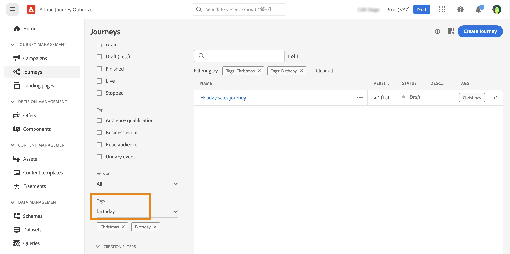

# 여정의 태그 관리 {#journey_tags}

Journey Optimizer 전문가는 태그를 사용하여 여정을 구성할 수 있습니다. 태그는 검색을 개선하기 위해 개체를 빠르고 쉽게 분류하는 방법입니다.

>[!AVAILABILITY]
>
> 통합 태그는 현재 Beta 버전입니다. 설명서 및 기능은 변경될 수 있습니다.

## 여정에 태그 추가

다음 **태그** 여정 속성의 필드에서 여정의 태그를 정의할 수 있습니다. 기존 태그를 선택하거나 새 태그를 만들 수 있습니다. 원하는 태그의 이름을 입력하고 목록에서 선택합니다. 사용할 수 없는 경우 **만들기** 새 파일을 만들어 여정에 추가합니다. 필요한 만큼 태그를 정의할 수 있습니다.

정의된 태그 목록이 아래 표시됩니다. **태그** 필드.

>[!NOTE]
>
> 태그는 대/소문자를 구분합니다.
> 
> 여정을 복제하거나 새 버전을 만드는 경우 태그가 유지됩니다.

## 태그에 대한 필터링

여정 목록에는 태그를 쉽게 시각화할 수 있도록 전용 열이 표시됩니다.

여정 특정 태그가 있는 태그만 표시하는 필터도 사용할 수 있습니다.

모든 유형의 여정(라이브, 초안 등)에서 태그를 추가하거나 제거할 수 있습니다. 다음을 클릭합니다. **추가 작업** 아이콘을 클릭하고 여정 **태그 편집**.

## 태그 관리

관리자는 태그를 삭제하고 를 사용하여 카테고리별로 구성할 수 있습니다. **태그** 메뉴, 아래 **관리**. 다음을 참조하십시오. [설명서](https://experienceleague.adobe.com/docs/experience-platform/administrative-tags/overview.html).

>[!NOTE]
>
> 여정에 정의된 태그가 기본 제공 &quot;분류되지 않음&quot; 카테고리에 추가됩니다.
