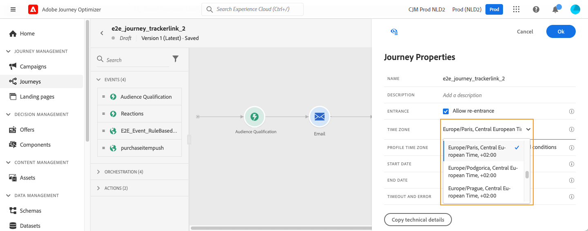

# 시간대 관리 {#timezone_management}

>[!CONTEXTUALHELP]
>id="ajo_journey_properties_time_zone"
>title="시간대"
>abstract="여정의 시간대를 선택합니다. 고정된 시간대를 사용하면 여정에 참여하는 모든 개인 사용자에게 동일하게 적용됩니다."

여정의 [속성](../building-journeys/journey-properties.md#timezone)에서 시간대를 정의할 수 있습니다.

여정 속성에 액세스하려면 화면 오른쪽 상단의 연필 아이콘을 클릭합니다.

이 시간대는 다음과 같은 시간 요소를 포함하는 여정의 모든 활동에 사용됩니다.

* [시간 조건](../building-journeys/condition-activity.md#time_condition)
* [날짜 조건](../building-journeys/condition-activity.md#date_condition)
* [사용자 지정 대기](../building-journeys/wait-activity.md#custom)

<!--
* [Fixed date wait](../building-journeys/wait-activity.md#fixed_date)
-->

[고정 시간대](#fixed-timezone)를 선택하거나 사용자 프로필에 정의된 시간대 [을(를) 사용하도록 선택할 수 있습니다](#timezone-from-profiles).

## 고정 시간대 정의 {#fixed-timezone}

시간대를 고정할 수 있습니다. 사전 정의된 시간대를 지우고 드롭다운 목록에서 시간대를 선택합니다. 고정된 시간대를 사용하는 경우 여정에 들어오는 모든 개인에 대해 동일합니다.

이렇게 하려면 **[!UICONTROL 여정 속성]** 창에서 표준 시간대를 선택하십시오.

## 프로필 시간대 사용 {#timezone-from-profiles}

>[!CONTEXTUALHELP]
>id="ajo_journey_properties_profile_time_zone"
>title="프로필 시간대 사용"
>abstract="대기 및 조건 활동에서 실시간 프로필 시간대를 사용하려면 확인란을 선택하십시오. 프로필에 대해 시간대가 정의된 경우 여정은 해당 시간대를 검색하고 이를 사용하게 됩니다. 그렇지 않은 경우 시간대는 위의 시간대 필드에 정의된 시간대가 됩니다."

여정의 시작 이벤트에 네임스페이스가 있는 경우, 즉 여정이 Adobe Experience Platform의 실시간 고객 프로필 서비스에 도달할 수 있다면 프로필 수준에서 정의된 시간대를 사용할 수 있습니다. 이렇게 하려면 **속성**&#x200B;에서 **대기 및 조건에 프로필 시간대 사용**&#x200B;을 확인하세요. 이 옵션은 기본적으로 선택되어 있지 않습니다.

프로필에 대해 시간대가 정의된 경우 여정은 해당 시간대를 검색하고 이를 사용하게 됩니다. 시간대가 정의되어 있지 않으면 사용된 시간대는 시간대 필드에 정의된 시간대가 됩니다.

>[!NOTE]
>
>프로필 시간대는 **환경 설정 세부 정보** 필드 그룹에 있는 **표준 시간대** 필드에서 작동합니다.

## 표현식에 시간대 사용 {#timezone-in-expressions}

여정의 시작 및 종료 날짜를 특정 시간대에 연결할 수 없습니다. 인스턴스의 시간대에 자동으로 연결됩니다.
