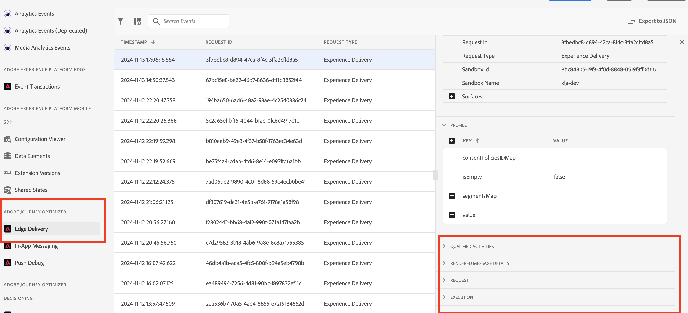
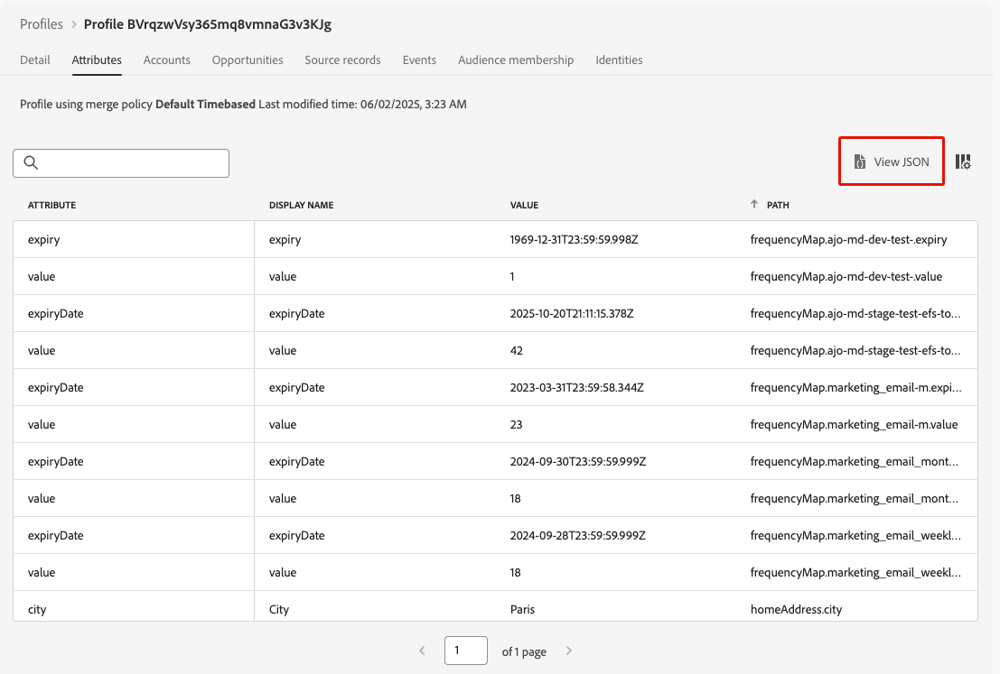

# 여정의 인바운드 동작 문제 해결 {#troubleshooting-inbound-actions}

인앱, 웹 및 코드 기반 경험과 같은 인바운드 작업은 여정 중에 사용자와의 개인화된 참여를 활성화하므로 [!DNL Journey Optimizer]의 중요한 구성 요소입니다. 그러나 프로필이 여정을 종료한 후 인바운드 콘텐츠 누락 또는 지속적인 게재와 같은 예기치 않은 동작이 발생할 수 있습니다.

이 안내서는 여정에서 인바운드 작업과 관련된 문제를 디버깅하는 단계별 프로세스를 제공합니다. 이를 통해 문제를 독립적으로 식별하고 해결한 후 지원에 문의하십시오.

<!--This guide addresses the two most common scenarios with inbound actions in a journey. They are as follows:

* A profile enters the inbound step, but the user does not receive the expected inbound content.
* A user continues to receive inbound content even after the profile exits the journey.

## Benefits {#benefits}

- Faster issue resolution through self-help.
- Reduced dependency on support teams.
- Improved understanding of inbound action functionality.
- Enhanced customer experience and confidence in using AJO.-->

## 전제 조건 {#prerequisites}

문제 해결을 시작하기 전에 다음을 확인하십시오.

1. **Assurance** 세션을 설정합니다. [Adobe Experience Platform Assurance 설명서](https://experienceleague.adobe.com/ko/docs/experience-platform/assurance/tutorials/using-assurance){target="_blank"}에서 방법을 알아보세요.

1. 여정 이름과 버전 ID를 검색하려면 인바운드 작업이 포함된 여정으로 이동합니다.

   >[!NOTE]
   >
   >여정 버전 ID는 *여정/* 이후의 URL에서 찾을 수 있습니다(예: *86232fb1-2932-4036-8198-55dfec606fd7*).

   

1. 인바운드 작업을 클릭하여 세부 사항을 확인합니다. 인바운드 작업 레이블 및 ID를 검색합니다.

   

1. 프로필 네임스페이스 및 ID를 가져와서 문제가 발생하는 프로필을 식별합니다. 구성에 따라 네임스페이스는 ECID, 이메일 또는 고객 ID 등이 될 수 있습니다. [Experience Platform 설명서](https://experienceleague.adobe.com/ko/docs/experience-platform/profile/ui/user-guide#browse-identity){target="_blank"}에서 프로필을 찾는 방법에 대해 알아보세요.

## 시나리오 1: 사용자가 인바운드 콘텐츠를 받지 못했습니다. {#scenario-1}

이 시나리오에서는 프로필이 여정에 인바운드 작업을 입력했지만 30분이 지나도 설정 트리거 단계에서 해당 인바운드 콘텐츠가 장치/클라이언트에 표시되지 않습니다.

### 사전 확인 {#pre-checks}

1. **여정 인바운드 데이터 세트가 프로필 수집에 대해 활성화됨**

   인바운드 작업은 실행 중에 여정 업데이트를 위해 **프로필 인바운드** 데이터 세트를 사용합니다. 현재 샌드박스에서 프로필에 대해 데이터 세트가 활성화되어 있는지 확인합니다. [데이터 세트에 대해 자세히 알아보기](../data/get-started-datasets.md)

2. **&#39;joai&#39; id가 플랫폼 id에 정의됨**

   인바운드 작업에서는 `segmentMembership` 프로필의 **&#39;joai&#39;** 네임스페이스를 사용하여 인바운드 단계에 대한 프로필을 활성화합니다. 샌드박스의 Platform ID에서 정의되었는지 확인합니다. [Experience Platform ID 서비스](https://experienceleague.adobe.com/ko/docs/experience-platform/identity/home){target="_blank"}에 대해 자세히 알아보기

### 디버깅 단계 {#debugging-steps}

아래 차트는 따를 수 있는 디버깅 단계의 순서를 보여 줍니다.

{width="70%" align="center"}

### 1단계: 장치/클라이언트가 Edge Network에서 콘텐츠를 수신하고 있는지 확인 {#step-1}

먼저 장치/클라이언트가 예상 콘텐츠를 가져오는지 확인합니다.

>[!BEGINTABS]

>[!TAB 인앱 채널]

1. [Assurance](https://experienceleague.adobe.com/ko/docs/experience-platform/assurance/tutorials/using-assurance){target="_blank"} 세션으로 이동하여 왼쪽 패널에서 **[!UICONTROL 인앱 메시지]** 섹션을 선택합니다.

1. **[!UICONTROL 장치의 메시지]** 탭에서 **[!UICONTROL 메시지]** 드롭다운 목록을 클릭하고 여정 이름 다음에 &#39;- 앱 내 메시지&#39;가 오는 메시지를 확인합니다. 존재하는 경우 인앱 메시지가 장치/클라이언트에 있으며 문제는 인앱 트리거와 관련될 수 있음을 의미합니다.

1. 메시지를 찾을 수 없는 경우 디바이스/클라이언트가 인앱 메시지를 받지 못했습니다. 추가 디버깅을 위해 [다음 단계](#step-2)(으)로 이동하십시오.

>[!TAB 웹 채널]

페이지를 방문하여 네트워킹 탭을 검사하거나 [Assurance](https://experienceleague.adobe.com/ko/docs/experience-platform/assurance/tutorials/using-assurance){target="_blank"} 세션의 **[!UICONTROL Edge Delivery]** 섹션에서 Edge 응답 페이로드를 확인하십시오.

>[!TAB 코드 기반 경험 채널]

[Adobe의 API](https://developer.adobe.com/data-collection-apis/docs/api/)를 사용하여 CURL 요청을 수행하고 [Assurance](https://experienceleague.adobe.com/ko/docs/experience-platform/assurance/tutorials/using-assurance){target="_blank"} 세션의 **[!UICONTROL Edge Delivery]** 섹션에서 Edge 응답 페이로드를 확인합니다.

>[!ENDTABS]

#### 2단계: Edge Network에서 콘텐츠를 반환하는지 확인 {#step-2}

이 단계는 Edge Network이 장치/클라이언트에서 렌더링할 예상 인바운드 콘텐츠를 반환하는지 확인하는 것입니다.

프로필이 여정에 인바운드 작업을 입력하면 인바운드 여정 작업에 해당하는 특수 대상 세그먼트(**joai** 네임스페이스의)에 자동으로 자격이 부여됩니다.

클라이언트가 주어진 프로필 및 표면에 대해 Edge Network에 요청할 때 프로필은 현재 해당 **joai** 세그먼트의 멤버인 경우에만 해당 표면을 타깃팅하는 인바운드 여정 작업에 대한 콘텐츠를 받을 수 있습니다.

Edge Network 동작을 디버깅하려면 아래 단계를 수행합니다.

1. Assurance 세션에서 **[!UICONTROL Edge Delivery]** 보기를 엽니다. 이 보기는 Edge Network 서버에서의 인바운드 작업 실행에 대한 정보를 제공합니다. [Experience Platform 설명서](https://experienceleague.adobe.com/ko/docs/experience-platform/assurance/view/edge-delivery){target="_blank"}에서 자세한 내용을 알아보십시오.

   <!---->

1. 인바운드 동작에 해당하는 Edge 활동이 **[!UICONTROL 자격 있는 활동]** 또는 **[!UICONTROL 자격 없는 활동]** 섹션에 나열되는지 확인하십시오.

   * **적격 활동** 섹션에서 인바운드 여정 작업에 대해 적격한 프로필과 콘텐츠를 반환해야 합니다.
   * **정규화되지 않은 활동** 섹션에서 프로필이 인바운드 여정 작업에 적합하지 않은 경우 자세한 내용은 제외 이유 를 참조하십시오.
   * **두 섹션**&#x200B;이 모두 아닌 경우 Edge Network에 인바운드 여정 작업을 게시하는 데 문제가 있거나 요청된 표면 URI가 인바운드 작업에 대한 채널 구성 설정과 일치하지 않습니다.

   >[!NOTE]
   >
   >**Assurance** 세션에서 Edge 활동을 찾으려면 **[!UICONTROL audienceNamespace]**&#x200B;이 **joai**&#x200B;이고 **[!UICONTROL audienceSegmentId]**&#x200B;이 `<JourneyVersionID>_<JourneyAction ID>`인 활동을 찾으십시오(예: *86232fb1-2932-4036-8198-55dfec606fd7_708f718d-8503-4427-ad8d-8e28979b554c*).

1. 활동이 **[!UICONTROL 정규화되지 않은 활동]** 섹션에 있고 제외 이유가 *&#39;세그먼트가 활성화되지 않음&#39;*&#x200B;인 경우 Edge Network 게재 서버는 프로필이 관련 **joai** 대상 세그먼트에 속하지 않는다고 생각합니다.

   프로필 섹션의 **segmentsMap** 요소를 열고 **joai** 세그먼트 ID가 있는지 확인하여 **joai** 세그먼트가 Edge Network 게재 서버의 프로필 보기에 있는지 다시 확인할 수 있습니다.

1. Edge Network 게재 서버에서 프로필을 관련 **joai** 세그먼트에 있는 것으로 보지 않으면 다음 단계로 이동하십시오.<!--use the Platform Profile viewer UI to check if the expected **joai** segment is in a realized state in the Edge profile. Learn more in the [Experience Platform Profile UI documentation](https://experienceleague.adobe.com/ko/docs/experience-platform/profile/ui/user-guide){target="_blank"}-->

#### 3단계: joai 대상 멤버십이 Edge Network에 전파되었는지 확인 {#step-3}

이 단계는 프로필이 인바운드 여정 작업을 입력하고 프로필이 해당 **joai** 세그먼트에 한정될 때 Edge 프로필이 올바르게 업데이트되었는지 확인하는 것입니다.

프로필이 **joai** 세그먼트에 적격인 경우 먼저 허브에서 프로필을 업데이트한 다음 Edge Network 게재 서버에서 사용할 수 있도록 Edge 프로필에 세그먼트 멤버십을 예측합니다.

>[!NOTE]
>
>Hub에서 Edge으로 전파하는 데 Hub에서 프로필을 업데이트하는 순간부터 최대 15~30분이 걸릴 수 있습니다.

Edge 프로필의 `segmentMembership` 특성에 **joai** 세그먼트가 있는지 확인하려면 아래 단계를 따르십시오.

1. [!DNL Journey Optimizer] 왼쪽 탐색 창에서 **[!UICONTROL 고객]** > **[!UICONTROL 프로필]** 메뉴로 이동한 다음 네임스페이스와 ID를 사용하여 프로필을 찾습니다. [실시간 고객 프로필](../audience/get-started-profiles.md)에 대해 자세히 알아보기

1. **[!UICONTROL 특성]** 탭을 선택하고 **[!UICONTROL Edge]** 보기를 선택하십시오.
   <!--cannot see Hub/Edge wiews for the profile-->

1. **[!UICONTROL JSON 보기]**&#x200B;를 클릭하여 프로필에 대한 JSON 보기를 엽니다.

   

1. **[!UICONTROL segmentMembership]** 특성으로 이동하여 세그먼트 ID `<JourneyVersionID>_<ActionID>`이(가) **joai** 네임스페이스에 있는지, **[!UICONTROL 실현됨]** <!--or existing?-->상태인 경우 확인합니다.

   

   * 있는 경우 인바운드 여정 작업에 해당하는 **joai** 세그먼트가 Edge 프로필에 올바르게 전파되었음을 의미합니다.

   * Edge Network 게재 서버의 프로필 보기에 표시되지 않으면 게재 서버가 Edge 프로필을 로드하는 중 문제가 발생할 수 있습니다.

1. **joai** 세그먼트 ID가 없거나 **[!UICONTROL 종료됨]** 상태인 경우 Edge에 전파되지 않았음을 의미합니다.

   `segmentMembership` 값이 허브에서 Edge으로 전파될 때까지 15~30분 정도 기다립니다. 아직 표시되지 않은 경우 다음 단계로 이동합니다.

<!--The next step is to check whether the audience segment is present in the profile on the Hub.-->

#### 4단계: Joai 대상자 멤버십이 허브의 프로필에 있는지 확인 {#step-4}

이 단계는 프로필이 인바운드 여정 작업을 입력하고 프로필이 해당 **joai** 세그먼트에 한정될 때 Hub 프로필이 올바르게 업데이트되었는지 확인하는 것입니다.

>[!NOTE]
>
>**joai** 세그먼트 멤버십을 Hub 프로필로 수집하는 데는 프로필이 인바운드 여정 작업에 들어간 시점부터 최대 15~30분이 걸릴 수 있습니다.

Hub 프로필의 `segmentMembership` 특성에 **joai** 세그먼트가 있는지 확인하려면 아래 단계를 수행하십시오.

1. [!DNL Journey Optimizer] 왼쪽 탐색 창에서 **[!UICONTROL 고객]** > **[!UICONTROL 프로필]** 메뉴로 이동한 다음 네임스페이스와 ID를 사용하여 프로필을 찾습니다. [실시간 고객 프로필](../audience/get-started-profiles.md)에 대해 자세히 알아보기

1. **[!UICONTROL 특성]** 탭을 선택하고 **[!UICONTROL 허브]** 보기를 선택하십시오. <!--cannot see Hub/Edge wiews for the profile-->

1. **[!UICONTROL JSON 보기]**&#x200B;를 클릭하여 프로필에 대한 JSON 보기를 엽니다.

1. **[!UICONTROL segmentMembership]** 특성으로 이동하여 세그먼트 ID `<JourneyVersionID>_<ActionID>`이(가) **joai** 네임스페이스에 있는지, **[!UICONTROL 실현됨]** <!--or existing?-->상태인 경우 확인합니다.

   * 있는 경우 인바운드 여정 작업에 해당하는 **joai** 세그먼트가 Hub 프로필에서 올바르게 수집되었음을 의미합니다.

   * 최소 30분 후에 Edge 프로필에서 찾을 수 없는 경우 Edge 프로젝션 시스템에 문제가 있을 수 있습니다.

1. **joai** 세그먼트 ID가 없거나 **[!UICONTROL 종료됨]** 상태인 경우, 해당 인바운드 여정 작업에 들어갈 때 프로필이 특수 **joai** 대상 세그먼트에 올바르게 인증되지 않았음을 의미합니다.

   `segmentMembership` 값이 허브의 프로필에 수집될 때까지 15~30분 정도 기다립니다. 아직 표시되지 않은 경우 다음 단계로 이동합니다.

#### 5단계: 클라이언트/장치가 여전히 예상 콘텐츠를 받지 못하는 경우 {#step-5}

위의 모든 단계를 수행했으며 세그먼트 멤버십이 Edge Network으로 전파될 때까지 30~60분 기다린 후 예상 비헤이비어가 표시되지 않는 경우 Adobe 고객 지원 센터 또는 Adobe 담당자에게 문의하십시오.

다음과 같이 디버깅 단계에서 할 수 있는 만큼 세부 정보를 포함합니다.

* 예기치 않은 동작이 표시되는 단계;
* 여정 버전 ID;
* 여정 작업 ID;
* 전체 Assurance 추적
* Edge 프로필의 JSON 보기;
* 허브 프로필의 JSON 보기;
* 등

## 시나리오 2: 프로필이 여정을 종료한 후에도 사용자가 인바운드 콘텐츠를 계속 수신하고 있음 {#scenario-2}

이 시나리오는 [시나리오 1](#scenario-1)의 반대입니다. 프로필이 여정을 종료하면 더 이상 여정의 인바운드 작업에 해당하는 **joai** 대상 세그먼트에 적합하지 않습니다.

[시나리오 1](#debugging-steps)과 동일한 디버깅 단계를 수행하여 Hub 프로필, Edge 프로필 및 Edge Network 게재 서버가 관련 **joai** 세그먼트의 세그먼트 멤버십 상태를 올바르게 반영하는지 여부와 클라이언트가 더 이상 인바운드 콘텐츠를 받지 않는지 여부를 확인합니다.

<!--
## Additional Notes {#additional-notes}

- **Propagation Time:** Segment membership updates can take up to 15-30 minutes to propagate from the Hub to the Edge Network.
- **Support:** If issues persist after following the steps, open a support ticket with details such as:
  - Journey Version ID and Journey Action ID.
  - Assurance trace.
  - JSON views of Edge and Hub profiles.
  - Debugging observations.

## Reference Section {#reference-section}

- [Assurance Setup Guide](https://experienceleague.adobe.com/ko/docs/experience-platform/assurance/tutorials/using-assurance)
- [Adobe Experience Platform Documentation](https://experienceleague.adobe.com/docs/experience-platform/home.html)
- [Streaming Ingestion APIs Troubleshooting](https://experienceleague.adobe.com/docs/experience-platform/ingestion/streaming/troubleshooting.html?lang=ko)

## Warnings and Notes {#warnings-and-notes}

> **Warning:** Ensure the `joai` namespace is correctly configured in Platform Identities. Misconfiguration can lead to qualification issues for inbound actions.

> **Note:** Segment membership updates may take up to 30 minutes to propagate. Plan debugging sessions accordingly.

## Cross-References {#cross-references}

- [Testing the Journey](../building-journeys/testing-the-journey.md)
- [Using the Journey Designer](../building-journeys/using-the-journey-designer.md#paths)
- [Troubleshooting Custom Actions](../action/troubleshoot-custom-action.md)
-->