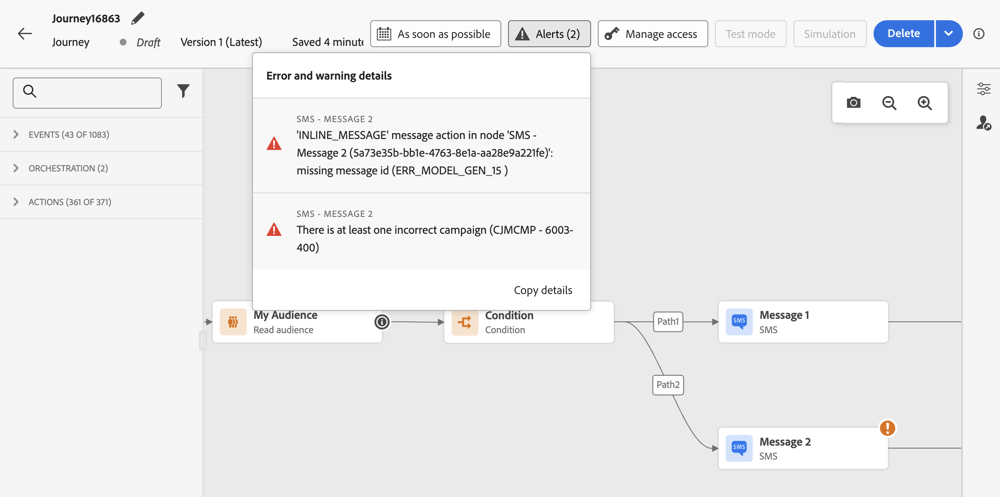

# 여정 문제 해결 {#troubleshooting}

이 섹션에서는 테스트 또는 게시 전에 여정 문제를 해결하는 방법에 대해 알아봅니다. 아래 나열된 모든 검사는 여정이 테스트 모드에 있거나 여정이 라이브 상태일 때 수행할 수 있습니다. 테스트 모드에서 아래의 모든 검사를 수행한 후에 게시를 진행하는 것이 좋습니다. [이 페이지](../building-journeys/testing-the-journey.md)의 테스트 모드에 대해 자세히 알아보세요.

관리자는 사용자 인터페이스에서 직접 실제 API 호출을 수행하여 사용자 지정 작업 구성을 테스트할 수도 있습니다. [이 페이지](../action/troubleshoot-custom-action.md)에서 자세히 알아보세요.

## 테스트하기 전에 오류 확인 {#checking-for-errors-before-testing}

여정을 테스트하고 게시하기 전에 모든 활동이 올바르게 구성되었는지 확인하십시오. 시스템에서 오류가 계속 감지되면 테스트나 게시를 수행할 수 없습니다.


### 활동 오류 {#activity-errors}

캔버스에서 활동 자체에 경고 기호가 표시되면서 오류가 나타납니다. 커서를 느낌표 위에 놓으면 오류 메시지가 표시됩니다. 활동을 클릭하면 오류가 발생한 줄이 경고와 함께 표시됩니다. 예:

* 필수 필드가 비어 있으면 오류가 표시됩니다

  

* 캔버스에서 두 활동의 연결이 끊기면 경고가 표시됩니다

  

### 여정 오류 {#canvas-errors}

캔버스 위의 **[!UICONTROL 경고]** 단추에서도 오류가 표시됩니다. 이 단추를 사용하면 시스템에서 감지된 오류와 테스트 모드 활성화 또는 여정 게시를 방지할 수 있습니다.

시스템에서 두 종류의 문제를 감지합니다. **오류** 및 **경고**. 오류는 게시 및 테스트 활성화를 차단합니다. 경고는 테스트 활성화 또는 게시를 차단하지 않는 잠재적인 문제를 나타냅니다. 문제에 대한 설명 그리고 ERR_XXX_XXX 유형의 문제 로그 ID가 표시됩니다. 이렇게 하면 문제를 식별하는 데 도움이 될 수 있습니다.



<!--Most of the time, errors detected by the system are linked to errors visible on the activities but they can also relate to other issues. In all cases, check alerts and resolve the issue using to the error description. If you cannot identify the issue, use the **[!UICONTROL Copy details]** button to store the alerts, and send them to your administrator.-->

여정에서 전체적으로 발생하는 오류와 경고가 목록에 먼저 나타납니다. 특정 활동과 관련된 오류와 경고는 그 뒤에 활동 순서별로 또는 여정 내 등장 순서별로 왼쪽에서 오른쪽으로 나열됩니다. 경고 목록의 맨 아래에 있는 **[!UICONTROL 세부 정보 복사]** 단추를 사용하여 문제를 해결하는 데 유용한 여정에 대한 기술 정보를 복사할 수 있습니다.

### 대체 경로 추가 {#canvas-add-path}

다음 여정 활동에 대해 오류가 발생한 경우 대체 동작을 정의할 수 있습니다. **[!UICONTROL 조건]** 및 **[!UICONTROL 동작]**.

작업 또는 조건에 오류가 발생하면 개별 여정이 중지됩니다. 이를 지속할 수 있는 유일한 방법은 문제를 해결하는 것이다. 여정이 중단되지 않도록 하기 위해 **[!UICONTROL 활동 속성에서 시간 초과 또는 오류 발생 시 대체 경로를 추가]** 옵션을 선택할 수도 있습니다. 자세한 내용은 [이 섹션](../building-journeys/using-the-journey-designer.md#paths)을 참조하십시오.


## 이벤트가 제대로 전송되었는지 확인 {#checking-that-events-are-properly-sent}

여정의 시작점은 항상 이벤트입니다. Postman과 같은 도구를 사용하여 테스트를 수행할 수 있습니다.

이러한 도구를 통해 보내는 API 호출이 올바르게 전송되었는지 여부를 확인할 수 있습니다. 오류가 반환되면 호출에 문제가 있는 것입니다. 페이로드, 헤더(특히 조직 ID) 및 대상 URL을 다시 확인하십시오. 올바른 URL이 무엇인지를 관리자에게 물어볼 수 있습니다.

이벤트는 소스에서 여정으로 직접 푸시되지 않습니다. 실제로 여정은 Adobe Experience Platform의 수집 API 스트리밍에 의존합니다. 따라서 이벤트 관련 문제가 발생하면 [Adobe Experience Platform 설명서](https://experienceleague.adobe.com/docs/experience-platform/ingestion/streaming/troubleshooting.html){target="_blank"}에서 수집 API 스트리밍 문제 해결을 참조할 수 있습니다.

`ERR_MODEL_RULES_16` 오류로 인해 여정에서 테스트 모드를 사용하도록 설정하지 못하는 경우 채널 작업을 사용할 때 사용된 이벤트에 [ID 네임스페이스](../audience/get-started-identity.md)가 포함되어 있는지 확인하십시오.

ID 네임스페이스는 테스트 프로필을 고유하게 식별하는 데 사용됩니다. 예를 들어 테스트 프로필을 식별하는 데 이메일을 사용하는 경우 ID 네임스페이스 **이메일**&#x200B;을(를) 선택해야 합니다. 고유 식별자가 전화번호인 경우 ID 네임스페이스 **Phone**&#x200B;을(를) 선택해야 합니다.

## 사람들이 여정을 입력하는지 확인 {#checking-if-people-enter-the-journey}

여정 보고는 여정에 들어오는 사람들을 실시간으로 측정합니다.

이벤트를 성공적으로 보냈는데 여정에 들어오는 사람이 없다면 여정에서 이벤트 보내기 및 이벤트 받기 사이에 무언가 잘못된 것입니다.

아래 질문과 함께 문제 해결을 시작할 수 있습니다.

* 수신 이벤트를 기다리는 여정이 테스트 모드이거나 라이브 상태인 것이 확실합니까?
* 페이로드 미리 보기에서 페이로드를 복사하기 전에 이벤트를 저장했습니까?
* 이벤트 페이로드에 이벤트 ID가 포함되어 있습니까?
* 정확한 URL을 입력했습니까?
* 이벤트 구성 창에서 페이로드 구조 미리 보기를 사용하여 수집 API 스트리밍 페이로드 구조를 따랐습니까? [이 페이지](../event/about-creating.md#preview-the-payload)를 참조하십시오.
* 이벤트 헤더에 올바른 키-값 쌍을 사용했습니까?

  ```
  X-gw-ims-org-id - your organization's ID
  Content-type - application/json
  ```

## 사람들이 여정을 탐색하는 방법 확인 {#checking-how-people-navigate-through-the-journey}

여정 보고는 여정 내에서 개인 사용자의 진행 상황을 측정합니다. 사람들이 어디에서 왜 멈췄는지를 쉽게 파악할 수 있습니다.

확인할 몇 가지 사항은 다음과 같습니다.

* 그 사람을 배제하는 조건 때문입니까? 예를 들어 조건이 &quot;gender = male&quot;인데 당사자가 여성입니다. 이 검사는 조건이 너무 복잡하지 않은 경우 비즈니스 사용자가 수행할 수 있습니다.
* 데이터 소스에 대한 호출이 응답하지 않기 때문입니까? 여정이 테스트 모드일 때는 이 정보를 테스트 모드 로그에서 볼 수 있습니다. 여정이 라이브 상태일 때는 관리자가 데이터 소스에 대한 직접 호출을 테스트하고 수신된 답변을 확인할 수 있습니다. 관리자가 여정을 복제하여 테스트할 수도 있습니다.

## 메시지를 성공적으로 보냈는지 확인 {#checking-that-messages-are-sent-successfully}

개인 사용자가 여정에서 플로우를 제대로 따랐는데 받아야 할 메시지를 받지 못하는 경우에는 다음을 확인하면 됩니다.

* [!DNL Journey Optimizer]이(가) 메시지를 보낼 요청을 올바르게 고려했습니다. 비즈니스 사용자는 전송되어야 하는 메시지에 액세스하여 최신 실행 시간이 여정 실행 시간과 일치하는지 확인할 수 있습니다. 최신 API 호출/이벤트를 수신했는지 확인할 수도 있습니다.
* [!DNL Journey Optimizer]이(가) 메시지를 보냈습니다. 여정 보고를 확인하여 오류가 없는지 확인합니다.

사용자 지정 작업을 통해 전송된 메시지의 경우, 여정 테스트 중에 확인할 수 있는 유일한 사실은 사용자 지정 작업 시스템의 호출이 오류로 이어졌는지 여부입니다. 사용자 지정 작업과 연결된 외부 시스템에 대한 호출이 오류로 이어지지 않았는데 메시지가 전송되지 않은 경우에는 외부 시스템 쪽에서 몇 가지 조사를 수행해야 합니다.
