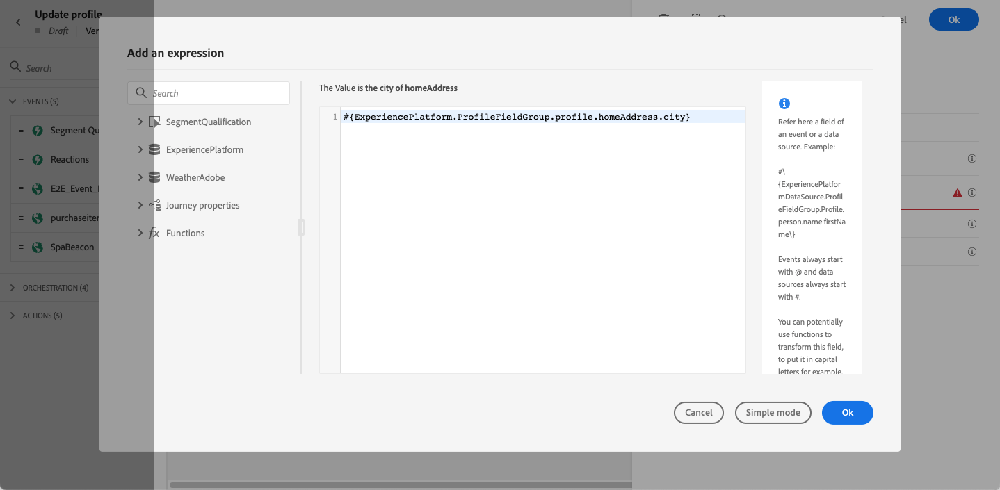

# 프로필 업데이트 {#update-profile}

>[!CONTEXTUALHELP]
>id="ajo_journey_update_profiles"
>title="프로필 활동 업데이트"
>abstract="프로필 업데이트 작업 활동을 사용하여 이벤트, 데이터 소스 또는 특정 값을 사용하여 도출하는 데이터로 기존 Adobe Experience Platform 프로필을 업데이트할 수 있습니다."

**[!UICONTROL 프로필 업데이트]** 작업 활동을 사용하여 이벤트, 데이터 원본 또는 특정 값에서 가져온 정보로 기존 Adobe Experience Platform 프로필을 업데이트합니다.

## 주요 개념 {#key-concepts}

* **프로필 업데이트** 작업은 네임스페이스가 있는 여정에 대해서만 사용할 수 있습니다.
* 작업은 기존 필드만 업데이트하며 새 프로필 필드는 만들지 않습니다.
* **프로필 업데이트** 액션을 사용하여 구매 등의 경험 이벤트를 생성할 수 없습니다.
* 다른 작업과 마찬가지로 오류나 시간 초과 시 대체 경로를 정의할 수 있으며 두 작업을 동시에 배치할 수는 없습니다.
* Adobe Experience Platform에 전송된 업데이트 요청은 즉시/1초 이내에 수행됩니다. 보통 몇 초는 걸리지만, 어떤 때는 보장이 없이 더 걸릴 수도 있습니다. 따라서, 예를 들어 작업이 바로 앞에 배치된 **프로필 업데이트** 작업에 의해 업데이트된 &quot;필드 1&quot;을 사용하는 경우 작업에서 &quot;필드 1&quot;이 업데이트될 것으로 예상해서는 안 됩니다.
* **프로필 업데이트** 활동은 열거형 또는 제안 값으로 정의된 XDM 필드를 지원하지 않습니다.
* **[!UICONTROL 프로필 업데이트]** 활동은 데이터 레이크가 아닌 [프로필 저장소](https://experienceleague.adobe.com/docs/experience-platform/profile/home.html?lang=ko#profile-data-store){target="_blank"}만 업데이트합니다.

## 데이터 세트 선택 {#dataset-selection}

**프로필 업데이트** 활동에는 업데이트를 저장할 전용 데이터 세트가 필요합니다. 이 활동은 프로필 저장소만 업데이트하므로(데이터 저장소는 업데이트되지 않음), 모든 업데이트는 **프로필 업데이트** 작업에 대해 특별히 지정된 프로필 사용 데이터 집합에 저장해야 합니다. 일괄 처리 또는 스트리밍 수집에 사용되는 데이터 세트를 사용하면 새로 온보딩된 데이터가 **프로필 업데이트** 작업에서 변경한 내용을 덮어씁니다.

또한 **프로필 업데이트** 활동 구성에는 ID 네임스페이스가 필요하지 않습니다. 따라서 선택한 데이터 집합이 여정을 시작한 작업에서 사용한 것과 동일한 **ID 네임스페이스**&#x200B;을(를) 이 네임스페이스와 동일하게 사용하도록 하십시오. 선택한 데이터 세트에서 ID 맵을 사용할 수도 있습니다. 올바른 네임스페이스가 있는 데이터 세트 또는 ID 맵을 사용하는 데이터 세트를 선택하지 않으면 프로필 업데이트 활동이 실패합니다.

## 프로필 업데이트 사용

1. 이벤트로 시작하여 여정을 디자인합니다. 이 [섹션](../building-journeys/journey.md)을 참조하세요.

1. 팔레트의 **작업** 섹션에서 **프로필 업데이트** 활동을 캔버스에 놓습니다.

   

1. 목록에서 스키마를 선택합니다.

1. 업데이트할 필드를 선택하려면 **필드**&#x200B;를 클릭하십시오. 필드는 하나만 선택할 수 있습니다.

   

1. 목록에서 데이터 세트를 선택합니다.

   >[!NOTE]
   >
   >**프로필 업데이트** 작업은 프로필 데이터를 실시간으로 업데이트하지만 데이터 세트는 업데이트되지 않습니다. 프로필이 데이터 세트와 관련된 레코드이므로 데이터 세트를 선택해야 합니다.

1. 사용할 값을 정의하려면 **값** 필드를 클릭합니다.

   * 단순 표현식 편집기를 사용하여 데이터 소스 또는 수신 이벤트에서 필드를 선택할 수 있습니다.

     

   * 특정 값을 정의하거나 고급 함수를 사용하려면 **고급 모드**&#x200B;를 클릭하세요.

     

이제 **프로필 업데이트**&#x200B;가 구성되었습니다.

## 테스트 모드 사용 {#using-the-test-mode}

테스트 모드에서는 프로필 업데이트가 시뮬레이트되지 않습니다. 업데이트가 테스트 프로필에서 수행됩니다.

테스트 프로필만 테스트 모드에서 여정에 들어갈 수 있습니다. 새 테스트 프로필을 만들거나 기존 프로필을 테스트 프로필로 만들 수 있습니다. Adobe Experience Platform에서 csv 파일 가져오기 또는 API 호출을 통해 프로필 속성을 업데이트할 수 있습니다. 더 간단한 방법은 **프로필 업데이트** 작업 활동을 사용하고 테스트 프로필 부울 필드를 false에서 true로 변경하는 것입니다.

기존 프로필을 테스트 프로필로 변환하는 방법에 대한 자세한 내용은 이 [섹션](../audience/creating-test-profiles.md#create-test-profiles-csv)을 참조하세요.
