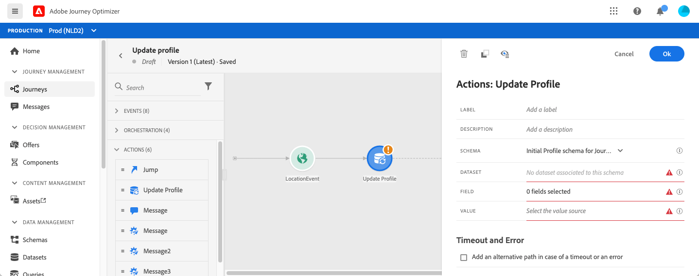

# 프로필 업데이트 {#update-profile}

**[!UICONTROL Update Profile]** 작업 활동을 사용하면 이벤트, 데이터 소스 또는 특정 값을 사용하여 기존 Adobe Experience Platform 프로필을 업데이트할 수 있습니다.

## 중요 정보

* **프로필 업데이트** 작업은 네임스페이스가 있는 이벤트로 시작하는 여정에서만 사용할 수 있습니다.
* 작업은 기존 필드만 업데이트하며 새 프로필 필드를 만들지 않습니다.
* **프로필 업데이트** 작업을 사용하여 경험 이벤트(예: 구매)를 생성할 수 없습니다.
* 다른 작업과 마찬가지로 오류 또는 시간 제한 시 대체 경로를 정의할 수 있으며 두 작업을 동시에 배치할 수 없습니다.
* Platform으로 보낸 업데이트 요청은 속도가 빠르지만 1초 이내에 전송되지 않습니다. 보통 몇 초 정도 걸리지만 가끔은 장담할 수 없는 경우도 있다. 따라서 예를 들어, 작업이 바로 앞에 배치된 프로필 업데이트 작업에 의해 업데이트된 &quot;필드 1&quot;을 사용하는 경우 작업에서 &quot;필드 1&quot;이 업데이트될 것으로 예상하면 안 됩니다.

## 테스트 모드 사용 {#using-the-test-mode}

테스트 모드에서는 프로필 업데이트가 시뮬레이션되지 않습니다. 업데이트는 테스트 프로필에서 수행됩니다.

테스트 프로필만 테스트 모드에서 여정을 입력할 수 있습니다. 새 테스트 프로필을 만들거나 기존 프로필을 테스트 프로필로 전환할 수 있습니다. Adobe Experience Platform에서 csv 파일 가져오기 또는 API 호출을 통해 프로필 속성을 업데이트할 수 있습니다. 보다 간단한 방법은 **프로필 업데이트** 작업 활동을 사용하고 테스트 프로필 부울 필드를 false에서 true로 변경하는 것입니다.

기존 프로필을 테스트 프로필로 변환하는 방법에 대한 자세한 내용은 이 [section](../building-journeys/creating-test-profiles.md#create-test-profiles-csv) 을 참조하십시오.

## 프로필 업데이트 사용

1. 이벤트를 시작하여 여정을 디자인합니다. 이 [섹션](../building-journeys/journey.md)을 참조하십시오.

1. 팔레트의 **작업** 섹션에서 **프로필 업데이트** 활동을 캔버스에 놓습니다.

   

1. 목록에서 스키마를 선택합니다.

1. **필드**&#x200B;를 클릭하여 업데이트할 필드를 선택합니다. 필드를 하나만 선택할 수 있습니다.

   

1. 목록에서 데이터 세트를 선택합니다.

   >[!NOTE]
   >
   >**프로필 업데이트** 작업은 프로필 데이터를 실시간으로 업데이트하지만 데이터 세트는 업데이트되지 않습니다. 프로필이 데이터 세트와 관련된 레코드이므로 데이터 세트 선택이 필요합니다.

1. **값** 필드를 클릭하여 사용할 값을 정의합니다.

   * 단순 표현식 편집기를 사용하여 데이터 소스 또는 수신 이벤트에서 필드를 선택할 수 있습니다.

      

   * 특정 값을 정의하거나 고급 함수를 활용하려면 **고급 모드**&#x200B;를 클릭하십시오.

      

이제 **프로필 업데이트**&#x200B;가 구성되었습니다.

