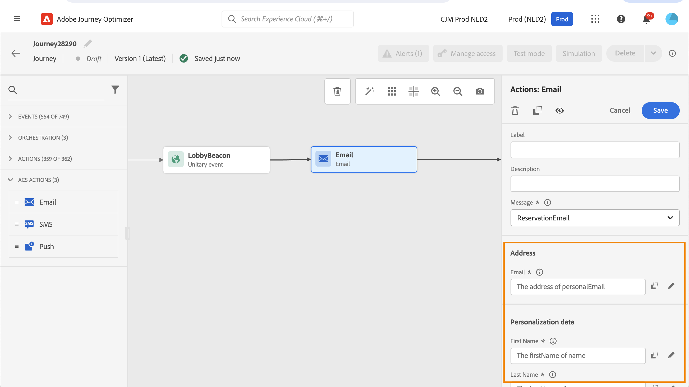

# Adobe Campaign Standard 작업 {#using_campaign_action}

>[!CONTEXTUALHELP]
>id="ajo_journey_action_custom_acs"
>title="사용자 정의 액션"
>abstract="Adobe Campaign Standard가 있는 경우 통합 기능을 사용할 수 있습니다. Adobe Campaign 트랜잭션 메시지 기능을 사용하여 이메일, 푸시 알림, SMS를 전송할 수 있습니다."

Adobe Campaign Standard이 있는 경우 다음과 같은 기본 제공 작업 활동을 사용할 수 있습니다. **[!UICONTROL 이메일]**, **[!UICONTROL 푸시]** 및 **[!UICONTROL SMS]**.

>[!NOTE]
>
>이를 위해서는 기본 작업을 구성해야 합니다. [이 페이지](../action/acs-action.md)를 참조하십시오.

이러한 각 채널에 대해 Adobe Campaign Standard 트랜잭션 메시지 **템플릿**&#x200B;을(를) 선택합니다. 기본 제공 이메일, SMS 및 푸시 채널의 경우 트랜잭션 메시지를 사용하여 메시지 전송을 실행합니다. 즉, 여정에서 특정 메시지 템플릿을 사용하려면 Adobe Campaign Standard에 게시해야 합니다. 이 기능을 사용하는 방법에 대해 알아보려면 [이 페이지](https://experienceleague.adobe.com/docs/campaign-standard/using/communication-channels/transactional-messaging/getting-started-with-transactional-msg.html?lang=ko)를 참조하세요.

>[!NOTE]
>
>Journey Optimizer에서 사용하려면 Campaign Standard 트랜잭션 메시지와 관련 이벤트를 게시해야 합니다. 이벤트가 게시되었지만 메시지는 게시되지 않은 경우 Journey Optimizer 인터페이스에 표시되지 않습니다. 메시지가 게시되었지만 연결된 이벤트가 게시되지 않은 경우 Journey Optimizer 인터페이스에 표시되지만 사용할 수 없습니다.


이벤트(실시간 이라고도 함) 또는 프로필 트랜잭션 메시지 템플릿을 사용할 수 있습니다.

>[!NOTE]
>
>실시간 트랜잭션 메시지(rtEvent)를 보내거나 사용자 지정 작업 덕분에 서드파티 시스템으로 메시지를 라우팅하는 경우 피로, 차단 목록 또는 구독 취소 관리에 특정 설정이 필요합니다. 예를 들어 &quot;구독 취소&quot; 속성이 Adobe Experience Platform 또는 서드파티 시스템에 저장된 경우 이 조건을 확인하려면 메시지를 보내기 전에 조건을 추가해야 합니다.

템플릿을 선택하면 메시지 페이로드에 필요한 모든 필드가 **[!UICONTROL 주소]** 및 **[!UICONTROL Personalization 데이터]** 아래의 활동 구성 창에 표시됩니다. 이러한 각 필드를 이벤트 또는 데이터 소스에서 사용할 필드에 매핑해야 합니다. 고급 표현식 편집기를 사용하여 값을 수동으로 전달하거나, 검색된 정보에 대해 데이터 조작을 수행하거나(예: 문자열을 대문자로 변환), &quot;if, then, else&quot;와 같은 함수를 사용할 수도 있습니다. [이 페이지](expression/expressionadvanced.md)를 참조하십시오.



## 이메일 및 SMS {#section_asc_51g_nhb}

**[!UICONTROL Email]** 및 **[!UICONTROL SMS]**&#x200B;의 경우 매개 변수가 동일합니다.

>[!NOTE]
>
>이메일에 프로필의 트랜잭션 템플릿을 사용하면 구독 취소 메커니즘이 Adobe Campaign Standard에서 자동으로 처리됩니다. 이를 구현하려면 [트랜잭션 전자 메일 템플릿](https://experienceleague.adobe.com/docs/campaign-standard/using/communication-channels/transactional-messaging/getting-started-with-transactional-msg.html?lang=ko)에 **[!UICONTROL 구독 취소 링크]** 콘텐츠 블록을 쉽게 포함할 수 있습니다. 그러나 이벤트 기반 템플릿(rtEvent)을 사용하는 경우 수신자의 이메일을 URL 매개 변수로 전달하고 구독 취소 랜딩 페이지로 안내하는 링크를 메시지에 통합해야 합니다. 이 랜딩 페이지를 만들고 수신자의 구독 취소 결정이 Adobe에 효과적으로 전달되도록 해야 합니다.

먼저 트랜잭션 메시지 템플릿을 선택해야 합니다.

**[!UICONTROL 주소]** 및 **[!UICONTROL Personalization 데이터]** 범주가 있습니다.

인터페이스를 사용하여 **[!UICONTROL 주소]** 또는 **[!UICONTROL Personalization 데이터]**&#x200B;를 검색할 위치를 쉽게 정의할 수 있습니다. 이벤트 및 사용 가능한 데이터 소스의 필드를 찾아볼 수 있습니다. 매개 변수를 전달하거나 조작해야 하는 데이터 소스를 사용하는 것과 같은 고급 사용 사례에 고급 표현식 편집기를 사용할 수도 있습니다. [이 페이지](expression/expressionadvanced.md)를 참조하십시오.

**[!UICONTROL 주소]**

>[!NOTE]
>
>이 범주는 &quot;이벤트&quot; 트랜잭션 메시지를 선택한 경우에만 표시됩니다. &quot;프로필&quot; 메시지의 경우 **[!UICONTROL 주소]** 필드는 시스템에서 Adobe Campaign Standard에서 자동으로 검색됩니다.

시스템이 메시지를 보낼 위치를 알아야 하는 필드입니다. 이메일 템플릿의 경우 이메일 주소입니다. SMS의 경우 휴대폰 번호입니다.


**[!UICONTROL Personalization 데이터]**

>[!NOTE]
>
>개인화 데이터에서 컬렉션을 전달할 수 없습니다. 트랜잭션 이메일 또는 SMS에 컬렉션이 필요한 경우 작동하지 않습니다. 또한 개인화 데이터에는 예상 형식(예: 문자열, 십진수 등)이 있습니다. 이러한 예상 형식을 준수하도록 주의해야 합니다.

Adobe Campaign Standard 메시지에서 예상하는 필드입니다. 이러한 필드는 메시지를 개인화하거나, 조건부 서식을 적용하거나, 특정 메시지 변형을 선택하는 데 사용할 수 있습니다.


## 푸시 {#section_im3_hvf_nhb}

푸시 활동을 사용하기 전에 푸시 알림을 전송하기 위해 Campaign Standard과 함께 모바일 앱을 구성해야 합니다. 이 [article](https://helpx.adobe.com/kr/campaign/kb/integrate-mobile-sdk.html)을(를) 사용하여 모바일에 필요한 구현 단계를 수행하십시오.

먼저 드롭다운 목록에서 모바일 앱을 선택하고 트랜잭션 메시지를 표시해야 합니다.


**[!UICONTROL Target]** 및 **[!UICONTROL Personalization 데이터]** 범주가 있습니다.

**[!UICONTROL Target]**

>[!NOTE]
>
>이 범주는 이벤트 메시지를 선택한 경우에만 표시됩니다. 프로필 메시지의 경우 **[!UICONTROL Target]** 필드는 Adobe Campaign Standard에서 수행한 조정을 사용하여 시스템에서 자동으로 검색됩니다.

이 섹션에서는 **[!UICONTROL 푸시 플랫폼]**&#x200B;을 정의해야 합니다. 드롭다운 목록에서 **[!UICONTROL Apple 푸시 알림 서버]**(iOS) 또는 **[!UICONTROL Firebase Cloud 메시징]**(Android)을 선택할 수 있습니다. 이벤트 또는 데이터 소스에서 특정 필드를 선택하거나 고급 표현식을 정의할 수도 있습니다.

**[!UICONTROL 등록 토큰]**&#x200B;도 정의해야 합니다. 식은 이벤트 페이로드 또는 다른 [!DNL Journey Optimizer] 정보에서 토큰이 정의되는 방식에 따라 다릅니다. 토큰이 예를 들어 컬렉션에 정의된 경우 단순 필드 또는 더 복잡한 식이 될 수 있습니다.

```
@event{Event_push._experience.campaign.message.profileSnapshot.pushNotificationTokens.first().token}
```

**[!UICONTROL Personalization 데이터]**

>[!NOTE]
>
>개인화 데이터에서 컬렉션을 전달할 수 없습니다. 트랜잭션 푸시에 컬렉션이 필요한 경우 작동하지 않습니다. 또한 개인화 데이터에는 예상 형식(예: 문자열, 십진수 등)이 있습니다. 이러한 예상 형식을 준수하도록 주의해야 합니다.

Adobe Campaign Standard 메시지에 사용된 트랜잭션 템플릿에서 예상하는 필드입니다. 이 필드를 사용하여 메시지를 개인화하거나, 조건부 서식을 적용하거나, 특정 메시지 변형을 선택할 수 있습니다.
