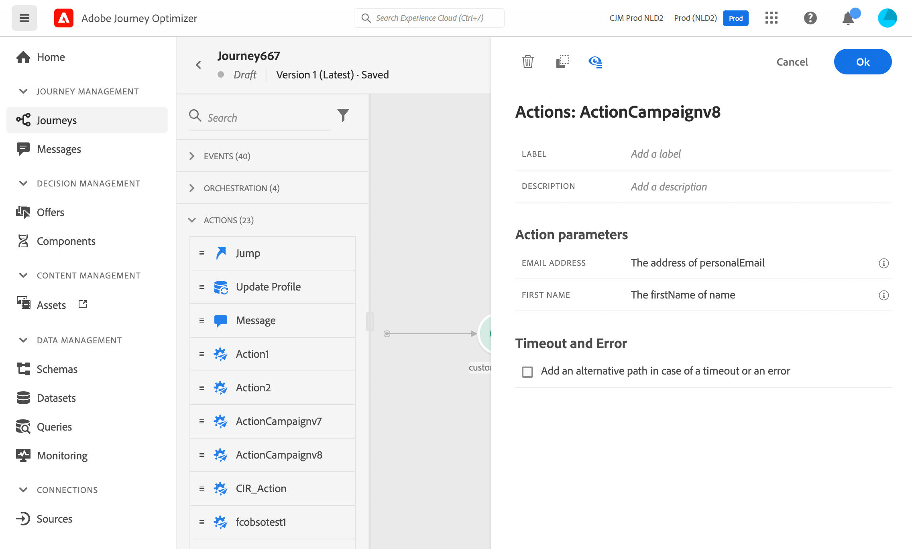

# Adobe Campaign v7/v8 작업 {#using_campaign_v7-v8}

>[!CONTEXTUALHELP]
>id="ajo_journey_action_custom_acc"
>title="사용자 정의 액션"
>abstract="Adobe Campaign v7 또는 v8이 있는 경우 통합을 사용할 수 있습니다. Adobe Campaign 트랜잭션 메시지 기능을 사용하여 이메일, 푸시 알림, SMS를 전송할 수 있습니다."

Adobe Campaign v7 또는 v8이 있는 경우 통합을 사용할 수 있습니다. Adobe Campaign 트랜잭션 메시지 기능을 사용하여 이메일, 푸시 알림 및 SMS를 전송할 수 있습니다.

Journey Optimizer 인스턴스와 Campaign 인스턴스 간의 연결은 프로비저닝 시 Adobe에 의해 설정됩니다. Adobe에 문의하십시오.

이를 수행하려면 전용 작업을 구성해야 합니다. 이 [섹션](../action/acc-action.md)을 참조하십시오.

이 [섹션](../building-journeys/ajo-ac.md)에 엔드 투 엔드 사용 사례가 표시됩니다.

1. 이벤트로 시작하여 여정을 디자인합니다. 이 [섹션](../building-journeys/journey.md)을 참조하세요.
1. 팔레트의 **작업** 섹션에서 캠페인 작업을 선택하고 여정에 추가합니다.
1. **작업 매개 변수**&#x200B;에 메시지 페이로드에 필요한 모든 필드가 표시됩니다. 이러한 각 필드를 이벤트 또는 데이터 소스에서 사용할 필드에 매핑해야 합니다. 이는 사용자 지정 작업과 유사합니다. 이 [섹션](../building-journeys/using-custom-actions.md)을 참조하십시오.

