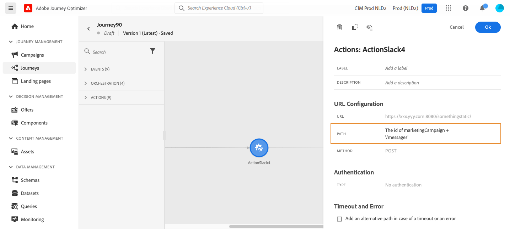

# 사용자 정의 액션 사용 {#use-custom-actions}

>[!BEGINSHADEBOX]

**이 페이지에서:** 데이터 거버넌스 및 동의 정책을 적용하는 동안 사용자 지정 작업을 사용하여 JSON 페이로드가 있는 REST API 호출을 통해 여정을 서드파티 시스템에 연결하는 방법을 알아봅니다.

>[!ENDSHADEBOX]

>[!CONTEXTUALHELP]
>id="ajo_journey_action_custom"
>title="사용자 정의 액션"
>abstract="사용자 정의 액션에서는 메시지나 API 호출을 전송할 서드파티 시스템의 연결을 구성할 수 있습니다. JSON 형식 페이로드를 사용하여 REST API를 통해 호출할 수 있는 모든 공급자의 어떤 서비스로든 작업을 구성할 수 있습니다."

사용자 지정 작업을 사용하여 메시지 또는 API 호출을 전송할 서드파티 시스템에 대한 연결을 활성화합니다. JSON 형식 페이로드를 사용하여 REST API를 통해 호출할 수 있는 모든 공급자의 어떤 서비스로든 작업을 구성할 수 있습니다.

[이 섹션](../action/action.md)에서 사용자 지정 작업에 대해 자세히 알아보세요.

[이 페이지](../action/about-custom-action-configuration.md)에서 사용자 지정 작업을 만들고 구성하는 방법에 대해 알아봅니다.

[이 페이지](../action/action-response.md)에서 개인화를 위해 사용자 지정 작업의 API 호출 응답을 사용하는 방법을 알아봅니다.

## 동의 및 데이터 거버넌스 {#privacy}

Journey Optimizer에서는 데이터 거버넌스 및 동의 정책을 사용자 지정 작업에 적용하여 특정 필드가 서드파티 시스템으로 내보내지지 않도록 하거나 이메일, 푸시 또는 SMS 통신 수신에 동의하지 않은 고객을 제외할 수 있습니다. 자세한 내용은 다음 페이지를 참조하십시오.

* [데이터 거버넌스](../action/action-privacy.md)
* [동의](../action/consent.md).

## URL 구성

**사용자 지정 작업** 활동의 구성 창에는 사용자 지정 작업에 대해 구성된 URL 구성 매개 변수와 인증 매개 변수가 표시됩니다. 여정에서 URL의 정적 부분을 설정할 수 없지만 사용자 지정 작업의 전역 구성에서는 설정할 수 있습니다. [자세히 알아보기](../action/about-custom-action-configuration.md)

### 동적 경로

URL에 동적 경로가 포함된 경우 **[!UICONTROL 경로]** 필드에 경로를 지정하십시오.

필드와 일반 텍스트 문자열을 연결하려면 고급 표현식 편집기에서 String 함수 또는 더하기 기호(+)를 사용하십시오. 일반 텍스트 문자열을 작은따옴표(&#39;) 또는 큰따옴표(&quot;)로 묶습니다. [자세히 알아보기](expression/expressionadvanced.md)

이 표에서는 구성의 예를 보여 줍니다.

| 필드 | 값 |
| --- | --- |
| URL | `https://xxx.yyy.com:8080/somethingstatic/` |
| 경로 | `The _id + '/messages'` |

연결된 URL의 형식은 다음과 같습니다.

`https://xxx.yyy.com:8080/somethingstatic/`\&lt;ID>`/messages`

### 헤더 및 쿼리 매개 변수 {#headers}

**[!UICONTROL URL 구성]** 섹션에는 동적 헤더 및 쿼리 매개 변수 필드가 표시되지만 상수 필드는 표시되지 않습니다. 동적 헤더 및 쿼리 매개 변수 필드는 작업 구성 화면에서 변수로 정의됩니다. [자세히 알아보기](../action/about-custom-action-configuration.md#url-configuration)

동적 헤더 및 쿼리 매개 변수 필드의 값을 지정하려면 필드 내부 또는 연필 아이콘을 클릭하고 원하는 필드를 선택합니다.

사용자 지정 작업의 

## 작업 매개 변수

**[!UICONTROL 작업 매개 변수]** 섹션에서 _&quot;변수&quot;_(으)로 정의된 메시지 매개 변수를 볼 수 있습니다. 이러한 매개 변수의 경우 이 정보를 가져올 위치(예: 이벤트, 데이터 소스)를 정의하거나, 값을 수동으로 전달하거나, 고급 사용 사례에 고급 표현식 편집기를 사용할 수 있습니다. 고급 사용 사례는 데이터 조작 및 기타 함수 사용일 수 있습니다. 이 [페이지](expression/expressionadvanced.md)를 참조하세요.

