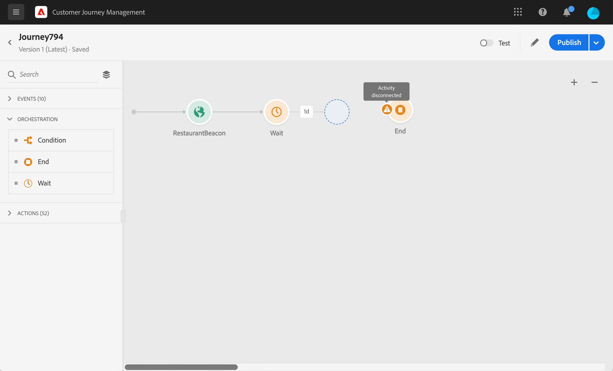

# 여정 디자인

여정 인터페이스를 사용하면 팔레트의 활동을 캔버스로 쉽게 드래그하여 놓을 수 있습니다. 활동을 두 번 클릭하여 사용 가능한 다음 단계에서 캔버스에 추가할 수도 있습니다. 각 활동에는 특정 역할과 위치가 있습니다. 활동이 시퀀싱됩니다. 활동이 끝나면 플로우는 계속 진행되며 다음 활동을 처리하는 등 다양한 작업을 수행합니다.

## 여정 디자인 시작

**팔레트**&#x200B;는 화면 왼쪽에 있습니다. 사용 가능한 모든 활동은 몇 가지 카테고리로 분류됩니다. **[!UICONTROL Events]**, **[!UICONTROL Orchestration]** 및 **[!UICONTROL Actions]**. 해당 이름을 클릭하여 다른 카테고리를 확장/축소할 수 있습니다. 여정에서 활동을 사용하려면 팔레트에서 캔버스로 활동을 끌어서 놓습니다.

새 여정을 시작할 때 첫 번째 단계가 숨겨지므로 캔버스에 놓을 수 없는 요소가 표시됩니다. 이는 모든 작업, 조건 활동, 대기 및 반응과 관련되어 있습니다.

왼쪽 상단 모서리의 **[!UICONTROL Filter items]** 아이콘을 사용하면 다음 필터를 표시할 수 있습니다.

* **사용 가능한 항목만 표시**: 팔레트에서 사용할 수 없는 요소(예: 여정에 사용되는 것과 다른 네임스페이스를 사용하는 이벤트)를 숨기거나 표시합니다. 기본적으로 사용할 수 없는 항목은 숨겨집니다. 표시할 경우 회색으로 표시됩니다.

* **최근 항목만 표시**: 이 필터를 사용하면 기본 이벤트 및 작업 외에 마지막으로 사용된 이벤트 5개와 작업만 표시할 수 있습니다. 이는 각 사용자에게만 해당됩니다. 기본적으로 모든 항목이 표시됩니다.

**[!UICONTROL Search]** 필드를 사용할 수도 있습니다. 이벤트와 작업만 필터링됩니다.

**canvas**&#x200B;는 여정 디자이너의 중앙 영역입니다. 활동을 삭제하고 구성할 수 있는 이 영역에 있습니다. 캔버스에서 활동을 클릭하여 구성합니다. 오른쪽에 활동 구성 창이 열립니다.

팔레트에서 활동을 클릭하면 **활동 구성 창**&#x200B;이 나타납니다. 필수 필드를 입력합니다. 활동을 삭제하려면 **[!UICONTROL Delete]** 아이콘을 클릭하십시오. 수정 사항을 취소하려면 **[!UICONTROL Cancel]** 를 클릭하고, 확인하려면 **[!UICONTROL Ok]** 를 클릭하십시오. 활동을 삭제하려면 활동 하나(또는 여러 개)를 선택하고 백스페이스 키를 누를 수도 있습니다. Esc 키를 누르면 활동 구성 창이 닫힙니다.

기본적으로 읽기 전용 필드는 숨겨집니다. 읽기 전용 필드를 표시하려면 활동 구성 창의 왼쪽 상단에 있는 **읽기 전용 필드 표시** 아이콘을 클릭합니다. 이 설정은 모든 여정의 모든 활동에 적용됩니다.

여정의 상태에 따라 오른쪽 상단 모서리에서 사용할 수 있는 단추를 사용하여 여정에 대해 다른 작업을 수행할 수 있습니다. **[!UICONTROL Publish]**, **[!UICONTROL Duplicate]**, **[!UICONTROL Delete]**, **[!UICONTROL Journey properties]**, **[!UICONTROL Test]**. 이러한 단추는 활동을 선택하지 않을 때 나타납니다. 일부 단추는 컨텍스트에 따라 나타납니다. 테스트 모드가 활성화되면 테스트 모드 로그 단추가 나타납니다.

## 여정 시작

여정을 디자인할 때 가장 먼저 질문할 질문은 프로필에서 여정에 어떻게 들어오는가 입니다. 두 가지 가능성이 있습니다.

**이벤트** 시작: 여정이 이벤트를 수신하도록 설정되어 있으면 개인 **** 이 실시간으로 여정을 입력합니다. 여정에 포함된 메시지는 현재 여정으로 이동하는 사람에게 전송됩니다. [이벤트에 대해 자세히 알아보기](../event/about-events.md)

**읽기 세그먼트로 시작**: Adobe Experience Platform 세그먼트를 수신 대기하도록 여정을 설정할 수 있습니다. 이 경우, 지정된 세그먼트에 속하는 모든 개인이 여정을 입력합니다. 여정에 포함된 메시지는 세그먼트에 속하는 개인에게 전송됩니다. [세그먼트 읽기에 대해 자세히 알아보십시오](read-segment.md).

## 다음 단계 정의

첫 번째 이벤트 또는 세그먼트 읽기 후에 다른 활동을 결합하여 여러 단계의 크로스 채널 시나리오를 작성할 수 있습니다. 팔레트에서 필요한 단계를 선택합니다.

**이벤트**

이벤트로 여정을 시작하면 이벤트가 수신되면 여정이 트리거됩니다. 그러면 개인이 여정에 정의된 다음 단계를 개별적으로 따릅니다.

동일한 네임스페이스를 사용하는 한 여정에서 **여러 이벤트**&#x200B;를 추가할 수 있습니다. 이벤트는 미리 구성됩니다. [이벤트에 대해 자세히 알아보기](about-journey-activities.md#event-activities)

메시지 뒤에 **Reaction** 이벤트를 추가하여 메시지와 관련된 추적 데이터에 응답할 수도 있습니다. 예를 들어 개인이 이전 메시지를 열거나 해당 메시지를 클릭한 경우 다른 메시지를 보낼 수 있습니다. 자세한 내용은 이 [섹션](reaction-events.md)을 참조하십시오.

**세그먼트 자격** 이벤트 활동을 사용하면 Adobe Experience Platform 세그먼트 출입구 및 종료에 따라 개인이 여정에 들어오거나 이동하도록 할 수 있습니다. 모든 신규 실버 고객이 여정을 입력하고 개인화된 메시지를 보낼 수 있습니다. 자세한 내용은 이 [섹션](segment-qualification-events.md)을 참조하십시오.

**오케스트레이션**

오케스트레이션 활동에서는 Adobe Experience Platform 세그먼트를 수신 대기하도록 여정을 설정할 수 있는 **세그먼트 읽기** 활동을 찾을 수 있습니다. [세그먼트 읽기 활동에 대해 자세히 알아보십시오](read-segment.md).

다른 활동을 사용하면 여정에 조건을 추가하여 여러 경로를 정의하거나, 다음 활동을 실행하기 전에 대기 시간을 설정하거나, 여정을 종료할 수 있습니다. 자세한 내용은 이 [섹션](about-journey-activities.md#orchestration-activities)을 참조하십시오.

**작업**

여기에서는 **메시지** 활동을 통해 [!DNL Journey Optimizer]에 디자인된 메시지를 포함할 수 있습니다. [메시지 활동에 대해 자세히 알아보기](journeys-message.md)

또한 서드파티 시스템과 함께 메시지를 전송하도록 구성한 사용자 지정 작업도 확인할 수 있습니다. 자세한 내용은 이 [섹션](about-journey-activities.md#action-activities)을 참조하십시오.

## 캔버스에서 경로 사용 {#paths}

몇 가지 활동(**[!UICONTROL Condition]**, **[!UICONTROL Action]** 활동)을 사용하면 오류 또는 시간 제한이 있을 경우 대체 작업을 정의할 수 있습니다. 활동 구성 창에서 상자를 선택합니다. **[!UICONTROL Add an alternative path in case of a timeout or an error]** 활동 뒤에 다른 경로가 추가됩니다. 시간 제한 기간은 여정의 속성에 정의됩니다( [이 페이지](../building-journeys/journey-gs.md#change-properties) 참조). 예를 들어 이메일을 전송하는 데 너무 오래 걸리거나 오류가 발생한 경우 SMS를 전송하도록 결정할 수 있습니다.

다양한 활동(이벤트, 작업, 대기)을 통해 뒤에 여러 경로를 추가할 수 있습니다. 이렇게 하려면 활동에 커서를 놓고 &quot;+&quot; 기호를 클릭합니다. 이벤트 및 대기 활동만 동시에 설정할 수 있습니다. 여러 이벤트가 동시에 설정되면 선택한 경로가 첫 번째 이벤트 중 하나가 됩니다.

이벤트를 수신할 때 이벤트를 무한정 기다리지 않는 것이 좋습니다. 이것은 필수가 아니며, 단지 좋은 방법일 뿐이다. 특정 시간 동안에만 하나 또는 여러 개의 이벤트를 수신하려면 하나 또는 여러 개의 이벤트와 대기 활동을 동시에 배치합니다. [이 섹션](../building-journeys/general-events.md#events-specific-time)을 참조하십시오.

경로를 삭제하려면 해당 경로에 커서를 놓고 **[!UICONTROL Delete path]** 아이콘을 클릭합니다.

캔버스에서 두 활동의 연결이 끊기면 경고가 표시됩니다. 경고 아이콘 위에 커서를 놓으면 오류 메시지가 표시됩니다. 문제를 해결하려면 연결이 끊긴 활동을 이동하고 이전 활동에 연결하기만 하면 됩니다.

## 활동 복사 및 붙여넣기 {#copy-paste}

한 개 또는 여러 개의 여정 활동을 복사하여 동일한 여정 또는 다른 활동에 붙여넣을 수 있습니다. 이를 통해 이전 여정에서 이미 구성된 다양한 활동을 재사용하려는 경우 시간을 절약할 수 있습니다.

**중요 정보**

* 다양한 탭 및 브라우저에 복사/붙여넣기를 할 수 있습니다. 동일한 인스턴스 내에서만 활동을 복사/붙여넣을 수 있습니다.
* 대상 여정에 다른 네임스페이스를 사용하는 이벤트가 있는 경우 이벤트를 복사/붙여넣을 수 없습니다.
* 붙여넣은 활동은 대상 여정에 존재하지 않는 데이터를 참조할 수 있습니다. 예를 들어 다른 샌드박스에서 복사/붙여넣기를 할 수 있습니다. 항상 오류를 확인하고 필요한 조정을 수행합니다.
* 작업을 실행 취소할 수 없습니다. 붙여넣은 활동을 삭제하려면 해당 활동을 선택하고 삭제해야 합니다. 따라서 필요한 활동을 복사하기 전에 선택해야 합니다.
* 모든 여정에서 활동을 복사할 수 있으며, 읽기 전용 활동도 복사할 수 있습니다.
* 연결되어 있지 않은 활동이라도 선택할 수 있습니다. 연결된 활동은 붙여넣은 후 계속 연결됩니다.

활동을 복사/붙여넣기는 다음과 같습니다.

1. 여정을 엽니다.
1. 를 클릭하는 동안 마우스를 이동하여 복사할 활동을 선택합니다. **Ctrl/Command** 키를 누른 채 각 활동을 클릭할 수도 있습니다. 모든 활동을 선택하려면 **Ctrl/Command+A**을 사용하십시오.
   
1. **Ctrl/Command + C**를 누릅니다.
활동을 하나만 복사하려는 경우 해당 활동을 클릭하고 활동 구성 창의 왼쪽 상단에 있는 **Copy** 아이콘을 사용할 수 있습니다.
   
1. 여정에서 **Ctrl/Command + V** 키를 눌러 기존 노드에 연결하지 않고 활동을 붙여넣습니다. 붙여넣은 활동은 같은 순서로 배치됩니다. 붙여넣은 후에는 활동이 선택된 상태로 유지되므로 쉽게 이동할 수 있습니다. 또한 빈 자리 표시자에 커서를 놓고 **Ctrl/Command + V**를 누를 수도 있습니다. 붙여넣은 활동은 노드에 연결됩니다.
   
