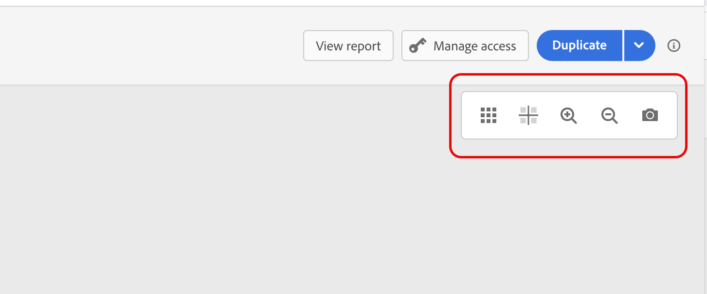
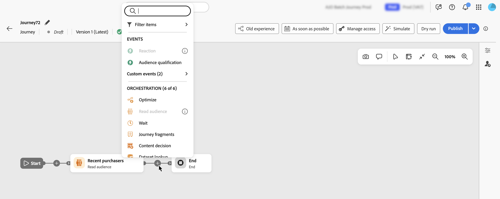
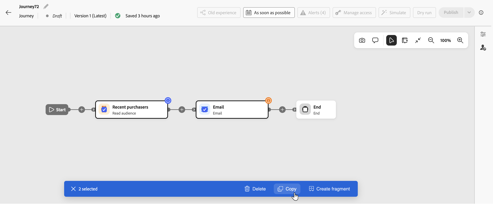
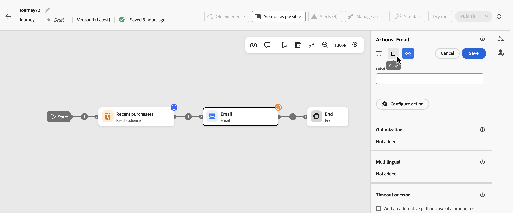
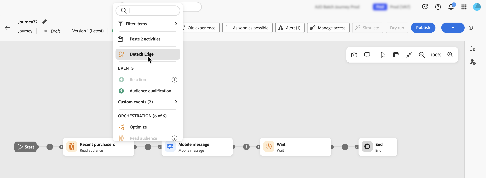
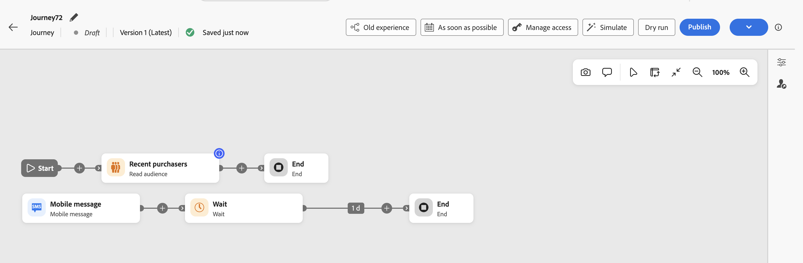
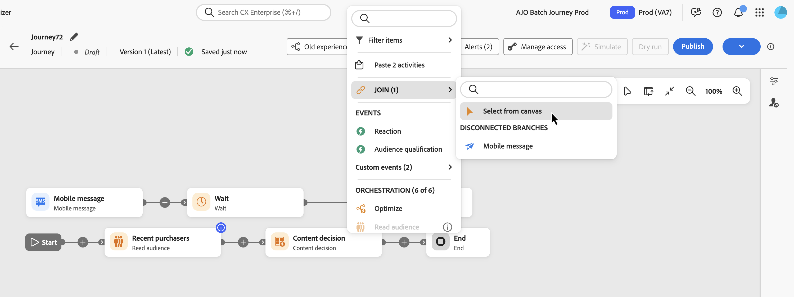
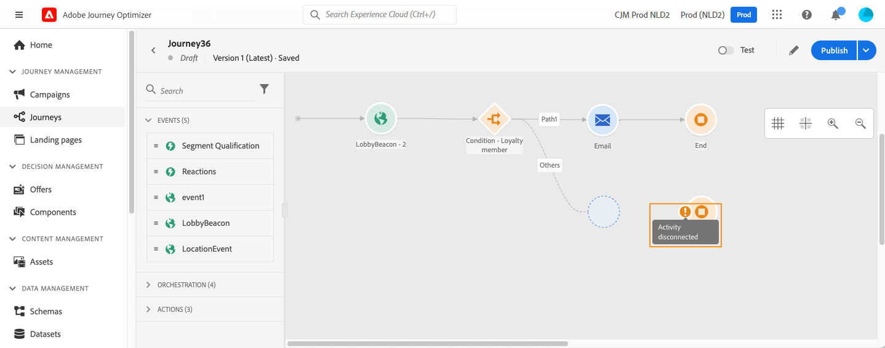
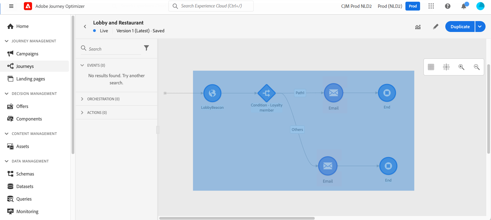
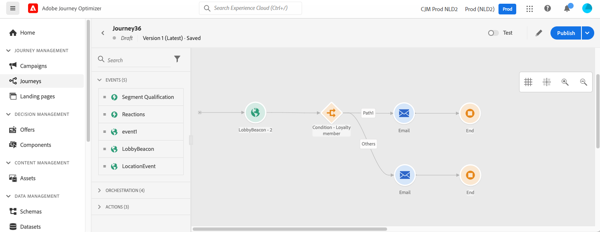

# 여정 디자인 {#design-your-journey}

>[!BEGINSHADEBOX]

**이 페이지에서:** 여정 디자이너 캔버스 및 팔레트를 사용하여 이벤트, 오케스트레이션 및 작업 활동을 여정을 빌드하는 순차적인 흐름으로 끌어서 놓는 방법을 알아봅니다.

>[!ENDSHADEBOX]

[!DNL Adobe Journey Optimizer]에는 마케터가 마케팅 활동과 일대일 고객 참여를 조화롭게 조정할 수 있는 옴니채널 오케스트레이션 캔버스가 포함되어 있습니다. 사용자 인터페이스를 사용하면 팔레트에서 캔버스로 활동을 쉽게 끌어다 놓아 여정을 빌드할 수 있습니다. 활동을 두 번 클릭하여 사용 가능한 다음 단계에서 캔버스에 추가할 수도 있습니다.

이벤트, 오케스트레이션 및 작업 활동에는 프로세스에서 특정한 역할과 위치가 있습니다. 활동이 완료되면, 흐름이 계속되고 다음 활동을 처리하는 등의 작업이 순서대로 진행됩니다.

## 여정 디자인 시작 {#gs-journey-design}

**팔레트**&#x200B;가 화면 왼쪽에 있습니다. 사용 가능한 모든 활동은 [이벤트](#jo-event), [오케스트레이션](#jo-orch) 및 [작업](#jo-actions) 범주로 정렬됩니다. 이름을 클릭하여 다른 범주를 확장/축소할 수 있습니다. 여정에서 활동을 사용하려면 팔레트에서 캔버스로 드래그하여 놓습니다.

새 여정을 시작할 때 첫 번째 단계로 캔버스에 놓을 수 없는 요소는 숨겨집니다. 이는 모든 작업, 조건 활동, 대기 및 반응과 관련되어 있습니다.

왼쪽 상단의 **[!UICONTROL 항목 필터링]** 아이콘을 사용하면 다음 필터를 표시할 수 있습니다.

* **사용 가능한 항목만 표시**: 팔레트에서 사용할 수 없는 요소(예: 여정에 사용되는 것과 다른 네임스페이스를 사용하는 이벤트)를 숨기거나 표시합니다. 기본적으로 사용할 수 없는 항목은 숨겨집니다. 이러한 옵션을 표시하도록 선택하면 해당 옵션이 회색으로 표시됩니다.

* **최근 항목만 표시**: 이 필터를 사용하면 기본 이벤트 및 작업 외에 마지막으로 사용된 5개의 이벤트만 표시할 수 있습니다. 이는 각 사용자에게만 해당됩니다. 기본적으로 모든 항목이 표시됩니다.

**[!UICONTROL 검색]** 필드도 사용할 수 있습니다. 이벤트와 작업만 필터링됩니다.

**canvas**&#x200B;은(는) 여정 디자이너의 중앙 영역입니다. 이 영역에서 활동을 삭제하고 구성할 수 있습니다. 캔버스에서 활동을 클릭하여 구성합니다. 오른쪽에 활동 구성 창이 열립니다.

오른쪽에 활동 구성 창이 열려 있는 

캔버스의 오른쪽 상단 모서리에 있는 **도구 모음**&#x200B;을(를) 사용하면 그리드를 표시/숨기고, 확대/축소하고, 캔버스의 스크린샷을 다운로드할 수 있습니다. 이 [섹션](../building-journeys/journey-properties.md#timeout_and_error)을 참조하세요.

<!--and show/hide timeout and error paths-->

{width="70%"}

>[!NOTE]
>
>새 캔버스 환경을 사용하는 경우 [도구 모음 아이콘 사용](#use-the-toolbar-icons)을 대신 참조하십시오.

팔레트에서 활동을 클릭하면 **활동 구성 창**&#x200B;이 나타납니다. 필수 필드를 입력합니다. 활동을 삭제하려면 **[!UICONTROL 삭제]** 아이콘을 클릭하십시오. **[!UICONTROL 취소]**&#x200B;를 클릭하여 수정 사항을 취소하거나 **[!UICONTROL 확인]**&#x200B;을 클릭하여 확인하십시오. 활동을 삭제하려면 하나의 활동(또는 여러 활동)을 선택하고 백스페이스 키를 누를 수도 있습니다. Esc 키를 누르면 활동 구성 창이 닫힙니다.

기본적으로 읽기 전용 필드는 숨겨집니다. 읽기 전용 필드를 표시하려면 활동 구성 창의 왼쪽 상단에 있는 **읽기 전용 필드 표시** 아이콘을 클릭합니다. 이 설정은 모든 여정의 모든 활동에 적용됩니다.

여정의 상태에 따라 오른쪽 상단 모서리에서 사용할 수 있는 단추를 사용하여 여정에서 다른 작업을 수행할 수 있습니다. **[!UICONTROL 게시]**, **[!UICONTROL 복제]**, **[!UICONTROL 삭제]**, **[!UICONTROL 테스트 모드]**, **[!UICONTROL 액세스 관리]**, **[!UICONTROL 경고]**. 이 단추는 활동을 선택하지 않은 경우에 나타납니다. 일부 단추가 컨텍스트에 따라 나타납니다. 테스트 모드가 활성화되면 테스트 모드 로그 버튼이 표시됩니다.

## 새 여정 캔버스 경험 {#canvas-capabilities}

가장 복잡한 사용 사례에 맞게 확장되도록 빌드된 여정 캔버스에 **새 사용자 인터페이스**&#x200B;를 사용할 수 있습니다.

* **성능** — 많은 단계와 분기를 사용하는 큰 여정을 효율적으로 처리합니다.
* **자동 레이아웃** - 가독성을 높이기 위해 활동을 자동으로 구성합니다.
* **안내식 작성** - 여정을 쉽고 효율적으로 작성할 수 있도록 구조화된 작성 환경을 제공합니다.

새로 만든 여정은 새 캔버스 경험을 사용합니다. 이 변경 전에 만든 여정의 경우 여정 캔버스에서 **[!UICONTROL 새 경험]** 단추를 클릭하여 새 경험으로 전환할 수 있습니다. 이전 경험으로 되돌리려면 **[!UICONTROL 이전 경험]** 단추를 클릭하십시오.

새 캔버스 경험에 대한 전체 설명은 이 [방법 비디오](#video)를 시청하십시오.

### 여정에 활동 추가

캔버스에 활동을 추가하려면 두 활동 사이에 있는 더하기(+) 아이콘을 클릭하고 목록에서 활동을 선택하여 여정에 추가합니다.

이 목록은 팔레트에서 사용할 수 있는 모든 활동이 아닌, 여정의 특정 위치에 추가할 수 있는 활동만 표시하도록 자동으로 필터링합니다. 위치에 상관없이 모든 활동을 보려면 **[!UICONTROL 항목 필터링]** 아이콘을 클릭하고 **[!UICONTROL 사용 가능한 항목만 표시]** 옵션의 선택을 취소하십시오.

### 도구 모음 아이콘 사용

캔버스의 오른쪽 상단 모서리에 있는 도구 모음을 사용하면 필수 기능에 빠르게 액세스할 수 있습니다. 이러한 도구를 사용하여 캔버스 보기를 사용자 정의하고 복잡한 여정 레이아웃을 관리할 수 있습니다.

| 도구 모음 아이콘 | 설명 |
|--- |--- |
| 캔버스 이미지 다운로드 | 현재 캔버스 보기를 이미지로 캡처하고 컴퓨터에 저장합니다. |
| 피드백 공유 | 피드백 양식을 열어 새 캔버스에서 누락된 항목이 있는지 또는 더 나은 결과를 얻을 수 있는 아이디어가 있는지 알려주십시오. |
| 다중 선택 | 선택 모드로 전환하여 여러 활동을 선택합니다. |
| 회전 | 캔버스 레이아웃의 방향을 변경합니다. |
| 화면에 맞춤 | 전체 여정 보기에 맞게 확대/축소 수준을 자동으로 조정합니다. |
| 축소 | 확대/축소 레벨을 줄입니다. |
| 확대 | 확대/축소 레벨을 높입니다. |

### 일괄 작업에 대해 여러 활동 선택

여러 활동을 한 번에 선택하고 일괄 작업을 실행할 수 있습니다.

여러 활동을 선택하려면 다음 방법 중 하나를 사용합니다.

* **Shift + 드래그** — **Shift**&#x200B;를 누른 상태에서 선택할 활동으로 마우스를 드래그합니다.
* **Ctrl/Cmd + 클릭** — 첫 번째 활동을 선택한 다음 **Ctrl**(또는 Mac의 **Command**)을 누른 상태에서 추가 활동을 클릭하여 개별적으로 선택합니다.
* **도구 모음** — 도구 모음에서 **다중 선택** 아이콘을 클릭한 다음 선택할 각 활동을 클릭합니다.

선택하면 다음 일괄 작업을 수행할 수 있습니다.

* **복사** — 선택한 모든 활동을 복사하여 동일한 여정에서 사용하거나 다른 여정에 붙여넣습니다.
* **삭제** — 선택한 모든 활동을 한 번에 제거합니다.
* **여정 조각으로 저장** — 선택한 활동을 다른 여정에서 사용할 수 있는 재사용 가능한 여정 조각으로 변환합니다.

### 활동 복사 및 붙여넣기

활동 또는 전체 여정 시퀀스를 재사용하려면 다음을 수행합니다.

1. 복사할 활동을 선택합니다.
1. 복사하려면 **복사**&#x200B;를 선택하거나 **Ctrl+C**(또는 Mac의 Command+C)를 누르십시오.

   

1. 샌드박스에서 동일한 여정 또는 다른 여정을 사용하여 대상으로 이동합니다.
1. 더하기 **(+)** 아이콘을 클릭하고 드롭다운에서 **[!UICONTROL 붙여넣기]**&#x200B;를 선택합니다.

   

활동을 복사한 순서와 동일한 순서로 붙여넣을 수 있으며, 활동은 구성을 유지합니다. 복사/붙여넣기 제한 및 모범 사례에 대한 자세한 내용은 [활동 복사 및 붙여넣기](#copy-paste)를 참조하십시오.

단일 활동을 복사하려면 활동을 선택한 다음 오른쪽의 활동 구성 창에서 **[!UICONTROL 복사]** 아이콘을 클릭하거나 **Ctrl+C**(또는 Mac의 Command+C)를 눌러 복사합니다.

붙여넣으려면 더하기 **(+)** 아이콘을 클릭하고 드롭다운에서 **[!UICONTROL 붙여넣기]**&#x200B;를 선택합니다.

### 분기 연결 및 분리

분기를 분리하여 삭제하지 않고 나머지 여정에서 연결을 끊고 나중에 다시 연결하여 다른 지점에서 다시 연결할 수 있습니다.

분기를 분리하려면 다음 방법 중 하나를 사용합니다.

* 분리하려는 활동으로 이어지는 가장자리를 직접 클릭한 다음 **[!UICONTROL 가장자리 분리]**&#x200B;를 선택합니다.

  

* 해당 가장자리에 더하기 **(+)** 아이콘을 클릭하고 **[!UICONTROL 가장자리 분리]**&#x200B;를 선택합니다.

  

두 방법 모두 가장자리를 새 **[!UICONTROL End]** 활동에 다시 연결하여 분리 지점 위의 체인을 제한합니다. 분리된 활동은 그 하류에 있는 모든 것과 함께 삭제되지 않습니다. 캔버스에서 연결이 끊어진 고유한 분기가 되어 나중에 다시 사용할 수 있습니다.

>[!NOTE]
>
>**[!UICONTROL 분리 에지]**&#x200B;는 분리가 적절한 위치에만 나타납니다. 예를 들어 둘 이상의 분기에서 공유하는 **[!UICONTROL End]** 활동이 타겟인 에지에서 사용할 수 없습니다.

분기를 연결하려면 연결을 계속할 가장자리에 있는 더하기 **(+)** 아이콘을 클릭한 다음 드롭다운에서 **[!UICONTROL 연결]** 섹션을 엽니다. 여기에서:

* **[!UICONTROL 연결 끊김]** 목록(여정의 어느 곳에서도 아직 연결되지 않은 분기) 또는 **[!UICONTROL 분기]** 목록(여정의 다른 곳에서 이미 사용된 분기)에서 분기를 선택하십시오. 활동이 많은 경우 검색 필드를 사용합니다.
* 캔버스에서 모든 적격 활동을 강조 표시하려면 **[!UICONTROL 캔버스에서 선택]**&#x200B;을 선택한 다음 연결할 활동을 클릭합니다.

## 사용 방법 비디오 {#video}

새로운 여정 캔버스 경험을 사용하는 방법을 알아봅니다.

>[!VIDEO](https://video.tv.adobe.com/v/3496193)

## 여정 시작 {#start-your-journey}

여정을 디자인할 때, 가장 먼저 질문할 질문은 프로필이 여정을 어떻게 입력하느냐입니다.

다음 두 가지 가능성이 있습니다.

1. **이벤트로 시작**: 여정이 이벤트를 수신하도록 설정되면 개인은 실시간으로 여정 **일괄**&#x200B;을(를) 입력합니다. 여정에 포함된 메시지는 현재 여정에 유입되고 있는 사용자에게 전송됩니다. [이벤트에 대해 자세히 알아보기](../event/about-events.md)
1. **대상자 읽기로 시작**: [!DNL Adobe Experience Platform]명의 대상자를 수신하도록 여정을 설정할 수 있습니다. 이 경우 지정된 대상에 속하는 모든 개인이 여정을 입력합니다. 여정에 포함된 메시지는 대상자에 속한 개인에게 전송됩니다. [대상자 읽기](read-audience.md)에 대해 자세히 알아보세요. Journey Optimizer에서 대상자를 생성하고 타깃팅하는 방법에 대한 자세한 내용은 [이 섹션](../audience/about-audiences.md)을 참조하세요.

## 다음 단계 정의{#define-next-steps}

첫 번째 이벤트 또는 대상 읽기 후에 여러 활동을 결합하여 다중 단계 크로스 채널 시나리오를 작성할 수 있습니다. 팔레트에서 필요한 단계를 선택합니다.

### 이벤트{#jo-event}

이벤트는 온라인 구매와 같은 개인화된 여정을 트리거하는 것입니다. 누군가 여정에 들어오면 한 개인으로 이동하며, 두 개인이 같은 속도나 같은 경로를 따라 이동하지는 않습니다.

이벤트로 여정을 시작하면 이벤트가 수신될 때 여정이 트리거됩니다. 그런 다음 여정의 각 사람은 여정에 정의된 다음 단계를 개별적으로 따릅니다.

동일한 네임스페이스를 사용하는 한 여정에 **여러 이벤트**&#x200B;를 추가할 수 있습니다. 이벤트는 미리 구성됩니다. [여정 이벤트에 대해 자세히 알아보기](about-journey-activities.md#event-activities)

메시지 뒤에 **반응** 이벤트를 추가하여 메시지와 관련된 추적 데이터에 반응할 수도 있습니다. 예를 들어 개인이 이전 메시지를 열거나 그 내부를 클릭한 경우 다른 메시지를 보낼 수 있습니다. [반응 이벤트에 대해 자세히 알아보기](reaction-events.md).

**대상 자격** 이벤트 활동을 사용하여 [!DNL Adobe Experience Platform]대상 출입구를 기준으로 여정에 개인이 들어오거나 앞으로 이동하도록 할 수 있습니다. 모든 신규 실버 고객이 여정을 입력하고 개인화된 메시지를 보내도록 할 수 있습니다. 이 [섹션](audience-qualification-events.md)에서 자세히 알아보세요.

### 오케스트레이션{#jo-orch}

오케스트레이션 활동은 여정의 다음 단계를 결정하는 데 도움이 되는 다양한 조건입니다.

오케스트레이션 활동에서 **대상 읽기** 활동을 사용하여 [!DNL Adobe Experience Platform] 대상을 수신하도록 여정을 설정합니다. [대상자 읽기 활동에 대해 자세히 알아보기](read-audience.md).

**여정 조각**&#x200B;을 사용하여 재사용 가능한 사전 빌드된 여정 노드 집합을 캔버스에 직접 삽입합니다. 조각을 사용하면 자격 확인, 채널 라우팅 또는 시작 시퀀스 같은 동일한 논리를 처음부터 다시 빌드하지 않으므로 팀이 일관성을 유지하고 더 빠르게 이동할 수 있습니다. [여정 조각에 대해 자세히 알아보세요](journey-fragments.md).

다른 활동을 사용하면 여정에 조건을 추가하여 여러 경로를 정의하고, 다음 활동을 실행하기 전에 대기 시간을 설정하거나, 여정을 종료할 수 있습니다. [오케스트레이션 활동에 대해 자세히 알아보세요](about-journey-activities.md#orchestration-activities).

### 작업{#jo-actions}

작업은 메시지 전송과 같은 일종의 트리거 결과로 발생하고자 하는 작업입니다. 이는 고객이 경험하는 여정 중 하나입니다. 이메일, SMS 또는 푸시 메시지이거나 Slack 메시지와 같은 서드파티 작업일 수 있습니다.

채널 작업 활동을 통해 [!DNL Journey Optimizer]에서 디자인된 메시지를 포함할 수 있습니다. [채널 작업 활동에 대해 자세히 알아보기](journey-action.md)

작업 활동에서 사용자 지정 작업을 사용하여 서드파티 시스템에서 메시지를 보냅니다. [사용자 지정 작업에 대해 자세히 알아보세요](about-journey-activities.md#action-activities).

## 대체 경로 추가 {#paths}

다음 여정 활동에 대한 오류 또는 시간 초과 시 대체 동작을 정의할 수 있습니다. **[!UICONTROL 조건]** 및 **[!UICONTROL 동작]**.

활동에 대한 대체 동작을 추가하려면 활동 속성에서 **[!UICONTROL 시간 초과 또는 오류 발생 시 대체 경로 추가]** 상자를 선택합니다. 활동 뒤에 다른 경로가 추가됩니다. 시간 제한 기간은 [여정 속성](../building-journeys/journey-properties.md)에서 관리자가 정의합니다. 예를 들어 이메일을 보내는 데 너무 오래 걸리거나 오류가 있는 경우 푸시 알림을 전송하도록 결정할 수 있습니다.

다양한 활동(이벤트, 작업, 대기)을 사용하면 여러 경로를 뒤에 추가할 수 있습니다. 이렇게 하려면 활동 위에 커서를 놓고 &quot;+&quot; 기호를 클릭합니다. 이벤트 및 대기 활동만 동시에 설정할 수 있습니다. 여러 이벤트가 병렬로 설정된 경우 선택한 경로가 첫 번째 이벤트 발생 중 하나가 됩니다.

이벤트를 들을 때는 이벤트를 무한정 기다리지 않는 것이 좋습니다. 이것은 필수가 아니며, 단지 모범 사례일 뿐이다. 특정 시간 동안에만 하나 또는 여러 이벤트를 수신하려는 경우 하나 또는 여러 이벤트와 대기 활동을 동시에 배치합니다. [이 섹션](../building-journeys/general-events.md#events-specific-time)을 참조하십시오.

경로를 삭제하려면 해당 경로 위에 커서를 놓고 **[!UICONTROL 경로 삭제]** 아이콘을 클릭합니다.

캔버스에서 두 활동의 연결이 끊기면 경고가 표시됩니다. 경고 아이콘 위에 커서를 놓으면 오류 메시지가 표시됩니다. 이 문제를 해결하려면 연결이 끊어진 활동을 이동하여 이전 활동에 연결하기만 하면 됩니다.

>[!NOTE]
>
>새 캔버스 경험을 사용하는 경우 대신 [분기 연결 및 분리](#join-and-detach-branches)를 참조하세요.

## 활동 복사 및 붙여넣기 {#copy-paste}

여정의 하나 또는 여러 활동을 복사하여 동일한 여정 또는 다른 페이지에 붙여넣을 수 있습니다. 이렇게 하면 이전 여정에서 이미 구성된 수많은 활동을 재사용하려는 경우 시간을 절약할 수 있습니다.

**중요 정보**

* 여러 탭과 브라우저에 걸쳐 복사/붙여넣기를 할 수 있습니다. 동일한 인스턴스 내에서만 활동을 복사/붙여넣을 수 있습니다.
* 대상 여정에 다른 네임스페이스를 사용하는 이벤트가 있는 경우 이벤트를 복사/붙여넣을 수 없습니다.
* 붙여넣은 활동은 대상 여정에 존재하지 않는 데이터를 참조할 수 있습니다(예: 다른 샌드박스를 복사하거나 붙여넣는 경우). 항상 오류를 확인하고 필요한 사항을 조정합니다.
* 작업을 실행 취소할 수 없습니다. 붙여넣은 활동을 삭제하려면 활동을 선택하고 삭제해야 합니다. 따라서 복사하기 전에 필요한 활동만 선택해야 합니다.
* 읽기 전용인 활동도 모든 여정에서 복사할 수 있습니다.
* 연결되지 않은 활동이라도 모든 활동을 선택할 수 있습니다. 연결된 활동은 붙여넣은 후에도 연결된 상태로 유지됩니다.

활동을 복사/붙여넣는 단계는 다음과 같습니다.

>[!NOTE]
>
>새 캔버스 환경을 사용하는 경우 [활동 복사 및 붙여넣기](#copy-and-paste-activities)를 대신 참조하십시오.

1. 여정을 엽니다.
1. 을(를) 클릭하는 동안 마우스를 이동하여 복사할 활동을 선택합니다. **Ctrl/Command** 키를 누른 채 각 활동을 클릭할 수도 있습니다. 모든 활동을 선택하려면 **Ctrl/Command+A**를 사용하십시오.
   
1. **Ctrl/Command + C**을 누릅니다.
한 개의 활동만 복사하려는 경우 해당 활동을 클릭하고 활동 구성 창의 왼쪽 상단에 있는 **복사** 아이콘을 사용할 수 있습니다.
   
1. 모든 여정에서 **Ctrl/Command+V**&#x200B;을 눌러 기존 노드에 연결하지 않고 활동을 붙여 넣습니다. 붙여넣은 활동은 동일한 순서로 배치됩니다. 붙여넣기 후에는 쉽게 이동할 수 있도록 활동이 선택된 상태로 유지됩니다. 빈 자리 표시자에 커서를 놓고 **Ctrl/Command + V**을 누를 수도 있습니다. 붙여넣은 활동은 노드에 연결됩니다.
   

{{$include /help/_includes/do-not-localize/building-journeys/ai-augmented-using-the-journey-designer.md}}
