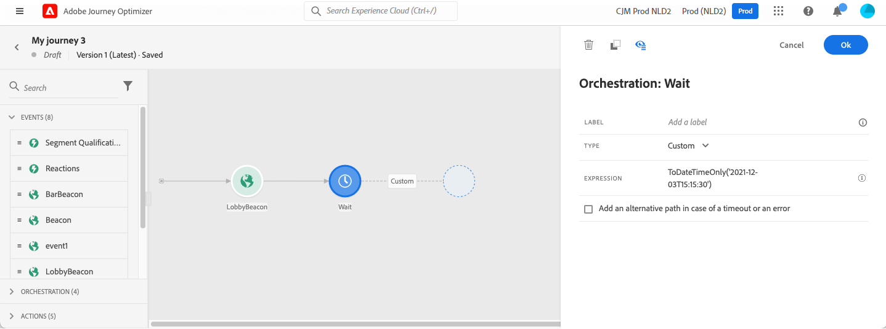

# 대기 활동 {#wait-activity}

>[!BEGINSHADEBOX]

**이 페이지에서:** 상대 기간 동안 또는 다음 활동이 실행되기 전에 사용자 지정 계산된 날짜까지 경로를 일시 중지하도록 대기 활동을 구성하는 방법에 대해 알아봅니다.

>[!ENDSHADEBOX]

>[!CONTEXTUALHELP]
>id="ajo_journey_wait"
>title="대기 활동"
>abstract="대기 활동을 사용하면 경로에서 다음 활동을 실행하기 전에 대기할 수 있습니다. 이를 통해 다음 활동이 실행되는 시점을 정의할 수 있습니다. 지속 기간과 사용자 정의와 같은 두 가지 옵션을 사용할 수 있습니다."

다음 활동을 실행하기 전에 **[!UICONTROL 대기]** 활동을 사용하여 기간을 정의할 수 있습니다.  최대 대기 기간은 **90일**&#x200B;입니다.

두 가지 유형의 **대기** 활동을 설정할 수 있습니다.

* 상대적 기간을 기반으로 한 대기. [자세히 알아보기](#duration)
* 함수를 사용하여 계산하는 사용자 지정 날짜입니다. [자세히 알아보기](#custom)

<!--
* [Email send time optimization](#email_send_time_optimization)
* [Fixed date](#fixed_date) 
-->

## 추천 {#wait-recommendations}

이러한 권장 사항을 사용하여 기다림을 예측 가능하고 안전하게 유지합니다.

### 여러 대기 활동 {#multiple-wait-activities}

여정에서 여러 **대기** 활동을 사용하는 경우 여정의 [전역 시간 초과](journey-properties.md#global_timeout)가 91일이므로 프로필이 입력한 후 항상 최대 91일 후에 여정에서 삭제됩니다. [이 페이지](journey-properties.md#global_timeout)에서 자세히 알아보십시오.

개인은 91일 여정 제한 시간 전에 대기 기간을 완료할 수 있는 충분한 시간이 여정에 남아 있는 경우에만 **대기** 활동을 입력할 수 있습니다.

### 대기 및 재입장 {#wait-reentrance}

**대기** 활동을 사용하여 다시 시작을 차단하지 않는 것이 좋습니다. 대신 여정 속성 수준에서 **재입력 허용** 옵션을 사용하십시오. [이 페이지](../building-journeys/journey-properties.md#entrance)에서 자세히 알아보십시오.

### 대기 및 테스트 모드 {#wait-test-mode}

테스트 모드에서 **[!UICONTROL 테스트의 대기 시간]** 매개 변수를 사용하면 각 **대기** 활동이 지속되는 시간을 정의할 수 있습니다. 기본 시간은 10초입니다. 이렇게 하면 테스트 결과를 빠르게 얻을 수 있습니다. [이 페이지](../building-journeys/testing-the-journey.md)에서 자세히 알아보십시오.

### 대기 및 모바일 채널 {#wait-mobile-channels}

[푸시 알림](../../rp_landing_pages/push-landing-page.md)을 보낸 직후 [인앱 메시지](../in-app/create-in-app.md)를 표시하려면 **대기** 활동을 사용하여 인앱 메시지 페이로드 시간을 전파하도록 허용하십시오. 일반적으로 5~15분 정도 기다리는 것이 좋지만 정확한 시간은 페이로드 복잡성과 개인화 요구 사항에 따라 달라질 수 있습니다.

## 구성 {#wait-configuration}

여기에서 대기 기간 및 시간을 구성합니다.

### 기간 대기 {#duration}

**Duration** 유형을 선택하여 다음 활동을 실행하기 전 대기 시간의 상대적 기간을 설정하십시오. 최대 기간은 **90일**&#x200B;입니다.

<!--
## Fixed date wait{#fixed_date}

Select the date for the execution of the next activity.

-->

### 사용자 지정 대기 {#custom}

이벤트에서 가져온 필드 또는 사용자 지정 작업 응답을 기반으로 하는 고급 식을 사용하여 사용자 지정 날짜를 정의하려면 **Custom** 유형을 선택하십시오. 상대적 기간(예: 7일)을 직접 정의할 수는 없지만, 필요한 경우 함수를 사용하여 계산할 수 있습니다(예: 구매 후 2일).

편집기의 식은 `dateTimeOnly` 형식을 제공해야 합니다. [이 페이지](expression/expressionadvanced.md)를 참조하십시오. dateTimeOnly 형식에 대한 자세한 내용은 [이 페이지](expression/data-types.md)를 참조하세요.

가장 좋은 방법은 프로필에만 해당되는 사용자 지정 날짜를 사용하고 모든 항목에 동일한 날짜를 사용하지 않는 것입니다. 예를 들어 `toDateTimeOnly('2024-01-01T01:11:00Z')`을(를) 정의하지 않고 각 프로필에 해당하는 `toDateTimeOnly(@event{Event.productDeliveryDate})`을(를) 정의하십시오. 고정 날짜를 사용하면 여정 실행에 문제가 발생할 수 있습니다. [이 섹션](entry-management.md#wait-activities-impact)에서 대기 활동이 여정 처리 속도에 미치는 영향에 대해 자세히 알아보세요.

>[!CAUTION]
>
>`dateTimeOnly` 식을 사용하여 작업할 때는 다음 사항에 유의하십시오.
>
>* `dateTimeOnly` 식을 직접 사용하거나 함수를 사용하여 해당 식으로 변환할 수 있습니다(예: `toDateTimeOnly(@event{Event.offerOpened.activity.endTime})`. 여기서 필드 값은 `2023-08-12T09:46:06Z` 형식입니다).
>* **표준 시간대**&#x200B;이(가) 여정 속성에 정의되어 있습니다. 따라서 UI에서 시간 및 시간대 오프셋을 혼합하는 전체 ISO-8601 타임스탬프(예: `2023-08-12T09:46:06.982-05`)를 지정할 수 없습니다. [자세히 알아보기](../building-journeys/timezone-management.md)
>* `toDateTimeOnly()`을(를) 사용하여 사용자 지정 대기 식을 작성하는 경우 **not**&#x200B;하여 `Z` 또는 시간대 오프셋(예: `-05:00`)을 추가하십시오. 표현식은 명확한 시간대 지정자 없이 여정이 구성한 시간대를 참조해야 합니다. 그렇지 않으면 프로필이 대기 활동에 걸릴 수 있습니다.
>
>| | 예 |
>| --- | --- |
>| **수정** | `toDateTimeOnly(concat(toString(toDateOnly(nowWithDelta(2, "days"))),"T10:00:00"))` |
>| **잘못됨** | `toDateTimeOnly(concat(toString(toDateOnly(nowWithDelta(2, "days"))),"T10:00:00Z"))` ❌(`Z` 포함) |

대기 활동이 예상대로 작동하는지 확인하려면 단계 이벤트를 사용할 수 있습니다. [자세히 알아보기](../reports/query-examples.md#common-queries)

## 대기 후 프로필 새로 고침 {#profile-refresh}

프로필이 **대상자 읽기** 활동으로 시작하는 여정의 **대기** 활동에 주차되어 있으면 여정은 UPS(통합 프로필 서비스)에서 프로필의 특성을 자동으로 새로 고쳐 사용 가능한 최신 데이터를 가져옵니다.

* **여정 항목에서**: 프로필은 여정 시작 시 평가된 대상 스냅숏의 특성 값을 사용합니다.
* **대기 노드 이후**: 여정이 조회를 수행하여 이전 스냅숏 데이터가 아닌 UPS에서 최신 프로필 데이터를 검색합니다. 즉, 여정이 시작된 후 프로필 속성이 변경되었을 수 있습니다.

이 비헤이비어는 다운스트림 활동이 대기 기간 후에 현재 프로필 정보를 사용하도록 합니다. 그러나 여정이 실행 전체에서 원본 스냅샷 데이터만 사용할 것으로 예상하면 예기치 않은 결과가 발생할 수 있습니다.

예: 여정 시작 시 프로필이 &quot;실버 고객&quot; 대상의 자격을 갖지만 3일 대기 동안 &quot;골드 고객&quot;으로 업그레이드하면 대기 후 활동에서 업데이트된 &quot;골드 고객&quot; 상태를 보게 됩니다.

## 자동 대기 노드  {#auto-wait-node}

>[!CONTEXTUALHELP]
>id="ajo_journey_auto_wait_node"
>title="자동 대기 노드 정보"
>abstract="이 인바운드 작업 후에는  **대기** 노드가 자동으로 삽입됩니다. 프로필이 메시지 또는 경험을 볼 수 있을 만큼 충분히 길게 여정에 남아 있도록 기본적으로 3일로 설정됩니다. 대기 기간은 사용 사례에서 필요한 경우 업데이트하거나 노드를 제거할 수 있습니다."

각 인바운드 경험 활동(인앱 메시지, 코드 기반 경험 또는 카드)에는 3일 **대기** 활동이 제공됩니다. 프로필이 여정 끝에 도달하면 인바운드 메시지가 자동으로 종료되므로 사용자가 적어도 3일 동안 이를 볼 수 있다고 가정합니다. 이 **대기** 활동을 제거하거나 필요한 경우 구성을 변경할 수 있습니다.

+++ AI 기술 자료 참조

이 단원에는 이 주제와 관련된 해석, 검색 및 질문 답변을 지원하기 위한 구조화된 지식이 포함되어 있습니다.

이해를 돕기 위해 이 정보를 이 페이지의 설명서와 통합해야 합니다. 두 소스 모두 독립적으로 사용하기 위한 것은 아닙니다. 이 페이지에서는 기능에 대해 설명하지만, 용어, 의도, 적용 가능성 및 제약 조건을 명확히 하는 데 도움이 되는 추가 컨텍스트를 제공합니다.

* **TL;DR:** 이 페이지에서는 다음 단계를 실행하기 전에 상대 기간 동안 또는 사용자 지정 계산된 날짜까지 프로필 진행을 일시 중지하도록 여정에서 대기 활동을 구성하는 방법을 설명합니다.

**의도:**

* 대기 활동을 추가하여 고정된 상대적 기간(최대 90일) 동안 여정을 일시 중지합니다.
* 프로필별 계산된 날짜까지 지연하도록 고급 표현식을 사용하여 사용자 지정 대기 구성
* 대기 활동이 여정 글로벌 시간 제한(91일)과 상호 작용하는 방법을 이해합니다
* 테스트의 대기 시간 매개 변수를 사용하여 테스트 모드 유효성 검사 속도를 높입니다.
* 대상자 읽기 여정에서 대기 노드 후에 프로필 속성을 새로 고치는 방법을 이해합니다

**용어집:**

* **대기 활동**: 지정된 기간 동안 또는 다음 활동이 *(제품별)을 실행하기 전에 계산된 날짜까지 프로필 진행을 일시 중지하는 여정 오케스트레이션 활동*
* **기간 대기**: 최대 90일 *(제품별)*&#x200B;을(를) 사용하여 일시 중지할 상대 기간을 설정하는 대기 유형입니다.
* **사용자 지정 대기**: 프로필 또는 이벤트 데이터에서 파생된 `dateTimeOnly` 식을 사용하여 재개를 위한 향후 특정 날짜/시간(*(제품별)*&#x200B;을(를) 정의하는 대기 유형입니다.
* **자동 대기 노드**: 인바운드 경험 활동(인앱, 코드 기반, 카드) 뒤에 3일 대기 활동이 자동으로 삽입되어 *(제품별) 콘텐츠를 볼 수 있을 만큼 오래 여정에 프로필을 유지합니다.*
* **테스트의 대기 시간**: 테스트 결과가 빠르게 반환되도록 실제 대기 기간(기본값 10초)을 무시하는 여정 테스트 모드 매개 변수 *(제품별)*

**보호 기능:**

* 최대 대기 기간은 90일입니다.
* 보류 중인 대기 활동과 관계없이 91일(전역 시간 초과) 이후 여정에서 프로필이 삭제됩니다.
* 여정에 91일 제한 시간 이전의 대기를 완료할 만큼 충분한 시간이 남아 있는 경우에만 프로필에서 대기 활동을 입력할 수 있습니다.
* 대기 활동을 사용하여 재입장을 차단하지 마십시오. 대신 여정 속성의 재진입 허용 옵션을 사용하십시오.
* 사용자 지정 대기 식은 `dateTimeOnly` 형식을 사용해야 하며 `Z` 접미사 또는 명시적 시간대 오프셋을 포함하지 않아야 합니다.
* 사용자 지정 대기에서 고정 정적 날짜(예: `toDateTimeOnly('2024-01-01T01:11:00Z')`)를 사용하면 문제가 발생할 수 있습니다. 대신 프로필별 동적 날짜를 사용하십시오.
* 대상자 읽기 여정의 대기 노드 후에 프로필 속성이 통합 프로필 서비스에서 새로 고쳐지므로 스냅샷 일관성이 필요한 경우 예기치 않은 결과가 발생할 수 있습니다.

**용어:**

* 정식 이름: 대기 활동 — 약어: 없음 — 변형: 대기 노드, 대기 단계
* 동의어: &quot;기간 대기&quot; = &quot;상대 대기&quot;; &quot;사용자 지정 대기&quot; = &quot;표현식 기반 대기&quot;
* 혼동하지 마십시오. &quot;기간 대기&quot;(상대적, 예: 지금부터 3일 후) ≠ &quot;사용자 지정 대기&quot;(프로필 데이터에서 절대 계산된 날짜)

**FAQ:**

* **Q: 대기 활동의 최대 기간은 얼마입니까?** — 최대 대기 기간은 90일입니다. 프로필에도 91일 글로벌 여정 제한 시간이 적용됩니다.
* **Q: 테스트 모드는 대기 활동을 어떻게 처리합니까?** — 테스트 모드에서 &quot;테스트의 대기 시간&quot; 매개 변수는 실제 대기 기간을 무시합니다. 기본값은 10초이므로 테스트가 빠르게 완료됩니다.
* **Q: 사용자 지정 대기 식에 Z를 추가하지 않아야 하는 이유는 무엇입니까?** — Z 또는 시간대 오프셋을 `toDateTimeOnly()` 식에 추가하면 프로필이 대기 활동에 걸릴 수 있습니다. 식은 여정의 구성된 시간대를 사용해야 합니다.
* **Q: 대기 노드 후에 프로필 특성이 업데이트됩니까?** — 예. 대상 읽기로 시작하는 여정에서 여정은 대기 후 통합 프로필 서비스의 프로필 속성을 새로 고침하므로 다운스트림 활동에서 원래 대상 스냅샷 데이터가 아닌 업데이트된 값을 볼 수 있습니다.
* **Q: 자동 대기 노드는 무엇입니까?** — 인바운드 경험 활동(인앱, 코드 기반, 카드) 후에 3일 대기 활동을 자동으로 삽입하여 프로필이 메시지를 볼 수 있을 만큼 충분히 오래 여정에 남아 있도록 합니다. 필요에 따라 제거하거나 재구성할 수 있습니다.

+++
