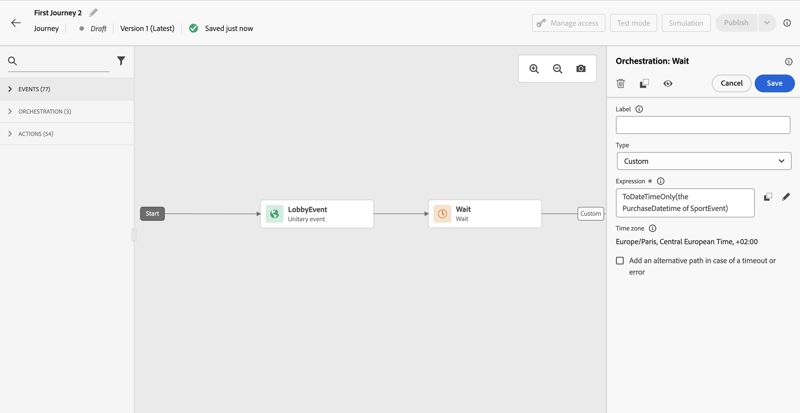

# 대기 활동 {#wait-activity}

>[!CONTEXTUALHELP]
>id="ajo_journey_wait"
>title="대기 활동"
>abstract="경로에서 다음 활동을 실행하기 전에 대기하려는 경우 대기 활동을 사용할 수 있습니다. 다음 활동이 실행되는 순간을 정의할 수 있습니다. 두 가지 옵션(지속 시간 및 사용자 지정)을 사용할 수 있습니다."

다음을 사용할 수 있습니다. **[!UICONTROL 대기]** 활동: 다음 활동을 실행하기 전에 기간을 정의합니다.  최대 대기 기간은 입니다. **29일**.

다음 유형을 사용할 수 있습니다.

* [기간](#duration)
* [사용자 지정](#custom)

<!--
* [Email send time optimization](#email_send_time_optimization)
* [Fixed date](#fixed_date) 
-->

## 추천 항목 {#wait-recommendations}

### 여러 대기 활동 {#multiple-wait-activities}

여러 개 사용 시 **대기** 여정의 활동에서는 전역 여정 시간 제한이 30일입니다. 즉, 프로필이 입력한 후 최대 30일 동안 여정에서 항상 드롭아웃됩니다. [이 페이지](../building-journeys/journey-gs.md#global_timeout)에서 자세히 알아보십시오.

개인이 다음을 입력할 수 있음: **대기** 활동은 30일 여정 제한 시간 이전에 대기 기간을 완료할 수 있는 충분한 시간이 여정에 남아 있는 경우에만 수행할 수 있습니다. 예를 들어, 두 개를 추가하는 경우 **대기** 각 20일로 설정된 활동은 두 번째 활동을 감지합니다. **대기** 활동은 30일 제한 후 종료됩니다. 두 번째 **대기** 따라서 활동이 무시되고 개인이 여정을 시작하기 전에 종료됩니다. 이 예에서는 고객이 여정에 총 20일 동안 머무르게 됩니다.

### 대기 후 재입장 {#wait-re-entrance}

사용하지 않는 모범 사례 **대기** 재입장을 차단하는 활동. 대신 **재등록 허용** 여정 속성 수준의 옵션입니다. [이 페이지](../building-journeys/journey-gs.md#entrance)에서 자세히 알아보십시오.

### 대기 및 테스트 모드 {#wait-test-modd}

테스트 모드에서 **[!UICONTROL 테스트의 대기 시간]** 매개 변수를 사용하면 각 시간을 정의할 수 있습니다 **대기** 활동이 지속됩니다. 기본 시간은 10초입니다. 이렇게 하면 테스트 결과를 빠르게 얻을 수 있습니다. [이 페이지](../building-journeys/testing-the-journey.md)에서 자세히 알아보십시오.

## 기간 대기 {#duration}

다음 항목 선택 **기간** 을 입력하여 다음 활동을 실행하기 전 대기 시간을 설정합니다. 최대 기간은 다음과 같습니다. **29일**.

<!--
## Fixed date wait{#fixed_date}

Select the date for the execution of the next activity.

-->

## 사용자 지정 대기 {#custom}

다음 항목 선택 **사용자 정의** 이벤트에서 가져온 필드 또는 사용자 지정 작업 응답을 기반으로 하는 고급 표현식을 사용하여 사용자 지정 날짜를 정의합니다. 상대적 기간(예: 7일)을 직접 정의할 수는 없지만, 필요한 경우 함수를 사용하여 계산할 수 있습니다(예: 구매 후 2일).

편집기의 표현식에서 다음을 제공해야 합니다. `dateTimeOnly` 포맷. [이 페이지](expression/expressionadvanced.md)를 참조하십시오. dateTimeOnly 형식에 대한 자세한 내용은 [이 페이지](expression/data-types.md).

가장 좋은 방법은 프로필에만 해당되는 사용자 지정 날짜를 사용하고 모든 항목에 동일한 날짜를 사용하지 않는 것입니다. 예를 들어 다음을 정의하지 마십시오 `toDateTimeOnly('2024-01-01T01:11:00Z')` 오히려 `toDateTimeOnly(@event{Event.productDeliveryDate})` 각 프로필에 따라 다릅니다. 고정 날짜를 사용하면 여정 실행에 문제가 발생할 수 있습니다.

>[!NOTE]
>
>다음을 활용할 수 있습니다. `dateTimeOnly` 표현식 또는 함수를 사용하여 `dateTimeOnly`. 예: `toDateTimeOnly(@event{Event.offerOpened.activity.endTime})`, 이벤트의 필드가 2023-08-12T09 양식임:46:6Z.
>
>다음 **시간대** 은 여정 속성에서 필요합니다. 그 결과, 사용자 인터페이스에서, 2023-08-12T09와 같은 전체 ISO-8601 타임스탬프 혼합 시간 및 시간대 오프셋을 직접 지정할 수 없습니다:46:06.982-05. [자세히 알아보기](../building-journeys/timezone-management.md).

대기 활동이 예상대로 작동하는지 확인하려면 단계 이벤트를 사용할 수 있습니다. [자세히 알아보기](../reports/query-examples.md#common-queries).

<!--## Email send time optimization{#email_send_time_optimization}

This type of wait uses a score calculated in Adobe Experience Platform. The score calculates the propensity to click or open an email in the future based on past behavior. Note that the algorithm calculating the score needs a certain amount of data to work. As a result, when it does not have enough data, the default wait time will apply. At publication time, you'll be notified that the default time applies.

>[!NOTE]
>
>The first event of your journey must have a namespace.
>
>This capability is only available after an **[!UICONTROL Email]** activity. You need to have Adobe Campaign Standard.

1. In the **[!UICONTROL Amount of time]** field, define the number of hours to consider to optimize email sending.
1. In the **[!UICONTROL Optimization type]** field, choose if the optimization should increase clicks or opens.
1. In the **[!UICONTROL Default time]** field, define the default time to wait if the predictive send time score is not available.

    >[!NOTE]
    >
    >Note that the send time score can be unavailable because there is not enough data to perform the calculation. In this case, you will be informed, at publication time, that the default time applies.

-->
