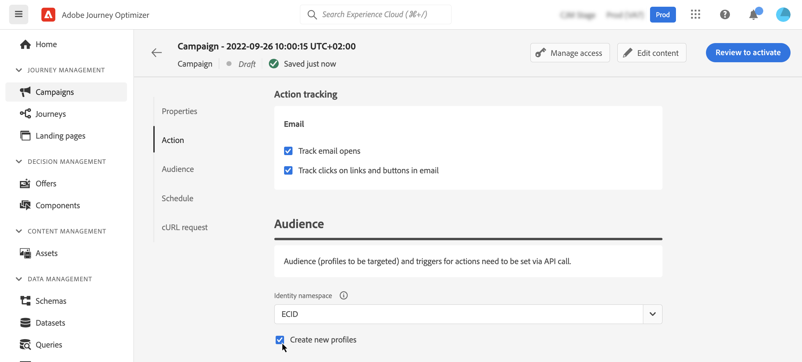

# API를 사용하여 캠페인 트리거 {#trigger-campaigns}

>[!CONTEXTUALHELP]
>id="ajo_campaigns_api_profile_creation"
>title="캠페인 유형"
>abstract="프로필을 만들지 않고 메시지를 보내는 제한된 가용성 기능을 사용하려면 설명서에 기재되어 있는 단계를 따르십시오."

## API 트리거 캠페인 기본 정보 {#about}

포함 [!DNL Journey Optimizer], 캠페인을 만든 다음 를 사용하는 사용자 트리거에 따라 외부 시스템에서 캠페인을 호출할 수 있습니다. [대화형 메시지 실행 REST API](https://developer.adobe.com/journey-optimizer-apis/references/messaging/#tag/execution). 이를 통해 암호 재설정, OTP 토큰 등과 같은 다양한 마케팅 및 트랜잭션 메시지 요구 사항을 처리할 수 있습니다.

이렇게 하려면 먼저 Journey Optimizer에서 API 트리거 캠페인을 만든 다음 API 호출을 통해 실행을 시작해야 합니다.

API 트리거 캠페인에 사용할 수 있는 채널은 이메일, SMS 및 푸시 메시지입니다.

>[!NOTE]
>
>현재 빠른 전송 모드는 푸시 알림 API 트리거 캠페인에 대해 지원되지 않습니다.

## API 트리거 캠페인 만들기 {#create}

### 캠페인 구성 및 활성화 {#create-activate}

API 트리거 캠페인을 만들려면 아래 단계를 따르십시오. 캠페인을 만드는 방법에 대한 자세한 내용은에서 확인할 수 있습니다. [이 섹션](create-campaign.md).

1. 을(를) 사용하여 새 캠페인 만들기 **[!UICONTROL API 트리거됨]** 유형.

1. 다음을 선택합니다. **[!UICONTROL 마케팅]** 또는 **[!UICONTROL 트랜잭션]** 카테고리(전송하려는 통신 유형에 따라 다름)

1. 메시지를 보내는 데 사용할 지원되는 채널 및 관련 채널 표면 중 하나를 선택한 다음 를 클릭합니다 **[!UICONTROL 만들기]**.

   

1. 캠페인에 대한 제목과 설명을 지정한 다음 **[!UICONTROL 콘텐츠 편집]** 보낼 메시지를 구성합니다.

   >[!NOTE]
   >
   >메시지를 개인화하는 데 활용할 수 있는 API 페이로드에 추가 데이터를 전달할 수 있습니다. [자세히 알아보기](#contextual)
   >
   >콘텐츠에 수많은 상황별 데이터 또는 방대한 컨텍스트 데이터를 사용하면 성능에 영향을 줄 수 있습니다.

1. 다음에서 **[!UICONTROL 대상자]** 섹션에서 개인을 식별하는 데 사용할 네임스페이스를 지정합니다.

   * 다음을 만드는 경우 **트랜잭션**-type campaign을 사용하면 API 호출에서 타겟팅된 프로필을 정의해야 합니다. 다음 **[!UICONTROL 새 프로필 만들기]** 옵션을 사용하면 데이터베이스에 없는 프로필을 자동으로 만들 수 있습니다. [캠페인 실행 시 프로필 만들기에 대해 자세히 알아보기](#profile-creation)

   * 대상 **마케팅**-type campaigns, 클릭 **[!UICONTROL 대상자]** 타깃팅할 대상을 선택하는 단추입니다.

1. 캠페인의 시작 및 종료 날짜를 구성합니다.

   캠페인에 대한 특정 시작 날짜 및/또는 종료 날짜를 구성하는 경우 이 날짜 외에는 실행되지 않으며, API에 의해 캠페인이 트리거되면 API 호출이 실패합니다.

1. 클릭 **[!UICONTROL 활성화하려면 검토]** 캠페인이 올바르게 구성되었는지 확인한 다음, 활성화합니다.

이제 API에서 캠페인을 실행할 준비가 되었습니다. [자세히 알아보기](#execute)

### 캠페인 실행 {#execute}

캠페인이 활성화되면 생성된 샘플 cURL 요청을 검색하고 API에 사용하여 페이로드를 빌드하고 캠페인을 트리거해야 합니다.

1. 캠페인을 연 다음, 다음에서 샘플 요청을 복사하여 붙여넣습니다. **[!UICONTROL cURL 요청]** 섹션.

   

1. 이 cURL 요청을 API에 사용하여 페이로드를 빌드하고 캠페인을 트리거합니다. 자세한 내용은 [대화형 메시지 실행 API 설명서](https://developer.adobe.com/journey-optimizer-apis/references/messaging/#tag/execution).

   API 호출 예는 에서도 사용할 수 있습니다 [이 페이지](https://developer.adobe.com/journey-optimizer-apis/references/messaging-samples/).

   >[!NOTE]
   >
   >캠페인을 생성할 때 특정 시작 날짜 및/또는 종료 날짜를 구성했다면 이 날짜 이후에 실행되지 않고 API 호출이 실패합니다.

## API가 트리거된 캠페인에서 컨텍스트 속성 사용 {#contextual}

API 트리거 캠페인을 사용하면 API 페이로드에서 추가 데이터를 전달하고 캠페인 내에서 이를 사용하여 메시지를 개인화할 수 있습니다.

고객이 암호를 재설정하고자 하고 서드파티 도구에서 생성된 암호 재설정 URL을 전송하고자 하는 이 예를 살펴보겠습니다. API 트리거된 캠페인을 사용하면 이렇게 생성된 URL을 API 페이로드에 전달하고 이를 캠페인에 활용하여 메시지에 추가할 수 있습니다.

>[!NOTE]
>
>프로필 활성화 이벤트와 달리 REST API에서 전달된 컨텍스트 데이터는 일회성 통신에 사용되며 프로필에 대해 저장되지 않습니다. 네임스페이스가 누락된 경우 최대 네임스페이스 세부 정보로 프로필이 만들어집니다.

캠페인에서 이러한 데이터를 사용하려면 해당 데이터를 API 페이로드에 전달하고 표현식 편집기를 사용하여 메시지에 추가해야 합니다. 이렇게 하려면 `{{context.<contextualAttribute>}}` 구문, 여기서 `<contextualAttribute>` 은 전달할 데이터를 포함하는 API 페이로드의 변수 이름과 일치해야 합니다.

다음 `{{context.<contextualAttribute>}}` 구문은 문자열 데이터 형식에만 매핑됩니다.

>[!IMPORTANT]
>
>요청에 전달된 컨텍스트 속성은 50kb를 초과할 수 없으며 항상 유형 문자열을 고려합니다.
>
>다음 `context.system` 구문은 Adobe 내부 사용으로만 제한되며 컨텍스트 속성을 전달하는 데 사용해서는 안 됩니다.

지금은 왼쪽 레일 메뉴에서 사용할 수 있는 컨텍스트 속성이 없습니다. 속성은 개인 맞춤화 표현식에서 직접 입력해야 하며, 다음에서 검사를 수행하지 않습니다. [!DNL Journey Optimizer].

## 캠페인 실행 시 프로필 만들기 {#profile-creation}

경우에 따라 시스템에 없는 프로필로 트랜잭션 메시지를 보내야 할 수도 있습니다. 예를 들어 알 수 없는 사용자가 웹 사이트에서 암호를 재설정하려고 하는 경우입니다.

데이터베이스에 프로필이 없는 경우, Journey Optimizer에서 캠페인을 실행할 때 프로필을 자동으로 만들어 이 프로필로 메시지를 보낼 수 있습니다.

>[!IMPORTANT]
>
>트랜잭션 메시지의 경우 이 기능은에 제공됩니다 **매우 작은 볼륨 프로필 만들기** 대량의 프로필이 이미 플랫폼에 존재하는 대용량 트랜잭션 전송 사용 사례의 경우.

캠페인 실행 시 프로필 만들기를 활성화하려면 **[!UICONTROL 새 프로필 만들기]** 옵션이에 있음 **[!UICONTROL 대상자]** 섹션. 이 옵션이 비활성화되면 모든 전송에 대해 알 수 없는 프로필이 거부되고 API 호출이 실패합니다.

>[!NOTE]
>
>알 수 없는 프로필이 **AJO 대화형 메시징 프로필 데이터 세트** 데이터 세트, 각 아웃바운드 채널(이메일, SMS 및 푸시)에 대한 기본 네임스페이스(이메일, 전화 및 ECID) 각각 3개
