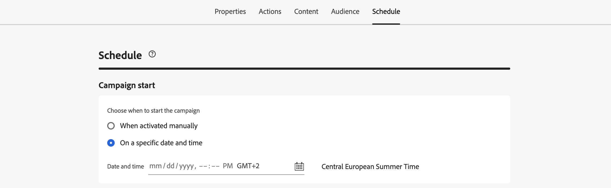

# 작업 캠페인 예약 {#action-campaign-schedule}

**[!UICONTROL 일정]** 탭을 사용하여 캠페인 일정을 정의합니다.

## 캠페인 시작일 설정

기본적으로 작업 캠페인은 수동으로 활성화되면 시작되고 메시지가 한 번 전송되는 즉시 종료됩니다. 활성화 직후 캠페인을 실행하지 않으려면 **[!UICONTROL 캠페인 시작]** 섹션에서 메시지를 보낼 날짜와 시간을 지정할 수 있습니다.

[!DNL Adobe Journey Optimizer]에서 캠페인을 예약할 때는 시작 날짜/시간이 원하는 첫 번째 게재에 맞춰졌는지 확인합니다. 반복 캠페인의 경우 초기 예약 시간이 이미 경과했을 때는 캠페인이 반복 규칙에 따라 다음 사용 가능한 시간 슬롯으로 넘어갑니다.

## 수신자의 현지 시간에 전송 {#profile-timezone}

>[!CONTEXTUALHELP]
>id="ajo_campaigns_schedule_profile_timezone"
>title="프로필 시간대 사용"
>abstract="각 수신자의 프로필 시간대를 기반으로 메시지를 전송합니다. 모든 수신자는 지리적 위치에 관계없이 동일한 현지 시간에 메시지를 수신하게 됩니다. 시스템은 Adobe Experience Platform 프로필의 &quot;시간대&quot; 필드를 사용하며, 캠페인 생성자의 시간대는 대체 항목으로 사용됩니다."

특정 날짜 및 시간에 대한 캠페인을 예약할 때 각 수신자의 프로필 시간대를 기반으로 메시지를 보내도록 선택할 수 있습니다. 이렇게 하면 지리적 위치에 관계없이 모든 수신자가 동일한 현지 시간에 메시지를 받을 수 있습니다.

예를 들어 프로필 시간대를 사용하여 오전 9시에 전송하는 캠페인을 예약하는 경우 뉴욕(ET)의 수신자는 오전 9시(ET)에, 로스앤젤레스(PT)의 수신자는 오전 9시(PT)에 수신하게 됩니다.

>[!AVAILABILITY]
>
>이 기능은 제한된 가용성입니다. 액세스 권한을 얻으려면 Adobe 담당자에게 문의하십시오.
>
>이메일, 푸시, SMS, WhatsApp 및 LINE과 같은 아웃바운드 채널에 대해서만 프로필 시간대를 사용하여 예약할 수 있습니다.

프로필 시간대 예약을 활성화하려면:

1. **[!UICONTROL 캠페인 시작]** 섹션에서 메시지를 보낼 날짜와 시간을 지정합니다.

1. **[!UICONTROL 프로필 시간대 사용]** 옵션을 사용하도록 설정합니다.

   

**작동 방식:**

시스템은 각 수신자의 Adobe Experience Platform 프로필에서 `profile.timeZone` 필드를 사용하여 해당 로컬 시간대를 결정합니다. 프로필에 시간대 값이 없는 경우 시스템은 캠페인이 생성된 시간대를 대체 항목으로 사용합니다.

모든 시간대에 메시지가 배달되는 동안 캠페인은 **Live** 상태로 유지됩니다. 모든 시간대가 처리되면 캠페인 상태가 **완료됨**(으)로 변경됩니다.

**지원되는 표준 시간대 식별자:**

Journey Optimizer은 표준 IANA 시간대 식별자에 대해 `profile.timeZone` 값의 유효성을 검사합니다. 식별자는 대소문자를 구분하며 공식 IANA 명명과 일치해야 합니다. 일광 절약 시간제 규칙 및 이전 업데이트로 인해 시간 경과에 따라 오프셋이 변경될 수 있습니다. 공식적인 식별자 목록은 [IANA 시간대 데이터베이스](https://www.iana.org/time-zones){_blank}를 참조하십시오.

## 실행 빈도 설정

**이메일**, **SMS** 및 **푸시 알림** 작업의 경우 캠페인 메시지를 보낼 빈도를 정의할 수 있습니다. 이렇게 하려면 캠페인 만들기 화면에서 **[!UICONTROL 작업 트리거]** 옵션을 사용하여 캠페인을 매일, 매주 또는 매월 실행할지 여부를 지정합니다.

>[!NOTE]
>
>**이메일** 작업의 경우 특정 IP 준비 계획 활성화 캠페인을 만들 수 있습니다. 캠페인 일정은 해당 일정과 연결될 IP 준비 계획에 의해 좌우되며, 이는 일정이 캠페인 자체에서 더 이상 정의되지 않음을 의미합니다. [IP 준비 캠페인을 만드는 방법을 알아보세요](../configuration/ip-warmup-campaign.md).

## 종료 날짜 설정

**[!UICONTROL 캠페인 끝]** 섹션에서 캠페인 실행을 중지해야 하는 시기를 지정할 수 있습니다. 지정한 날짜 외에는 캠페인이 실행되지 않습니다.

## 속도 제어 설정

[!DNL Journey Optimizer]을(를) 통해 아웃바운드 동작(전자 메일, SMS, 푸시 알림)에 대한 속도 제어를 사용하도록 설정할 수 있습니다.

이 기능은 랜딩 페이지나 고객 지원 플랫폼과 같은 다운스트림 시스템의 오버로드를 방지하는 데 특히 유용합니다. 예를 들어, 속도가 초당 165개의 메시지로 제한하여 다운스트림 시스템을 압도하지 않고도 지속적인 전송을 보장할 수 있습니다.

속도 제어를 설정하려면 **[!UICONTROL 배달 설정]** 섹션에서 **[!UICONTROL 배달 스로틀]** 옵션을 활성화하고 원하는 **[!UICONTROL 초당 배달 속도]**&#x200B;를 지정하십시오.

* 지원되는 최소 게재 속도: 초당 1개.
* 지원되는 최대 배달 속도: &quot;배달 스로틀&quot; 옵션이 활성화된 경우 초당 2000입니다.

>[!IMPORTANT]
>
>게재 속도를 설정할 때 캠페인 대상자가 실행할 수 있는 최대 기간은 12시간입니다. 게재 속도가 12시간 이내에 모든 대상자에게 메시지를 보낼 수 없는 값으로 설정된 경우 나머지 프로필은 캠페인에서 제외됩니다. 캠페인 보고서에서 제외된 이러한 프로필의 수를 볼 수 있습니다.

## 다음 단계 {#next}

캠페인 일정이 준비되면 캠페인을 검토하고 활성화할 수 있습니다. [자세히 알아보기](review-activate-campaign.md)
