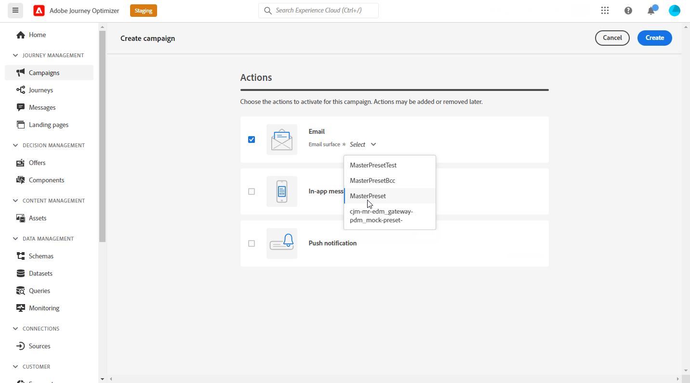
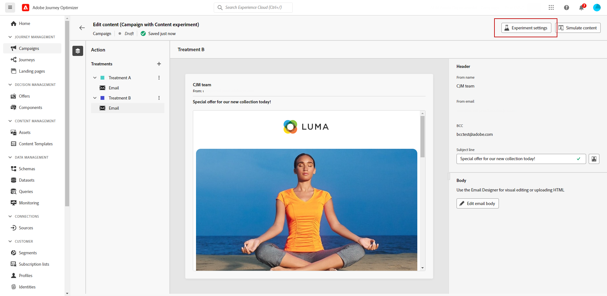

# 콘텐츠 실험 만들기 {#content-experiment}

>[!CONTEXTUALHELP]
>id="ajo_campaigns_content_experiment"
>title="콘텐츠 실험"
>abstract="여러 배달 처리를 정의하고 대상을 위한 최상의 조합을 결정하기 위해 게재 콘텐츠, 제목 또는 발신자를 다르게 선택할 수 있습니다."

>[!AVAILABILITY]
>
>다음 **컨텐츠 실험** 기능은 현재 조직 집합(제한된 가용성)에만 사용할 수 있습니다. 자세한 내용은 Adobe 직원에게 문의하십시오.

Journey Optimizer 컨텐츠 실험을 사용하면 타겟 대상자에게 가장 적합한 경험을 측정하기 위해 여러 전달 처리를 정의할 수 있습니다. 게재 콘텐츠, 제목 또는 발신자를 변경하도록 선택할 수 있습니다. 관심 대상자는 지정된 지표에 가장 잘 작동하는 대상을 결정하기 위해 각 처리에 무작위로 할당됩니다.

>[!NOTE]
>
>컨텐츠 실험을 시작하기 전에 보고 구성이 사용자 지정 데이터 세트에 대해 설정되어 있는지 확인하십시오. 자세한 내용은 [이 섹션](reporting-configuration.md)을 참조하십시오.

아래 예에서는 게재 대상이 두 그룹으로 분할되어, 각각 타겟팅된 모집단의 45%를 나타내고, 10%의 상위 그룹은 게재를 받지 않습니다.

타겟팅된 대상의 각 사람은 다음 두 가지 중 하나에 해당하는 제목 줄이 있는 한 가지 버전의 이메일을 받게 됩니다.

* 한 오퍼가 새 컬렉션과 이미지에 대해 10% 오퍼를 직접 홍보합니다.
* 다른 오퍼는 이미지 없이 10% 할인을 지정하지 않고 특별 오퍼만 광고합니다.

여기서 목표는 수신자가 수신된 실험에 따라 이메일과 상호 작용하는지 확인하는 것입니다. 그러므로 우리는 **[!UICONTROL 이메일 열기]** 을 이 컨텐츠 실험에서의 기본 목표 지표로 사용하십시오.

## 캠페인 만들기 {#campaign-experiment}

1. 에서 **[!UICONTROL 캠페인]** 페이지를 클릭한 다음 **[!UICONTROL 캠페인 만들기]**.

   

1. 채널을 선택하고 **[!UICONTROL 서피스]** 이 게재에 을(를) 사용하고 **[!UICONTROL 만들기]**. 자세한 내용은 [채널 서피스](../configuration/channel-surfaces.md) 페이지.

   

1. 설정 **[!UICONTROL 속성]** 게재 시:
   * **[!UICONTROL 이름]**
   * **[!UICONTROL 설명]**

1. 타겟팅할 대상을 정의합니다. 이렇게 하려면 **[!UICONTROL 대상 선택]** 사용 가능한 Adobe Experience Platform 세그먼트 목록을 표시하는 단추. [세그먼트에 대해 자세히 알아보기](../segment/about-segments.md)

   에서 **[!UICONTROL ID 네임스페이스]** 필드에서 선택한 세그먼트에서 개인을 식별하는 데 사용할 네임스페이스를 선택합니다. [자세히 알아보기](get-started-experiment.md#content-experiment-work)

   

1. 에서 **[!UICONTROL 작업 추적]** 섹션에서 수신자가 게재에 어떻게 반응하는지를 추적할지 지정합니다. 클릭 및/또는 열기를 추적할 수 있습니다.

   캠페인이 실행되면 캠페인 보고서에서 추적 결과에 액세스할 수 있습니다.

1. 특정 날짜 또는 반복 빈도로 캠페인을 실행하려면 를 구성합니다 **[!UICONTROL 예약]** 섹션을 참조하십시오. [자세히 알아보기](create-campaign.md)

1. 클릭 **[!UICONTROL 컨텐츠 편집]** 을(를) 사용하여 게재 개인화를 시작합니다. [자세히 알아보기](../email/content-from-scratch.md)

   

1. 에서 **[!UICONTROL 컨텐츠 편집]** 창, 처리 A 개인화 시작.

   이 처리를 위해 제목 줄에 특별 오퍼를 직접 지정하고 개인화를 추가합니다.

   

## 콘텐츠 실험 구성 {#configure-experiment}

1. 게재를 개인화할 때 캠페인 요약 페이지에서 을 클릭합니다 **[!UICONTROL 실험 만들기]** 컨텐츠 실험 구성을 시작합니다.

   

1. 을(를) 선택합니다 **[!UICONTROL 성공 지표]** 실험용으로 설정하려고 합니다.

   테스트를 위해 **[!UICONTROL 전자 메일 열기]** 프로모션 코드가 제목 줄에 있는 경우 수신자가 이메일을 열는지 테스트하기 위해.

   

1. 클릭 **[!UICONTROL 치료 추가]** 필요한 만큼 새로운 치료법을 만드는 것.

   

1. 변경 **[!UICONTROL 제목]** 그들을 더 잘 차별화하기 위해 당신의 치료들을

1. 추가 선택 **[!UICONTROL 홀드아웃]** 그룹화하여 게재할 수 있습니다. 이 그룹은 이 캠페인에서 콘텐츠를 받지 않습니다.

   전환 표시줄을 켜면 모집단의 10%가 자동으로 전환되며, 필요한 경우 이 백분율을 조정할 수 있습니다.

   

1. 그런 다음 각 항목에 정확한 백분율을 할당하도록 선택할 수 있습니다 **[!UICONTROL 치료]** 또는 **[!UICONTROL 균등하게 분배]** 막대 전환

   

1. 클릭 **[!UICONTROL 만들기]** 구성을 설정할 때.

## 치료 디자인 {#treatment-experiment}

1. 에서 **[!UICONTROL 컨텐츠 편집]** 창에서 처리 B를 선택하여 내용을 변경합니다.

   여기서는 오퍼를 **[!UICONTROL 제목 줄]**.

   

1. 클릭 **[!UICONTROL 이메일 본문 편집]** 치료 B를 추가로 개인화합니다.

   

1. 트리트먼트 디자인 후 **[!UICONTROL 추가 작업]** 치료 관련 옵션에 액세스하려면 다음을 수행하십시오. **[!UICONTROL 이름 변경]**, **[!UICONTROL 복제]** 및 **[!UICONTROL 삭제]**.

   

1. 필요한 경우 **[!UICONTROL 실험 설정]** 메뉴 를 사용하여 처리 구성을 변경할 수 있습니다.

   

1. 메시지 콘텐츠가 정의되면 **[!UICONTROL 컨텐츠 시뮬레이션]** 버튼을 클릭하여 게재 렌더링을 제어하고 테스트 프로필로 개인화 설정을 확인합니다. [자세히 알아보기](../email/preview.md)

1. 컨텐츠 실험이 준비되면 캠페인 요약 페이지에서 다음을 클릭할 수 있습니다 **[!UICONTROL 활성화 검토]** 캠페인 요약을 표시합니다. 매개 변수가 잘못되었거나 누락된 경우 경고가 표시됩니다.

   

1. 캠페인이 올바르게 구성되었는지 확인하고 를 클릭합니다. **[!UICONTROL 활성화]** 실행

   

실험 및 캠페인을 구성한 후 캠페인 보고서를 통해 게재의 성공을 따를 수 있습니다.

## 목표 보고서 {#objectives-global}

>[!AVAILABILITY]
>
>컨텐츠 실험 기능은 현재 조직 집합(제한된 가용성)에만 사용할 수 있습니다. 자세한 내용은 Adobe 직원에게 문의하십시오.

다음 **[!UICONTROL 목표]** 캠페인 보고서의 탭을 사용하면 하나의 특정 지표를 타깃팅하여 게재 보고서를 더 잘 세밀하게 조정할 수 있습니다.

다음 **[!UICONTROL 목표]** 나열됨 **[!UICONTROL 데이터 세트]** 추가 정보를 검색할 수 있도록 시스템에 대한 연결을 정의합니다. 기본 제공 목록 **[!UICONTROL 목표]** 을(를) 사용할 수 있지만, 새 항목을 추가하여 자신의 ID를 추가할 수 있습니다 **[!UICONTROL 데이터 집합]**. 자세한 절차는 다음을 참조하십시오 [섹션](reporting-configuration.md).

타깃팅할 목표를 선택한 후 두 목표를 설정합니다 **[!UICONTROL 성능 개요]** 및 **[!UICONTROL 캠페인 목표]** 위젯은 게재 성능에 대한 자세한 요약을 제공합니다.

사용 **[!UICONTROL 캠페인 목표]** 위젯을 사용하면 주요 목표를 다른 지표와 비교하도록 선택할 수도 있습니다.

필요한 경우 각 위젯의 크기를 조정하고 삭제할 수 있습니다. 자세한 내용은 다음을 참조하십시오 [섹션](../reports/global-report.md#modify-dashboard).

## 실험 보고서 {#experimentation-global}

>[!CONTEXTUALHELP]
>id="ajo_campaigns_content_experiment_click"
>title="프로필당 고유한 클릭 수"
>abstract="프로필당 고유 클릭 수 지표는 경험이 대상을 얼마나 효과적으로 참여시키고 클릭 수를 타겟 대상으로 유도하는지를 이해하는 데 도움이 됩니다. 특정 링크에 대한 개별 클릭 수를 링크에 노출된 총 프로필 수로 나눈 값을 계산합니다."

>[!AVAILABILITY]
>
>컨텐츠 실험 기능은 현재 조직 집합(제한된 가용성)에만 사용할 수 있습니다. 자세한 내용은 Adobe 직원에게 문의하십시오.

캠페인에서 **[!UICONTROL 글로벌 보고서]**, **[!UICONTROL 실험]** 탭에서는 각 변형의 수행 방식과 가장 적합한 수행자가 있는 경우의 기본 정보에 대해 자세히 설명합니다.

가장 뛰어난 수행자를 정의하는 데 시간이 걸릴 수 있으며 이 아이콘은 이 아이콘으로 표시됩니다 .

다음 **[!UICONTROL 실험 결과]** 위젯은 각 변형의 성능을 자세히 설명합니다. 기준 요소 중 하나를 선택한 다음 **[!UICONTROL 기준선]** 드롭다운. 가장 좋은 치료는 별 아이콘으로 표시됩니다.

이 표에는 다음 지표가 나와 있습니다.

* **[!UICONTROL 프로필]**: 이 처리를 타겟팅한 프로필 수입니다.

* **[!UICONTROL 고유한 아웃바운드 클릭 수]**: 아웃바운드 채널 간 총 클릭 수.

* **[!UICONTROL 프로필당 카운트]**: 실험 목표 지표의 합계 값을 프로필 수로 나눈 값입니다.

* **[!UICONTROL 신뢰도 구간]**: 기준 요소와 가장 성과가 좋은 처리 간의 성능 차이율. [자세히 알아보기](../campaigns/experiment-calculations.md#confidence-intervals).

* **[!UICONTROL 평균 상승도]**: 기준선에 대해 지정된 처리의 전환율 비율 개선. [자세히 알아보기](../campaigns/experiment-calculations.md#understand-lift)

* **[!UICONTROL 신뢰도]**: 주어진 치료가 기본 치료와 동일하다는 증거. [자세히 알아보기](../campaigns/experiment-calculations.md#understand-confidence)

이러한 결과에 대해 자세히 알아보고 해석하는 방법은 다음을 참조하십시오 [이 페이지](../campaigns/get-started-experiment.md#interpret-results).
