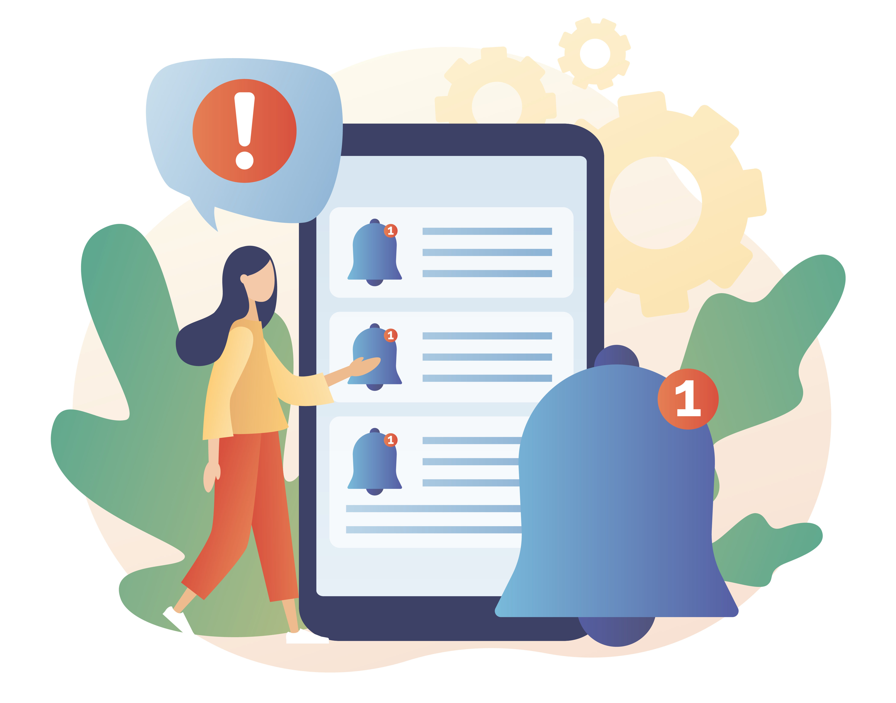
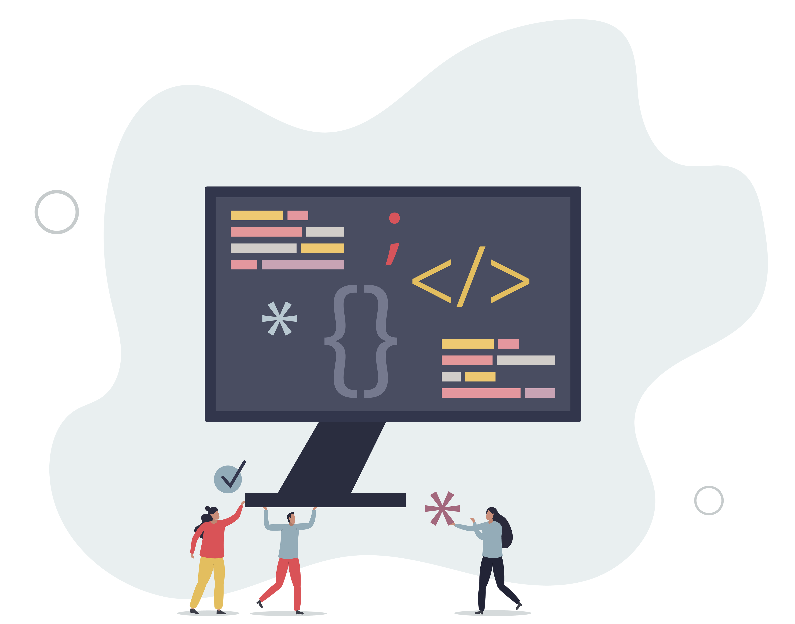

# 캠페인 만들기 {#create-campaign}

새 캠페인을 만들려면 왼쪽 레일에서 **[!UICONTROL 캠페인]** 메뉴로 이동한 다음 **[!UICONTROL 캠페인 만들기]**&#x200B;를 클릭합니다. 기존 라이브 캠페인을 복제하여 새 캠페인을 만들 수도 있습니다. [방법을 알아보세요](modify-stop-campaign.md#duplicate).

시작하기 전에 [이 페이지](get-started-with-campaigns.md#before-starting-campaign-prerequisites)에서 캠페인 필수 구성 요소를 읽어 보세요.

## 캠페인 유형 선택 {#campaigntype}

>[!CONTEXTUALHELP]
>id="ajo_campaigns_campaign_type"
>title="캠페인 유형"
>abstract="**예약된 캠페인**&#x200B;은 즉시 또는 지정된 날짜에 실행되며 마케팅 유형 메시지 전송을 의미합니다. **API 트리거** 캠페인은 API 호출을 사용하여 실행됩니다. 이는 마케팅 메시지(사용자 동의가 필요한 프로모션 메시지) 또는 트랜잭션 메시지(특정 상황에서 구독하지 않은 프로필에도 보낼 수 있는 비상업적 메시지)를 전송하는 것을 목표로 합니다."

새 캠페인을 만들 때 먼저 캠페인 유형을 선택해야 합니다. 세 가지 유형의 캠페인을 사용할 수 있습니다.

1. **[!UICONTROL 예약됨 - 마케팅]** - 이러한 캠페인은 즉시 실행되거나 지정된 날짜에 실행됩니다. 예약된 캠페인은 **마케팅** 메시지를 보내거나 인바운드 작업을 만드는 것을 목표로 합니다. 사용자 인터페이스에서 구성 및 실행됩니다.

1. **[!UICONTROL API 트리거됨 - 마케팅]** - 이러한 캠페인은 API 호출을 사용하여 실행됩니다. 이 유형의 캠페인을 선택하여 개인화된 마케팅 커뮤니케이션을 타겟팅된 대상자에게 보냅니다.  [API를 사용하여 캠페인을 트리거하는 방법을 알아봅니다](api-triggered-campaigns.md)

1. **[!UICONTROL API 트리거됨 - 트랜잭션]** - API 트리거됨 - 마케팅 캠페인과 동일하며, 이러한 캠페인은 API 호출을 사용하여 실행됩니다. API 트리거 트랜잭션 캠페인은 **트랜잭션** 메시지(예: 암호 재설정 요청, 장바구니 구매 등 개인이 수행한 작업에 따라 전송된 메시지)를 보내는 것을 목표로 합니다.  [API를 사용하여 캠페인을 트리거하는 방법을 알아봅니다](api-triggered-campaigns.md)

   

## 캠페인 속성 정의 {#create}

캠페인이 만들어지면 속성을 정의해야 합니다. 아래의 단계를 수행하십시오.

1. **[!UICONTROL 속성]** 섹션에서 캠페인의 이름과 설명을 입력하십시오.

   <!--To test the content of your message, toggle the **[!UICONTROL Content experiment]** option on. This allows you to test multiple variables of a delivery on populations samples, in order to define which treatment has the biggest impact on the targeted population.[Learn more about content experiment](../content-management/content-experiment.md).-->

1. (선택 사항) **태그** 필드를 사용하여 Adobe Experience Platform 통합 태그를 캠페인에 할당합니다. 태그를 할당하면 캠페인을 간단히 분류하고 캠페인 목록에서 편하게 검색할 수 있습니다. [태그를 사용하여 작업하는 방법을 알아봅니다](../start/search-filter-categorize.md#tags).

1. (선택 사항) 액세스 레이블에 따라 이 캠페인에 대한 액세스를 제한할 수 있습니다. 액세스 제한을 추가하려면 이 페이지 상단의 **[!UICONTROL 액세스 관리]** 버튼을 찾아보십시오. 사용 권한이 있는 레이블만 선택해야 합니다. [개체 수준 액세스 제어에 대해 자세히 알아보세요](../administration/object-based-access.md).

## 캠페인 대상자 정의 {#audience}

이제 캠페인의 대상자를 선택할 수 있습니다. 대상자는 유사한 행동 및/또는 특성을 공유하는 사람들의 집합입니다.

>[!IMPORTANT]
>
>* [대상 구성](../audience/get-started-audience-orchestration.md)의 대상 및 특성을 현재 Healthcare Shield 또는 Privacy and Security Shield에서 사용할 수 없습니다.
>
>* API 트리거 캠페인의 경우, 대상자는 API 호출을 통해 설정되어야 합니다.

예약된 마케팅 캠페인에 의해 타겟팅된 모집단을 정의하려면 다음 단계를 따르십시오.

1. **대상** 섹션에서 **[!UICONTROL 대상 선택]** 단추를 클릭하여 사용 가능한 Adobe Experience Platform 대상 목록을 표시합니다. [이 섹션](../audience/about-audiences.md)에서 대상자에 대해 자세히 알아보세요.

1. **[!UICONTROL ID 유형]** 필드에서 선택한 대상에서 개인을 식별하는 데 사용할 키 유형을 선택합니다. 기존 ID 유형을 사용하거나 Adobe Experience Platform ID 서비스를 사용하여 새 ID 유형을 만들 수 있습니다. 표준 ID 네임스페이스는 [이 페이지](https://experienceleague.adobe.com/en/docs/experience-platform/identity/features/namespaces#standard){target="_blank"}에 나열됩니다.

   캠페인당 하나의 ID 유형만 허용됩니다. 다른 ID 중에서 선택한 ID 유형이 없는 세그먼트에 속하는 개인은 캠페인에서 타깃팅할 수 없습니다.

   

   [Adobe Experience Platform 설명서](https://experienceleague.adobe.com/docs/experience-platform/identity/home.html?lang=ko-KR){target="_blank"}에서 ID 유형 및 네임스페이스에 대해 자세히 알아보세요.

   <!--If you are are creating an API-triggered campaign, the **[!UICONTROL cURL request]** section allows you to retrieve the **[!UICONTROL Campaign ID]** to use in the API call. [Learn more](api-triggered-campaigns.md)-->

## 채널 선택 {#channel}

이제 채널과 해당 구성을 선택할 수 있습니다. 아래의 단계를 수행하십시오.

1. **[!UICONTROL 작업]** 섹션에서 통신 채널을 선택합니다.

   사용 가능한 채널 목록은 라이선스 모델 및 추가 기능에 따라 다릅니다. API 트리거 캠페인의 경우 이메일, SMS 및 푸시 알림 채널만 사용할 수 있습니다.

1. 채널 구성을 선택합니다.

   [시스템 관리자](../start/path/administrator.md)에 의해 구성이 정의되었습니다. 여기에는 헤더 매개변수, 하위 도메인, 모바일 앱 등 메시지 전송을 위한 모든 기술적 매개변수가 포함되어 있습니다. [자세히 알아보기](../configuration/channel-surfaces.md).

   마케팅 캠페인 유형과 호환되는 채널 구성만 드롭다운 목록에 나열됩니다.

   

   >[!NOTE]
   >
   >푸시 알림 캠페인을 만드는 경우 대량으로 매우 빠른 푸시 메시지를 전송할 수 있는 Journey Optimizer 추가 기능인 **[!UICONTROL 빠른 전송 모드]**&#x200B;를 사용하도록 설정할 수 있습니다. [자세히 알아보기](../push/create-push.md#rapid-delivery)

## 콘텐츠 편집 {#content}

이제 **[!UICONTROL 콘텐츠 편집]** 단추에서 메시지의 콘텐츠를 정의할 수 있습니다. 콘텐츠 만들기 프로세스는 선택한 채널에 따라 다릅니다.

다음 페이지에서 메시지 콘텐츠를 만드는 자세한 단계를 배웁니다.

<table style="table-layout:fixed"><tr style="border: 0;">
<td>

<a href="../email/create-email.md"><strong>이메일</strong></a>
</td>
<td>

<a href="../sms/create-sms.md"><strong>SMS</strong></a>
</td>
<td>

<a href="../push/create-push.md"><strong>푸시 알림</strong></a>
</td>
<td>

<a href="../direct-mail/create-direct-mail.md"><strong>다이렉트 메일</strong></a>
</td>
</tr></table>

<table style="table-layout:fixed"><tr style="border: 0;">
<td>

<a href="../in-app/create-in-app.md"><strong>인앱</strong></a>
</td>
<td>

<a href="../web/create-web.md"><strong>웹</strong></a>
</td>
<td>

<a href="../code-based/create-code-based.md"><strong>코드 기반 경험</strong></a>
</td>
<td>

<a href="../content-card/create-content-card.md"><strong>콘텐츠 카드</strong></a>
</td>
</tr></table>

콘텐츠가 정의되면 **[!UICONTROL 콘텐츠 시뮬레이션]** 버튼을 사용하여 CSV/JSON 파일에서 업로드하거나 수동으로 추가한 테스트 프로필 또는 샘플 입력 데이터로 콘텐츠를 미리 보고 테스트합니다. [자세히 알아보기](../content-management/preview-test.md) 캠페인 생성 화면으로 돌아가려면 왼쪽 화살표를 클릭합니다.

메시지 콘텐츠 자체 외에도 다음 설정을 구성할 수 있습니다.

1. (선택 사항) **[!UICONTROL 콘텐츠 실험]** 섹션에서 **[!UICONTROL 실험 만들기]** 단추를 사용하여 더 잘 작동하는 콘텐츠를 테스트할 수 있습니다. 콘텐츠 실험 기능은 [이 섹션](../content-management/content-experiment.md)에 자세히 설명되어 있습니다.

1. **[!UICONTROL 작업 추적]** 섹션에서 수신자가 게재에 반응하는 방식을 추적할지 여부를 지정합니다. 클릭 및/또는 열기를 추적할 수 있습니다.

   캠페인이 실행되면 캠페인 보고서에서 추적 결과에 액세스할 수 있습니다. [캠페인 보고서에 대해 자세히 알아보기](../reports/campaign-global-report-cja.md)

## 캠페인 예약 {#schedule}

>[!CONTEXTUALHELP]
>id="ajo_campaigns_schedule"
>title="캠페인 일정"
>abstract="기본적으로 캠페인은 수동 활성화 시 시작되고 메시지가 전송된 후에 즉시 종료됩니다. 메시지를 보낼 특정 날짜와 시간을 유연하게 설정할 수 있습니다. 또한 반복 캠페인이나 API 트리거 캠페인의 종료 날짜를 지정할 수 있습니다. 액션 트리거에서 환경 설정에 맞게 메시지 전송 빈도를 구성할 수도 있습니다."

>[!CONTEXTUALHELP]
>id="ajo_campaigns_schedule_start"
>title="캠페인 시작"
>abstract="메시지를 전송해야 하는 날짜와 시간을 지정합니다."

>[!CONTEXTUALHELP]
>id="ajo_campaigns_schedule_end"
>title="캠페인 종료"
>abstract="반복 캠페인 실행을 중지해야 하는 시점을 지정합니다."

>[!CONTEXTUALHELP]
>id="ajo_campaigns_schedule_triggers"
>title="캠페인 액션 트리거"
>abstract="캠페인 메시지를 전송해야 하는 빈도를 정의합니다."

기본적으로 예약된 캠페인은 수동으로 활성화되면 시작되고 메시지가 한 번 전송되는 즉시 종료됩니다.

활성화 직후 캠페인을 실행하지 않으려면 **[!UICONTROL 캠페인 시작]** 옵션을 사용하여 메시지를 보낼 날짜와 시간을 지정할 수 있습니다. **[!UICONTROL 캠페인 끝]** 옵션을 사용하면 캠페인 실행을 중지해야 하는 시기를 지정할 수 있습니다.

이메일, SMS 및 푸시 알림 캠페인의 경우 캠페인 메시지를 전송해야 하는 빈도를 정의할 수 있습니다. 이렇게 하려면 캠페인 만들기 화면에서 **[!UICONTROL 작업 트리거]** 옵션을 사용하여 캠페인을 매일, 매주 또는 매월 실행할지 여부를 지정합니다.

>[!NOTE]
>
>[!DNL Adobe Journey Optimizer]에서 캠페인을 예약할 때 시작 날짜/시간이 원하는 첫 번째 게재에 맞춰졌는지 확인하십시오. 반복 캠페인의 경우 초기 예약 시간이 이미 경과한 경우 캠페인은 반복 규칙에 따라 다음 사용 가능한 시간 슬롯으로 롤오버됩니다.

## 기타 설정 {#settings}

일부 설정은 캠페인에 대해 선택한 통신 채널에만 적용되거나 특정 사용 사례에 사용됩니다. 자세한 내용은 아래에 설명되어 있습니다.

* 이메일의 경우 특정 IP 웜업 플랜 활성화 캠페인을 만들 수 있습니다. 자세한 내용은 [이 섹션](../configuration/ip-warmup-campaign.md)을 참조하십시오.
* 웹, 인앱 및 코드 기반 채널의 경우 캠페인에 우선 순위 점수를 할당할 수 있습니다. 자세한 내용은 [이 섹션](../conflict-prioritization/priority-scores.md)을 참조하십시오.
* 콘텐츠 카드 캠페인의 경우 추가 게재 규칙을 활성화하여 메시지를 트리거하는 이벤트 및 기준을 선택할 수 있습니다. 자세한 내용은 [이 섹션](../content-card/create-content-card.md)을 참조하십시오.
* 인앱 메시지의 경우 **[!UICONTROL 트리거 편집]** 단추를 사용하여 메시지를 트리거하는 이벤트 및 기준을 선택할 수 있습니다. 자세한 내용은 [이 섹션](../in-app/create-in-app.md)을 참조하십시오.

## 다음 단계 {#next}

캠페인 구성 및 콘텐츠가 준비되면 이를 검토하고 활성화할 수 있습니다. [자세히 알아보기](review-activate-campaign.md)
