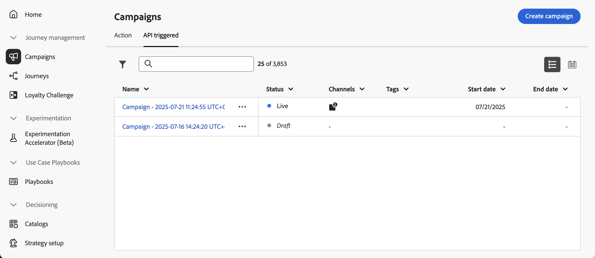

# 캠페인 액세스 및 관리 {#manage-campaigns}

>[!CONTEXTUALHELP]
>id="ajo_targeting_workflow_list"
>title="오케스트레이션된 캠페인 인벤토리"
>abstract="이 화면에서 오케스트레이션된 캠페인의 전체 목록에 액세스하고 현재 상태, 마지막/다음 실행 일자를 확인하고 오케스트레이션된 새 캠페인을 만들 수 있습니다."

>[!CONTEXTUALHELP]
>id="ajo_orchestration_campaign_action"
>title="작업"
>abstract="이 섹션에는 오케스트레이션된 캠페인 내부에서 사용되는 모든 액션이 나열됩니다."

캠페인은 **[!UICONTROL 캠페인]** 메뉴에서 액세스할 수 있습니다. 탭을 사용하여 유형별로 캠페인을 찾아보세요. **작업** 캠페인, **API 트리거** 캠페인 및 **오케스트레이션** 캠페인. [캠페인 유형](get-started-with-campaigns.md#get-started-with-campaigns)에 대해 자세히 알아보세요. 사용 가능한 유형은 사용권 계약 및 사용 권한에 따라 다릅니다.

>[!BEGINTABS]

>[!TAB 액션 캠페인]

작업 캠페인 목록에 액세스하려면 **[!UICONTROL 작업]** 탭을 선택하십시오.

기본적으로 목록에는 **[!UICONTROL 초안]**, **[!UICONTROL 예약됨]** 및 **[!UICONTROL 라이브]** 상태의 모든 캠페인이 표시됩니다. 중지, 완료 및 보관된 캠페인을 표시하려면 필터를 지워야 합니다.

>[!TAB API 트리거 캠페인]

API 트리거 캠페인 목록에 액세스하려면 **[!UICONTROL API 트리거]** 탭을 선택하십시오.

기본적으로 목록에는 **[!UICONTROL 초안]**, **[!UICONTROL 예약됨]** 및 **[!UICONTROL 라이브]** 상태의 모든 캠페인이 표시됩니다. 중지, 완료 및 보관된 캠페인을 표시하려면 필터를 지워야 합니다.

>[!TAB 오케스트레이션된 캠페인]

오케스트레이션된 캠페인 목록에 액세스하려면 **[!UICONTROL 오케스트레이션]** 탭을 선택하십시오.

{zoomable="yes"}{zoomable="yes"}

목록의 오케스트레이션된 각 캠페인에는 캠페인의 현재 [상태](#status), 연결된 채널 및 태그 또는 마지막으로 수정한 시간 등의 정보가 표시됩니다.  버튼을 클릭하여 표시되는 열을 사용자 정의할 수 있습니다.

>[!ENDTABS]

또한 목록에서 쉽게 검색할 수 있도록 검색 창과 필터를 사용할 수 있습니다. 예를 들어 지정된 채널 또는 태그와 연결된 캠페인 또는 특정 날짜 범위 동안 만들어진 캠페인만 표시하도록 캠페인을 필터링할 수 있습니다.

캠페인 인벤토리의 ](assets/do-not-localize/rule-builder-icon-more.svg)액션 더 보기 버튼을 표시하는 이미지

* **[!UICONTROL 모든 시간 보고서 보기]** / **[!UICONTROL 최근 24시간 보고서 보기]** - 보고서에 액세스하여 캠페인의 영향과 성과를 측정하고 시각화할 수 있습니다. [캠페인 보고서](../reports/campaign-global-report-cja.md)에 대해 자세히 알아보세요.
* **[!UICONTROL 태그 편집]** - 캠페인에 연결된 태그를 편집합니다. [캠페인에서 태그를 사용하는 방법](../start/search-filter-categorize.md#add-tags-to-an-object) 알아보기
* **[!UICONTROL 복제]** - 이 옵션을 사용하여 캠페인을 복제합니다. 예를 들어 중지된 오케스트레이션된 캠페인을 실행할 수 있습니다. [자세히 알아보기](#duplicate-a-campaign)
* **[!UICONTROL 삭제]** - 이 옵션을 사용하여 캠페인을 삭제합니다. [자세히 알아보기](#delete-a-campaign)
* **[!UICONTROL 보관]** - 캠페인을 보관합니다. 보관된 모든 캠페인은 마지막 수정 날짜 30일 후 롤링 일정에서 삭제됩니다. 이 작업은 **[!UICONTROL 초안]** 캠페인을 제외한 모든 캠페인에 사용할 수 있습니다. [캠페인 보관](#archive-a-campaign)에 대해 자세히 알아보세요.

작업 및 API 트리거 캠페인의 경우 아래의 추가 작업을 사용할 수 있습니다.

* **[!UICONTROL 패키지에 추가]** - 다른 샌드박스로 내보내려면 패키지에 캠페인을 추가하십시오. [다른 샌드박스로 개체를 내보내는 방법](../configuration/copy-objects-to-sandbox.md)을 알아보세요.
* **[!UICONTROL 초안 버전 열기]** - 캠페인의 새 버전이 만들어지고 아직 활성화되지 않은 경우 이 작업을 사용하여 해당 초안 버전에 액세스할 수 있습니다.

## 캠페인 라이프사이클 {#statuses}

Adobe Journey Optimizer에서 각 캠페인은 인터페이스에서의 상태에 반영되는 라이프사이클을 통해 이동합니다. 사용 가능한 상태는 캠페인 유형(작업, API 트리거 또는 오케스트레이션)에 따라 다릅니다. 아래 탭을 사용하여 각 캠페인 유형과 관련된 라이프사이클 및 상태를 살펴보십시오.

>[!BEGINTABS]

>[!TAB 액션 캠페인]

* **[!UICONTROL 초안]**: 캠페인이 편집 중이며 활성화되지 않았습니다.
* **[!UICONTROL 예약됨]**: 캠페인이 특정 시작 날짜에 활성화되도록 구성되었습니다.
* **[!UICONTROL Live]**: 캠페인이 활성화되었습니다.
* **[!UICONTROL 검토 중]**: 게시할 승인을 위해 캠페인이 제출되었습니다. [승인 작업 방법 알아보기](../test-approve/gs-approval.md)
* **[!UICONTROL 중지됨]**: 캠페인이 수동으로 중지되었습니다. 더 이상 활성화하거나 재사용할 수 없습니다. [캠페인을 중지하는 방법 알아보기](manage-campaigns.md#stop)
* **[!UICONTROL 완료]**: 캠페인이 완료되었습니다. 이 상태는 캠페인이 활성화된 후 3일 또는 캠페인 종료 날짜(반복 실행이 있는 경우)에 자동으로 할당됩니다.
* **[!UICONTROL 실패]**: 캠페인을 실행하지 못했습니다. 로그를 확인하여 문제를 파악합니다.
* **[!UICONTROL 보관됨]**: 캠페인이 보관되었습니다. [캠페인을 보관하는 방법 알아보기](manage-campaigns.md#archive)

>[!NOTE]
>
>**[!UICONTROL Live]** 또는 **[!UICONTROL 예약됨]** 상태 옆에 있는 &quot;초안 버전 열기&quot; 아이콘은 새 버전의 작업 또는 API 트리거 캠페인이 만들어졌고 아직 활성화되지 않았음을 나타냅니다.

>[!TAB API 트리거 캠페인]

* **[!UICONTROL 초안]**: 캠페인이 편집 중이며 활성화되지 않았습니다.
* **[!UICONTROL 예약됨]**: 캠페인이 특정 시작 날짜에 활성화되도록 구성되었습니다.
* **[!UICONTROL Live]**: 캠페인이 활성화되었습니다.
* **[!UICONTROL 검토 중]**: 게시할 승인을 위해 캠페인이 제출되었습니다. [승인 작업 방법 알아보기](../test-approve/gs-approval.md)
* **[!UICONTROL 중지됨]**: 캠페인이 수동으로 중지되었습니다. 더 이상 활성화하거나 재사용할 수 없습니다. [캠페인을 중지하는 방법 알아보기](manage-campaigns.md#stop)
* **[!UICONTROL 완료]**: 캠페인이 완료되었습니다. 이 상태는 캠페인이 활성화된 후 3일 또는 캠페인 종료 날짜(반복 실행이 있는 경우)에 자동으로 할당됩니다.
* **[!UICONTROL 실패]**: 캠페인을 실행하지 못했습니다. 로그를 확인하여 문제를 파악합니다.
* **[!UICONTROL 보관됨]**: 캠페인이 보관되었습니다. [캠페인을 보관하는 방법 알아보기](manage-campaigns.md#archive)

>[!NOTE]
>
>**[!UICONTROL Live]** 또는 **[!UICONTROL 예약됨]** 상태 옆에 있는 &quot;초안 버전 열기&quot; 아이콘은 새 버전의 작업 또는 API 트리거 캠페인이 만들어졌고 아직 활성화되지 않았음을 나타냅니다.

>[!TAB 오케스트레이션된 캠페인]

* **[!UICONTROL 초안]**: 오케스트레이션된 캠페인이 만들어졌습니다. 아직 게시되지는 않았습니다.
* **[!UICONTROL 게시]**: 오케스트레이션된 캠페인이 게시되고 있습니다.
* **[!UICONTROL Live]**: 오케스트레이션된 캠페인이 게시되어 실행 중입니다.
* **[!UICONTROL 예약됨]**: 오케스트레이션된 캠페인 실행이 예약되었습니다.
* **[!UICONTROL 완료됨]**: 오케스트레이션된 캠페인 실행이 완료되었습니다. 완료됨 상태는 캠페인이 오류 없이 메시지 전송을 완료한 후 최대 3일까지 자동으로 할당됩니다.
* **[!UICONTROL 종료됨]**: 이 상태는 반복 캠페인이 종료되었을 때 표시됩니다. 캠페인은 모든 활동이 완료될 때까지 실행을 계속하지만 더 이상 새로운 프로필이 캠페인에 입장할 수 없습니다.
* **[!UICONTROL 보관됨]**: 오케스트레이션된 캠페인이 보관되었습니다. 보관된 모든 캠페인은 마지막 수정일로부터 30일이 지나면 변경된 일정에 따라 삭제됩니다. 필요한 경우 보관된 캠페인을 복제하여 계속 작업할 수 있습니다.
* **[!UICONTROL 중지됨]**: 오케스트레이션된 캠페인 실행이 중지되었습니다. 캠페인을 다시 시작하려면 복제해야 합니다.

>[!ENDTABS]

캠페인 중 하나에서 오류가 발생하면 캠페인 상태와 함께 경고 아이콘이 표시됩니다. 경고와 관련된 정보를 표시하려면 이 패널을 클릭합니다. 이러한 경고는 캠페인 메시지가 게시되지 않았거나 선택한 구성이 잘못된 경우와 같은 다양한 상황에서 발생할 수 있습니다.

## 캠페인 캘린더 {#calendar}

>[!CONTEXTUALHELP]
>id="ajo_campaigns_view"
>title="캠페인 목록 및 캘린더 보기"
>abstract="캠페인 목록 외에도 [!DNL Journey Optimizer]는 캠페인에 대한 캘린더 보기를 제공하여 일정을 명확하게 시각적으로 보여 줍니다. 이들 버튼을 사용하여 언제든지 목록 보기와 캘린더 보기 사이를 전환할 수 있습니다."

[!DNL Journey Optimizer]은(는) 캠페인 목록 외에 캠페인의 일정 보기를 제공하여 일정에 대한 명확한 시각적 표현을 제공합니다.

캠페인 표시 방법:

* 기본적으로 달력 표에는 선택한 주에 대한 모든 라이브 및 예약된 캠페인이 표시됩니다. 추가 필터 옵션은 특정 유형 또는 채널의 완료된 활성화, 중지된 활성화 및 완료된 활성화를 표시할 수 있습니다.
* 초안 캠페인은 표시되지 않습니다.
* 여러 날에 걸친 캠페인이 달력 격자의 맨 위에 나타납니다.
* 시작 시간을 지정하지 않으면 가장 가까운 수동 활성화 시간이 달력에 배치됩니다.
* 캠페인은 1시간 시간대로 표시되지만, 실제 전송 또는 완료 시간은 반영되지 않습니다.

캠페인 캘린더에서 탐색하려면 다음 작업을 수행하십시오.

1.  아이콘을 클릭하여 캠페인 일정에 액세스합니다.

1. 화살표 단추 또는 달력 위의 날짜 선택기를 사용하여 주 사이를 이동합니다.

   캘린더에 현재 주에 예약된 모든 캠페인이 표시됩니다.

   

1.  아이콘을 클릭하여 여러 날 또는 여러 주에 걸친 항목 표시를 전환합니다.

   

1. 최대 3개의 외부 일정을 관리하고 추가하려면  아이콘을 클릭하십시오.

   

1. 이벤트 이름, 시작 날짜 및 종료 날짜가 포함된 CSV 파일을 끌어서 놓습니다.

   업로드된 이벤트는 조직의 모든 사용자에 대해 표시되며 여정 및 캠페인 달력 모두에 표시됩니다.

   +++CSV 형식은 다음과 같아야 합니다.

   | 열1 | 열2 | 열3 |
   |-|-|-|
   | 이벤트 이름 | 시작 일자(mm/dd/yy 형식) | 종료일(mm/dd/yy 형식) |

   +++

1. 필요한 경우 추가된 외부 캘린더를 숨기거나 숨김을 해제하거나 제거할 수 있습니다.

   

1. 캠페인에 대한 자세한 내용을 보려면 해당 시각적 블록을 클릭하여 캠페인에 대한 세부 정보를 엽니다. 유형, 보고서에 대한 액세스 권한 또는 할당된 태그 등 캠페인에 대한 다양한 정보가 있는 정보 창이 열립니다.

   정보 창이 열린 

## 반복 작업 캠페인 수정 및 중지 {#modify}

### 액션 캠페인 수정

반복 작업 캠페인의 새 버전을 수정하고 만들려면 다음 단계를 수행합니다.

1. 작업 캠페인을 연 다음 **[!UICONTROL 캠페인 수정]** 단추를 클릭합니다.

1. 캠페인의 새 버전이 만들어집니다. **[!UICONTROL 라이브 버전 열기]**&#x200B;를 클릭하여 라이브 버전을 확인할 수 있습니다.

   

   캠페인 목록에서 진행 중인 초안 버전의 활성화된 캠페인이 **[!UICONTROL 상태]** 열에 특정 아이콘과 함께 표시됩니다. 이 아이콘을 클릭하여 캠페인의 초안 버전을 엽니다.

   

1. 변경 사항이 준비되면 새 버전의 캠페인을 활성화할 수 있습니다([캠페인 검토 및 활성화](create-campaign.md#review-activate) 참조).

   >[!IMPORTANT]
   >
   >초안을 활성화하면 캠페인의 라이브 버전이 대체됩니다.

### 액션 캠페인 중지 {#stop}

반복 캠페인을 중지하려면 해당 캠페인을 연 다음 **[!UICONTROL 캠페인 중지]** 단추를 클릭하십시오.

>[!IMPORTANT]
>
>캠페인을 중지해도 진행 중인 전송은 중지되지 않지만, 전송이 이미 진행 중인 경우 예약된 전송 또는 다음 항목이 중지됩니다.

## 캠페인 보관 {#archive}

시간이 지남에 따라 캠페인 목록이 계속 증가하고 결국 완료 및 중지된 캠페인을 탐색하는 것이 더 어려워집니다.

이를 방지하기 위해 더 이상 필요하지 않은 완료 및 중지된 캠페인을 보관할 수 있습니다. 이렇게 하려면 줄임표 버튼을 클릭한 다음 **[!UICONTROL 보관]**&#x200B;을(를) 선택합니다.

보관된 캠페인은 목록의 전용 필터를 사용하여 검색할 수 있습니다.

## 캠페인 삭제 {#delete}

캠페인을 삭제하려면 추가 작업 단추이미지를 사용하고 **[!UICONTROL 삭제]**&#x200B;를 선택하십시오.

{width="70%" align="left"}

>[!IMPORTANT]
>
>이 옵션은 **[!UICONTROL 초안]** 캠페인에만 사용할 수 있습니다.

## 캠페인 복제 {#duplicate}

캠페인을 복제하려면, 예를 들어 중단된 경우 추가 작업 단추이미지를 사용하고 **[!UICONTROL 복제]**&#x200B;를 선택하십시오.

캠페인 이름을 입력하고 확인합니다.

캠페인이 만들어지고 캠페인 목록에 추가됩니다.
