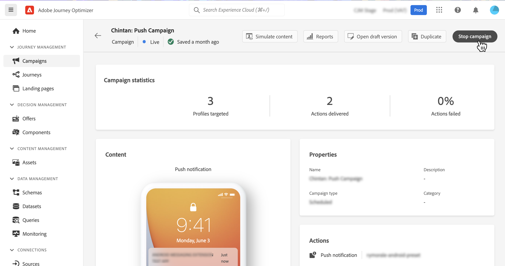
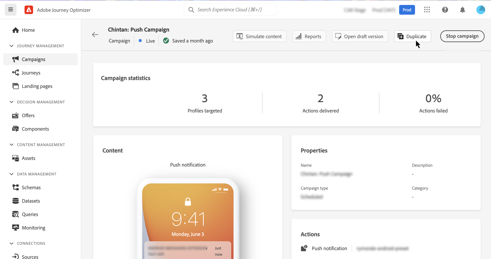

# 라이브 캠페인 관리 {#modify-stop-campaign}

캠페인이 활성화되면 언제든지 수정하거나 중지할 수 있습니다. 이러한 작업은 반복 실행이 있는 캠페인에만 사용할 수 있습니다.

또한 라이브 캠페인(한 번 또는 반복 실행으로 실행)을 복제하여 새 캠페인을 만들 수도 있습니다.

## 반복 캠페인 수정 {#modify}

반복 캠페인의 새 버전을 수정하고 만들려면 다음 단계를 수행합니다.

1. 캠페인을 연 다음 **[!UICONTROL Modify campaign]** 버튼을 클릭합니다.

1. 캠페인의 새 버전이 만들어집니다. 를 클릭하여 라이브 버전을 확인할 수 있습니다 **[!UICONTROL Open live version]**.

   

   캠페인 목록에서 초안 버전이 진행 중인 활성화된 캠페인이 의 특정 아이콘과 함께 표시됩니다 **[!UICONTROL Status]** 열. 이 아이콘을 클릭하여 캠페인의 초안 버전을 엽니다.

   

1. 변경 사항이 준비되면 새 버전의 캠페인을 활성화할 수 있습니다(참조). [캠페인 검토 및 활성화](create-campaign.md#review-activate)).

   >[!IMPORTANT]
   >
   >초안을 활성화하면 캠페인의 라이브 버전이 대체됩니다.

## 반복 캠페인 중지 {#stop}

반복 캠페인을 중지하려면 해당 캠페인을 연 다음 **[!UICONTROL Stop campaign]** 버튼을 클릭합니다.

>[!IMPORTANT]
>
>캠페인을 중지하면 진행 중인 전송이 중지되지는 않지만 전송 작업이 진행 중인 경우 예약된 전송을 중지하거나 다음 작업이 중지됩니다.

<!-- inbound campaign (inapp): can stop and resume -->

## 캠페인 복제 {#duplicate}

라이브 캠페인을 복제하여 새 캠페인을 만들 수 있습니다. 이렇게 하려면 캠페인을 연 다음 **[!UICONTROL Duplicate]**.

