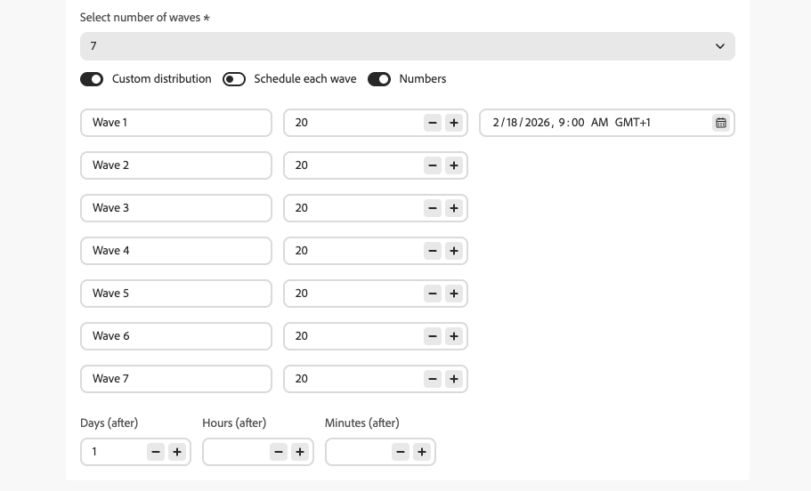

# 캠페인에서 웨이브를 사용하여 보내기 {#send-using-waves}

아웃바운드 캠페인 메시지 게재를 여러 배치(예약된 일괄 처리)로 나누어 시간별로 예약할 수 있습니다. Wave Sending은 특히 대량 전송을 위해 로드 밸런스를 조정하고, 과도한 다운스트림 시스템(예: 콜 센터나 랜딩 페이지)을 방지하고, 전달성과 발신자의 평판을 지원합니다.

<!--
>[!CAUTION]
>
>Wave sending applies to **outbound** actions only (Email, SMS, Push, Direct mail).
-->

Journey Optimizer을 사용하면 예약된 일괄 처리 수, 크기(대상의 백분율 또는 절대수로 표시) 및 각 일괄 처리가 실행되는 시기를 정의할 수 있습니다.

## 제한 사항 및 보호 기능 {#limitations-guardrails}

* 웨이브 전송은 **아웃바운드** 작업에만 적용됩니다(전자 메일, SMS, 푸시, DM).
* **2개 이상의 예약된 일괄 처리**&#x200B;를 정의해야 하며 최대 **10개의 예약된 일괄 처리**&#x200B;를 추가할 수 있습니다.
* 두 예약된 일괄 처리 시작 사이의 최소 간격은 **30분**&#x200B;입니다.
* 웨이브 시작은 캠페인 시작 전이거나 과거일 수 없습니다.

## 웨이브 전송 구성 {#configure-wave-sending}

캠페인에서 웨이브를 보내는 방법과 시기를 구성하려면 아래 단계를 수행합니다.

1. 아웃바운드 동작(예: 이메일, SMS, 푸시)이 포함된 [동작 캠페인](create-campaign.md)을 만들거나 엽니다.

1. 캠페인의 **[!UICONTROL 일정]** 탭에서 **[!UICONTROL 캠페인 동작 전달]**&#x200B;을 선택합니다.

   {width="100%"}

   >[!NOTE]
   >
   >**[!UICONTROL 캠페인 동작 전달]** 옵션은 캠페인의 **[!UICONTROL 동작]** 탭에서 아웃바운드 동작을 선택한 경우에만 표시됩니다. [자세히 알아보기](campaign-action.md)

1. 전송할 예약된 일괄 처리 수를 설정합니다(예: 4).

   >[!NOTE]
   >
   >최소한 2개의 웨이브를 정의해야 하며 최대 10개의 웨이브를 추가할 수 있습니다.

1. 아래에 자세히 설명된 대로 웨이브 크기와 타이밍을 정의하는 방법을 선택하십시오.

### 예약된 일괄 처리 {#equal-waves}

기본적으로 대상자는 동일한 크기의 예약된 일괄 처리로 분할됩니다. 첫 번째 웨이브에 대한 시간을 예약하고 각 웨이브의 시작 사이의 고정 간격(예: 2시간)을 설정합니다.

{width="80%"}

>[!NOTE]
>
>두 예약된 일괄 처리 시작 사이의 최소 간격은 **30분**&#x200B;입니다.

그런 다음 시스템은 후속 웨이브를 자동으로 예약합니다(예: 오전 9:00에 첫 번째 웨이브, 오전 11:00에 두 번째 웨이브, 오후 1:00에 세 번째 웨이브, 오후 3:00에 네 번째 웨이브).

### 사용자 지정 배포 {#custom-distribution}

**[!UICONTROL 사용자 지정 분포]** 옵션을 선택하여 각 파동의 크기를 전체 대상자의 백분율(예: 15%, 20%, 25%, 40%)로 정의합니다.

{width="80%"}

**[!UICONTROL 숫자]**&#x200B;을(를) 선택하여 각 웨이브의 크기를 프로필의 절대 수(예: 10,000; 50,000)로 정의합니다.

{width="80%"}

>[!NOTE]
>* 백분율을 사용할 때 모든 파동의 합계는 100%여야 합니다. 그렇지 않은 경우 경고가 표시됩니다.
>* 숫자를 사용할 때 시스템에서 범위를 확인하지 않습니다. 웨이브 크기가 의도한 대상자를 포함하는지 확인하십시오. [자세히 알아보기](#faq)

### 사용자 정의 일정 {#custom-schedule}

**[!UICONTROL 예약된 예약된 각 예약된 예약된 예약된 예약된 예약된 예약된 각 예약된 일괄 처리]**&#x200B;를 선택하여 각 예약된 일괄 처리에 대한 특정 시작 날짜와 시간을 정의합니다. 예약된 일괄 처리는 균일한 간격으로 배치할 필요가 없습니다(예: 오전 9:00, 오전 11:00, 오후 5:00, 오후 8:30).

{width="80%"}

>[!NOTE]
>
>두 예약된 일괄 처리 시작 사이의 최소 간격은 **30분**&#x200B;입니다.

## 사용 사례 {#use-cases}

웨이브 전송을 사용하면 메시지를 보내는 시기와 수를 제어하여 게재 능력을 향상시키고, 보낸 사람의 평판을 보호하며, 사용자의 운영 용량에 맞게 전송을 조정할 수 있습니다. 다음과 같은 경우 예약된 일괄 처리를 사용하는 것이 좋습니다.

* **콜센터 또는 응답 관리:** 다운스트림 팀(예: 고객 지원 센터)이 응답을 처리할 수 있도록 하루에 또는 시간당 나가는 메시지 수를 제한합니다. 예를 들어 콜센터 용량을 일치시키기 위해 하루에 20개의 메시지를 보냅니다.

  {width="75%"}

* **높은 볼륨 및 전달성:** 한 번에 매우 큰 캠페인을 보내지 마십시오. 시간에 따라 게재를 확산하여 발신자의 평판을 유지하고 스팸으로 플래그가 지정될 위험을 줄입니다.

  {width="75%"}

* **램프 업:** 새 플랫폼 또는 IP를 사용할 때 점진적으로 볼륨을 늘려(예: 첫 번째 웨이브에서 10%, 그 다음 15%, 20% 등) 평판을 점진적으로 구축합니다.

  {width="75%"}

## 자주 묻는 질문 {#faq}

+++ 예약된 일괄 처리 크기의 합이 전체 대상자와 같지 않으면 어떻게 됩니까?

* 예약된 예약된 웨이브 크기 **이(가) 대상자를 초과**&#x200B;하면(예를 들어 100,000명의 대상자에 대해 첫 번째 웨이브에서 100,000명을 예약), 첫 번째 웨이브는 전체 대상자에게 보내지고 나머지 웨이브에는 보낼 사람이 없게 됩니다. 즉, 아직 실행되지 않습니다.
* **의 합계가 대상자보다**&#x200B;이(가) 적으면(예: 10만 명의 대상에 대해 총 40,000개의 프로필로 4개의 웨이브를 정의) 해당 웨이브에 포함된 프로필만 메시지를 수신합니다. 나머지 관객은 커뮤니케이션을 받지 못하며, 추후 파도에 의해 재시도되지 않을 것이다.

+++

+++ 개별 예약된 일괄 처리에 서로 다른 세그먼트나 기준을 할당할 수 있습니까?

예약된 일괄 처리의 크기와 타이밍만 정의할 수 있습니다. 수신자 선택은 전체 캠페인에 대해 동일합니다. 개별 전파에 다른 세그먼트나 기준을 할당할 수 없습니다.

+++

## 다음 단계 {#next}

* [작업 캠페인을 예약합니다](campaign-schedule.md)—시작 날짜, 종료 날짜, 빈도 및 비율 관리를 설정합니다.
* [캠페인을 검토하고 활성화](review-activate-campaign.md)—캠페인을 확인하고 라이브로 전환합니다.
