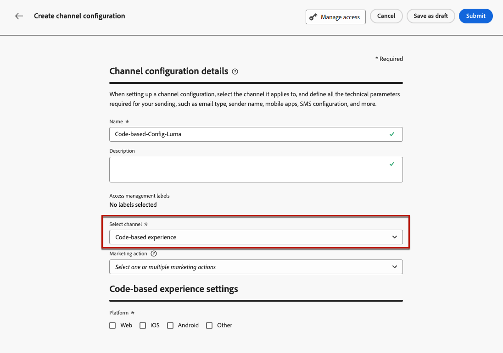
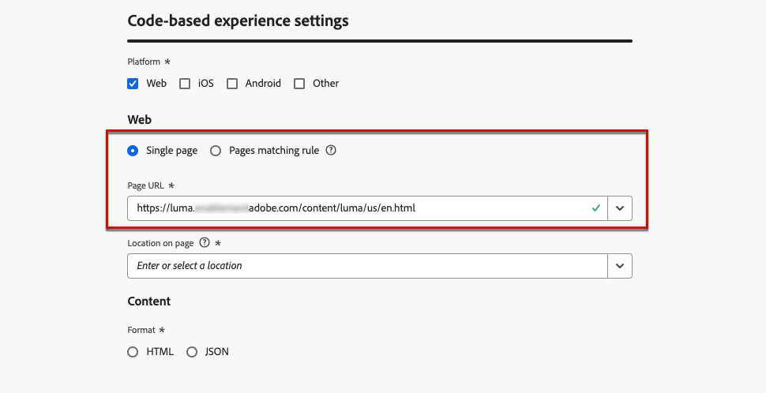
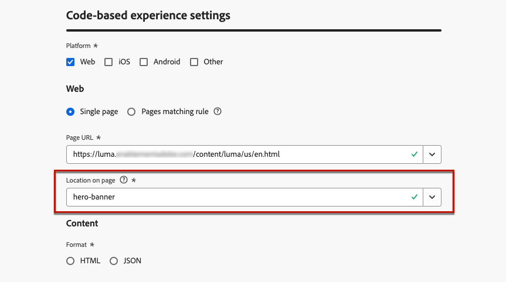

# 코드 기반 경험 구성 {#code-based-configuration}

>[!CONTEXTUALHELP]
>id="ajo_code_based_surface"
>title="코드 기반 경험 구성 정의"
>abstract="코드 기반 구성은 콘텐츠가 게재되고 사용되는 애플리케이션 내부의 경로와 위치를 정의하며 애플리케이션 구현의 URI로 고유하게 식별됩니다."

[환경을 구축](create-code-based.md)하기 전에 응용 프로그램 내에서 콘텐츠가 전달되고 소비될 위치를 정의하는 코드 기반 경험 구성을 만들어야 합니다.

코드 기반 경험 구성은 기본적으로 변경 사항을 렌더링할 위치인 표면을 참조해야 합니다. 선택한 플랫폼에 따라 위치/경로 또는 전체 표면 URI를 입력해야 합니다. [자세히 알아보기](code-based-surface.md)

## 코드 기반 경험 구성 만들기 {#create-code-based-configuration}

>[!CONTEXTUALHELP]
>id="ajo_admin_location"
>title="페이지 또는 앱 내부의 특정 위치 표시"
>abstract="이 필드는 사용자가 액세스하기를 원하는 페이지 내부 또는 앱 내의 정확한 대상을 지정합니다. 이는 웹 페이지 내 특정 섹션이나 앱의 탐색 구조 내 페이지일 수 있습니다."

>[!CONTEXTUALHELP]
>id="ajo_admin_default_mobile_url"
>title="콘텐츠 만들기 및 미리보기를 위한 URL 정의"
>abstract="이 필드는 규칙에 의해 생성되거나 규칙과 일치하는 페이지에 지정된 URL이 있는지 확인하는 데 필요한데, 이는 콘텐츠를 효과적으로 만들고 미리 보는 데 필수적입니다."

코드 기반 경험 채널 구성을 만들려면 다음 단계를 수행하십시오.

1. **[!UICONTROL 채널]** > **[!UICONTROL 일반 설정]** > **[!UICONTROL 채널 구성]** 메뉴에 액세스한 다음 **[!UICONTROL 채널 구성 만들기]**&#x200B;를 클릭하십시오.

   

1. 구성의 이름 및 설명(선택 사항)을 입력합니다.

   >[!NOTE]
   >
   > 이름은 문자(A-Z)로 시작해야 합니다. 영숫자만 포함할 수 있습니다. 밑줄 `_`, 점 `.`, 하이픈 `-`도 사용할 수 있습니다.

1. 구성에 사용자 지정 또는 핵심 데이터 사용 레이블을 할당하려면 **[!UICONTROL 액세스 관리]**&#x200B;를 선택할 수 있습니다. [OLAC(개체 수준 액세스 제어)에 대해 자세히 알아보기](../administration/object-based-access.md)

1. 이 구성을 사용하여 동의 정책을 메시지에 연결하려면 **[!UICONTROL 마케팅 액션]**&#x200B;을 선택하십시오. 마케팅 액션과 관련된 모든 동의 정책은 고객의 선호도를 존중하기 위해 활용됩니다. [자세히 알아보기](../action/consent.md#surface-marketing-actions)

1. **코드 기반 경험** 채널을 선택하십시오.

   

1. 코드 기반 경험을 적용할 플랫폼을 선택합니다.

   * [웹](#web)
   * [iOS 및/또는 Android](#mobile)
   * [기타](#other)

   >[!NOTE]
   >
   >여러 플랫폼을 선택할 수 있습니다. 여러 플랫폼을 선택하면 컨텐츠가 선택한 모든 페이지 또는 앱에 전달됩니다.

1. 이 특정 위치에 대해 애플리케이션에서 예상하는 형식을 선택합니다. 캠페인 및 여정에서 코드 기반 경험을 작성할 때 사용됩니다.

   

1. 변경 내용을 저장하려면 **[!UICONTROL 제출]**&#x200B;을 클릭하세요.

이제 캠페인 및 여정에서 [코드 기반 경험을 만들기](create-code-based.md)할 때 이 구성을 선택할 수 있습니다.

>[!NOTE]
>
>앱 구현 팀은 선택한 코드 기반 경험 구성에 정의된 표면에 대한 콘텐츠를 가져오기 위해 명시적인 API 또는 SDK 호출을 수행할 책임이 있습니다. [이 섹션](code-based-implementation-samples.md)에서 다양한 고객 구현에 대해 자세히 알아보세요.

### 웹 플랫폼 {#web}

>[!CONTEXTUALHELP]
>id="ajo_admin_default_web_url"
>title="콘텐츠 작성 및 미리보기를 위한 URL 정의"
>abstract="이 필드는 규칙에 의해 생성되거나 규칙과 일치하는 페이지에 지정된 URL이 있는지 확인하는 데 필요한데, 이는 콘텐츠를 효과적으로 만들고 미리 보는 데 필수적입니다."

웹 플랫폼에 대한 코드 기반 경험 구성 설정을 정의하려면 아래 단계를 따르십시오.

1. 다음 옵션 중 하나를 선택합니다.

   * **[!UICONTROL 단일 페이지]** - 변경 내용을 단일 페이지에만 적용하려면 **[!UICONTROL 페이지 URL]**&#x200B;을 입력하십시오.

     

   * **[!UICONTROL 규칙 일치]** - 동일한 규칙과 일치하는 여러 URL을 대상으로 지정하려면 하나 이상의 규칙을 빌드하십시오. [자세히 알아보기](../web/web-configuration.md#web-page-matching-rule)

     <!--This could be used to apply changes universally across a website, such as updating a hero banner across all pages or adding a top image to display on every product page.-->

     예를 들어 Luma 웹 사이트의 모든 여성 제품 페이지에 표시되는 요소를 편집하려면 **[!UICONTROL 도메인]** > **[!UICONTROL 다음으로 시작]** > `luma` 및 **[!UICONTROL 페이지]** > **[!UICONTROL 포함]** > `women`을(를) 선택합니다.

     

1. 다음은 미리보기 URL에 적용됩니다.

   * 단일 페이지 URL을 입력하면 해당 URL이 미리보기에 사용되며 다른 URL을 입력할 필요가 없습니다.
   * [페이지와 일치하는 규칙](../web/web-configuration.md#web-page-matching-rule)을(를) 선택한 경우 브라우저에서 환경을 미리 보는 데 사용할 **[!UICONTROL 기본 작성 및 미리 보기 URL]**&#x200B;을(를) 입력해야 합니다. [자세히 알아보기](test-code-based.md#preview-on-device)

     

1. **[!UICONTROL 페이지의 위치]** 필드는 사용자가 액세스하려는 페이지 내의 정확한 대상을 지정합니다. &#39;히어로-배너&#39; 또는 &#39;제품-레일&#39;과 같은 사이트의 탐색 구조 내에 있는 페이지의 특정 섹션일 수 있습니다.

   >[!CAUTION]
   >
   >이 필드에 입력한 문자열 또는 경로는 앱 또는 페이지 구현에서 선언한 문자열 또는 경로와 일치해야 합니다. 이렇게 하면 콘텐츠가 지정된 앱 또는 페이지 내에서 원하는 위치에 전달됩니다. [자세히 알아보기](code-based-surface.md#uri-composition)

   

### 모바일 플랫폼 (iOS 및 Android) {#mobile}

>[!CONTEXTUALHELP]
>id="ajo_admin_app_id"
>title="앱 ID 입력"
>abstract="애플리케이션의 운영 환경 내에서 정확한 식별과 구성을 위해 앱 ID를 입력하여 원활한 통합과 기능을 보장합니다."

>[!CONTEXTUALHELP]
>id="ajo_admin_mobile_url_preview"
>title="콘텐츠 미리보기를 위한 URL 입력"
>abstract="이 필드는 디바이스의 애플리케이션 내에서 직접 콘텐츠의 시뮬레이션과 미리보기를 활성화하는 데 반드시 필요합니다."

모바일 플랫폼에 대한 코드 기반 경험 구성 설정을 정의하려면 아래 단계를 따르십시오.

1. **[!UICONTROL 앱 ID]**&#x200B;를 입력하세요. 이를 통해 앱의 운영 환경 내에서 정확한 식별 및 구성이 가능하며 원활한 통합과 기능을 보장합니다.

1. **[!UICONTROL 앱 내의 위치 또는 경로를 입력하십시오]**. 이 필드는 사용자가 액세스할 앱 내의 정확한 대상을 지정합니다. &#39;히어로-배너&#39; 또는 &#39;제품-레일&#39;과 같은 앱의 탐색 구조 내에 있는 특정 섹션이나 페이지일 수 있습니다.

   

1. **[!UICONTROL 미리 보기 URL]** 필드를 입력하여 온디바이스 미리 보기를 사용하도록 설정합니다. 이 URL은 장치에서 미리보기를 트리거할 때 사용할 특정 URL을 미리보기 서비스에 알립니다. [자세히 알아보기](test-code-based.md#preview-on-device)

   미리보기 URL은 앱 내의 앱 개발자가 구성한 딥링크입니다. 이렇게 하면 딥링크 체계와 일치하는 모든 URL이 모바일 웹 브라우저가 아닌 앱 내에서 열립니다. 앱에 대해 구성된 딥링크 체계를 얻으려면 앱 개발자에게 문의하십시오.

+++  다음 리소스는 앱 구현에 대한 딥링크를 구성하는 데 도움이 될 수 있습니다

   * Android의 경우

      * [앱 컨텍스트에 대한 딥 링크 만들기](https://developer.android.com/training/app-links/deep-linking)

   * iOS의 경우

      * [앱에 대한 사용자 정의 URL 체계 정의](https://developer.apple.com/documentation/xcode/defining-a-custom-url-scheme-for-your-app)

      * [앱에서 범용 링크 지원](https://developer.apple.com/documentation/xcode/supporting-universal-links-in-your-app)

+++

   >[!NOTE]
   >
   >환경을 미리 보는 동안 문제가 발생하는 경우 [이 설명서](https://experienceleague.adobe.com/ko/docs/experience-platform/assurance/troubleshooting#app-does-not-open-link)를 참조하세요.

### 기타 플랫폼 {#other}

다른 플랫폼(예: 비디오 콘솔, TV 연결 장치, 스마트 TV, 키오스크, ATM, 음성 지원 장치, IoT 장치 등)에 대한 코드 기반 경험 구성 설정을 정의하려면 아래 단계를 따르십시오.

1. 구현이 Web, iOS 또는 Android용이 아니거나 특정 URI를 대상으로 해야 하는 경우 플랫폼으로 **[!UICONTROL 기타]**&#x200B;를 선택합니다.

1. **[!UICONTROL 표면 URI]**&#x200B;를 입력하십시오. 표면 URI는 경험을 전달하려는 엔티티에 해당하는 고유 식별자입니다. [자세히 알아보기](code-based-surface.md#surface-uri)

   

   >[!CAUTION]
   >
   >자체 구현에 사용된 것과 일치하는 표면 URI를 입력해야 합니다. 그렇지 않으면 변경 사항을 전달할 수 없습니다. [자세히 알아보기](code-based-surface.md#uri-composition)

1. 필요한 경우 **[!UICONTROL 다른 표면 URI를 추가]**&#x200B;하십시오. 최대 10개의 URI를 추가할 수 있습니다.

   >[!NOTE]
   >
   >여러 URI를 추가하면 콘텐츠가 나열된 모든 구성 요소에 전달됩니다.
