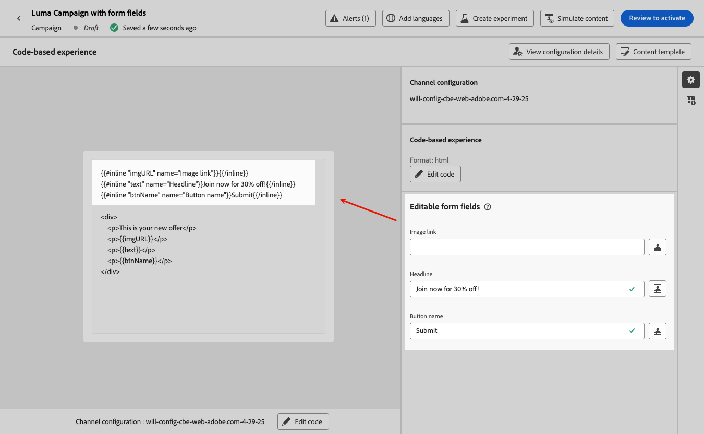

# 코드 기반 경험에서 편집 가능한 양식 필드 사용 {#code-based-form-fields}

코드 기반 경험을 보다 유연하게 제어하고 제어하기 위해 [!DNL Journey Optimizer]을(를) 사용하면 개발 팀에서 미리 정의된 편집 가능한 특정 필드가 포함된 JSON 또는 HTML 콘텐츠 템플릿을 만들 수 있습니다.

코드 기반 경험을 만들 때 기술 전문가가 아닌 마케터는 개인화 편집기를 열거나 여정 또는 캠페인의 다른 코드 요소를 터치할 필요 없이 인터페이스에서 이러한 필드를 직접 편집할 수 있습니다.

이 기능은 마케팅 사용자에게 간소화된 환경을 제공하는 동시에 개발자가 코드 콘텐츠를 보다 세밀하게 제어할 수 있도록 하여 오류가 발생할 여지가 줄어듭니다.

## 양식 필드 구문 이해 {#form-field-syntax}

HTML 또는 JSON 코드 페이로드의 일부를 편집할 수 있도록 하려면 표현식 편집기에서 특정 구문을 사용해야 합니다. 여기에는 사용자가 코드 기반 환경에 콘텐츠 템플릿을 적용한 후 재정의할 수 있는 기본값으로 **변수** 선언이 포함됩니다.

예를 들어, 코드 기반 경험에 적용할 콘텐츠 템플릿을 만들고 사용자가 다른 위치에서 사용되는 특정 색상(예: 프레임 또는 버튼의 배경색)을 사용자 지정할 수 있도록 하려는 경우,

콘텐츠 템플릿을 만들 때는 **고유 ID**(예: &quot;*color*&quot;)로 변수를 선언하고 이 색상을 적용할 콘텐츠의 원하는 위치에서 호출해야 합니다.

콘텐츠에 콘텐츠 템플릿을 적용할 때 사용자는 변수를 참조하는 모든 곳에서 사용되는 색상을 맞춤화할 수 있습니다.

## HTML 또는 JSON 콘텐츠 템플릿에 편집 가능한 필드 추가 {#add-editable-fields}

>[!CONTEXTUALHELP]
>id="ajo_cbe_preview_form_fields"
>title="양식 필드의 렌더링 확인"
>abstract="JSON 또는 HTML 콘텐츠 템플릿에서 특정 편집 가능 필드를 정의하여 기술 전문가가 아닌 사용자도 코드 조작 없이 손쉽게 코드 기반 경험의 콘텐츠를 편집할 수 있습니다. 전용 구문을 사용하여 해당 필드를 만들고 이 버튼을 사용하여 미리보기합니다."

JSON 또는 HTML 코드 중 일부를 편집할 수 있도록 하려면 먼저 특정 양식 필드를 정의할 수 있는 코드 기반 경험 [콘텐츠 템플릿](../content-management/content-templates.md)을 만듭니다.

>[!NOTE]
>
>이 단계는 일반적으로 개발자 담당자에 의해 수행됩니다.

➡️ [이 비디오에서 코드 기반 경험 템플릿에 편집 가능한 필드를 추가하는 방법을 알아봅니다.](#video)

1. 콘텐츠 템플릿을 만들고 **[!UICONTROL 코드 기반 경험]** 채널을 선택하십시오. [템플릿을 만드는 방법을 알아봅니다](../content-management/create-content-templates.md)

1. 작성 모드를 선택합니다. HTML 또는 JSON.

   >[!CAUTION]
   >
   >작성 모드를 변경하면 현재 코드가 모두 손실됩니다. 이 템플릿을 기반으로 하는 코드 기반 경험은 동일한 작성 모드를 사용해야 합니다.

1. 코드 콘텐츠를 편집하려면 [개인화 편집기](../personalization/personalization-build-expressions.md)를 여십시오.

1. 편집 가능한 양식 필드<!--To declare the variable you want users to edit-->을(를) 정의하려면 왼쪽 탐색 창의 **[!UICONTROL 도우미 함수]** 메뉴로 이동하여 **인라인** 특성을 추가하십시오. 변수를 선언하고 호출하는 구문은 콘텐츠에 자동으로 추가됩니다.

   {width="85%"}

1. 편집 가능한 필드를 식별하려면 `"name"`을(를) 고유 ID로 바꾸십시오. 예를 들어 &quot;imgURL&quot;을 입력합니다.

   >[!NOTE]
   >
   >필드 ID는 고유해야 하며 공백을 포함할 수 없습니다. 이 ID는 변수의 값을 표시하려는 콘텐츠의 모든 곳에서 사용해야 합니다.

1. 아래 표에 설명된 매개 변수를 추가하여 필요에 맞게 구문을 조정합니다.

   | 작업 | 매개변수 | 예 |
   | ------- | ------- | ------- |
   | 편집 가능한 필드를 **기본값**(으)로 선언합니다. 템플릿을 콘텐츠에 추가할 때 템플릿을 사용자 지정하지 않으면 이 기본값이 사용됩니다. | 인라인 태그 사이에 기본값을 추가합니다. | `{{#inline "editableFieldID"}}default_value{{/inline}}` |
   | 편집 가능한 필드에 대해 **레이블**&#x200B;을(를) 정의합니다. 이 레이블은 템플릿의 필드를 편집할 때 코드 편집기에 표시됩니다. | `name="title"` | `{{#inline "editableFieldID" name="title"}}default_value{{/inline}}` |

   <!--
    | Action | Parameter| Example |
    | ------- | ------- | ------- |
    |Declare an editable field containing an **image source** that needs to be published.|`assetType="image"`|`{{#inline "editableFieldID" assetType="image"}}default_value{{/inline}}`|
    |Declare an editable field containing an **URL** that needs to be tracked.br/>Note that out-of-the-box "Mirror page URL" and "Unsubscribe link" predefined blocks cannot become editable fields.>|`assetType="url"`|`{{#inline "editableFieldID" assetType="url"}}default_value{{/inline}}`|
    -->

1. **[!UICONTROL 양식 필드 미리 보기]**&#x200B;를 클릭하여 이 템플릿을 적용하는 코드 기반 환경에서 편집 가능한 양식 필드가 표시되는 방식을 확인합니다.

   {width="85%"}

1. 편집 가능한 필드 값을 표시할 모든 위치에서 코드에 `{{{name}}}` 구문을 사용합니다. `name`을(를) 이전에 정의된 필드의 고유 ID로 바꾸십시오.

   {width="85%"}

1. 마찬가지로 다른 편집 가능한 필드를 추가하여 각 필드를 `{{#inline}}` 및 `{{/inline}}` 태그로 래핑합니다.

1. 정의한 편집 가능한 필드에 해당하는 ID를 포함하여 나머지 코드를 필요에 따라 편집합니다. [방법 알아보기](create-code-based.md#edit-code)

   

1. 템플릿을 저장합니다.

### 편집 가능한 필드 양식에서 의사 결정 정책 사용 {#decision-policy-in-form-fields}

코드 기반 경험 콘텐츠 템플릿을 만들 때 의사 결정 정책을 사용하여 편집 가능한 양식 필드에 오퍼를 활용할 수 있습니다.

1. [위](#add-editable-fields)에서 설명한 대로 코드 기반 경험 템플릿을 만듭니다.

1. 편집 화면의 오른쪽 레일에서 **[!UICONTROL 의사 결정 표시]** 아이콘을 사용하거나 왼쪽 메뉴의 **[!UICONTROL 의사 결정 정책]** 섹션에서 식 편집기에서 **[!UICONTROL 의사 결정 정책 추가]**&#x200B;를 클릭합니다.

   [이 섹션](../experience-decisioning/create-decision.md#add-decision)에서 의사 결정 정책을 만드는 방법을 알아봅니다.

1. **[!UICONTROL 정책 삽입]** 단추를 클릭합니다. 결정 정책에 해당하는 코드가 추가됩니다.

   

1. `{{#each}}` 태그 뒤에 **위**&#x200B;에 설명된 [인라인](#add-editable-fields) 구문을 사용하여 추가하려는 편집 가능한 양식 필드에 해당하는 코드를 삽입합니다. `"name"`을(를) 고유 ID로 바꾸면 편집 가능한 필드를 식별할 수 있습니다. 이 예제에서는 &quot;title&quot;을 사용합니다.

   {width="90%"}

1. **[!UICONTROL 양식 필드 미리 보기]**&#x200B;를 클릭하여 이 템플릿을 적용하는 코드 기반 환경에서 편집 가능한 양식 필드가 표시되는 방식을 확인합니다.

   {width="70%"}

1. `{{/each}}` 태그 위에 나머지 코드를 삽입합니다. 편집 가능한 필드 값을 표시할 모든 위치에서 코드에 `{{{name}}}` 구문을 사용합니다. 이 예제에서는 `name`을(를) &quot;title&quot;(으)로 바꿉니다.

   {width="85%"}

1. 템플릿을 저장합니다.

### 코드 예 {#code-examples}

다음은 JSON 및 HTML 템플릿의 몇 가지 예이며 그 중 일부는 의사 결정 정책을 포함합니다.

**JSON 템플릿:**

```
{{#inline "title" name="Title"}}Best gear for winter is here for you!{{/inline}} 
{{#inline "description" name="Description"}}Add description{{/inline}} 
{{#inline "imgURL" name="Image Link"}}Add link{{/inline}} 
{{#inline "number_of_items" name="Number of items"}}23{{/inline}}

{
  "title": "{{{title}}}",
  "description": "{{{description}}}",
  "imageUrl": "{{{imgURL}}}",
  "number_of_items": {{{number_of_items}}}, 
  "code": "DEFAULT"
}
```

>[!NOTE]
>
>JSON 페이로드의 인라인 필드를 참조할 때:
>
>* 문자열 유형 필드는 큰따옴표로 묶어야 합니다.
>* 정수 또는 부울은 큰따옴표로 묶으면 안 됩니다. (위의 예에서 `number_of_items` 필드를 참조하십시오.)

**의사 결정 포함 JSON 템플릿:**

```
{ 
"offer": [ 
{{#each decisionPolicy.fff709b7-7fef-4e4e-83d7-594fbcf196c1.items as |item|}} 
{{#inline "title" name="Title"}}{{item._mobiledx.Title1}}{{/inline}} {{#inline "description" name="Description"}}{{item._mobiledx.Title2}}{{/inline}} {{#inline "imgURL" name="Image Link"}}https://luma.enablementadobe.com/content/luma/us/en/experience/warming-up/_jcr_content/root/hero_image.coreimg.jpeg{{/inline}} 

{ 
"title": "{{{title}}}", 
"description": "{{{description}}}", 
"imageUrl": "{{{imgURL}}}", 
"link": "https://lumaenablement.adobe.com/web/luma/home", "code": "DEFAULT" 
}, 
{{/each}}
] 
}
```

>[!NOTE]
>
>결정 항목을 사용할 인라인 필드는 결정 정책 블록 안에 `{{#each}}`과(와) `{{/each}}`태그 사이에 배치해야 합니다.

**HTML 템플릿:**

```
{{#inline "title" name="Title"}}Please enter title here{{/inline}} 
{{#inline "imgSrc" name="Image link"}}{{/inline}} 

<div class="TopRibbon__content">{{{title}}}</div> 
<style> .theme-luma .TopRibbon { background-color: #200098; }</style>
```

**의사 결정 포함 HTML 템플릿:**

```
{{#each decisionPolicy.f112884a-5654-43ad-9d6d-dbd32ae23ee6.items as |item|}} 
{{#inline "title" name="Title"}}Title is: {{item._mobiledx.Title1}}{{/inline}} 

<div class="TopRibbon__content">{{{title}}}</div> 
<style> .theme-luma .TopRibbon { background-color: #200098; }</style> 

{{/each}}
```

## 코드 기반 환경에서 양식 필드 편집 {#edit-form-fields}

>[!CONTEXTUALHELP]
>id="ajo_code_based_form_fields"
>title="양식 필드란 무엇입니까?"
>abstract="이 코드 기반 경험에는 개인화 편집기에서 코드를 조작할 필요 없이 쉽게 편집할 수 있는 양식 필드가 포함되어 있습니다."

미리 정의된 편집 가능한 양식 필드가 포함된 콘텐츠 템플릿을 만들었으므로 이제 이 콘텐츠 템플릿을 사용하여 코드 기반 경험을 빌드할 수 있습니다.

개인화 편집기를 열지 않고도 코드 기반 경험 여정 또는 캠페인에서 양식 필드를 쉽게 편집할 수 있습니다.

>[!NOTE]
>
>이 단계는 일반적으로 마케터 담당자에 의해 수행됩니다.

1. 여정 활동 또는 캠페인 에디션 화면에서 편집 가능한 양식 필드가 포함된 콘텐츠 템플릿을 선택합니다. [콘텐츠 템플릿을 사용하는 방법 알아보기](../content-management/use-content-templates.md)

   {width="60%"}

   >[!CAUTION]
   >
   >선택할 수 있는 템플릿은 이전에 선택한 채널 구성을 기반으로 HTML 또는 JSON으로 범위가 지정됩니다. 호환되는 템플릿만 표시됩니다.

1. 선택한 콘텐츠 템플릿에서 사전 정의된 필드는 오른쪽 창에서 사용할 수 있습니다. <!--The code preview is displayed with the rest of the code.-->

   

1. **[!UICONTROL 편집 가능한 양식 필드]** 섹션에서 다음을 수행할 수 있습니다.

   * 코드 편집기를 열지 않고도 편집 가능한 필드 내에서 각 값을 직접 편집할 수 있습니다.

   {width="60%"}

   * [코드 편집기](../personalization/personalization-build-expressions.md)를 사용하여 각 필드를 편집하려면 개인화 아이콘을 클릭하십시오.

   {width="70%"}

   >[!NOTE]
   >
   >두 경우 모두 한 번에 하나의 필드만 편집할 수 있으며 나머지 코드 기반 경험 컨텐츠는 편집할 수 없습니다.

1. [결정 정책이 콘텐츠 템플릿에 추가된 경우](#decision-policy-in-form-fields), [오퍼 카탈로그 스키마](../experience-decisioning/catalogs.md)에서 사용할 수 있는 모든 특성이 함께 제공됩니다. 결정 항목을 인라인으로 편집하거나 표현식 편집기를 사용할 수 있습니다.

1. 나머지 코드를 편집하려면 **[!UICONTROL 코드 편집]** 단추를 클릭하고 편집 가능한 양식 필드를 포함한 전체 코드 기반 경험 콘텐츠를 업데이트하십시오. [자세히 알아보기](create-code-based.md#edit-code)

## 방법 비디오 {#video}

코드 기반 경험 채널 콘텐츠 템플릿에 편집 가능한 필드를 추가하는 방법을 알아봅니다.

>[!VIDEO](https://video.tv.adobe.com/v/3463990/?learn=on&#x26;enablevpops)
