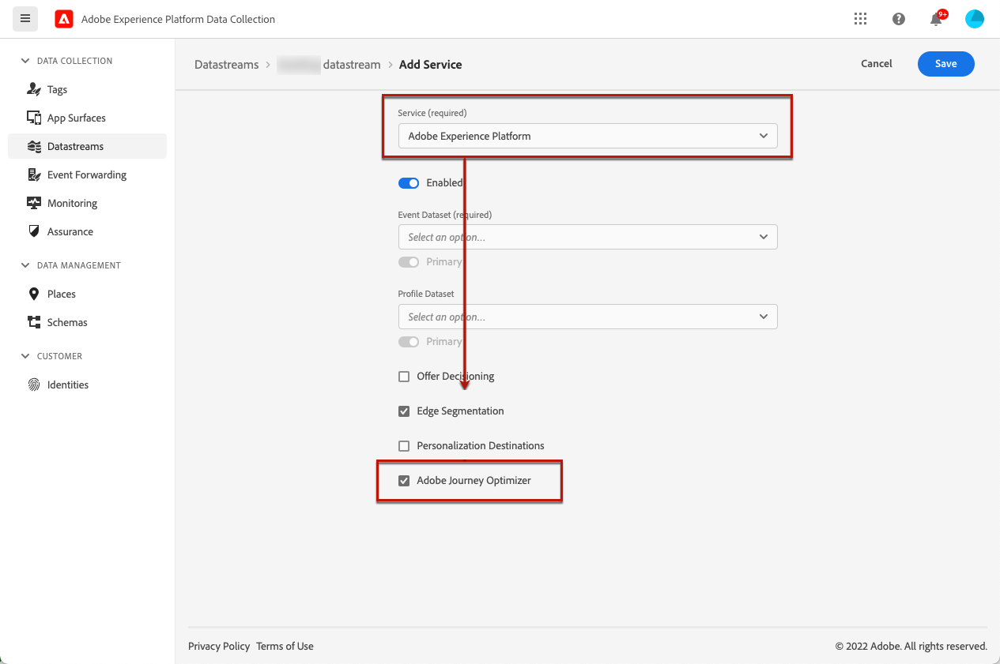

# 코드 기반 경험 사전 요구 사항 {#code-based-prerequisites}

[!DNL Journey Optimizer]에서 코드 기반 경험 작업을 사용하고 응용 프로그램에서 사용할 수 있는 코드 콘텐츠 페이로드를 전달하려면 아래 전제 조건을 따르십시오.

* 응용 프로그램에 수정 사항을 추가하려면 특정 구현이 있어야 합니다. [자세히 알아보기](#implementation-prerequisites)

* 코드 기반 경험이 올바르게 배달되도록 하려면 [여기](#delivery-prerequisites)에서 자세히 설명하는 Adobe Experience Platform 설정을 정의해야 합니다.

* 코드 기반 경험 보고서에 데이터를 표시할 수 있도록 하려면 다음 [보고 사전 요구 사항](#reporting-prerequisites)을 따라야 합니다.

* [코드 기반 경험 채널 구성](code-based-configuration.md)을 만들 때 자체 구현에서 선언된 것과 일치하는 문자열/경로 또는 표면 URI를 입력해야 합니다. 이렇게 하면 콘텐츠가 지정된 앱 또는 페이지 내에서 원하는 위치에 전달됩니다. 그렇지 않으면 변경 사항을 전달할 수 없습니다. [자세히 보기](code-based-surface.md)

## 구현 사전 요구 사항 {#implementation-prerequisites}

코드 기반 경험은 아래 옵션에 표시된 대로 모든 유형의 고객 구현을 지원합니다. 속성에 클라이언트측, 서버측 또는 하이브리드 구현 방법을 사용할 수 있습니다.

* 클라이언트측 전용 - 웹 페이지 또는 모바일 앱에 수정 사항을 추가하려면 웹 사이트에서 [Adobe Experience Platform Web SDK](https://experienceleague.adobe.com/docs/platform-learn/implement-web-sdk/overview.html?lang=ko-KR){target="_blank"}를 구현하거나 모바일 앱에서 [Adobe Experience Platform Mobile SDK](https://developer.adobe.com/client-sdks/documentation/){target="_blank"}를 구현해야 합니다.

* 하이브리드 모드 - [AEP Edge Network Server API](https://experienceleague.adobe.com/docs/experience-platform/edge-network-server-api/data-collection/interactive-data-collection.html?lang=ko-KR){target="_blank"}를 사용하여 개인화 서버측을 요청할 수 있습니다. 수정 사항을 클라이언트측에서 렌더링하도록 Adobe Experience Platform Web SDK에 응답이 제공됩니다. 자세한 내용은 Adobe Experience Platform [Edge Network Server API 설명서](https://experienceleague.adobe.com/docs/experience-platform/edge-network-server-api/overview.html?lang=ko){target="_blank"}를 참조하세요. 하이브리드 모드에 대한 자세한 정보를 확인하고 [이 블로그 게시물](https://blog.developer.adobe.com/hybrid-personalization-in-the-adobe-experience-platform-web-sdk-6a1bb674bf41){target="_blank"}에서 일부 구현 샘플을 확인할 수 있습니다.

* 서버측 - [AEP Edge Network Server API](https://experienceleague.adobe.com/docs/experience-platform/edge-network-server-api/data-collection/interactive-data-collection.html?lang=ko-KR){target="_blank"}를 사용하여 개인화 서버측을 요청할 수 있습니다. 개발 팀은 응답을 처리하고 앱 구현에서 클라이언트측에서 수정 사항을 렌더링해야 합니다.

[이 섹션](code-based-implementation-samples.md)에서 위의 각 구현 방법에 대한 샘플을 찾을 수 있습니다.

## 게재 사전 요구 사항 {#delivery-prerequisites}

코드 기반 경험을 올바르게 전달하려면 다음 설정을 정의해야 합니다.

* [Adobe Experience Platform 데이터 수집](https://experienceleague.adobe.com/docs/experience-platform/edge/datastreams/overview.html?lang=ko-KR){target="_blank"}에서 **[!UICONTROL Adobe Experience Platform]** 서비스 아래에 **[!UICONTROL Adobe Journey Optimizer]** 옵션이 활성화되어 있는지와 같이 데이터 스트림이 정의되어 있는지 확인합니다.

  이렇게 하면 Journey Optimizer 인바운드 이벤트가 Adobe Experience Platform Edge에서 올바르게 처리됩니다. [자세히 알아보기](https://experienceleague.adobe.com/docs/experience-platform/edge/datastreams/configure.html?lang=ko){target="_blank"}

  

* [Adobe Experience Platform](https://experienceleague.adobe.com/docs/experience-platform/profile/home.html?lang=ko){target="_blank"}에서 **[!UICONTROL Active-On-Edge 병합 정책]** 옵션이 활성화된 하나의 병합 정책이 있는지 확인하십시오. 이렇게 하려면 **[!UICONTROL 고객]** > **[!UICONTROL 프로필]** > **[!UICONTROL 정책 병합]** Experience Platform 메뉴에서 정책을 선택합니다. [자세히 알아보기](https://experienceleague.adobe.com/docs/experience-platform/profile/merge-policies/ui-guide.html?lang=ko#configure){target="_blank"}

  [!DNL Journey Optimizer] 인바운드 채널이 이 병합 정책을 사용하여 에지에서 인바운드 캠페인을 올바르게 활성화하고 게시합니다. [자세히 알아보기](https://experienceleague.adobe.com/docs/experience-platform/profile/merge-policies/ui-guide.html?lang=ko){target="_blank"}

  

* Journey Optimizer 웹 경험의 배달 문제를 해결하려면 **Adobe Experience Platform Assurance**&#x200B;에서 **Edge Delivery** 보기를 사용할 수 있습니다. 이 플러그인을 사용하면 요청 호출을 자세히 검사하고, 예상 Edge 호출이 예상대로 발생하는지 확인하고, ID 맵, 세그먼트 멤버십 및 동의 설정을 포함한 프로필 데이터를 검사할 수 있습니다. 또한 요청이 자격을 부여한 활동을 검토하고 자격이 없는 활동을 식별할 수 있습니다.

  **Edge Delivery** 플러그인을 사용하면 인바운드 구현을 효과적으로 이해하고 문제를 해결하는 데 필요한 인사이트를 얻을 수 있습니다.

  [Edge Delivery 보기에 대해 자세히 알아보기](https://experienceleague.adobe.com/ko/docs/experience-platform/assurance/view/edge-delivery)

## 보고 사전 요구 사항 {#reporting-prerequisites}

코드 기반 채널에 대한 보고를 사용하려면 앱 구현 [데이터 스트림](https://experienceleague.adobe.com/docs/experience-platform/datastreams/overview.html?lang=ko){target="_blank"}에 사용된 [데이터 세트](../data/get-started-datasets.md)도 보고 구성에 포함되어 있는지 확인해야 합니다.

즉, 보고를 구성할 때 앱 데이터 스트림에 없는 데이터 세트를 추가하면 앱 데이터가 보고서에 표시되지 않습니다.

[이 섹션](../reports/reporting-configuration.md#add-datasets)에서 보고할 데이터 세트를 추가하는 방법을 알아보세요.

>[!NOTE]
>
>데이터 집합은 [!DNL Journey Optimizer] 보고 시스템에서 읽기 전용으로 사용되며 데이터 수집이나 데이터 수집에는 영향을 주지 않습니다.
