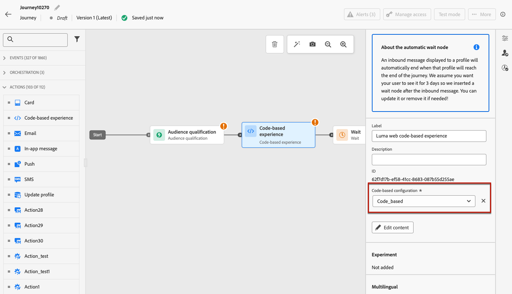

# 코드 기반 경험 만들기 {#create-code-based}

[!DNL Journey Optimizer]에서 여정 또는 캠페인에서 코드 기반 경험을 만들 수 있습니다.

코드 기반 경험에 적용되는 가드레일 및 권장 사항은 [이 페이지](code-based-prerequisites.md)에서 자세히 설명합니다.

## 여정 또는 캠페인을 통해 코드 기반 경험 추가 {#create-code-based-experience}

여정 또는 캠페인을 통해 코드 기반 경험을 구축하려면 아래 단계를 따르십시오.

>[!BEGINTABS]

>[!TAB 여정에 코드 기반 경험 추가]

여정에 **코드 기반 경험** 활동을 추가하려면 다음 단계를 따르십시오.

1. [여정 만들기](../building-journeys/journey-gs.md).

1. [이벤트](../building-journeys/general-events.md) 또는 [대상자 읽기](../building-journeys/read-audience.md) 활동으로 여정을 시작하십시오.

1. 팔레트의 **[!UICONTROL 작업]** 섹션에서 **[!UICONTROL 코드 기반 경험]** 활동을 끌어서 놓습니다.

   

   >[!NOTE]
   >
   >**코드 기반 경험**&#x200B;은(는) 인바운드 메시지 활동이므로 3일 **대기** 활동과 함께 제공됩니다. [자세히 알아보기](../building-journeys/wait-activity.md#auto-wait-node)

1. 메시지에 대해 **[!UICONTROL 레이블]** 및 **[!UICONTROL 설명]**&#x200B;을 입력하십시오.

1. 사용할 [코드 기반 경험 구성](code-based-configuration.md)을 선택하거나 만드십시오.

   

1. **[!UICONTROL 콘텐츠 편집]** 단추를 선택하고 개인화 편집기를 사용하여 원하는 대로 콘텐츠를 편집하십시오. [자세히 알아보기](#edit-code)

   기존 콘텐츠 템플릿을 코드 콘텐츠의 기반으로 사용할 수도 있습니다. 선택할 수 있는 템플릿은 이전에 선택한 채널 구성을 기반으로 HTML 또는 JSON으로 범위가 지정됩니다. [콘텐츠 템플릿을 사용하는 방법 알아보기](../content-management/use-content-templates.md)

1. 필요한 경우 추가 작업 또는 이벤트를 끌어다 놓아 여정 흐름을 완료합니다. [자세히 알아보기](../building-journeys/about-journey-activities.md)

1. 코드 기반 경험이 준비되면 구성을 완료하고 여정을 게시하여 활성화합니다. [자세히 알아보기](../building-journeys/publishing-the-journey.md)

여정 구성 방법에 대한 자세한 내용은 [이 페이지](../building-journeys/journey-gs.md)를 참조하세요.

>[!TAB 코드 기반 경험 캠페인 만들기]

캠페인을 통해 **코드 기반 경험** 빌드를 시작하려면 아래 단계를 따르십시오.

1. 캠페인을 만듭니다. [자세히 알아보기](../campaigns/create-campaign.md)

1. 실행할 캠페인 유형 선택

   * **[!UICONTROL 예약됨 - 마케팅]**: 캠페인을 즉시 또는 지정한 날짜에 실행합니다. 예약된 캠페인은 **마케팅** 메시지를 보내는 것을 목표로 합니다. 사용자 인터페이스에서 구성 및 실행됩니다.

   * **[!UICONTROL API 트리거됨 - 마케팅/트랜잭션]**: API 호출을 사용하여 캠페인을 실행하십시오. API 트리거 캠페인은 **마케팅** 또는 **트랜잭션** 메시지(예: 암호 재설정, 장바구니 구매 등 개인이 수행한 작업 후 발송된 메시지)를 보내는 것을 목표로 합니다. [API를 사용하여 캠페인을 트리거하는 방법을 알아봅니다](../campaigns/api-triggered-campaigns.md)

1. 캠페인 속성, [대상자](../audience/about-audiences.md) 및 [일정](../campaigns/create-campaign.md#schedule)과 같은 캠페인을 만드는 단계를 완료합니다. 캠페인을 구성하는 방법에 대한 자세한 내용은 [이 페이지](../campaigns/get-started-with-campaigns.md)를 참조하세요.

1. **[!UICONTROL 코드 기반 경험]** 작업을 선택하십시오.

1. 코드 기반 경험 구성을 선택하거나 만듭니다. [자세히 알아보기](code-based-configuration.md)

   

1. 개인화 편집기를 사용하여 원하는 대로 콘텐츠를 편집합니다. [자세히 알아보기](#edit-code)

   기존 콘텐츠 템플릿을 코드 콘텐츠의 기반으로 사용할 수도 있습니다. 선택할 수 있는 템플릿은 이전에 선택한 채널 구성을 기반으로 HTML 또는 JSON으로 범위가 지정됩니다. [콘텐츠 템플릿을 사용하는 방법 알아보기](../content-management/use-content-templates.md)

   <!---->

캠페인을 구성하는 방법에 대한 자세한 내용은 [이 페이지](../campaigns/get-started-with-campaigns.md)를 참조하세요.

➡️[이 비디오에서 코드 기반 경험 캠페인을 만드는 방법을 알아보세요](#video)

>[!ENDTABS]

## 코드 콘텐츠 편집 {#edit-code}

>[!CONTEXTUALHELP]
>id="ajo_code_based_experience"
>title="개인화 편집기 사용"
>abstract="이 코드 기반 경험 액션의 일부로 게재하려는 코드를 삽입하고 편집합니다."

<!-- additional-url="https://experienceleague.adobe.com/docs/journey-optimizer/using/content-management/personalization/expression-editor/personalization-build-expressions.html" text="Get started with the personalization editor"-->

1. 여정 활동 또는 캠페인 버전 화면에서 **[!UICONTROL 코드 편집]**&#x200B;을 선택합니다.

   

1. [개인화 편집기](../personalization/personalization-build-expressions.md)가 열립니다. 코드를 작성할 수 있는 비시각적 경험 만들기 인터페이스입니다.

1. 작성 모드를 HTML에서 JSON으로 전환하거나 그 반대로 전환할 수 있습니다.

   

   >[!CAUTION]
   >
   >작성 모드를 변경하면 현재 코드가 모두 손실되므로 작성을 시작하기 전에 모드를 전환해야 합니다.

1. 필요에 따라 코드를 입력합니다. [!DNL Journey Optimizer] 개인화 편집기를 모든 개인화 및 작성 기능과 함께 활용할 수 있습니다. [자세히 알아보기](../personalization/personalization-build-expressions.md)

1. 필요한 경우 HTML 또는 JSON 표현식 조각을 추가할 수 있습니다. [방법 알아보기](../personalization/use-expression-fragments.md)

   코드 콘텐츠의 일부를 조각으로 저장할 수도 있습니다. [방법 알아보기](../content-management/fragments.md#save-as-expression-fragment)

1. 코드 기반 경험을 통해 의사 결정 기능을 사용할 수 있습니다. 왼쪽 막대에서 **[!UICONTROL 결정 정책]** 아이콘을 선택하고 **[!UICONTROL 결정 정책 추가]**&#x200B;를 클릭합니다. [자세히 알아보기](../experience-decisioning/create-decision.md)

   

1. 변경 내용을 확인하려면 **[!UICONTROL 저장 후 닫기]**&#x200B;를 클릭하십시오.

이제 개발자가 채널 구성에 정의된 표면에 대한 콘텐츠를 가져오기 위해 API 또는 SDK을 호출하면 변경 사항이 웹 페이지 또는 앱에 적용됩니다.

## 사용 방법 비디오{#video}

아래 비디오에서는 코드 기반 경험 캠페인을 만들고, 속성을 구성하고, 테스트하고, 게시하는 방법을 보여 줍니다.

>[!VIDEO](https://video.tv.adobe.com/v/3428868/?quality=12&learn=on)
