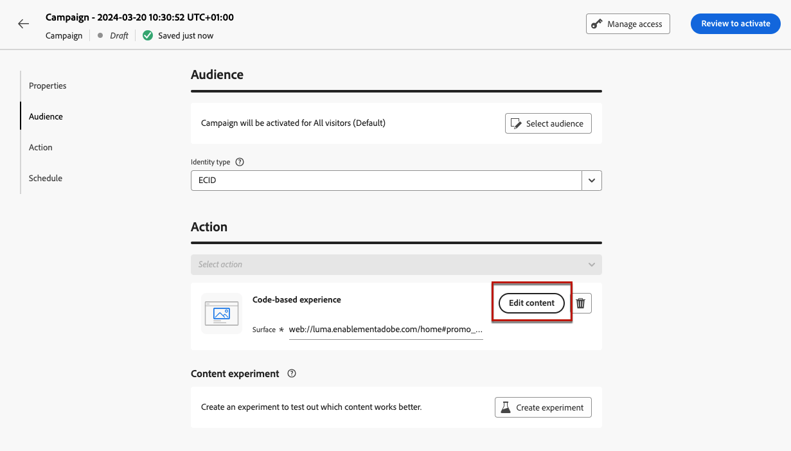
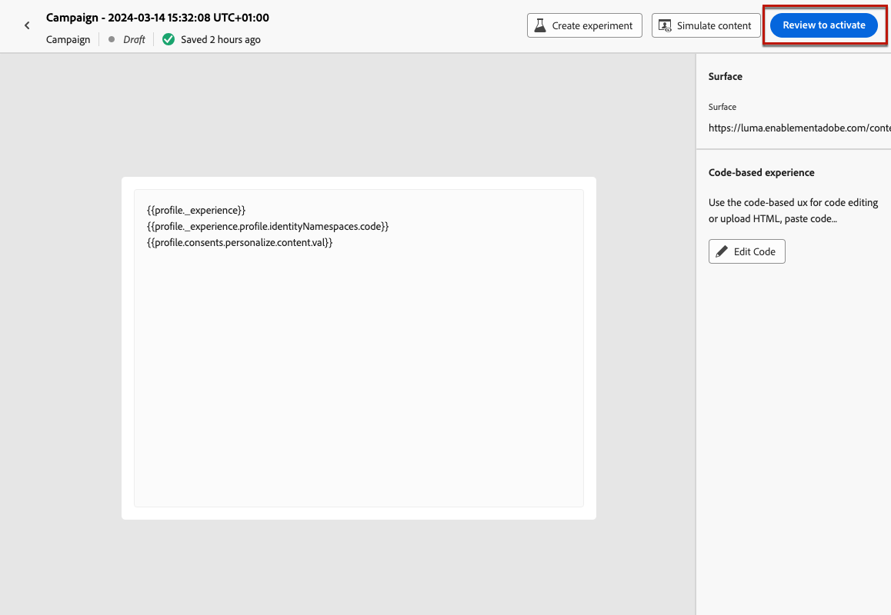

# 코드 기반 경험 만들기 {#create-code-based}

현재 위치 [!DNL Journey Optimizer] 에서는 코드 기반 경험만 만들 수 있습니다. **캠페인**.

코드 기반 경험에 대한 특정 보호 기능 및 권장 사항이에 자세히 설명되어 있습니다. [이 페이지](code-based-prerequisites.md).

>[!AVAILABILITY]
>
>현재 Adobe을 구입한 조직에서는 코드 기반 경험 채널을 사용할 수 없습니다 **헬스케어 실드** 및 **개인 정보 보호 및 보안 보호** 추가 기능 제공.

## 코드 기반 캠페인 만들기 {#create-code-based-campaign}

캠페인을 통해 코드 기반 경험을 구축하려면 아래 단계를 따르십시오.

1. 캠페인을 만듭니다. [자세히 알아보기](../campaigns/create-campaign.md)

1. 다음 항목 선택 **[!UICONTROL 코드 기반 경험]** 작업.

1. 코드 기반 경험 표면을 입력합니다. [자세히 알아보기](#surface-definition)

   

   >[!CAUTION]
   >
   >코드 기반 캠페인에 사용된 표면 URI가 자체 구현에 사용된 표면 URI와 일치하는지 확인합니다. 그렇지 않으면 변경 사항이 전달되지 않습니다.

1. **[!UICONTROL 만들기]**&#x200B;를 선택합니다.

1. 캠페인 속성 등 캠페인을 만드는 단계를 완료합니다. [대상자](../audience/about-audiences.md), 및 [예약](../campaigns/create-campaign.md#schedule). 캠페인 구성 방법에 대한 자세한 내용은 다음을 참조하십시오. [이 페이지](../campaigns/get-started-with-campaigns.md).

1. 표현식 편집기를 사용하여 원하는 대로 콘텐츠를 편집합니다. [자세히 알아보기](#edit-code)

   

## 코드 콘텐츠 편집 {#edit-code}

>[!CONTEXTUALHELP]
>id="ajo_code_based_experience"
>title="표현식 편집기 사용"
>abstract="이 코드 기반 경험 액션의 일부로 게재하려는 코드를 삽입하고 편집합니다."
>additional-url="https://experienceleague.adobe.com/docs/journey-optimizer/using/content-management/personalization/expression-editor/personalization-build-expressions.html" text="표현식 편집기 시작하기"

1. Campaign Edition 화면에서 다음을 선택합니다. **[!UICONTROL 코드 편집]**.

   

1. 다음 [표현식 편집기](../personalization/personalization-build-expressions.md) 열림. 코드를 작성할 수 있는 비시각적 경험 만들기 인터페이스입니다.

1. 작성 모드를 HTML에서 JSON으로 전환하거나 그 반대로 전환할 수 있습니다.

   

   >[!CAUTION]
   >
   >작성 모드를 변경하면 현재 코드가 모두 손실되므로 작성을 시작하기 전에 모드를 전환해야 합니다.

1. 필요에 따라 코드를 입력합니다. 다음을 활용할 수 있습니다. [!DNL Journey Optimizer] 모든 개인화 및 작성 기능이 있는 표현식 편집기. [자세히 알아보기](../personalization/personalization-build-expressions.md)

1. 필요한 경우 HTML 또는 JSON 표현식 조각을 추가할 수 있습니다. [방법 알아보기](../personalization/use-expression-fragments.md)

   코드 콘텐츠의 일부를 조각으로 저장할 수도 있습니다. [방법 알아보기](../content-management/fragments.md#save-as-expression-fragment)

<!--
1. In code-based campaigns, you can use the experience decisioning feature. Select the **[!UICONTROL Decisions]** icon from the left bar and click **[!UICONTROL Create decision]**. [Learn more](../experience-decisioning/create-decision.md)

    

    >[!NOTE]
    >
    >The experience decisioning feature is currently available as a beta to select users only.
-->

1. 클릭 **[!UICONTROL 저장 및 닫기]** 을 클릭하여 변경 내용을 확인합니다.

이제 개발자가 선택한 표면에 대한 콘텐츠를 가져오기 위해 API 또는 SDK를 호출하는 즉시 변경 사항이 웹 페이지 또는 앱에 적용됩니다.

## 코드 기반 캠페인 테스트 {#test-code-based-campaign}

>[!CONTEXTUALHELP]
>id="ajo_code_based_preview"
>title="코드 기반 경험 미리보기"
>abstract="코드 기반 경험이 어떻게 시각화되는지 시뮬레이션을 수행합니다."

수정된 코드 기반 경험의 미리보기를 표시하려면 아래 단계를 따르십시오. 테스트 프로필을 선택하고 콘텐츠를 미리 보는 방법에 대한 자세한 내용은 [콘텐츠 페이지 미리보기 및 테스트](../content-management/preview-test.md).

>[!CAUTION]
>
>게재할 오퍼를 시뮬레이션할 수 있는 테스트 프로필이 있어야 합니다. 방법 알아보기 [테스트 프로필 만들기](../audience/creating-test-profiles.md).

1. 표현식 편집기 또는 콘텐츠 편집 화면에서 다음을 선택합니다. **[!UICONTROL 콘텐츠 시뮬레이션]**.

   

1. 클릭 **[!UICONTROL 테스트 프로필 관리]** 테스트 프로필을 한 개 이상 선택합니다.

1. 수정된 코드 기반 경험의 미리보기가 표시됩니다.

<!--
    

    You can also open it in the default browser, or copy the test URI to paste it in any browser. This allows you to share the link with your team and stakeholders who will be able to preview the new web experience in any browser before the campaign goes live.

    When copying the test URI, the content displayed is the one personalized for the test profile used when the content simulation was generated in [!DNL Journey Optimizer].-->

## 코드 기반 캠페인 활성화 {#activate-code-based-campaign}

코드 기반 캠페인을 정의하고 를 사용하여 원하는 대로 콘텐츠를 편집한 후에는 [코드 기반 편집기](#edit-code), 검토 및 활성화할 수 있습니다. 아래 단계를 수행합니다.

>[!NOTE]
>
>캠페인 콘텐츠를 활성화하기 전에 미리 볼 수도 있습니다. [자세히 알아보기](#test-code-based-campaign)

1. 코드 기반 캠페인에서 다음을 선택합니다. **[!UICONTROL 활성화하려면 검토]**.

   

1. 필요한 경우 콘텐츠, 속성, 표면, 대상자 및 일정을 확인하고 편집합니다.

1. 선택 **[!UICONTROL 활성화]**.

   

   >[!NOTE]
   >
   >을(를) 클릭한 후 **[!UICONTROL 활성화]**, 코드 기반 캠페인 변경 사항을 위치에서 라이브로 사용할 수 있는 데 최대 1분이 걸릴 수 있습니다.

코드 기반 캠페인은 **[!UICONTROL 라이브]** 상태 및 가 이제 선택한 대상자에게 표시됩니다. 캠페인의 각 수신자는 수정 사항을 볼 수 있습니다.

>[!NOTE]
>
>코드 기반 캠페인에 대한 일정을 정의한 경우 **[!UICONTROL 예약됨]** 시작 날짜 및 시간에 도달할 때까지의 상태.
>
>이미 라이브 상태인 다른 캠페인과 동일한 위치에 영향을 주는 코드 기반 캠페인을 활성화하면 모든 변경 내용이 해당 위치에 적용됩니다.

에서 캠페인 활성화에 대해 자세히 알아보기 [이 섹션](../campaigns/review-activate-campaign.md).

## 코드 기반 캠페인 중지 {#stop-code-based-campaign}

코드 기반 캠페인이 라이브인 경우 이를 중지하여 대상자가 수정 사항을 보지 못하도록 할 수 있습니다. 아래 단계를 수행합니다.

1. 목록에서 라이브 캠페인을 선택합니다.

1. 상단 메뉴에서 을 선택합니다. **[!UICONTROL 캠페인 중지]**.

   

1. 추가한 수정 사항은 정의한 대상자에게 더 이상 표시되지 않습니다.

>[!NOTE]
>
>코드 기반 캠페인이 중지되면 다시 편집하거나 활성화할 수 없습니다. 복제하고 복제된 캠페인을 활성화할 수만 있습니다.

## 코드 기반 캠페인 보고서

캠페인 요약 화면에서 코드 기반 캠페인 보고서에 액세스할 수 있습니다.

글로벌 보고서는 최소 2시간 전에 발생한 이벤트를 표시하고 선택한 기간 동안의 이벤트를 다룹니다. 반면 라이브 보고서는 이벤트 발생으로부터 최소 2분의 시간 간격을 가지고 지난 24시간 내에 발생한 이벤트에 중점을 둡니다.

### 코드 기반 라이브 보고서 {#live-report-code-based}

캠페인에서 **[!UICONTROL 라이브 보고서]**, **[!UICONTROL 코드 기반 경험]** 탭은 앱 또는 웹 페이지와 관련된 기본 정보를 자세히 설명합니다. [라이브 보고서에 대해 자세히 알아보기](../reports/campaign-live-report.md)

+++코드 기반 경험 보고서에 사용할 수 있는 다양한 지표 및 위젯에 대해 자세히 알아보십시오.

다음 **[!UICONTROL 코드 기반 경험 성능]** KPI는 다음과 같이 코드 기반 경험에 대한 방문자의 참여와 관련된 주요 정보를 자세히 설명합니다.

* **[!UICONTROL 노출 횟수]**: 모든 사용자에게 전달된 총 경험 수입니다.

* **[!UICONTROL 상호 작용]**: 앱/페이지에 대한 총 참여 수입니다. 여기에는 클릭 또는 기타 상호 작용과 같이 사용자가 수행한 모든 작업이 포함됩니다.

다음 **[!UICONTROL 코드 기반 경험 요약]** 그래프는 지난 24시간 동안 경험의 진행 상황(노출 횟수, 고유 노출 횟수 및 상호 작용)을 보여 줍니다.

<!--The **[!UICONTROL Interactions by element]** table details the main information relative to your visitors' engagement with the various elements on your app/pages.-->
+++

### 코드 기반 글로벌 보고서 {#global-report-code-based}

코드 기반 캠페인 글로벌 보고서는 캠페인에서 **[!UICONTROL 보고서 보기]** 단추를 클릭합니다. [글로벌 보고서에 대해 자세히 알아보기](../reports/campaign-global-report.md)

캠페인에서 **[!UICONTROL 글로벌 보고서]**, **[!UICONTROL 코드 기반 경험]** 탭은 앱 또는 웹 페이지와 관련된 기본 정보를 자세히 설명합니다.

<!--image-->

+++코드 기반 경험 보고서에 사용할 수 있는 다양한 지표 및 위젯에 대해 자세히 알아보십시오.

다음 **[!UICONTROL 코드 기반 경험 성능]** KPI는 다음과 같이 방문자의 경험 참여와 관련된 주요 정보를 자세히 설명합니다.

* **[!UICONTROL 고유 노출 횟수]**: 경험이 전달된 고유 사용자 수.

* **[!UICONTROL 노출 횟수]**: 모든 사용자에게 전달된 총 경험 수입니다.

* **[!UICONTROL 상호 작용]**: 앱/페이지 참여 비율. 여기에는 클릭 또는 기타 상호 작용과 같이 사용자가 수행한 모든 작업이 포함됩니다.

다음 **[!UICONTROL 코드 기반 경험 요약]** 그래프는 관련 기간에 대한 경험의 진행 상황(고유 노출 횟수, 노출 횟수 및 상호 작용)을 보여 줍니다.

<!--The **[!UICONTROL Interactions by element]** table details the main information relative to your visitors' engagement with the various elements on your apps/pages.-->
+++

<!--
## How-to video{#video}

The video below shows how to create a code-based campaign, configure its properties, review, and publish it.

>[!VIDEO]()

-->
