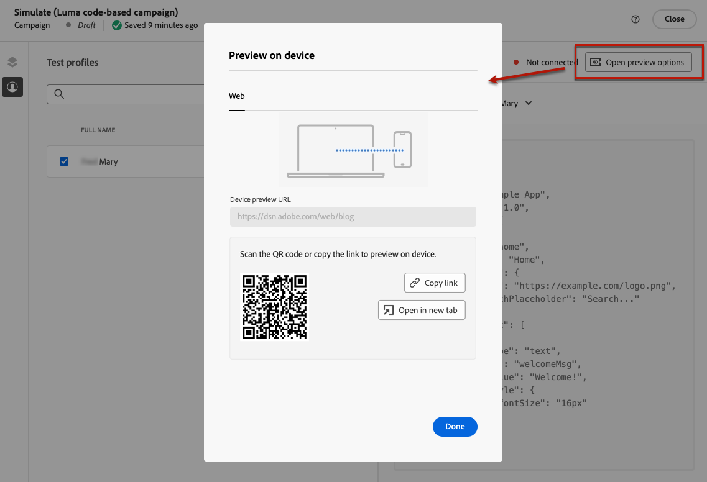

# 코드 기반 경험 만들기 {#create-code-based}

[!DNL Journey Optimizer]에서 여정 또는 캠페인에서 코드 기반 경험을 만들 수 있습니다.

코드 기반 경험에 적용되는 가드레일 및 권장 사항은 [이 페이지](code-based-prerequisites.md)에서 자세히 설명합니다.

## 여정 또는 캠페인을 통해 코드 기반 경험 추가 {#create-code-based-experience}

여정 또는 캠페인을 통해 코드 기반 경험을 구축하려면 아래 단계를 따르십시오.

>[!BEGINTABS]

>[!TAB 여정에 코드 기반 경험 추가]

여정에 **코드 기반 경험** 활동을 추가하려면 다음 단계를 따르십시오.

1. [여정 만들기](../building-journeys/journey-gs.md).

1. [이벤트](../building-journeys/general-events.md) 또는 [대상자 읽기](../building-journeys/read-audience.md) 활동으로 여정을 시작하십시오.

1. 팔레트의 **[!UICONTROL 작업]** 섹션에서 **[!UICONTROL 코드 기반 경험]** 활동을 끌어서 놓습니다.

   

   >[!NOTE]
   >
   >**코드 기반 경험**&#x200B;은(는) 인바운드 메시지 활동이므로 3일 **대기** 활동과 함께 제공됩니다. [자세히 알아보기](../building-journeys/wait-activity.md#auto-wait-node)

1. 메시지에 대해 **[!UICONTROL 레이블]** 및 **[!UICONTROL 설명]**&#x200B;을 입력하십시오.

1. 사용할 [코드 기반 경험 구성](code-based-configuration.md)을 선택하거나 만드십시오.

   

1. **[!UICONTROL 콘텐츠 편집]** 단추를 선택하고 개인화 편집기를 사용하여 원하는 대로 콘텐츠를 편집하십시오. [자세히 알아보기](#edit-code)

1. 필요한 경우 추가 작업 또는 이벤트를 끌어다 놓아 여정 흐름을 완료합니다. [자세히 알아보기](../building-journeys/about-journey-activities.md)

1. 코드 기반 경험이 준비되면 구성을 완료하고 여정을 게시하여 활성화합니다. [자세히 알아보기](../building-journeys/publishing-the-journey.md)

여정 구성 방법에 대한 자세한 내용은 [이 페이지](../building-journeys/journey-gs.md)를 참조하세요.

>[!TAB 코드 기반 경험 캠페인 만들기]

캠페인을 통해 **코드 기반 경험** 빌드를 시작하려면 아래 단계를 따르십시오.

1. 캠페인을 만듭니다. [자세히 알아보기](../campaigns/create-campaign.md)

1. 실행할 캠페인 유형 선택

   * **[!UICONTROL 예약됨 - 마케팅]**: 캠페인을 즉시 또는 지정한 날짜에 실행합니다. 예약된 캠페인은 **마케팅** 메시지를 보내는 것을 목표로 합니다. 사용자 인터페이스에서 구성 및 실행됩니다.

   * **[!UICONTROL API 트리거됨 - 마케팅/트랜잭션]**: API 호출을 사용하여 캠페인을 실행하십시오. API 트리거 캠페인은 **마케팅** 또는 **트랜잭션** 메시지(예: 암호 재설정, 장바구니 구매 등 개인이 수행한 작업 후 발송된 메시지)를 보내는 것을 목표로 합니다. [API를 사용하여 캠페인을 트리거하는 방법을 알아봅니다](../campaigns/api-triggered-campaigns.md)

1. 캠페인 속성, [대상자](../audience/about-audiences.md) 및 [일정](../campaigns/create-campaign.md#schedule)과 같은 캠페인을 만드는 단계를 완료합니다. 캠페인을 구성하는 방법에 대한 자세한 내용은 [이 페이지](../campaigns/get-started-with-campaigns.md)를 참조하세요.

1. **[!UICONTROL 코드 기반 경험]** 작업을 선택하십시오.

1. 코드 기반 경험 구성을 선택하거나 만듭니다. [자세히 알아보기](code-based-configuration.md)

   

1. 개인화 편집기를 사용하여 원하는 대로 콘텐츠를 편집합니다. [자세히 알아보기](#edit-code)

   <!---->

캠페인을 구성하는 방법에 대한 자세한 내용은 [이 페이지](../campaigns/get-started-with-campaigns.md)를 참조하세요.

>[!ENDTABS]

## 코드 콘텐츠 편집 {#edit-code}

>[!CONTEXTUALHELP]
>id="ajo_code_based_experience"
>title="개인화 편집기 사용"
>abstract="이 코드 기반 경험 액션의 일부로 게재하려는 코드를 삽입하고 편집합니다."
>additional-url="https://experienceleague.adobe.com/docs/journey-optimizer/using/content-management/personalization/expression-editor/personalization-build-expressions.html?lang=ko" text="개인화 편집기 시작하기"

1. 여정 활동 또는 캠페인 버전 화면에서 **[!UICONTROL 코드 편집]**&#x200B;을 선택합니다.

   

1. [개인화 편집기](../personalization/personalization-build-expressions.md)가 열립니다. 코드를 작성할 수 있는 비시각적 경험 만들기 인터페이스입니다.

1. 작성 모드를 HTML에서 JSON으로 전환하거나 그 반대로 전환할 수 있습니다.

   

   >[!CAUTION]
   >
   >작성 모드를 변경하면 현재 코드가 모두 손실되므로 작성을 시작하기 전에 모드를 전환해야 합니다.

1. 필요에 따라 코드를 입력합니다. [!DNL Journey Optimizer] 개인화 편집기를 모든 개인화 및 작성 기능과 함께 활용할 수 있습니다. [자세히 알아보기](../personalization/personalization-build-expressions.md)

1. 필요한 경우 HTML 또는 JSON 표현식 조각을 추가할 수 있습니다. [방법 알아보기](../personalization/use-expression-fragments.md)

   코드 콘텐츠의 일부를 조각으로 저장할 수도 있습니다. [방법 알아보기](../content-management/fragments.md#save-as-expression-fragment)

1. 코드 기반 경험을 사용하면 experience decisioning 기능을 사용할 수 있습니다. 왼쪽 막대에서 **[!UICONTROL 결정 정책]** 아이콘을 선택하고 **[!UICONTROL 결정 정책 추가]**&#x200B;를 클릭합니다. [자세히 알아보기](../experience-decisioning/create-decision.md)

   

   >[!NOTE]
   >
   >SMS 채널은 현재 조직 집합(제한된 가용성)에만 사용할 수 있습니다. 액세스 권한을 받으려면 Adobe 담당자에게 문의하십시오.

1. 변경 내용을 확인하려면 **[!UICONTROL 저장 후 닫기]**&#x200B;를 클릭하십시오.

이제 개발자가 채널 구성에 정의된 표면에 대한 콘텐츠를 가져오기 위해 API 또는 SDK를 호출하는 즉시 변경 사항이 웹 페이지 또는 앱에 적용됩니다.

## 코드 기반 경험 테스트 {#test-code-based-experience}

>[!CONTEXTUALHELP]
>id="ajo_code_based_preview"
>title="코드 기반 경험 미리보기"
>abstract="코드 기반 경험이 어떻게 시각화되는지 시뮬레이션을 수행합니다."

수정된 코드 기반 경험의 미리보기를 표시하려면 아래 단계를 따르십시오.

>[!CAUTION]
>
>게재할 오퍼를 시뮬레이션할 수 있는 테스트 프로필이 있어야 합니다. [테스트 프로필을 만드는](../audience/creating-test-profiles.md) 방법을 알아봅니다.

1. 여정 또는 캠페인의 개인화 편집기 또는 콘텐츠 편집 화면에서 **[!UICONTROL 콘텐츠 시뮬레이션]**&#x200B;을 선택합니다.

   

1. 하나 이상의 테스트 프로필을 선택하려면 **[!UICONTROL 테스트 프로필 관리]**&#x200B;를 클릭하십시오.

1. 수정된 코드 기반 경험의 미리보기가 표시됩니다.

테스트 프로필을 선택하고 콘텐츠를 미리 보는 방법에 대한 자세한 정보는 [이 섹션](../content-management/preview.md)에서 확인할 수 있습니다.

### 디바이스에서 미리 보기 {#preview-on-device}

>[!CONTEXTUALHELP]
>id="ajo_code_based_preview_device"
>title="실제 디바이스에서 코드 기반 경험 미리 보기"
>abstract="브라우저나 모바일 디바이스에서 개인화된 경험을 미리 보고 실제 디바이스에서 어떻게 보이는지 확인합니다."

>[!CONTEXTUALHELP]
>id="ajo_code_based_preview_device_web"
>title="디바이스에서 코드 기반 웹 경험 미리 보기"
>abstract="디바이스에서 미리 보려면 QR 코드를 스캔하거나 링크를 복사합니다."

>[!CONTEXTUALHELP]
>id="ajo_code_based_preview_device_mobile"
>title="디바이스에서 코드 기반 모바일 경험 미리 보기"
>abstract="디바이스에서 미리 보려면 QR 코드를 스캔하거나 링크를 복사합니다. 연결되면 디바이스에 PIN을 입력합니다. 미리보기 링크를 업데이트할 때마다 변경 사항을 확인하려면 앱을 다시 시작해야 할 수도 있습니다."

>[!CONTEXTUALHELP]
>id="ajo_code_based_preview_device_refresh"
>title="현재 보기를 반영하도록 미리보기 링크 새로 고침"
>abstract="디바이스 미리보기에는 미리보기 링크를 만들거나 새로 고친 시점의 콘텐츠가 표시됩니다. 콘텐츠를 수정하거나 다른 테스트 프로필 또는 처리를 선택한 경우 미리보기를 새로 고쳐 현재 보기에 반영되도록 하십시오."

웹 페이지 또는 모바일 앱에 대한 코드 기반 경험을 작성할 때 브라우저 또는 모바일 디바이스에서 개인화된 경험을 바로 미리 보고 이러한 경험이 실제 디바이스에서 어떻게 표시되는지 확인할 수 있습니다.

>[!WARNING]
>
>[의사 결정 정책](../experience-decisioning/create-decision.md) 또는 [개인화](../personalization/personalization-build-expressions.md) 컨텍스트 특성을 사용할 때는 장치에서 미리 보기를 사용할 수 없습니다.

1. **[!UICONTROL 시뮬레이션]** 화면에서 **[!UICONTROL 미리 보기 옵션 열기]** 단추를 클릭합니다. 미리 보기 옵션은 [코드 기반 구성](code-based-configuration.md#create-code-based-configuration)에서 선택한 플랫폼에 따라 다릅니다.

1. 코드 기반 구성에서 [웹 플랫폼](code-based-configuration.md#web)을 사용하는 경우 **[!UICONTROL 장치 미리 보기 URL]** 읽기 전용 필드가 현재 채널 구성에 대해 입력한 URL로 미리 채워집니다.

   

   다음 중 하나를 수행할 수 있습니다.

   * **[!UICONTROL 링크 복사]** 단추를 선택하고 링크를 브라우저 탭에 붙여 넣습니다. 또한 팀 및 이해 당사자와 링크를 공유할 수 있으며, 변경 사항이 적용되기 전에 모든 브라우저에서 새 경험을 미리 볼 수 있습니다.

   * **[!UICONTROL 새 탭에서 열기]**&#x200B;를 클릭하여 현재 브라우저에서 링크를 엽니다.

   * 모바일 장치로 QR 코드를 스캔하여 모바일 브라우저에서 미리 보기 링크를 엽니다.

1. 코드 기반 구성에서 [모바일 플랫폼](code-based-configuration.md#mobile)(iOS/Android)을 사용하는 경우 **[!UICONTROL 딥링크]** 읽기 전용 필드가 선택한 플랫폼에 대한 채널 구성에 입력한 **[!UICONTROL 미리 보기 URL]** 값으로 미리 채워집니다.

   **[!UICONTROL iOS]** 탭과 **[!DNL Android]** 탭 간을 전환하여 선택한 플랫폼에 대한 환경을 미리 봅니다.

   

   다음 중 하나를 수행할 수 있습니다.

   * **[!UICONTROL 링크 복사]** 단추를 선택하고 링크를 팀 및 관련자와 공유하십시오. 관련자는 변경 내용이 실행되기 전에 모든 모바일 브라우저에서 새 환경을 미리 볼 수 있습니다.

   * 모바일 장치로 QR 코드를 스캔하여 모바일 애플리케이션에서 바로 미리보기 링크를 엽니다. [Assurance](https://experienceleague.adobe.com/en/docs/experience-platform/assurance/tutorials/implement-assurance){target="_blank"} 세션을 설정하려면 장치에 PIN을 입력해야 합니다.

     >[!NOTE]
     >
     >**Adobe Experience Platform Assurance**&#x200B;은(는) 모바일 앱에서 데이터를 수집하거나 경험을 제공하는 방법을 검사, 증명, 시뮬레이션 및 확인하는 데 도움이 되는 Adobe Experience Cloud의 제품입니다. [자세히 알아보기](https://experienceleague.adobe.com/ko/docs/experience-platform/assurance/home){target="_blank"}

1. 선택한 테스트 프로필에 대한 미리 보기 링크가 생성되며, 여정 또는 캠페인에서 [콘텐츠 실험](../content-management/content-experiment.md)을(를) 사용하는 경우 선택한 처리에 대해 미리 보기 링크가 생성됩니다.

   <!--If you have modified the content or selected a different treatment or test profile, scroll down to the bottom of the **[!UICONTROL Preview on device]** pop-up and click **[!UICONTROL Refresh preview link]** to reflect the current state.

   -->

   <!--When creating a content experiment, you need to select a given treatment and click the **[!UICONTROL Simulate content]** button to obtain the link corresponding to that treatment, then select another treatment, click the **[!UICONTROL Simulate content]** button to obtain a new preview link, and so on.-->

   콘텐츠를 업데이트하거나 다른 테스트 프로필 또는 처리를 선택하면 미리 보기 링크가 자동으로 새로 고쳐집니다. 링크를 다른 브라우저 탭에 복사하고 경험을 비교할 수 있습니다.

## 코드 기반 경험 라이브로 만들기 {#code-based-experience-live}

>[!IMPORTANT]
>
> 캠페인이 승인 정책의 적용을 받는 경우 코드 기반 경험을 활성화하려면 승인을 요청해야 합니다. [자세히 알아보기](../test-approve/gs-approval.md)

코드 기반 경험을 정의하고 [코드 기반 편집기](#edit-code)를 사용하여 원하는 대로 콘텐츠를 편집한 후에는 여정 또는 캠페인을 활성화하여 변경 내용을 대상자에게 표시할 수 있습니다.

코드 기반 경험 콘텐츠를 라이브로 만들기 전에 미리 볼 수도 있습니다. [자세히 알아보기](#test-code-based-experience)

>[!NOTE]
>
>이미 라이브 상태인 다른 여정 또는 캠페인과 동일한 페이지에 영향을 주는 코드 기반 여정/캠페인을 활성화하면 모든 변경 사항이 콘텐츠에 적용됩니다.
>
>여러 코드 기반 여정 또는 캠페인이 콘텐츠의 동일한 요소를 업데이트하는 경우, 우선 순위가 가장 높은 여정/캠페인이 우선합니다.

코드 기반 여정 또는 캠페인이 실행되면 앱 구현 팀이 명시적 API 또는 SDK 호출을 수행하여 선택한 [코드 기반 경험 구성](code-based-configuration.md)에 정의된 표면에 대한 콘텐츠를 가져옵니다. [이 섹션](code-based-implementation-samples.md)에서 다양한 고객 구현에 대해 자세히 알아보세요.

### Publish a 코드 기반 여정 {#publish-code-based-journey}

여정에서 코드 기반 경험을 라이브로 만들려면 아래 단계를 따르십시오.

1. 여정이 유효하고 오류가 없는지 확인합니다. [자세히 알아보기](../building-journeys/troubleshooting.md#checking-for-errors-before-testing)

1. 여정에서 오른쪽 상단 드롭다운 메뉴에 있는 **[!UICONTROL Publish]** 옵션을 선택합니다.

   

   >[!NOTE]
   >
   >[이 섹션](../building-journeys/publishing-the-journey.md)에서 여정 게시에 대해 자세히 알아보세요.

코드 기반 여정은 **[!UICONTROL Live]** 상태를 사용하며 이제 선택한 대상자에게 표시됩니다. 여정의 각 수신자는 수정 사항을 볼 수 있습니다.

>[!NOTE]
>
>**[!UICONTROL Publish]**&#x200B;을(를) 클릭하면 변경 내용을 실시간으로 사용할 수 있게 되는 데 최대 15분이 걸릴 수 있습니다.

### 코드 기반 캠페인 활성화 {#activate-code-based-campaign}

1. 코드 기반 캠페인에서 **[!UICONTROL 활성화 검토]**&#x200B;를 선택합니다.

   

1. 필요한 경우 컨텐츠, 속성, 구성, 대상자 및 일정을 확인하고 편집합니다.

1. **[!UICONTROL 활성화]**&#x200B;를 선택합니다.

   

   >[!NOTE]
   >
   >[이 섹션](../campaigns/review-activate-campaign.md)에서 캠페인을 활성화하는 방법에 대해 자세히 알아보세요.

코드 기반 캠페인은 **[!UICONTROL Live]** 상태를 사용하며 이제 선택한 대상자에게 표시됩니다. 캠페인의 각 수신자는 콘텐츠에 추가한 수정 사항을 볼 수 있습니다.

>[!NOTE]
>
>**[!UICONTROL 활성화]**&#x200B;를 클릭하면 변경 내용을 실시간으로 사용할 수 있게 되는 데 최대 15분이 걸릴 수 있습니다.
>
>코드 기반 캠페인에 대한 일정을 정의한 경우 시작 날짜 및 시간에 도달할 때까지 **[!UICONTROL 예약됨]** 상태가 됩니다.

## 코드 기반 여정 또는 캠페인 중지 {#stop-code-based-experience}

코드 기반 환경이 라이브 상태일 때 이를 중지하여 대상자가 수정 사항을 보지 못하도록 할 수 있습니다. 아래 단계를 수행합니다.

1. 해당 목록에서 라이브 여정 또는 캠페인을 선택합니다.

1. 사용 사례에 따라 관련 작업을 수행합니다.

   * 캠페인 상단 메뉴에서 **[!UICONTROL 캠페인 중지]**&#x200B;를 선택합니다.

     

   * 여정 상단 메뉴에서 **[!UICONTROL 자세히]** 단추를 클릭하고 **[!UICONTROL 중지]**&#x200B;를 선택합니다.

     

1. 추가한 수정 사항은 정의한 대상자에게 더 이상 표시되지 않습니다.

>[!NOTE]
>
>코드 기반 여정 또는 캠페인이 중지되면 다시 편집하거나 활성화할 수 없습니다. 복제하고 복제된 여정/캠페인만 활성화할 수 있습니다.

<!--Reporting TBC

## Check the code-based experience reports {#check-code-based-reports}

Once your code-based experience is live, you can check the **[!UICONTROL Code-based]** tab of the  [Journey report](../reports/journey-global-report-cja.md#web-cja) and [Campaign report](../reports/campaign-global-report-cja.md#web) to compare elements such as the number of experiences delivered to your audience, and the number of engagements with your content.-->

<!--## Code-based reports

You can access code-based journey or campaign reports from the summary screen.

Global reports display events that occurred at least two hours ago and cover events over a selected time period. In comparison, Live reports focus on events that took place within the past 24 hours, with a minimum time interval of two minutes from the event occurrence.

### Code-based live report {#live-report-code-based}

From your campaign **[!UICONTROL Live report]**, the **[!UICONTROL Code-based experience]** tab details the main information relative to your apps or web pages. [Learn more on live report](../reports/campaign-live-report.md)

+++Learn more on the different metrics and widgets available for the Code-based experience report.

The **[!UICONTROL Code-based experience performance]** KPIs detail the main information relative to your visitors' engagement with your code-based experiences, such as:

* **[!UICONTROL Impressions]**: total number of experiences delivered to all users.

* **[!UICONTROL Interactions]**:  total number of engagements with your app/page. This includes any actions taken by the users, such as clicks or any other interactions.

The **[!UICONTROL Code-based experience summary]** graph shows the evolution of your experiences (impressions, unique impressions and interactions) for the last 24 hours.

TBC: The **[!UICONTROL Interactions by element]** table details the main information relative to your visitors' engagement with the various elements on your app/pages.
+++

### Code-based global report {#global-report-code-based}

Code-based campaign global report can be accessed directly from your journey or campaign with the **[!UICONTROL View report]** button. [Learn more on global report](../reports/campaign-global-report-cja.md)

From your Campaign **[!UICONTROL Global report]**, the **[!UICONTROL Code-based experience]** tab details the main information relative to your apps or web pages.

Add image TBC

+++Learn more on the different metrics and widgets available for the Code-based experience report.

The **[!UICONTROL Code-based experience performance]** KPIs detail the main information relative to your visitors' engagement with your experiences, such as:

* **[!UICONTROL Unique impressions]**: number of unique users to whom the experience was delivered.

* **[!UICONTROL Impressions]**: total number of experiences delivered to all users.

* **[!UICONTROL Interactions]**: percentage of engagements with your app/page. This includes any actions taken by the users, such as clicks or any other interactions.

The **[!UICONTROL Code-based experience summary]** graph shows the evolution of your experiences (unique impressions, impressions and interactions) for the concerned period.

TBC: The **[!UICONTROL Interactions by element]** table details the main information relative to your visitors' engagement with the various elements on your apps/pages.
+++

TBC video if existing

## How-to video{#video}

The video below shows how to create a code-based campaign, configure its properties, review, and publish it.

>[!VIDEO]()

-->
